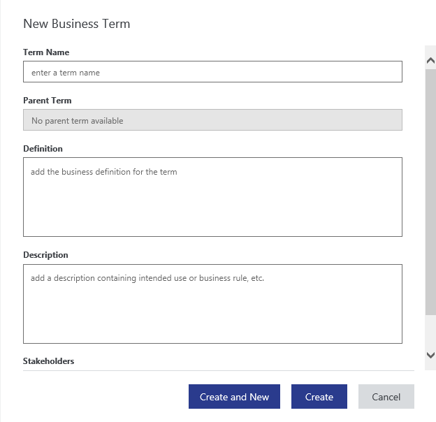
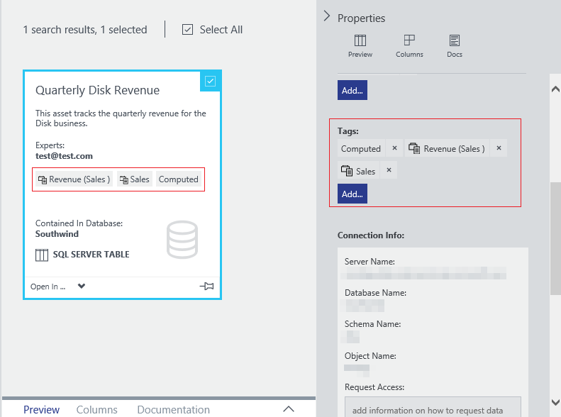

<properties
    pageTitle="如何設定的權限所規範標記商務詞彙 |Microsoft Azure"
    description="醒目提示商務詞彙 Azure 資料目錄] 中的，定義及使用常見的商務用詞彙要標記的使用方法文章登錄的資料資產。"
    services="data-catalog"
    documentationCenter=""
    authors="steelanddata"
    manager="NA"
    editor=""
    tags=""/>
<tags
    ms.service="data-catalog"
    ms.devlang="NA"
    ms.topic="article"
    ms.tgt_pltfrm="NA"
    ms.workload="data-catalog"
    ms.date="09/21/2016"
    ms.author="maroche"/>

# 如何設定權限所規範標記商務詞彙

## 簡介

Azure 資料目錄提供資料來源探索的功能，讓使用者可以輕鬆地探索並瞭解執行分析並做出決策所需的資料來源。 使用者可以尋找並瞭解最大範圍的可用的資料來源時，這些探索功能會讓最大的影響。

將更深入瞭解資產資料列升階的一個資料目錄功能已標記。 標記可讓使用者建立關鍵字資產的資料行，以便依序探索透過搜尋或瀏覽資產，之間的關聯，且可讓使用者更輕鬆地瞭解內容的資產。

但是標記時，有時候會導致自己的問題。 是可以引入標記的問題的一些範例︰

1.  部分的資產與其他人在展開時標記的文字上使用縮寫的使用者。 此不一致會阻礙發現的資產，即使是要標記相同標籤的資產。
2.  意義在不同的內容中的不同項目標籤。 例如，稱為 「 營收 」 上客戶資料集的標籤可能表示營收的客戶，，但上每季銷售資料集的相同標籤的公司表示每季營收。  

若要協助處理這些及其他類似的挑戰，資料目錄包含商務詞彙。

資料目錄商務詞彙可讓組織文件主要商務字詞及建立常見的商務用詞彙及其定義。 此管理整個組織間啟用資料使用的一致性。 一旦條款定義商務詞彙中，可指定的資料資產，在目錄中，使用相同的方法為標記，從而_控制標記_。

> [AZURE.NOTE] 本文所述的功能，可只標準版的 Azure 資料目錄] 中。 免費版不提供受控標記或商務詞彙的功能。

## 詞彙可用性和權限

*標準版的 Azure 資料目錄] 中使用商務用詞彙。資料目錄免費版不包含詞彙。*

商務用詞彙可透過 「 詞彙 」 選項，在 [資料目錄入口網站的導覽功能表加以存取。  

資料目錄系統管理員和詞彙系統管理員角色的成員可以建立、 編輯和刪除商務詞彙中的詞彙。 資料目錄的所有使用者可以檢視的字詞定義，並可以標記資產與詞彙。

## 建立名詞

資料目錄系統管理員和詞彙系統管理員可以在新字詞上的 [建立新的詞彙 ' 按鈕建立名詞與下列欄位︰

* 商務定義為該字詞的
* 擷取商務規則資產/資料行的用途的描述
* 一份專案關係人知道最關於字詞
* 父字詞，定義分為字詞的階層

## 詞彙字詞的階層

資料目錄商務詞彙能夠描述您的商務用詞彙為階層的字詞。 這個選項可讓組織建立更有效地代表其商務分類的字詞分類。

指定之階層層級的字詞名稱必須是唯一-不允許重複的名稱。 在階層中的層級數目不受限制，但階層是通常更易於理解的有三個層級或更少時。

使用商務用詞彙中的階層是選擇性的。 讓名詞上層字詞欄位空白，會詞彙中建立字詞的平面 （非階層式） 清單。  

## 標記資產與詞彙

一旦名詞類別目錄中定義，標記資產的經驗已最佳化而適合使用者輸入其標籤的同時，搜尋詞彙。 [資料目錄] 入口網站顯示相符的使用者，選擇 [從名詞的清單。 如果使用者從清單中選取字彙它會新增至資產為標籤 （又名 詞彙標籤）。 使用者也可以選擇輸入未詞彙 （又名字詞來建立新的標籤 使用者標記）。

> [AZURE.NOTE] 使用者標籤是標籤的唯一的支援免費版的資料目錄] 中類型。

### 將游標暫留在標籤上的行為
在 [資料目錄] 入口網站中兩種類型的標籤是以視覺化方式不同，不同的色彩變化表現方式。 當使用者停留使用者標籤時就可以看到標記文字的使用者或使用者已新增標籤。 當使用者停留詞彙標籤時，他們也會看到字彙與連結来開啟以檢視完整的字詞定義商務詞彙的定義。

### 標籤的搜尋篩選
同時詞彙標籤使用者標籤都可以搜尋，並可以做為搜尋中的篩選套用。

## 摘要
商務用詞彙中 Azure 資料目錄]，然後加以啟用，請受控標記允許識別、 管理，並以一致的方式找到的資料資產。 商務詞彙可以升階商務詞彙在組織的使用者的學習及支援若要擷取的有意義中繼資料，讓資產探索和了解幫助您輕鬆。

## 另請參閱

- [REST API 文件，營運詞彙](https://msdn.microsoft.com/library/mt708855.aspx)
