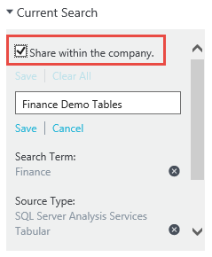

<properties
   pageTitle="如何儲存的搜尋，並將其釘選的資料資產 |Microsoft Azure"
   description="醒目提示 Azure 資料目錄] 中的功能，用來儲存資料來源與資料資產，供日後重複使用的使用方法文章。"
   services="data-catalog"
   documentationCenter=""
   authors="steelanddata"
   manager="NA"
   editor=""
   tags=""/>
<tags
   ms.service="data-catalog"
   ms.devlang="NA"
   ms.topic="article"
   ms.tgt_pltfrm="NA"
   ms.workload="data-catalog"
   ms.date="10/10/2016"
   ms.author="maroche"/>

# 如何儲存的搜尋，並將其釘選的資料資產

## 簡介

Microsoft Azure 資料目錄提供資料來源探索的功能。 使用者可以快速搜尋，並篩選目錄]，找出資料來源，並瞭解其預定的目的，讓您更容易找到正確的資料的工作。

但是，當使用者需要經常使用相同的資料時，應該做什麼？ 當使用者定期參與目錄] 中相同的資料來源知識又是什麼？ 在這些情況下，不必重複相同的搜尋可能會沒有效率，因此這是其中儲存的搜尋，並已釘選可協助資產的資料。

## 已儲存的搜尋

Azure 資料目錄] 中的搜尋儲存為可重複使用，每位使用者搜尋定義。 當使用者已定義搜尋 （包括搜尋字詞]、 [標籤和 [其他篩選） 他可以將其儲存以供日後使用。 已儲存的搜尋定義您就可以重新執行之後的日期，傳回任何符合其搜尋準則的資料資產。

### 建立已儲存的搜尋

若要建立已儲存的搜尋，請先輸入要重複使用的搜尋準則。 然後按一下 [儲存] 中的連結 Azure 資料目錄入口網站中的 「 目前的搜尋 」 方塊。

 ![選取 [儲存] ' 儲存目前的搜尋設定](./media/data-catalog-how-to-save-pin/01-save-option.png)

出現提示時，請輸入已儲存的搜尋的名稱。 挑選搜尋會傳回的資料資產的相關描述性的有意義的名稱。

 

### 管理儲存的搜尋

當使用者已儲存一或多個搜尋 」 儲存搜尋 」 選項會出現在 Azure 資料目錄入口網站的 「 目前搜尋 」 方塊下方。 展開時，就會顯示儲存搜尋的完整清單。

 

從清單中選取已儲存的搜尋會執行搜尋。

選取下拉功能表會提供一組管理選項︰

 

選取 [重新命名]，將會提示使用者輸入已儲存的搜尋的新名稱。 搜尋定義不會變更。

選取 「 刪除 」 會提示使用者確認，並會儲存的搜尋，然後移除使用者的清單。

選取 [儲存成預設值] 會將儲存為預設的搜尋使用者的搜尋選擇。 如果使用者從 Azure 資料目錄首頁上，執行 「 空白 」 的搜尋，就會執行使用者的預設搜尋。 此外，搜尋標示為預設會顯示在頂端的 [已儲存的搜尋] 清單。

### 組織已儲存的搜尋

每位使用者都可以儲存供自己使用的搜尋。 資料目錄管理員也可以將組織中的所有使用者的搜尋。 儲存時搜尋，管理員可以看到共用公司中儲存的搜尋選項。 如果選取此選項時，儲存的搜尋會包含在清單中的所有使用者的可用搜尋中。

 

## 釘選的資料資產

已儲存的搜尋可讓使用者儲存並重複使用搜尋定義;搜尋所傳回的資料資產，可能會變更為目錄變更內容的時間。 釘選的資料資產，可讓使用者明確找出特定的資料資產，若要使其更易於存取，並不需要使用 [搜尋]。

釘選的資料資產很簡單，使用者可以只需按一下 「 固定 」 圖示的資料資產，將其新增至其 [固定] 清單。 在並排檢視中，與最左邊的資料行中 Azure 資料目錄入口網站中的 [清單] 檢視中的 [資產] 磚的邊角會出現此圖示。

取消固定資產十分平均 – 使用者只需按一下 「 固定 」 圖示，即可切換 [選取資產] 設定。

## 「 我的資產 」
Azure 資料目錄入口網站首頁會包含目前的使用者顯示感興趣的資產的 「 我的資產 」 區段。 本節包含兩個固定的資產，並儲存的搜尋。

![「 我的資產' 在 [首頁] 頁面上](./media/data-catalog-how-to-save-pin/07-my-assets.png)

## 摘要
Azure 資料目錄提供輕鬆找出所需的資料來源，讓他們可以節省更多時間尋找資料和更多時間使用該使用者的功能。 儲存的搜尋，並已釘選資產建立這些核心功能，讓使用者可以輕鬆地識別有哪些他們會使用重複的資料來源的資料。
