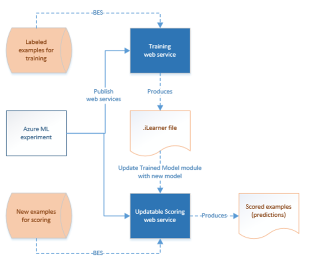

<properties 
    pageTitle="使用電腦學習活動 |Microsoft Azure" 
    description="說明如何建立建立預測使用 Azure 資料工廠和 Azure 電腦學習的管線" 
    services="data-factory" 
    documentationCenter="" 
    authors="sharonlo101" 
    manager="jhubbard" 
    editor="monicar"/>

<tags 
    ms.service="data-factory" 
    ms.workload="data-services" 
    ms.tgt_pltfrm="na" 
    ms.devlang="na" 
    ms.topic="article" 
    ms.date="09/06/2016" 
    ms.author="shlo"/>

# 建立預測使用 Azure 電腦學習活動的管線   
> [AZURE.SELECTOR]
[登錄區](data-factory-hive-activity.md)  
[豬](data-factory-pig-activity.md)  
[MapReduce](data-factory-map-reduce.md)  
[Hadoop 串流](data-factory-hadoop-streaming-activity.md)
[電腦學習](data-factory-azure-ml-batch-execution-activity.md) 
[預存程序](data-factory-stored-proc-activity.md)
[資料湖分析 U SQL](data-factory-usql-activity.md)
[.NET 自訂](data-factory-use-custom-activities.md)

## 簡介

[Azure 電腦學習](https://azure.microsoft.com/documentation/services/machine-learning/)可讓您建立、 測試和部署預測分析的解決方案。 從高層級的觀點，完成的三個步驟︰ 

1. **建立訓練實驗**。 您使用 Azure 毫升 Studio 執行此步驟。 毫升 studio 是您用來進行訓練的建議和測試使用訓練資料的預測狀況分析模型的共同作業的視覺開發環境。
2. **將它轉換成預測的實驗**。 一旦您模型已經過培訓以現有的資料並準備好使用分數新資料，您準備並簡化計分實驗。
3. **將其部署為 web 服務**。 您可以發佈計分實驗 Azure web 服務。 您可以傳送資料至您透過此 web 服務結束點的模型，而且從模型收到結果預測。  

Azure 資料工廠可讓您輕鬆建立使用已發佈的[Azure 電腦學習]的管線[azure-machine-learning]web 服務的預測狀況分析。 請參閱快速入門 Azure 資料工廠服務[Azure 資料工廠簡介](data-factory-introduction.md)，並[建立您的第一個管線](data-factory-build-your-first-pipeline.md)文章。 

Azure 資料工廠管道使用**批次執行的活動**，您可以叫用批次中的資料進行預測 Azure 毫升 web 服務。 如需詳細資訊，請參閱[啟動 Azure 毫升 web 服務使用批次執行活動](#invoking-an-azure-ml-web-service-using-the-batch-execution-activity)區段。

一段時間，必須使用新的輸入資料集重新培訓計分實驗 Azure 毫升預測的模型。 您可以重新從資料工廠管線 Azure 毫升模型訓練，請執行下列步驟︰ 

1. 發佈為 web 服務的訓練課程實驗 （不預測實驗）。 以 web 服務中的上一個案例的方式公開預測實驗一樣，您可以執行此步驟中 Azure 毫升 Studio 中。
2. 您可以使用 Azure 毫升批次執行活動來啟動訓練實驗 web 服務。 基本上，您可以使用 Azure 毫升批次執行活動叫用訓練課程 web 服務和計分 web 服務。 
  
您完成重新訓練之後，要新訓練模型更新計分的 web 服務 （預測的實驗公開為 web 服務）。 步驟如下︰ 

1. 新增非預設的結束點計分的 web 服務。 無法更新 web 服務的預設端點，，因此您需要建立非預設的結束點，使用 [Azure 入口網站。 請參閱[建立結束點](../machine-learning/machine-learning-create-endpoint.md)的概念性資訊與程序步驟。
2. 更新現有的連結 Azure 毫升服務計分使用非預設結束點。 開始使用新的結束點來使用 web 服務的更新。
3. 若要以新訓練模型更新 web 服務使用**Azure 毫升更新資源活動**。  

如需詳細資訊，請參閱[使用更新資源活動的更新 Azure 毫升模型](#updating-azure-ml-models-using-the-update-resource-activity)一節。 

## 啟動 web 服務使用批次執行的活動

您使用 Azure 資料工廠協調資料移動及處理，並執行使用 Azure 電腦學習批次執行。 以下是最上層的步驟︰

1. 建立連結的 Azure 電腦學習服務。 您需要︰
    1. **要求 URI**批次執行 API。 您可以按一下 [web 服務] 頁面中的**批次執行**連結來尋找要求 URI。
    1. 已發佈的 Azure 電腦學習 web 服務**API 金鑰**。 您可以找到 API 金鑰，即可發佈 web 服務。 
 2. 使用**AzureMLBatchExecution**活動。

    

    

### 案例︰ 實驗使用 Web 服務的輸入/輸出參照 Azure Blob 儲存體中的資料
在此案例中，Azure 電腦學習 Web 服務可讓您預測使用 Azure blob 儲存體中的檔案中的資料，並將預測結果儲存 blob 儲存體。 下列 JSON 定義資料工廠管線與 AzureMLBatchExecution 活動。 活動有資料集**DecisionTreeInputBlob**做為輸入和**DecisionTreeResultBlob**作為輸出。 **DecisionTreeInputBlob**會傳遞給 web 服務使用**webServiceInput** JSON 屬性。 使用**webServiceOutputs** JSON 屬性**DecisionTreeResultBlob**會作為輸出傳遞至 Web 服務。  

> [AZURE.IMPORTANT] 
> 如果 web 服務需要多個輸入，請使用**webServiceInputs**屬性，而非**webServiceInput**。 請參閱使用 webServiceInputs 屬性的範例[Web 服務需要多個輸入](#web-service-requires-multiple-inputs)一節。
>  
> **WebServiceInput**所參照的資料集/**webServiceInputs** **webServiceOutputs**中的屬性 （ **typeProperties**) 也必須包含活動**的輸入**與**輸出**中。
> 
> Azure 毫升實驗中, web 服務輸入與輸出連接埠和全域參數有預設的名稱 （「 input1 」、 「 input2 」），您可以自訂。 您使用 webServiceInputs、 webServiceOutputs，及 globalParameters 設定名稱必須確實符合實驗中的名稱。 您可以檢視範例要求裝載批次執行協助您 Azure 毫升結束點，以驗證預期的對應頁面上。 

    {
      "name": "PredictivePipeline",
      "properties": {
        "description": "use AzureML model",
        "activities": [
          {
            "name": "MLActivity",
            "type": "AzureMLBatchExecution",
            "description": "prediction analysis on batch input",
            "inputs": [
              {
                "name": "DecisionTreeInputBlob"
              }
            ],
            "outputs": [
              {
                "name": "DecisionTreeResultBlob"
              }
            ],
            "linkedServiceName": "MyAzureMLLinkedService",
            "typeProperties":
            {
                "webServiceInput": "DecisionTreeInputBlob",
                "webServiceOutputs": {
                    "output1": "DecisionTreeResultBlob"
                }                
            },
            "policy": {
              "concurrency": 3,
              "executionPriorityOrder": "NewestFirst",
              "retry": 1,
              "timeout": "02:00:00"
            }
          }
        ],
        "start": "2016-02-13T00:00:00Z",
        "end": "2016-02-14T00:00:00Z"
      }
    }

> [AZURE.NOTE] 僅限輸入和 AzureMLBatchExecution 活動的輸出可以做為參數至 Web 服務傳遞。 例如，在上述的 JSON 程式碼片段，DecisionTreeInputBlob 是 AzureMLBatchExecution 的活動，透過 webServiceInput 參數傳遞至 Web 服務的輸入的輸入。   

### 範例

此範例使用 Azure 儲存體保留輸入與輸出的資料。 

我們建議您進行[建立您的第一個管線與資料工廠][adf-build-1st-pipeline]教學課程之前進行此範例。 若要建立資料工廠成品 （連結的服務、 資料集，管線） 在此範例中使用資料工廠編輯器。   
 

1. 為您**Azure 儲存體**中建立**連結的服務**。 如果的輸入與輸出檔案會在不同的儲存帳戶，您會需要兩個連結的服務。 以下是 JSON 範例︰

        {
          "name": "StorageLinkedService",
          "properties": {
            "type": "AzureStorage",
            "typeProperties": {
              "connectionString": "DefaultEndpointsProtocol=https;AccountName=[acctName];AccountKey=[acctKey]"
            }
          }
        }

2. 建立**輸入**Azure 資料工廠**資料集**。 與其他資料工廠資料集，這些資料集必須包含**folderPath**和 [**檔案名稱**] 值。 您可以使用分割會導致 [處理程序或產生唯一的輸入與輸出檔案至每個批次執行 （每個資料扇形區）。 您可能需要將會輸入轉換成 CSV 檔案格式，並將其放在每個扇形區儲存帳戶一些上游活動。 在此情況下，您不想包含在下列範例中，顯示**外部**] 及 [ **externalData**設定，您 DecisionTreeInputBlob 應輸出資料集的不同的活動。

        {
          "name": "DecisionTreeInputBlob",
          "properties": {
            "type": "AzureBlob",
            "linkedServiceName": "StorageLinkedService",
            "typeProperties": {
              "folderPath": "azuremltesting/input",
              "fileName": "in.csv",
              "format": {
                "type": "TextFormat",
                "columnDelimiter": ","
              }
            },
            "external": true,
            "availability": {
              "frequency": "Day",
              "interval": 1
            },
            "policy": {
              "externalData": {
                "retryInterval": "00:01:00",
                "retryTimeout": "00:10:00",
                "maximumRetry": 3
              }
            }
          }
        }
    
    您輸入的 csv 檔案必須具有欄標題列。 如果您以建立或移動 csv 到 blob 儲存體使用**複製活動**，您應該將接收屬性**blobWriterAddHeader**為**true**。 例如︰
    
         sink: 
         {
             "type": "BlobSink",     
             "blobWriterAddHeader": true 
         }
     
    如果 csv 檔案沒有標題列，您可能會看到下列錯誤︰**活動的錯誤︰ 讀取字串時發生錯誤。非預期的權杖︰ StartObject。路徑 」，第 1 行，將 1**。
3. 建立**輸出**Azure 資料工廠**資料集**。 此範例使用分割來建立唯一的輸出路徑每次扇形區執行。 不含分割，活動會覆寫檔案。

        {
          "name": "DecisionTreeResultBlob",
          "properties": {
            "type": "AzureBlob",
            "linkedServiceName": "StorageLinkedService",
            "typeProperties": {
              "folderPath": "azuremltesting/scored/{folderpart}/",
              "fileName": "{filepart}result.csv",
              "partitionedBy": [
                {
                  "name": "folderpart",
                  "value": {
                    "type": "DateTime",
                    "date": "SliceStart",
                    "format": "yyyyMMdd"
                  }
                },
                {
                  "name": "filepart",
                  "value": {
                    "type": "DateTime",
                    "date": "SliceStart",
                    "format": "HHmmss"
                  }
                }
              ],
              "format": {
                "type": "TextFormat",
                "columnDelimiter": ","
              }
            },
            "availability": {
              "frequency": "Day",
              "interval": 15
            }
          }
        }

4. 建立**連結的服務**的類型︰ **AzureMLLinkedService**，提供 API 金鑰與模型批次執行 URL。
        
        {
          "name": "MyAzureMLLinkedService",
          "properties": {
            "type": "AzureML",
            "typeProperties": {
              "mlEndpoint": "https://[batch execution endpoint]/jobs",
              "apiKey": "[apikey]"
            }
          }
        }
5. 最後，作者管線包含**AzureMLBatchExecution**活動。 在執行階段，管道的郵件，請執行下列步驟︰
    1. 從您輸入的資料集，取得輸入檔案的位置。
    2. 叫用 Azure 電腦學習批次執行 API
    3. 在您的輸出資料集的 blob 複製批次執行輸出。 

    > [AZURE.NOTE] 零個或多個輸入和一或多個輸出，可以有 AzureMLBatchExecution 活動。

        {
          "name": "PredictivePipeline",
          "properties": {
            "description": "use AzureML model",
            "activities": [
              {
                "name": "MLActivity",
                "type": "AzureMLBatchExecution",
                "description": "prediction analysis on batch input",
                "inputs": [
                  {
                    "name": "DecisionTreeInputBlob"
                  }
                ],
                "outputs": [
                  {
                    "name": "DecisionTreeResultBlob"
                  }
                ],
                "linkedServiceName": "MyAzureMLLinkedService",
                "typeProperties":
                {
                    "webServiceInput": "DecisionTreeInputBlob",
                    "webServiceOutputs": {
                        "output1": "DecisionTreeResultBlob"
                    }                
                },
                "policy": {
                  "concurrency": 3,
                  "executionPriorityOrder": "NewestFirst",
                  "retry": 1,
                  "timeout": "02:00:00"
                }
              }
            ],
            "start": "2016-02-13T00:00:00Z",
            "end": "2016-02-14T00:00:00Z"
          }
        }

    **啟動**和**結束**的日期時間必須是[ISO](http://en.wikipedia.org/wiki/ISO_8601)格式。 例如︰ 2014年-10-14T16:32:41Z。 **結束**時間為選用步驟。 如果您未指定的 [**結束**] 屬性的值，它會計算為 「**開始 + 48 小時。**」 若要執行管線，指定**9999-09 09**做為 [**結束**] 屬性的值。 如需 JSON 屬性的詳細資訊，請參閱[JSON 指令碼的參考](https://msdn.microsoft.com/library/dn835050.aspx)。

    > [AZURE.NOTE] 指定輸入 AzureMLBatchExecution 活動是選擇性的。 

### 案例︰ 實驗參照各種不同的儲存區中的資料使用讀取裝置/寫入模組

其他常見的案例建立 Azure 毫升實驗時，就是使用讀取和寫入模組。 閱讀程式模組用來將資料載入至實驗和寫入模組可從您的實驗儲存資料。 如需讀取和寫入模組的詳細資訊，請參閱 MSDN 文件庫的[讀取](https://msdn.microsoft.com/library/azure/dn905997.aspx)和[寫入](https://msdn.microsoft.com/library/azure/dn905984.aspx)的說明主題。     

使用讀取和寫入器模組，則這些讀取裝置/寫入模組的每一個屬性使用 Web 服務參數的最佳作法。 這些網頁參數可讓您在執行階段設定的值。 例如，您可以建立實驗的閱讀程式模組，可使用 Azure SQL 資料庫︰ XXX.database.windows.net。 在部署 web 服務之後，您要啟用之 web 服務的消費者，若要指定另一個稱為 YYY.database.windows.net Azure SQL Server。 若要允許這個值要設定，您可以使用 Web 服務參數。

> [AZURE.NOTE] Web 服務輸入與輸出是不同的 Web 服務參數。 在第一個案例中，您已經看到如何 Azure 毫升 Web 服務的指定的輸入與輸出。 在此案例中，您將對應的 Web 服務的參數傳遞讀取裝置/寫入模組的屬性。 

讓我們來看看使用 Web 服務參數的情況。 您已經使用讀者模組讀取從 Azure 電腦學習支援的資料來源的資料已部署的 Azure 電腦學習 web 服務 (例如︰ Azure SQL 資料庫)。 在執行批次執行後，結果會寫入使用作者模組 （Azure SQL 資料庫）。  沒有 web 服務的輸入與輸出實驗中定義。 在此案例中，我們建議您設定讀取和寫入器模組的相關的 web 服務參數。 此設定可讓讀者/作者使用 AzureMLBatchExecution 活動時設定的模組。 您指定 Web 服務參數活動 JSON **globalParameters** ] 區段中，如下所示。 

    "typeProperties": {
        "globalParameters": {
            "Param 1": "Value 1",
            "Param 2": "Value 2"
        }
    }

您也可以使用[資料工廠函數](https://msdn.microsoft.com/library/dn835056.aspx)中傳遞 Web 服務參數，如下列範例所示的值︰

    "typeProperties": {
        "globalParameters": {
           "Database query": "$$Text.Format('SELECT * FROM myTable WHERE timeColumn = \\'{0:yyyy-MM-dd HH:mm:ss}\\'', Time.AddHours(WindowStart, 0))"
        }
    }
 
> [AZURE.NOTE] Web 服務參數會區分大小寫，因此，確定您指定的活動的名稱，JSON 符合所公開之 Web 服務的項目。 

### 使用閱讀程式模組讀取 Azure Blob 中的多個檔案中的資料
大型資料管線，例如豬的活動和登錄區可以產生一或多個輸出檔案沒有副檔名。 例如，當您指定外部登錄區資料表，外部的登錄區資料表的資料可以儲存中使用下列名稱 000000_0 Azure blob 儲存體。 您可以使用 [讀取] 模組實驗中讀取多個檔案，並使用它們來預測。 

使用時的閱讀程式模組 Azure 電腦學習實驗中，您可以指定 Azure Blob 的輸入。 Azure blob 儲存體中的檔案可輸出檔案 (範例︰ 000000_0) 的所產生的 HDInsight 上執行的豬和登錄區指令碼。 閱讀程式模組，可讓您閱讀檔案 （副檔名為沒有） 設定**容器，路徑目錄/blob**。 **容器路徑**指向容器和**目錄/blob**的點，以包含的檔案，如下圖所示的資料夾。 星號即\*)**指定的容器/資料夾中的所有檔案 (也就是資料/aggregateddata 年 = 2014年/月 6 /\*)**讀取實驗的一部分。

### 範例 
#### 使用 Web 服務參數的 AzureMLBatchExecution 活動的管線

    {
      "name": "MLWithSqlReaderSqlWriter",
      "properties": {
        "description": "Azure ML model with sql azure reader/writer",
        "activities": [
          {
            "name": "MLSqlReaderSqlWriterActivity",
            "type": "AzureMLBatchExecution",
            "description": "test",
            "inputs": [
              {
                "name": "MLSqlInput"
              }
            ],
            "outputs": [
              {
                "name": "MLSqlOutput"
              }
            ],
            "linkedServiceName": "MLSqlReaderSqlWriterDecisionTreeModel",
            "typeProperties":
            {
                "webServiceInput": "MLSqlInput",
                "webServiceOutputs": {
                    "output1": "MLSqlOutput"
                }
                "globalParameters": {
                    "Database server name": "<myserver>.database.windows.net",
                    "Database name": "<database>",
                    "Server user account name": "<user name>",
                    "Server user account password": "<password>"
                }              
            },
            "policy": {
              "concurrency": 1,
              "executionPriorityOrder": "NewestFirst",
              "retry": 1,
              "timeout": "02:00:00"
            },
          }
        ],
        "start": "2016-02-13T00:00:00Z",
        "end": "2016-02-14T00:00:00Z"
      }
    }
 
在上述 JSON 範例中︰

- 部署的 Azure 電腦學習 Web 服務使用讀取和寫入模組來讀/寫從/至 Azure SQL 資料庫的資料。 此 Web 服務公開下列四個參數︰ 資料庫伺服器名稱、 資料庫名稱、 伺服器的使用者帳戶名稱，以及伺服器的使用者帳戶密碼。  
- **啟動**和**結束**的日期時間必須是[ISO](http://en.wikipedia.org/wiki/ISO_8601)格式。 例如︰ 2014年-10-14T16:32:41Z。 **結束**時間為選用步驟。 如果您未指定的 [**結束**] 屬性的值，它會計算為 「**開始 + 48 小時。**」 若要執行管線，指定**9999-09 09**做為 [**結束**] 屬性的值。 如需 JSON 屬性的詳細資訊，請參閱[JSON 指令碼的參考](https://msdn.microsoft.com/library/dn835050.aspx)。

### 其他案例

#### Web 服務需要多個輸入
如果 web 服務需要多個輸入，請使用**webServiceInputs**屬性，而非**webServiceInput**。 **WebServiceInputs**所參照的資料集也必須包含活動**輸入**中。
 
Azure 毫升實驗中, web 服務輸入與輸出連接埠和全域參數有預設的名稱 （「 input1 」、 「 input2 」），您可以自訂。 您使用 webServiceInputs、 webServiceOutputs，及 globalParameters 設定名稱必須確實符合實驗中的名稱。 您可以檢視範例要求裝載批次執行協助您 Azure 毫升結束點，以驗證預期的對應頁面上。

    {
        "name": "PredictivePipeline",
        "properties": {
            "description": "use AzureML model",
            "activities": [{
                "name": "MLActivity",
                "type": "AzureMLBatchExecution",
                "description": "prediction analysis on batch input",
                "inputs": [{
                    "name": "inputDataset1"
                }, {
                    "name": "inputDataset2"
                }],
                "outputs": [{
                    "name": "outputDataset"
                }],
                "linkedServiceName": "MyAzureMLLinkedService",
                "typeProperties": {
                    "webServiceInputs": {
                        "input1": "inputDataset1",
                        "input2": "inputDataset2"
                    },
                    "webServiceOutputs": {
                        "output1": "outputDataset"
                    }
                },
                "policy": {
                    "concurrency": 3,
                    "executionPriorityOrder": "NewestFirst",
                    "retry": 1,
                    "timeout": "02:00:00"
                }
            }],
            "start": "2016-02-13T00:00:00Z",
            "end": "2016-02-14T00:00:00Z"
        }
    }

#### Web 服務時，不需要輸入

Azure 毫升批次執行 web 服務可用於執行任何工作流程，範例 R 或 Python 指令碼，可能不需要任何輸入。 或者，您也可以實驗可能設有不會揭露任何 GlobalParameters 讀者模組。 在此情況下，AzureMLBatchExecution 活動想設定，如下所示︰

    {
        "name": "scoring service",
        "type": "AzureMLBatchExecution",
        "outputs": [
            {
                "name": "myBlob"
            }
        ],
        "typeProperties": {
            "webServiceOutputs": {
                "output1": "myBlob"
            }              
         },
        "linkedServiceName": "mlEndpoint",
        "policy": {
            "concurrency": 1,
            "executionPriorityOrder": "NewestFirst",
            "retry": 1,
            "timeout": "02:00:00"
        }
    },
   

#### Web 服務時，不需要輸入輸出
Azure 毫升批次執行 web 服務可能沒有設定任何 Web 服務輸出。 在此範例中，沒有任何 Web 服務輸入或輸出，也不設定任何 GlobalParameters。 仍然是在本身的活動上設定的輸出，但不是會給予為 webServiceOutput。

    {
        "name": "retraining",
        "type": "AzureMLBatchExecution",
        "outputs": [
            {
                "name": "placeholderOutputDataset"
            }
        ],
        "typeProperties": {
         },
        "linkedServiceName": "mlEndpoint",
        "policy": {
            "concurrency": 1,
            "executionPriorityOrder": "NewestFirst",
            "retry": 1,
            "timeout": "02:00:00"
        }
    },

#### Web 服務使用讀者和作者，只有在已成功其他活動時的工作活動就會執行

Azure 毫升 web 服務讀取和寫入器模組可能會設定為執行包含或不含任何 GlobalParameters。 不過，您可以使用一些上游處理完成時，才叫用服務的資料集的相依性的管線中內嵌服務呼叫。 批次執行使用這種方式完成後，您也可以觸發其他動作。 在此情況下，您可以表示沒有任何命名為 Web 服務輸入或輸出使用活動的輸入與輸出的相依性。

    {
        "name": "retraining",
        "type": "AzureMLBatchExecution",
        "inputs": [
            {
                "name": "upstreamData1"
            },
            {
                "name": "upstreamData2"
            }
        ],
        "outputs": [
            {
                "name": "downstreamData"
            }
        ],
        "typeProperties": {
         },
        "linkedServiceName": "mlEndpoint",
        "policy": {
            "concurrency": 1,
            "executionPriorityOrder": "NewestFirst",
            "retry": 1,
            "timeout": "02:00:00"
        }
    },

**心得**是︰

-   如果您的實驗端點使用 webServiceInput︰ 它由 blob 資料集，所包含的活動輸入和 webServiceInput 屬性。 否則，省略 webServiceInput 屬性。 
-   如果您的實驗端點使用 webServiceOutput(s)︰ 它們由 blob 資料集且 webServiceOutputs 屬性和活動輸出中包含。 輸出活動和 webServiceOutputs 對應每次實驗的輸出的名稱。 否則，省略 webServiceOutputs 屬性。
-   如果您的實驗端點公開 globalParameter(s)，他們會提供活動 globalParameters 屬性中做為索引鍵的值組。 否則，省略 globalParameters 屬性。 機碼會區分大小寫。 在值]，可能會用於[azure 資料工廠函數](data-factory-scheduling-and-execution.md#data-factory-functions-reference)。 
- 其他資料集可能包含在活動輸入和輸出屬性，而不在活動 typeProperties 參考。 這些資料集監管使用扇形區相依性的執行，但否則會忽略 AzureMLBatchExecution 活動。 

## 使用更新資源活動的更新模型
一段時間，必須使用新的輸入資料集重新培訓計分實驗 Azure 毫升預測的模型。 您使用重新訓練完成之後，要 retrained 毫升模型更新計分的 web 服務。 若要啟用透過 web 服務的訓練與更新 Azure 毫升模型的一般步驟如下︰ 

1. 建立實驗[Azure 毫升 Studio](https://studio.azureml.net)中。 
2. 當您滿意模型時，使用 Azure 毫升 Studio 發佈 web 服務的兩個**訓練嘗試**和計分 /**預測實驗**。

下表說明在此範例中所使用的 web 服務。  如需詳細資訊，請參閱[重新訓練電腦學習模型以程式設計方式](../machine-learning/machine-learning-retrain-models-programmatically.md)。

| Web 服務的類型 | 描述 
| :------------------ | :---------- 
| **訓練課程 web 服務** | 接收訓練資料，並產生訓練的模型。 重新訓練的輸出是.ilearner 檔案中 Azure Blob 儲存體。  發佈為 web 服務訓練實驗時，**預設端點**會自動建立適合您。 您可以建立更多的端點，但此範例使用預設端點 |
| **計分 web 服務** | 收到未加上標籤的資料的範例，並讓預測。 預測的輸出可能會有不同的表單，例如.csv 檔案或在 Azure SQL 資料庫中，實驗的設定，根據資料列。 發佈為 web 服務預測實驗時的預設端點會自動建立適合您。 使用[Azure 入口網站](https://manage.windowsazure.com)，以建立第二個**非預設和更新的結束點**。 您可以建立更多的端點，但此範例使用只有一個非預設可更新的結束點。 請參閱[建立結束點](../machine-learning/machine-learning-create-endpoint.md)的步驟。       
 
下圖說明訓練與中 Azure 毫升計分結束點之間的關係。 

您可以使用**Azure 毫升批次執行的活動**，叫用**訓練課程 web 服務**。 等於叫用 （計分 web 服務） Azure 毫升 web 服務，計分的資料是叫用訓練課程 web 服務。 如前幾節討論如何叫用的詳細資料 Azure 資料工廠管線從 Azure 毫升 web 服務。 
  
您可以使用叫用**計分 web 服務**的**Azure 毫升更新資源活動**新訓練模型更新 web 服務。 如上述表格中所述，您必須建立並使用非預設的更新，就能結束點。 此外，更新您的資料工廠使用非預設端點，使其永遠使用 retrained 最新的模型中任何現有連結的服務。 

下列情況提供更多詳細資料。 有重新訓練及更新從 Azure 資料工廠管線 Azure 毫升模型範例。 
 
### 案例︰ 重新訓練及更新 Azure 毫升模型
本節提供範例管線重新訓練模型使用**Azure 毫升批次執行的活動**。 管線也會使用**Azure 毫升更新資源活動**來更新計分的 web 服務中的模型。 區段也會提供 JSON 程式碼片段，所有連結的服務、 資料集和在此範例中的管線。 

以下是範例管線的 [圖表] 檢視。 如您所見，Azure 毫升批次執行活動會訓練輸入，而產生的訓練課程輸出 （iLearner 檔案）。 Azure 毫升更新資源活動接受此訓練輸出，而且更新中計分的 web 服務端點的模型。 更新資源活動不會產生任何輸出。 PlaceholderBlob 是所需的 Azure 資料工廠服務執行管線只是空的輸出資料集。 

#### Azure Blob 儲存體連結服務︰
Azure 儲存體保留下列資料︰

- 訓練課程的資料。 Azure 毫升訓練課程 web 服務的輸入的資料。  
- iLearner 檔案。 從 Azure 毫升訓練課程 web 服務成果。 此檔案也會更新資源活動的輸入。  
   
以下是範例 JSON 的定義連結服務︰ 

    {
        "name": "StorageLinkedService",
        "properties": {
            "type": "AzureStorage",
            "typeProperties": {
                "connectionString": "DefaultEndpointsProtocol=https;AccountName=name;AccountKey=key"
            }
        }
    }

#### 輸入資料集訓練課程︰
下列資料集代表 Azure 毫升訓練課程 web 服務的輸入的訓練資料。 Azure 毫升批次執行的活動會使用這個資料集，做為輸入。 

    {
        "name": "trainingData",
        "properties": {
            "type": "AzureBlob",
            "linkedServiceName": "StorageLinkedService",
            "typeProperties": {
                "folderPath": "labeledexamples",
                "fileName": "labeledexamples.arff",
                "format": {
                    "type": "TextFormat"
                }
            },
            "availability": {
                "frequency": "Week",
                "interval": 1
            },
            "policy": {          
                "externalData": {
                    "retryInterval": "00:01:00",
                    "retryTimeout": "00:10:00",
                    "maximumRetry": 3
                }
            }
        }
    }

#### 訓練輸出資料集︰
下列資料集代表輸出 iLearner 檔案從 Azure 毫升訓練課程 web 服務。 Azure 毫升批次執行活動會產生此資料集。 此資料集也是 Azure 毫升更新資源活動的輸入。

    {
        "name": "trainedModelBlob",
        "properties": {
            "type": "AzureBlob",
            "linkedServiceName": "StorageLinkedService",
            "typeProperties": {
                "folderPath": "trainingoutput",
                "fileName": "model.ilearner",
                "format": {
                    "type": "TextFormat"
                }
            },
            "availability": {
                "frequency": "Week",
                "interval": 1
            }
        }
    }

#### Azure 毫升訓練端點連結的服務 
下列 JSON 程式碼片段定義指向訓練課程 web 服務的預設端點 Azure 電腦學習連結服務。 

    {   
        "name": "trainingEndpoint",
        "properties": {
            "type": "AzureML",
            "typeProperties": {
                "mlEndpoint": "https://ussouthcentral.services.azureml.net/workspaces/xxx/services/--training experiment--/jobs",
                "apiKey": "myKey"
            }
        }
    }

在**Azure 毫升 Studio**中，執行下列動作以取得**mlEndpoint**和**apiKey**的值︰

1. 在左功能表上，按一下 [ **WEB 服務**。
2. 按一下 [web 服務] 清單中的**訓練課程 web 服務**]。 
3. [ **API 金鑰**文字] 方塊旁的 [複製]。 在剪貼簿中貼入資料工廠 JSON 編輯器索引鍵。
4. 在**Azure 毫升 studio**中，按一下 [**批次執行**連結。
5. [**邀請**] 區段中，複製**要求 URI**並貼到資料工廠 JSON 編輯器。   

#### Azure 毫升可更新的計分端點的連結的服務︰
下列 JSON 程式碼片段定義指向非預設可更新的結束點計分的 web 服務 Azure 電腦學習連結服務。  

    {
        "name": "updatableScoringEndpoint2",
        "properties": {
            "type": "AzureML",
            "typeProperties": {
                "mlEndpoint": "https://ussouthcentral.services.azureml.net/workspaces/xxx/services/--scoring experiment--/jobs",
                "apiKey": "endpoint2Key",
                "updateResourceEndpoint": "https://management.azureml.net/workspaces/xxx/webservices/--scoring experiment--/endpoints/endpoint2"
            }
        }
    }

建立及部署 Azure 毫升連結服務之前，請遵循建立計分 web 服務的第二個 （非預設和更新） 結束點 」[建立端點](../machine-learning/machine-learning-create-endpoint.md)文件中的步驟進行。

您建立的非預設可更新的結束點之後，請執行下列動作︰

- 按一下 [**批次執行**URI 值取得**mlEndpoint** JSON 屬性]。
- 按一下以取得的 URI 值**updateResourceEndpoint** JSON 屬性**更新資源**連結。 API 金鑰位於結束點頁面 （在右下角）。 

 
#### 版面配置區輸出資料集︰
Azure 毫升更新資源活動不會產生任何輸出。 不過，Azure 資料工廠需要磁碟機的管線排程輸出資料集。 因此，我們會在此範例使用 dummy/版面配置區資料集。  

    {
        "name": "placeholderBlob",
        "properties": {
            "availability": {
                "frequency": "Week",
                "interval": 1
            },
            "type": "AzureBlob",
            "linkedServiceName": "StorageLinkedService",
            "typeProperties": {
                "folderPath": "any",
                "format": {
                    "type": "TextFormat"
                }
            }
        }
    }

#### 管線
管線具有兩個活動︰ **AzureMLBatchExecution**和**AzureMLUpdateResource**。 Azure 毫升批次執行的活動所需的時間訓練資料輸入，並產生作為輸出 iLearner 檔案。 活動叫用的輸入的訓練資料的訓練課程 web 服務 （訓練實驗公開為 web 服務），然後從 web 服務接收 ilearner 檔案。 PlaceholderBlob 是所需的 Azure 資料工廠服務執行管線只是空的輸出資料集。 

    {
        "name": "pipeline",
        "properties": {
            "activities": [
                {
                    "name": "retraining",
                    "type": "AzureMLBatchExecution",
                    "inputs": [
                        {
                            "name": "trainingData"
                        }
                    ],
                    "outputs": [
                        {
                            "name": "trainedModelBlob"
                        }
                    ],
                    "typeProperties": {
                        "webServiceInput": "trainingData",
                        "webServiceOutputs": {
                            "output1": "trainedModelBlob"
                        }              
                     },
                    "linkedServiceName": "trainingEndpoint",
                    "policy": {
                        "concurrency": 1,
                        "executionPriorityOrder": "NewestFirst",
                        "retry": 1,
                        "timeout": "02:00:00"
                    }
                },
                {
                    "type": "AzureMLUpdateResource",
                    "typeProperties": {
                        "trainedModelName": "Training Exp for ADF ML [trained model]",
                        "trainedModelDatasetName" :  "trainedModelBlob"
                    },
                    "inputs": [
                        {
                            "name": "trainedModelBlob"
                        }
                    ],
                    "outputs": [
                        {
                            "name": "placeholderBlob"
                        }
                    ],
                    "policy": {
                        "timeout": "01:00:00",
                        "concurrency": 1,
                        "retry": 3
                    },
                    "name": "AzureML Update Resource",
                    "linkedServiceName": "updatableScoringEndpoint2"
                }
            ],
            "start": "2016-02-13T00:00:00Z",
            "end": "2016-02-14T00:00:00Z"
        }
    }

### 讀取和寫入模組

使用 Web 服務參數的常見的案例是 Azure SQL 和作者使用。 閱讀程式模組用來將資料載入至資料管理服務外 Azure 電腦學習 Studio 實驗。 若要從您實驗的資料儲存成 Azure 電腦學習 Studio 以外的資料管理服務是作者模組。  

如需 Azure Blob/Azure SQL 讀取裝置/寫入的詳細資訊，請參閱 MSDN 文件庫的[讀取](https://msdn.microsoft.com/library/azure/dn905997.aspx)和[寫入](https://msdn.microsoft.com/library/azure/dn905984.aspx)的說明主題。 上一節中的範例使用 Azure Blob 讀取與 Azure Blob 作者。 本節說明如何使用 Azure SQL 讀取和 Azure SQL 寫入器。

## 常見問題集

**Q:**我有多個我大型資料管線所產生的檔案。 可以使用 AzureMLBatchExecution 活動處理的所有檔案嗎？

**A:**[是]。 請參閱**使用讀者模組閱讀 Azure Blob 中的多個檔案中的資料**] 區段，如需詳細資訊。 

## Azure 毫升批次計分活動
如果您使用**AzureMLBatchScoring**活動與 Azure 電腦學習整合，我們建議您使用最新的**AzureMLBatchExecution**活動。 

引進 AzureMLBatchExecution 活動 Azure SDK 和 PowerShell 的 Azure 年 8 月 2015年版本。

如果您想要繼續使用 AzureMLBatchScoring 活動，請繼續閱讀本節。  

### 用於輸入輸出 Azure 儲存體 azure 毫升批次計分活動 

    {
      "name": "PredictivePipeline",
      "properties": {
        "description": "use AzureML model",
        "activities": [
          {
            "name": "MLActivity",
            "type": "AzureMLBatchScoring",
            "description": "prediction analysis on batch input",
            "inputs": [
              {
                "name": "ScoringInputBlob"
              }
            ],
            "outputs": [
              {
                "name": "ScoringResultBlob"
              }
            ],
            "linkedServiceName": "MyAzureMLLinkedService",
            "policy": {
              "concurrency": 3,
              "executionPriorityOrder": "NewestFirst",
              "retry": 1,
              "timeout": "02:00:00"
            }
          }
        ],
        "start": "2016-02-13T00:00:00Z",
        "end": "2016-02-14T00:00:00Z"
      }
    }

### Web 服務參數
若要指定 Web 服務參數的值， **typeProperties** ] 區段中新增至**AzureMLBatchScoringActivty**區段的管線 JSON，如下列範例所示︰ 

    "typeProperties": {
        "webServiceParameters": {
            "Param 1": "Value 1",
            "Param 2": "Value 2"
        }
    }

您也可以使用[資料工廠函數](https://msdn.microsoft.com/library/dn835056.aspx)中傳遞 Web 服務參數，如下列範例所示的值︰

    "typeProperties": {
        "webServiceParameters": {
           "Database query": "$$Text.Format('SELECT * FROM myTable WHERE timeColumn = \\'{0:yyyy-MM-dd HH:mm:ss}\\'', Time.AddHours(WindowStart, 0))"
        }
    }
 
> [AZURE.NOTE] Web 服務參數會區分大小寫，因此，確定您指定的活動的名稱，JSON 符合所公開之 Web 服務的項目。 

## 另請參閱

- [Azure 部落格文章︰ 使用 Azure 資料工廠和 Azure 電腦學習快速入門](https://azure.microsoft.com/blog/getting-started-with-azure-data-factory-and-azure-machine-learning-4/)

[adf-build-1st-pipeline]: data-factory-build-your-first-pipeline.md

[azure-machine-learning]: http://azure.microsoft.com/services/machine-learning/

 
