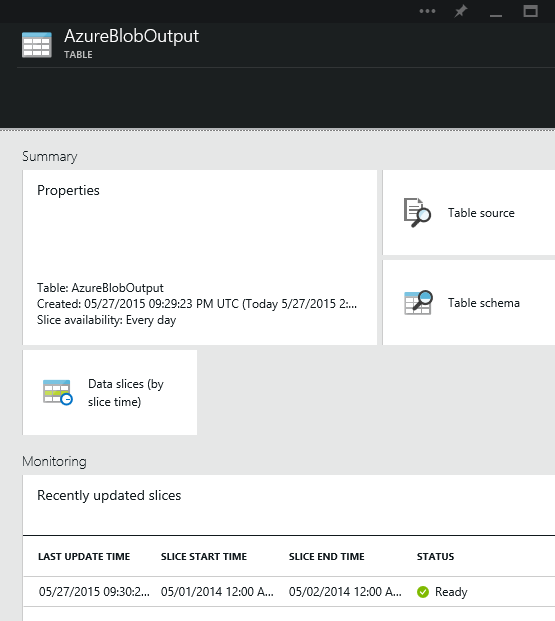

<properties
    pageTitle="建立第一個資料工廠 （資源管理員範本） |Microsoft Azure"
    description="在此教學課程中，您可以建立使用 Azure 資源管理員範本的範例 Azure 資料工廠管線。"
    services="data-factory"
    documentationCenter=""
    authors="spelluru"
    manager="jhubbard"
    editor="monicar"/>

<tags
    ms.service="data-factory"
    ms.workload="data-services"
    ms.tgt_pltfrm="na"
    ms.devlang="na"
    ms.topic="hero-article"
    ms.date="10/12/2016"
    ms.author="spelluru"/>

# 教學課程︰ 建立您使用 Azure 資源管理員範本的第一個 Azure 資料工廠
> [AZURE.SELECTOR]
- [概觀與先決條件](data-factory-build-your-first-pipeline.md)
- [Azure 入口網站](data-factory-build-your-first-pipeline-using-editor.md)
- [Visual Studio](data-factory-build-your-first-pipeline-using-vs.md)
- [PowerShell](data-factory-build-your-first-pipeline-using-powershell.md)
- [資源管理員範本](data-factory-build-your-first-pipeline-using-arm.md)
- [REST API](data-factory-build-your-first-pipeline-using-rest-api.md)

本文中，您可以使用 [Azure 資源管理員範本來建立您的第一個 Azure 資料工廠。

## 必要條件
- 閱讀[教學課程概觀](data-factory-build-your-first-pipeline.md)文章並完成的**必要**步驟。
- 依照您的電腦上安裝最新版本的 PowerShell 的 Azure[如何安裝和設定 PowerShell 的 Azure](../powershell-install-configure.md)文件中的指示進行。
- 請參閱[撰寫 Azure 資源管理員範本](../resource-group-authoring-templates.md)，若要深入瞭解 Azure 資源管理員範本。 

## 在本教學課程
實體 | 描述  
------ | ----------- 
Azure 連結的儲存服務 | 連結資料 factory Azure 儲存體帳戶。 Azure 儲存體帳戶會保留在這個範例中的管線的輸入與輸出資料。 
HDInsight 視連結的服務| 連結視 HDInsight 叢集資料 factory。 叢集會自動為您建立程序的資料，並且會刪除後會進行處理。
Azure Blob 輸入資料集 | 參照 Azure 儲存體連結服務。 連結的服務參照 Azure 儲存體帳戶和 Azure Blob 資料集指定容器、 資料夾及檔案名稱中含有輸入的資料的儲存空間。 
Azure Blob 輸出資料集 | 參照 Azure 儲存體連結服務。 連結的服務參照 Azure 儲存體帳戶和 Azure Blob 資料集指定容器、 資料夾及檔案名稱中含有輸出資料的儲存空間。 
資料管線 | 管線有一個活動的類型 HDInsightHive 會消耗輸入資料集，並產生輸出資料集。   

資料工廠多可以有一或多個管線。 管線可以有一或多個活動。 有兩種類型的活動︰[資料移動活動](data-factory-data-movement-activities.md)」 和 「[資料轉換的活動](data-factory-data-transformation-activities.md)。 在本教學課程中，您可以建立的管線含一個活動 （複製活動）。

下一節提供完整的資源管理員範本定義資料工廠項目，好讓您可以快速執行教學課程和測試範本。 若要瞭解如何每個資料工廠實體的定義，請參閱[在範本中的資料工廠實體](#data-factory-entities-in-the-template)一節。

## 資料工廠 JSON 範本
定義資料工廠的最上層資源管理員範本是︰ 

    {
        "$schema": "http://schema.management.azure.com/schemas/2015-01-01/deploymentTemplate.json#",
        "contentVersion": "1.0.0.0",
        "parameters": { ...
        },
        "variables": { ...
        },
        "resources": [
            {
                "name": "[parameters('dataFactoryName')]",
                "apiVersion": "[variables('apiVersion')]",
                "type": "Microsoft.DataFactory/datafactories",
                "location": "westus",
                "resources": [
                    { ... },
                    { ... },
                    { ... },
                    { ... }
                ]
            }
        ]
    }

建立一個名為**ADFTutorialARM.json**下列內容**C:\ADFGetStarted**資料夾中的 JSON 檔案︰

    {
        "contentVersion": "1.0.0.0",
        "$schema": "http://schema.management.azure.com/schemas/2015-01-01/deploymentTemplate.json#",
        "parameters": {
            "storageAccountName": { "type": "string", "metadata": { "description": "Name of the Azure storage account that contains the input/output data." } },
            "storageAccountKey": { "type": "securestring", "metadata": { "description": "Key for the Azure storage account." } },
            "blobContainer": { "type": "string", "metadata": { "description": "Name of the blob container in the Azure Storage account." } },
            "inputBlobFolder": { "type": "string", "metadata": { "description": "The folder in the blob container that has the input file." } },
            "inputBlobName": { "type": "string", "metadata": { "description": "Name of the input file/blob." } },
            "outputBlobFolder": { "type": "string", "metadata": { "description": "The folder in the blob container that will hold the transformed data." } },
            "hiveScriptFolder": { "type": "string", "metadata": { "description": "The folder in the blob container that contains the Hive query file." } },
            "hiveScriptFile": { "type": "string", "metadata": { "description": "Name of the hive query (HQL) file." } }
        },
        "variables": {
            "dataFactoryName": "[concat('HiveTransformDF', uniqueString(resourceGroup().id))]",
            "azureStorageLinkedServiceName": "AzureStorageLinkedService",
            "hdInsightOnDemandLinkedServiceName": "HDInsightOnDemandLinkedService",
            "blobInputDatasetName": "AzureBlobInput",
            "blobOutputDatasetName": "AzureBlobOutput",
            "pipelineName": "HiveTransformPipeline"
        },
        "resources": [
        {
            "name": "[variables('dataFactoryName')]",
            "apiVersion": "2015-10-01",
            "type": "Microsoft.DataFactory/datafactories",
            "location": "West US",
            "resources": [
            {
                "type": "linkedservices",
                "name": "[variables('azureStorageLinkedServiceName')]",
                "dependsOn": [
                    "[variables('dataFactoryName')]"
                ],
                "apiVersion": "2015-10-01",
                "properties": {
                    "type": "AzureStorage",
                    "description": "Azure Storage linked service",
                    "typeProperties": {
                        "connectionString": "[concat('DefaultEndpointsProtocol=https;AccountName=',parameters('storageAccountName'),';AccountKey=',parameters('storageAccountKey'))]"
                    }
                }
            },
            {
                "type": "linkedservices",
                "name": "[variables('hdInsightOnDemandLinkedServiceName')]",
                "dependsOn": [
                    "[variables('dataFactoryName')]",
                    "[variables('azureStorageLinkedServiceName')]"
                ],
                "apiVersion": "2015-10-01",
                "properties": {
                    "type": "HDInsightOnDemand",
                    "typeProperties": {
                        "clusterSize": 1,
                        "version": "3.2",
                        "timeToLive": "00:05:00",
                        "osType": "windows",
                        "linkedServiceName": "[variables('azureStorageLinkedServiceName')]"
                    }
                }
            },
            {
                "type": "datasets",
                "name": "[variables('blobInputDatasetName')]",
                "dependsOn": [
                    "[variables('dataFactoryName')]",
                    "[variables('azureStorageLinkedServiceName')]"
                ],
                "apiVersion": "2015-10-01",
                "properties": {
                    "type": "AzureBlob",
                    "linkedServiceName": "[variables('azureStorageLinkedServiceName')]",
                    "typeProperties": {
                        "fileName": "[parameters('inputBlobName')]",
                        "folderPath": "[concat(parameters('blobContainer'), '/', parameters('inputBlobFolder'))]",
                        "format": {
                            "type": "TextFormat",
                            "columnDelimiter": ","
                        }
                    },
                    "availability": {
                        "frequency": "Month",
                        "interval": 1
                    },
                    "external": true
                }
            },
            {
                "type": "datasets",
                "name": "[variables('blobOutputDatasetName')]",
                "dependsOn": [
                    "[variables('dataFactoryName')]",
                    "[variables('azureStorageLinkedServiceName')]"
                ],
                "apiVersion": "2015-10-01",
                "properties": {
                    "type": "AzureBlob",
                    "linkedServiceName": "[variables('azureStorageLinkedServiceName')]",
                    "typeProperties": {
                        "folderPath": "[concat(parameters('blobContainer'), '/', parameters('outputBlobFolder'))]",
                        "format": {
                            "type": "TextFormat",
                            "columnDelimiter": ","
                        }
                    },
                    "availability": {
                        "frequency": "Month",
                        "interval": 1
                    }
                }
            },
            {
                "type": "datapipelines",
                "name": "[variables('pipelineName')]",
                "dependsOn": [
                    "[variables('dataFactoryName')]",
                    "[variables('azureStorageLinkedServiceName')]",
                    "[variables('hdInsightOnDemandLinkedServiceName')]",
                    "[variables('blobInputDatasetName')]",
                    "[variables('blobOutputDatasetName')]"
                ],
                "apiVersion": "2015-10-01",
                "properties": {
                    "description": "Pipeline that transforms data using Hive script.",
                    "activities": [
                    {
                        "type": "HDInsightHive",
                        "typeProperties": {
                            "scriptPath": "[concat(parameters('blobContainer'), '/', parameters('hiveScriptFolder'), '/', parameters('hiveScriptFile'))]",
                            "scriptLinkedService": "[variables('azureStorageLinkedServiceName')]",
                            "defines": {
                                "inputtable": "[concat('wasb://', parameters('blobContainer'), '@', parameters('storageAccountName'), '.blob.core.windows.net/', parameters('inputBlobFolder'))]",
                                "partitionedtable": "[concat('wasb://', parameters('blobContainer'), '@', parameters('storageAccountName'), '.blob.core.windows.net/', parameters('outputBlobFolder'))]"
                            }
                        },
                        "inputs": [
                            {
                                "name": "[variables('blobInputDatasetName')]"
                            }
                        ],
                        "outputs": [
                            {
                                "name": "[variables('blobOutputDatasetName')]"
                            }
                        ],
                        "policy": {
                            "concurrency": 1,
                            "retry": 3
                        },
                        "scheduler": {
                            "frequency": "Month",
                            "interval": 1
                        },
                        "name": "RunSampleHiveActivity",
                        "linkedServiceName": "[variables('hdInsightOnDemandLinkedServiceName')]"
                    }
                    ],
                    "start": "2016-10-01T00:00:00Z",
                    "end": "2016-10-02T00:00:00Z",
                    "isPaused": false
                }
            }
            ]
        }
        ]
    }

> [AZURE.NOTE] 您可以找到另一個範例的資源管理員範本建立 Azure 資料工廠[教學課程︰ 使用 Azure 資源管理員範本複製活動建立管線](data-factory-copy-activity-tutorial-using-azure-resource-manager-template.md)。  

## 參數 JSON 
建立一個名為**ADFTutorialARM Parameters.json**包含 Azure 資源管理員範本參數的 JSON 檔案。  

> [AZURE.IMPORTANT] 指定此參數檔案中的 [名稱] 和 [索引鍵的**storageAccountName**和**storageAccountKey**參數您 Azure 儲存體帳戶。 

    {
        "$schema": "https://schema.management.azure.com/schemas/2015-01-01/deploymentParameters.json#",
        "contentVersion": "1.0.0.0",
        "parameters": {
            "storageAccountName": {
                "value": "<Name of your Azure Storage account>"
            },
            "storageAccountKey": {
                "value": "<Key of your Azure Storage account>"
            },
            "blobContainer": {
                "value": "adfgetstarted"
            },
            "inputBlobFolder": {
                "value": "inputdata"
            },
            "inputBlobName": {
                "value": "input.log"
            },
            "outputBlobFolder": {
                "value": "partitioneddata"
            },
            "hiveScriptFolder": {
                "value": "script"
            },
            "hiveScriptFile": {
                "value": "partitionweblogs.hql"
            }
        }
    }

> [AZURE.IMPORTANT] 您可能需要開發、 測試和生產環境中，您可以使用相同的資料工廠 JSON 範本的另一個參數 JSON 檔案。 使用 Power Shell 指令碼，您可以自動化這些環境中的部署資料工廠項目。 

## 建立資料工廠

1. 啟動**Azure PowerShell** ，並執行下列命令︰ 
    - 執行`Login-AzureRmAccount`輸入使用者名稱和密碼，您用於登入 Azure 入口網站。  
    - 執行`Get-AzureRmSubscription`檢視此帳戶的所有訂閱。
    - 執行`Get-AzureRmSubscription -SubscriptionName <SUBSCRIPTION NAME> | Set-AzureRmContext`以選取您想要使用的訂閱。 此訂閱應該在 Azure 入口網站中所使用的項目相同。
1. 執行下列命令以部署使用資源管理員範本的資料工廠實體您在步驟 1 中建立。 

        New-AzureRmResourceGroupDeployment -Name MyARMDeployment -ResourceGroupName ADFTutorialResourceGroup -TemplateFile C:\ADFGetStarted\ADFTutorialARM.json -TemplateParameterFile C:\ADFGetStarted\ADFTutorialARM-Parameters.json

## 監視器管線
 
1.  後登入至[Azure 入口網站](https://portal.azure.com/)，按一下 [**瀏覽**並選取**資料工廠**。
        ![瀏覽]-> [資料工廠](./media/data-factory-build-your-first-pipeline-using-arm/BrowseDataFactories.png)
2.  在**資料工廠**刀中，按一下您所建立的資料工廠 (**TutorialFactoryARM**)。   
2.  在針對您資料的工廠**資料工廠**刀，按一下 [**圖表**]。
        
4.  在**圖表檢視**中，您會看到管線和在本教學課程中使用的資料集的概觀。
    
     
8. 在 [圖表] 檢視中，按兩下 [ **AzureBlobOutput**資料集。 您會看到目前正在處理的扇形區。

    
9. 完成處理之後，您會看到的扇形區，**準備好**的狀態。 視需要 HDInsight 叢集建立通常會有時 （大約 20 分鐘）。 因此，預期管線需要**30 分鐘**才能扇形區 [處理程序。

     
10. **準備好**狀態扇形區後，請核取**adfgetstarted**容器中的輸出資料您 blob 儲存體中的 [ **partitioneddata** ] 資料夾。  

如何使用 Azure 入口網站刀監控管線與資料集的指示建立在本教學課程，請參閱[監視器資料集和管道的郵件](data-factory-monitor-manage-pipelines.md)。

監控您的資料管線，您也可以使用螢幕與管理應用程式。 請參閱[監視器及管理使用監視的應用程式的 Azure 資料工廠管線](data-factory-monitor-manage-app.md)的詳細資料使用的應用程式。 

> [AZURE.IMPORTANT] 扇形區已成功處理時，會刪除輸入的檔案。 因此，如果您想要重新執行扇形區，或重複動作教學課程，檔案上傳輸入 (input.log) adfgetstarted 容器的 inputdata 資料夾。

## 範本中的資料工廠實體
### 定義資料工廠
下列範例所示，您可以定義資源管理員範本中的資料工廠︰  

    "resources": [
    {
        "name": "[variables('dataFactoryName')]",
        "apiVersion": "2015-10-01",
        "type": "Microsoft.DataFactory/datafactories",
        "location": "West US"
    }

DataFactoryName 定義為︰ 
      
      "dataFactoryName": "[concat('HiveTransformDF', uniqueString(resourceGroup().id))]",

它是唯一的字串，根據 [資源群組識別碼。  

### 定義資料工廠項目
下列資料工廠實體定義 JSON 範本中︰ 

- [Azure 連結的儲存服務](#azure-storage-linked-service)
- [HDInsight 視連結的服務](#hdinsight-on-demand-linked-service)
- [Azure blob 輸入資料集](#azure-blob-input-dataset)
- [Azure blob 輸出資料集](#azure-blob-output-dataset)
- [使用複製活動的資料管線](#data-pipeline)

#### Azure 連結的儲存服務
您可以在此區段中指定 [名稱] 和 [索引鍵的 Azure 儲存體帳戶。 如需用來定義 Azure 儲存體連結服務 JSON 屬性的詳細資訊，請參閱[Azure 儲存體連結服務](data-factory-azure-blob-connector.md#azure-storage-linked-service)。 

      {
        "type": "linkedservices",
        "name": "[variables('azureStorageLinkedServiceName')]",
        "dependsOn": [
          "[variables('dataFactoryName')]"
        ],
        "apiVersion": "2015-10-01",
        "properties": {
          "type": "AzureStorage",
          "description": "Azure Storage linked service",
          "typeProperties": {
            "connectionString": "[concat('DefaultEndpointsProtocol=https;AccountName=',parameters('storageAccountName'),';AccountKey=',parameters('storageAccountKey'))]"
          }
        }
      }

**連接字串**使用 storageAccountName 和 storageAccountKey 參數。 這些傳遞的參數使用的設定檔值。 定義也使用變數︰ azureStroageLinkedService 和 dataFactoryName 範本中的定義。 
    
#### HDInsight 視連結的服務
請參閱用來定義 HDInsight 視連結的服務 JSON 屬性的詳細資料的[計算連結的服務](data-factory-compute-linked-services.md#azure-hdinsight-on-demand-linked-service)文件。  

      {
        "type": "linkedservices",
        "name": "[variables('hdInsightOnDemandLinkedServiceName')]",
        "dependsOn": [
          "[variables('dataFactoryName')]"
        ],
        "apiVersion": "2015-10-01",
        "properties": {
          "type": "HDInsightOnDemand",
          "typeProperties": {
            "clusterSize": 1,
            "version": "3.2",
            "timeToLive": "00:05:00",
            "osType": "windows",
            "linkedServiceName": "[variables('azureStorageLinkedServiceName')]"
          }
        }
      }

請注意下列重點︰ 

- 資料 Factory 為您建立**Windows 型**HDInsight 叢集，使用上述 JSON。 您也可以讓它建立**Linux 型**HDInsight 叢集。 如需詳細資訊，請參閱[視 HDInsight 連結服務](data-factory-compute-linked-services.md#azure-hdinsight-on-demand-linked-service)。 
- 您可以使用**您自己的 HDInsight 叢集**，而不是使用視 HDInsight 叢集。 如需詳細資訊，請參閱[HDInsight 連結服務](data-factory-compute-linked-services.md#azure-hdinsight-linked-service)。
- HDInsight 叢集建立**預設容器**中 JSON (**linkedServiceName**) 中所指定的 blob 儲存體。 刪除叢集時，HDInsight 並不會刪除此容器。 此行為是設計。 視需要 HDInsight 連結服務時，每次需要處理除非有現有的扇形區，建立叢集 HDInsight live 叢集 (**timeToLive**)，而且完成處理之後刪除。

    當處理更多的扇形區，您會看到您 Azure blob 儲存體中的許多容器。 如果您不需要進行的工作的疑難排解，您可能要以減少儲存空間成本將它們刪除。 這些容器的名稱所遵循的圖樣的線條: 「 adf**yourdatafactoryname**-**linkedservicename**datetimestamp 」。 您可以使用工具，例如[Microsoft 儲存檔案總管](http://storageexplorer.com/)來刪除容器中將 Azure blob 儲存體。

如需詳細資訊，請參閱[視 HDInsight 連結服務](data-factory-compute-linked-services.md#azure-hdinsight-on-demand-linked-service)。

#### Azure blob 輸入資料集
您指定的 blob 容器、 資料夾及檔案包含輸入的資料的名稱。 如需詳細資訊用來定義 Azure Blob 資料集的 JSON 屬性，請參閱[Azure Blob 資料集屬性](data-factory-azure-blob-connector.md#azure-blob-dataset-type-properties)。 

      {
        "type": "datasets",
        "name": "[variables('blobInputDatasetName')]",
        "dependsOn": [
          "[variables('dataFactoryName')]",
          "[variables('azureStorageLinkedServiceName')]"
        ],
        "apiVersion": "2015-10-01",
        "properties": {
          "type": "AzureBlob",
          "linkedServiceName": "[variables('azureStorageLinkedServiceName')]",
          "typeProperties": {
            "fileName": "[parameters('inputBlobName')]",
            "folderPath": "[concat(parameters('blobContainer'), '/', parameters('inputBlobFolder'))]",
            "format": {
              "type": "TextFormat",
              "columnDelimiter": ","
            }
          },
          "availability": {
            "frequency": "Month",
            "interval": 1
          },
          "external": true
        }
      }

這個定義會使用已定義之參數的範本中的下列參數︰ blobContainer，inputBlobFolder，及 inputBlobName。 

#### Azure Blob 輸出資料集
您指定 blob 容器和保留輸出資料的資料夾的名稱。 如需詳細資訊用來定義 Azure Blob 資料集的 JSON 屬性，請參閱[Azure Blob 資料集屬性](data-factory-azure-blob-connector.md#azure-blob-dataset-type-properties)。  

      {
        "type": "datasets",
        "name": "[variables('blobOutputDatasetName')]",
        "dependsOn": [
          "[variables('dataFactoryName')]",
          "[variables('azureStorageLinkedServiceName')]"
        ],
        "apiVersion": "2015-10-01",
        "properties": {
          "type": "AzureBlob",
          "linkedServiceName": "[variables('azureStorageLinkedServiceName')]",
          "typeProperties": {
            "folderPath": "[concat(parameters('blobContainer'), '/', parameters('outputBlobFolder'))]",
            "format": {
              "type": "TextFormat",
              "columnDelimiter": ","
            }
          },
          "availability": {
            "frequency": "Month",
            "interval": 1
          }
        }
      }

這個定義會使用已定義之參數的範本中的下列參數︰ blobContainer 和 outputBlobFolder。 

#### 資料管線
您定義的管線視 Azure HDInsight 叢集上執行登錄區指令碼轉換的資料。 用來在此範例中定義的管線 JSON 元素的說明，請參閱[管線 JSON](data-factory-create-pipelines.md#pipeline-json) 。 

    {
        "type": "datapipelines",
        "name": "[variables('pipelineName')]",
        "dependsOn": [
          "[variables('dataFactoryName')]",
          "[variables('azureStorageLinkedServiceName')]",
          "[variables('hdInsightOnDemandLinkedServiceName')]",
          "[variables('blobInputDatasetName')]",
          "[variables('blobOutputDatasetName')]"
        ],
        "apiVersion": "2015-10-01",
        "properties": {
          "description": "Pipeline that transforms data using Hive script.",
          "activities": [
            {
              "type": "HDInsightHive",
              "typeProperties": {
                "scriptPath": "[concat(parameters('blobContainer'), '/', parameters('hiveScriptFolder'), '/', parameters('hiveScriptFile'))]",
                "scriptLinkedService": "[variables('azureStorageLinkedServiceName')]",
                "defines": {
                  "inputtable": "[concat('wasb://', parameters('blobContainer'), '@', parameters('storageAccountName'), '.blob.core.windows.net/', parameters('inputBlobFolder'))]",
                  "partitionedtable": "[concat('wasb://', parameters('blobContainer'), '@', parameters('storageAccountName'), '.blob.core.windows.net/', parameters('outputBlobFolder'))]"
                }
              },
              "inputs": [
                {
                  "name": "[variables('blobInputDatasetName')]"
                }
              ],
              "outputs": [
                {
                  "name": "[variables('blobOutputDatasetName')]"
                }
              ],
              "policy": {
                "concurrency": 1,
                "retry": 3
              },
              "scheduler": {
                "frequency": "Month",
                "interval": 1
              },
              "name": "RunSampleHiveActivity",
              "linkedServiceName": "[variables('hdInsightOnDemandLinkedServiceName')]"
            }
          ],
          "start": "2016-10-01T00:00:00Z",
          "end": "2016-10-02T00:00:00Z",
          "isPaused": false
        }
      }

## 重複使用的範本 
在教學課程中，您可以建立的範本定義資料工廠實體和傳遞的參數值的範本。 若要將資料工廠實體部署至不同的環境中使用相同的範本，您建立的每個環境參數檔案，然後將其部署至該環境時。     

範例︰  

    New-AzureRmResourceGroupDeployment -Name MyARMDeployment -ResourceGroupName ADFTutorialResourceGroup -TemplateFile ADFTutorialARM.json -TemplateParameterFile ADFTutorialARM-Parameters-Dev.json

    New-AzureRmResourceGroupDeployment -Name MyARMDeployment -ResourceGroupName ADFTutorialResourceGroup -TemplateFile ADFTutorialARM.json -TemplateParameterFile ADFTutorialARM-Parameters-Test.json

    New-AzureRmResourceGroupDeployment -Name MyARMDeployment -ResourceGroupName ADFTutorialResourceGroup -TemplateFile ADFTutorialARM.json -TemplateParameterFile ADFTutorialARM-Parameters-Production.json

請注意的第一個命令的開發環境、 測試環境中，第二個和第三個生產環境使用參數檔案。  

您也可以重複使用的範本，以執行重複的工作。 例如，您需要建立多個資料工廠實作相同的邏輯的一或多個管線與，但每個資料工廠使用不同的 Azure 儲存和 Azure SQL 資料庫帳戶。 在此案例中，您使用相同的範本 （開發、 測試或生產） 相同的環境中使用不同的參數檔案來建立資料工廠。 

## 資源管理員範本建立閘道器
以下是建立背面邏輯閘道器的範例資源管理員範本。 Azure IaaS VM 或內部部署電腦上安裝的閘道器和閘道登錄資料工廠服務使用金鑰。 如需詳細資訊，請參閱[將內部部署與雲端之間的資料](data-factory-move-data-between-onprem-and-cloud.md)。

    {
        "contentVersion": "1.0.0.0",
        "$schema": "http://schema.management.azure.com/schemas/2015-01-01/deploymentTemplate.json#",
        "parameters": {
        },
        "variables": {
            "dataFactoryName":  "GatewayUsingArmDF",
            "apiVersion": "2015-10-01",
            "singleQuote": "'"
        },
        "resources": [
            {
                "name": "[variables('dataFactoryName')]",
                "apiVersion": "[variables('apiVersion')]",
                "type": "Microsoft.DataFactory/datafactories",
                "location": "eastus",
                "resources": [
                    {
                        "dependsOn": [ "[concat('Microsoft.DataFactory/dataFactories/', variables('dataFactoryName'))]" ],
                        "type": "gateways",
                        "apiVersion": "[variables('apiVersion')]",
                        "name": "GatewayUsingARM",
                        "properties": {
                            "description": "my gateway"
                        }
                    }            
                ]
            }
        ]
    }

此範本建立閘道器名稱以命名 GatewayUsingArmDF 資料工廠︰ GatewayUsingARM。 

## 另請參閱
| 主題 | 描述 |
| :---- | :---- |
| [資料轉換活動](data-factory-data-transformation-activities.md) | 本文提供的資料轉換活動 （例如在本教學課程中所使用的 HDInsight 登錄區轉換） 清單 Azure 資料工廠支援。 |
| [排程和執行](data-factory-scheduling-and-execution.md) | 本文說明 Azure 資料 Factory 應用程式模型的排程和執行方面。 |
| [管線](data-factory-create-pipelines.md) | 本文可協助您瞭解管線和 Azure 資料工廠，以及如何用來建構端對端的資料導向的工作流程案例或企業版中的活動。 |
| [資料集](data-factory-create-datasets.md) | 本文可協助您瞭解 Azure 資料工廠中的資料集。
| [監控和管理使用監視的應用程式的管線](data-factory-monitor-manage-app.md) | 本文將說明如何監控、 管理及偵錯管線使用 [監控和管理應用程式。 

  

