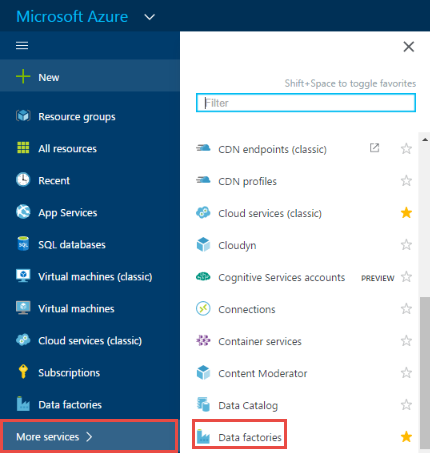
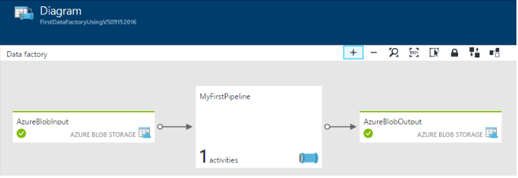
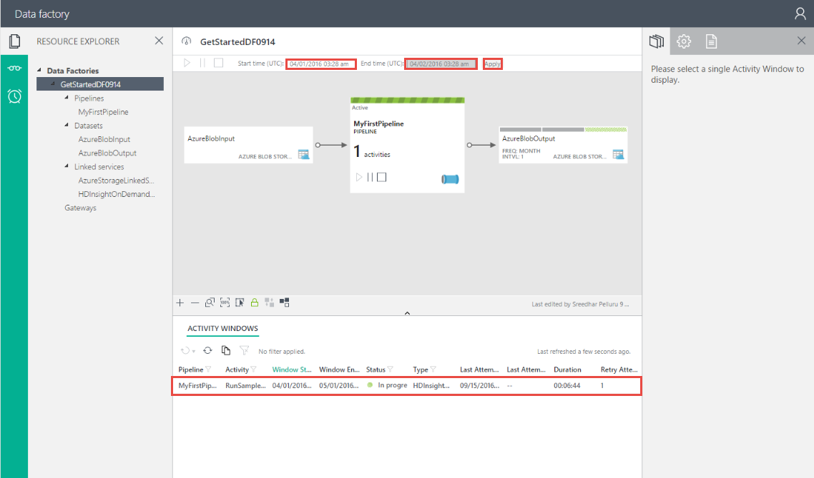
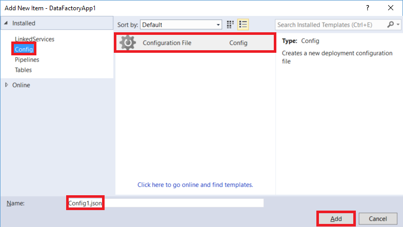

<properties
    pageTitle="建立第一個資料工廠 (Visual Studio) |Microsoft Azure"
    description="在本教學課程中，您可以建立使用 Visual Studio 範例 Azure 資料工廠管線。"
    services="data-factory"
    documentationCenter=""
    authors="spelluru"
    manager="jhubbard"
    editor="monicar"/>

<tags
    ms.service="data-factory"
    ms.workload="data-services"
    ms.tgt_pltfrm="na"
    ms.devlang="na"
    ms.topic="hero-article" 
    ms.date="10/17/2016"
    ms.author="spelluru"/>

# 使用 Microsoft Visual Studio 教學課程︰ 建立您 Azure 的第一個資料工廠
> [AZURE.SELECTOR]
- [概觀與先決條件](data-factory-build-your-first-pipeline.md)
- [Azure 入口網站](data-factory-build-your-first-pipeline-using-editor.md)
- [Visual Studio](data-factory-build-your-first-pipeline-using-vs.md)
- [PowerShell](data-factory-build-your-first-pipeline-using-powershell.md)
- [資源管理員範本](data-factory-build-your-first-pipeline-using-arm.md)
- [REST API](data-factory-build-your-first-pipeline-using-rest-api.md)

本文中，您可以使用 Microsoft Visual Studio 建立您的第一個 Azure 資料工廠。

## 必要條件
1. 閱讀[教學課程概觀](data-factory-build-your-first-pipeline.md)文章並完成的**必要**步驟。
2. 您必須是**Azure 訂閱的管理員**，才能發佈資料工廠 Azure 資料工廠從 Visual Studio 項目。
3. 您必須在電腦上安裝下列動作︰ 
    - Visual Studio 2013 或 Visual Studio 2015
    - 下載 Azure SDK Visual Studio 2013 或 Visual Studio 2015。 瀏覽至[Azure 下載頁面](https://azure.microsoft.com/downloads/)，然後按一下**與 2013年**或**與 2015年** **.NET** ] 區段中。
    - 下載最新的 Azure 資料工廠外掛程式的 Visual Studio︰[與 2013年](https://visualstudiogallery.msdn.microsoft.com/754d998c-8f92-4aa7-835b-e89c8c954aa5)或[與 2015年](https://visualstudiogallery.msdn.microsoft.com/371a4cf9-0093-40fa-b7dd-be3c74f49005)。 您也可以執行下列動作來更新外掛程式︰ 的功能表上，按一下 [**工具** -> **Extensions 和更新** -> **Online** -> **Visual Studio 庫** -> **Microsoft Azure 資料工廠工具 Visual Studio** -> **更新**。 
 
現在，我們使用 Visual Studio 建立 Azure 資料工廠。 

## 建立 Visual Studio 專案 
1. **Visual Studio 2013**或**Visual Studio 2015**啟動。 按一下 [**檔案]**、 指向 [**新增**]，並按一下 [**專案**]。 您應該會看到**新的專案**] 對話方塊。  
2. 在 [**新專案**] 對話方塊中選取**DataFactory**範本，然後按一下 [**空白資料工廠專案**。   

    ![新增專案] 對話方塊](./media/data-factory-build-your-first-pipeline-using-vs/new-project-dialog.png)

3. 輸入**名稱**專案、**位置**及**解決方案**的名稱，然後按一下**[確定]**。

    

## 建立連結的服務
資料工廠多可以有一或多個管線。 管線可以有一或多個活動。 例如，複製活動，將資料複製目的地資料存放區並執行，將輸入的資料轉換的登錄區指令碼至 HDInsight 登錄區活動的來源。 請參閱[支援的資料會儲存](data-factory-data-movement-activities.md##supported-data-stores-and-formats)所有來源和接收支援複製活動。 請參閱支援的資料工廠計算服務清單中的 [[計算連結的服務](data-factory-compute-linked-services.md)。 

在此步驟中，您連結 Azure 儲存體帳戶並視需要 Azure HDInsight 叢集您資料的工廠至。 Azure 儲存體帳戶會保留在這個範例中的管線的輸入與輸出資料。 連結的 HDInsight 服務用來執行這個範例中的管線活動中指定的登錄區指令碼。 識別哪些資料存放區/計算服務會在您的情況下使用，並連結資料 factory 建立連結的服務，這些服務。  

您指定的名稱及設定資料 factory 稍後發佈您的資料工廠解決方案。

#### 建立連結的 Azure 儲存服務
在此步驟中，您可以連結 Azure 儲存體帳戶至您的資料工廠。 在此教學課程中，您可以使用相同的 Azure 儲存體帳戶儲存輸入輸出資料和 HQL 指令碼檔。 

4. 以滑鼠右鍵按一下方案總管] 中的**連結的服務**，指向 [**新增**]，然後按一下 [**新增項目**。      
5. 在**新增新的項目**] 對話方塊中，從清單中，選取**Azure 儲存連結服務**，然後按一下 [**新增**]。 
3. 取代**accountname**和**accountkey** Azure 儲存體帳戶及索引鍵的名稱。 若要瞭解如何取得儲存 access 金鑰，請參閱[檢視、 複製及重新產生的儲存空間便捷鍵](../storage/storage-create-storage-account.md#view-copy-and-regenerate-storage-access-keys)

    

4. 儲存**AzureStorageLinkedService1.json**檔案。

#### 建立連結的 Azure HDInsight 服務
在此步驟中，您可以連結視 HDInsight 叢集至您的資料工廠。 HDInsight 叢集自動在執行階段建立及刪除之後，為了處理及空閒指定的時間量。 您可以使用您自己的 HDInsight 叢集，而不是使用視 HDInsight 叢集。 如需詳細資訊，請參閱[計算連結的服務](data-factory-compute-linked-services.md)。 

1. 在**方案總管]**中，以滑鼠右鍵按一下 [**連結的服務**指向 [**新增**]，按一下 [**新增項目**。
2. 選取**HDInsight Demand 連結服務**，然後按一下 [**新增**]。 
3. **JSON**取代下列動作︰

        {
          "name": "HDInsightOnDemandLinkedService",
          "properties": {
            "type": "HDInsightOnDemand",
            "typeProperties": {
              "version": "3.2",
              "clusterSize": 1,
              "timeToLive": "00:30:00",
              "linkedServiceName": "AzureStorageLinkedService1"
            }
          }
        }
    
    下表提供說明中的程式碼片段使用 JSON 屬性︰
    
    屬性 | 描述
    -------- | -----------
    版本 | 指定的 HDInsight 版本建立要 3.2 捨位。 
    ClusterSize | 指定 HDInsight 叢集的大小。 
    TimeToLive | 指定的空閒時間 HDInsight 叢集，刪除之前。
    linkedServiceName | 指定的儲存空間帳戶用來儲存記錄檔所產生的 HDInsight

    請注意下列事項︰ 
    
    - 資料 Factory 為您建立**Windows 型**HDInsight 叢集，使用上述 JSON。 您也可以讓它建立**Linux 型**HDInsight 叢集。 如需詳細資訊，請參閱[視 HDInsight 連結服務](data-factory-compute-linked-services.md#azure-hdinsight-on-demand-linked-service)。 
    - 您可以使用**您自己的 HDInsight 叢集**，而不是使用視 HDInsight 叢集。 如需詳細資訊，請參閱[HDInsight 連結服務](data-factory-compute-linked-services.md#azure-hdinsight-linked-service)。
    - HDInsight 叢集建立**預設容器**中 JSON (**linkedServiceName**) 中所指定的 blob 儲存體。 刪除叢集時，HDInsight 並不會刪除此容器。 此行為是設計。 視 HDInsight 連結服務時，每次扇形區處理除非有現有的即時叢集 (**timeToLive**) 時，會建立 HDInsight 叢集。 處理程序完成時，會自動刪除叢集。
    
        當處理更多的扇形區，您會看到您 Azure blob 儲存體中的許多容器。 如果您不需要進行的工作的疑難排解，您可能要以減少儲存空間成本將它們刪除。 這些容器的名稱所遵循的圖樣的線條: 「 adf**yourdatafactoryname**-**linkedservicename**datetimestamp 」。 您可以使用工具，例如[Microsoft 儲存檔案總管](http://storageexplorer.com/)來刪除容器中將 Azure blob 儲存體。

    如需詳細資訊，請參閱[視 HDInsight 連結服務](data-factory-compute-linked-services.md#azure-hdinsight-on-demand-linked-service)。 
4. 儲存**HDInsightOnDemandLinkedService1.json**檔案。

## 建立資料集
在此步驟中，您可以建立資料集，以表示輸入與輸出的登錄區處理資料。 您之前在本教學課程中建立**AzureStorageLinkedService1**參考這些資料集。 指向 Azure 儲存體帳戶和資料集之間的連結的服務指定容器、 資料夾、 檔案名稱中含有輸入的儲存空間和輸出資料。   

#### 建立輸入資料集

1. 在**方案總管]**中，以滑鼠右鍵按一下**資料表**指向 [**新增**]，然後按一下**新的項目**。 
2. 從清單中選取**Azure Blob** **InputDataSet.json**，變更檔案的名稱，按一下 [**新增**]。
3. **JSON**編輯器中取代下列動作︰ 

    JSON 程式碼片段，在您建立稱為**AzureBlobInput**代表管道活動的輸入的資料的資料集。 此外，您可以指定輸入的資料位於稱為**adfgetstarted** blob 容器和稱為**inputdata** ] 資料夾中
        
        {
            "name": "AzureBlobInput",
            "properties": {
                "type": "AzureBlob",
                "linkedServiceName": "AzureStorageLinkedService1",
                "typeProperties": {
                    "fileName": "input.log",
                    "folderPath": "adfgetstarted/inputdata",
                    "format": {
                        "type": "TextFormat",
                        "columnDelimiter": ","
                    }
                },
                "availability": {
                    "frequency": "Month",
                    "interval": 1
                },
                "external": true,
                "policy": {}
            }
        } 

    下表提供說明中的程式碼片段使用 JSON 屬性︰

  	| 屬性 | 描述 |
  	| :------- | :---------- |
  	| 類型 | [類型] 屬性設 AzureBlob，因為資料位於 Azure blob 儲存體。 |  
  	| linkedServiceName | 指向您先前建立 AzureStorageLinkedService1。 |
  	| 檔案名稱 | 這是選擇性屬性。 如果您省略此屬性時，所挑選的 folderPath 的所有檔案。 在此情況下，只 input.log 會進行處理。 |
  	| 類型 | 記錄檔會是文字格式，因此我們使用 TextFormat 的範圍。 | 
  	| columnDelimiter | 以逗號 （，） 分隔的記錄檔中的資料行 |
  	| 頻率/間隔 | 設定為 [月與間隔的 frequency 不是 1，表示您輸入的扇形區使用每個月。 | 
  	| 外部 | 設定此屬性，則為 true，則如果輸入的資料不會產生資料工廠服務。 | 
      
    
3. 儲存**InputDataset.json**檔案。 

 
#### 建立輸出資料集
現在，您可以建立輸出資料集來代表 Azure Blob 儲存體中儲存的輸出資料。 

1. 在**方案總管]**中，以滑鼠右鍵按一下**表格**以**新增**]，指向，按一下 [**新增項目**。 
2. 從清單中選取**Azure Blob** **OutputDataset.json**，變更檔案的名稱，按一下 [**新增**]。 
3. **JSON**編輯器中取代下列動作︰ 

    JSON 程式碼片段，在您建立稱為**AzureBlobOutput**，並指定資料所產生的登錄區指令碼的結構資料集。 此外，您可以指定結果會儲存稱為**adfgetstarted** blob 容器和稱為**partitioneddata**] 資料夾中。 **可用性**] 區段中指定的輸出資料集，則會產生每個月。
    
        {
          "name": "AzureBlobOutput",
          "properties": {
            "type": "AzureBlob",
            "linkedServiceName": "AzureStorageLinkedService1",
            "typeProperties": {
              "folderPath": "adfgetstarted/partitioneddata",
              "format": {
                "type": "TextFormat",
                "columnDelimiter": ","
              }
            },
            "availability": {
              "frequency": "Month",
              "interval": 1
            }
          }
        }

    請參閱**建立輸入資料集**一節說明這些屬性。 您沒有設定外部屬性輸出資料集上為資料集由資料工廠服務。

4. 儲存**OutputDataset.json**檔案。

### 建立管線
在此步驟中，您可以建立您的第一個管線與**HDInsightHive**活動。 輸入的扇形區有每月 (頻率︰ Month、 間隔︰ 1) 輸出扇形區不會產生每月與活動的排程器屬性也會設定為每個月。 必須符合的輸出資料集與活動排程器設定。 目前，輸出資料集是什麼磁碟機排程，因此您必須建立輸出資料集，即使活動不會產生任何輸出。 如果活動不需要任何輸入，您可以略過建立輸入資料集。 下列 JSON 中使用的內容會說明在此節結尾處。

1. 在**方案總管]**中，以滑鼠右鍵按一下**管線**，指向 [**新增**]，然後按一下**新項目。** 
2. 從清單中，選取**登錄區轉換管道的郵件**，然後按一下 [**新增**]。 
3. 下列程式碼片段取代**JSON** 。

    > [AZURE.IMPORTANT] **storageaccountname**換成您儲存的帳戶的名稱。

        {
            "name": "MyFirstPipeline",
            "properties": {
                "description": "My first Azure Data Factory pipeline",
                "activities": [
                    {
                        "type": "HDInsightHive",
                        "typeProperties": {
                            "scriptPath": "adfgetstarted/script/partitionweblogs.hql",
                            "scriptLinkedService": "AzureStorageLinkedService1",
                            "defines": {
                                "inputtable": "wasb://adfgetstarted@<storageaccountname>.blob.core.windows.net/inputdata",
                                "partitionedtable": "wasb://adfgetstarted@<storageaccountname>.blob.core.windows.net/partitioneddata"
                            }
                        },
                        "inputs": [
                            {
                                "name": "AzureBlobInput"
                            }
                        ],
                        "outputs": [
                            {
                                "name": "AzureBlobOutput"
                            }
                        ],
                        "policy": {
                            "concurrency": 1,
                            "retry": 3
                        },
                        "scheduler": {
                            "frequency": "Month",
                            "interval": 1
                        },
                        "name": "RunSampleHiveActivity",
                        "linkedServiceName": "HDInsightOnDemandLinkedService"
                    }
                ],
                "start": "2016-04-01T00:00:00Z",
                "end": "2016-04-02T00:00:00Z",
                "isPaused": false
            }
        }

    JSON 程式碼片段，在您建立包含使用登錄區 HDInsight 叢集的程序資料至單一活動的管線。
    
    JSON 程式碼片段，在您建立包含使用登錄區 HDInsight 叢集的程序資料至單一活動的管線。
    
    登錄區指令檔、 **partitionweblogs.hql**，儲存在 （指定 scriptLinkedService，稱為**AzureStorageLinkedService1**） Azure 儲存體帳戶和**指令碼**] 資料夾中容器**adfgetstarted**。

    [**定義**] 區段中用來指定執行階段設定為登錄區設定值傳遞給登錄區指令碼 (如 ${hiveconf: inputtable}，${hiveconf:partitionedtable})。

    管線的**開始**和**結束**屬性會指定作用中的管線期間。

    活動 JSON 中，您可以指定登錄區指令碼執行計算指定**linkedServiceName** – **HDInsightOnDemandLinkedService**上。

    > [AZURE.NOTE] 如需 JSON 屬性範例中的詳細資訊，請參閱[的管線剖析](data-factory-create-pipelines.md#anatomy-of-a-pipeline)。 
3. 儲存**HiveActivity1.json**檔案。

### 新增 partitionweblogs.hql 和 input.log 做為相依性 

1. **相依性**在**方案總管]**視窗中以滑鼠右鍵按一下，指向 [**新增**]，然後按一下 [**現有的項目**。  
2. 瀏覽至**C:\ADFGettingStarted**並選取**partitionweblogs.hql**， **input.log**檔案，然後按一下 [**新增**]。 您建立的先決條件一部分這兩個檔案從[教學課程概觀](data-factory-build-your-first-pipeline.md)。

當您在下一個步驟中發行方案時，會**partitionweblogs.hql**檔案上傳到**adfgetstarted** blob 容器中的指令碼] 資料夾。   

### 發佈/部署資料工廠項目

18. 在方案總管中，以滑鼠右鍵按一下，然後按一下 [**發佈**]。 
19. 如果您看到**您的 Microsoft 帳戶登入**] 對話方塊中，輸入您的認證有 Azure 訂閱的帳戶，然後按一下 [**登入**。
20. 您應該會看到下列對話方塊中︰

    ![發佈] 對話方塊](./media/data-factory-build-your-first-pipeline-using-vs/publish.png)

21. 在 [設定資料工廠頁面上，執行下列動作︰ 
    1. 選取 [**建立新的資料工廠**選項]。
    2. 輸入資料 factory 唯一的**名稱**。 例如︰ **FirstDataFactoryUsingVS09152016**。 名稱必須是全域唯一的。  
    
    
        > [AZURE.IMPORTANT] 如果您收到錯誤**資料工廠名稱 「 FirstDataFactoryUsingVS 」 會無法使用**，發佈時，變更的名稱 (例如，yournameFirstDataFactoryUsingVS)。 請參閱[資料工廠-命名規則](data-factory-naming-rules.md)命名規則資料工廠成品主題。
3。 選取 [**訂閱**] 欄位的正確的訂閱]。
     
     
        > [AZURE.IMPORTANT] 如果您沒有看到任何訂閱，請確定您有登入使用的是系統管理員或共同管理訂閱的帳戶。  
        
    4. 選取要建立的資料工廠**資源群組**]。 
    5. 選取的資料 factory 的**區域**。 
    6. 按一下 [**下一步**切換至**發佈的項目**頁面。 （按**] 索引標籤**移出 [名稱] 欄位，如果已停用 [**下一步**] 按鈕）。 
23. 在 [**發佈的項目**] 頁面中，確保所有資料工廠實體已選取，並按 [**下一步**切換至 [**摘要**] 頁面。     
24. 檢閱摘要，請按 [**下一步**開始部署程序，並檢視**部署狀態**。
25. 在 [**部署狀態**] 頁面中，您應該會看到部署程序的狀態。 部署完成之後，請按一下 [完成]。 

 
記下重要事項︰ 

- 如果您收到錯誤訊息: 「**使用命名空間 Microsoft.DataFactory 未註冊此訂閱**]，請執行下列其中一項，然後再試一次發佈︰ 

    - 在 PowerShell 的 Azure，執行下列命令以註冊資料工廠提供者。 
        
            Register-AzureRmResourceProvider -ProviderNamespace Microsoft.DataFactory
    
        您可以執行下列命令以確認的資料工廠提供者註冊。 
    
            Get-AzureRmResourceProvider
    - 使用[Azure 入口網站](https://portal.azure.com)中的 Azure 訂閱登入並瀏覽至資料工廠刀 （或） Azure 入口網站中建立資料工廠。 這個動作會自動註冊您的提供者。
-   可能在未來，因此就會公開顯示的 DNS 名稱登錄資料 factory 的名稱。
-   若要建立資料工廠執行個體，您必須系統管理員或 Azure 訂閱的共同管理員

 
## 監視器管線

### 使用 [圖表] 檢視的監視器管線
6. [Azure 入口網站](https://portal.azure.com/)登入，請執行下列動作︰
    1. 按一下 [**更多服務**，然後按一下 [**資料工廠**。
         
    2. 選取您資料的工廠的名稱 (例如︰ **FirstDataFactoryUsingVS09152016**) 清單中的資料工廠。 
        
7. 在您的資料工廠首頁，按一下 [**圖表**]。
  
    
7. 在圖表檢視中，您會看到管線和在本教學課程中使用的資料集的概觀。
    
     
8. 若要檢視所有活動管線中，以滑鼠右鍵按一下圖表中的管線，然後按一下 [開啟管線。 

    ![開啟管道的郵件] 功能表](./media/data-factory-build-your-first-pipeline-using-vs/open-pipeline-menu.png)
9. 確認您看到管道 HDInsightHive 活動。 
  
    

    要瀏覽回到先前的檢視，按一下**資料工廠**功能表中的階層連結頂端。 
10. 在**圖表檢視**中，按兩下 [ **AzureBlobInput**資料集。 確認 [扇形區是在**準備好**的狀態]。 可能需要幾分鐘的扇形區，顯示在準備好的狀態。 如果它不會發生您等待某個之後，請參閱如果您有放置右容器 (adfgetstarted) 和資料夾 (inputdata) 中輸入的檔案 (input.log)。

    
11. 按一下 [ **X** ] 以關閉**AzureBlobInput**刀]。 
12. 在**圖表檢視**中，按兩下 [ **AzureBlobOutput**資料集。 您會看到目前正在處理的扇形區。

    
9. 完成處理之後，您會看到的扇形區，**準備好**的狀態。

    > [AZURE.IMPORTANT] 視需要 HDInsight 叢集建立通常會有時 （大約 20 分鐘）。 因此，預期管線需要**30 分鐘**才能扇形區 [處理程序。  

     
    
10. **準備好**狀態扇形區時，核取**adfgetstarted**容器中的輸出資料您 blob 儲存體中的 [ **partitioneddata** ] 資料夾。  
 
    
11. 按一下 [若要查看詳細資料中**資料的扇形區**刀的扇形區]。

      
12. 按一下 [活動執行**的活動執行清單**中，查看**活動執行詳細資料**視窗中執行 （登錄區中的活動，我們的情況） 活動詳細資料]。   
      
    
    從記錄檔] 中，您可以看到的登錄區查詢執行的和狀態資訊。 這些記錄是有幫助的任何問題的疑難排解。  
 

請參閱如何使用監控管線與資料集的 Azure 入口網站中的指示進行本教學課程中建立[監視器資料集和管道的郵件](data-factory-monitor-manage-pipelines.md)。

### 監視使用監控和管理應用程式的管線
您也可以使用 [監視器]，並管理應用程式來監控您的管線]。 瞭解如何使用此應用程式的詳細資訊，請參閱[監控和管理使用監控和管理應用程式的 Azure 資料工廠管線](data-factory-monitor-manage-app.md)。

1. 按一下 [監視器] 與管理] 方塊。

     
2. 您應該看到監控和管理應用程式。 變更的**開始時間**和**結束時間**以符合開始 (04-01-2016年 12:00 AM) 和結束時間 (04-02-2016年 12:00 AM) 的管道的郵件，然後按一下 [**套用**]。

     
3. 若要查看詳細資料的活動視窗] 清單中選取活動視窗。 
    

> [AZURE.IMPORTANT] 扇形區已成功處理時，會刪除輸入的檔案。 因此，如果您想要重新執行扇形區，或重複動作教學課程，檔案上傳輸入 (input.log) adfgetstarted 容器的 inputdata 資料夾。
 

## 若要檢視資料工廠使用伺服器總管

1. 在**Visual Studio**中，按一下 [**檢視**] 功能表，然後按一下**伺服器總管]**。
2. 在 [伺服器總管] 視窗中，展開 [ **Azure**並展開**資料工廠**。 如果您看到**Visual Studio 登入**，請輸入**帳戶**Azure 訂閱相關聯，然後按一下 [**繼續**]。 輸入**密碼**，然後按一下 [**登入**。 Visual Studio 會以取得您的訂閱中的所有 Azure 資料工廠的相關資訊。 您會看到此**資料工廠工作清單**] 視窗中作業的狀態。

    
3. 您也可以資料工廠，以滑鼠右鍵按一下，並選取**新的專案匯出資料工廠**建立根據現有的資料工廠 Visual Studio 專案。

    

## Visual Studio 的更新資料工廠工具

若要更新 Azure 資料工廠工具的 Visual Studio 中，執行下列動作︰

1. 按一下 [在功能表上的 [**工具]** ，然後選取**Extensions 和更新**。
2. 在左窗格中選取**的更新**，然後選取 [ **Visual Studio 圖庫**。
3. 選取**的 Visual Studio Azure 資料工廠工具**，然後按一下 [**更新**]。 如果您沒有看到這個項目，您已經擁有最新版本的工具。 

## 使用設定檔
您可以使用 Visual Studio 中的設定檔，以設定連結服務/表格/管線不同的每個環境的屬性。 

請考慮下列 JSON 定義 Azure 儲存體連結服務。 若要使用不同的值，accountname 和 accountkey 根據您部署資料工廠實體環境 （開發/測試/生產） 指定**連接字串**。 您可以在每個環境中使用不同的設定檔達到這個問題。 

    {
        "name": "StorageLinkedService",
        "properties": {
            "type": "AzureStorage",
            "description": "",
            "typeProperties": {
                "connectionString": "DefaultEndpointsProtocol=https;AccountName=<accountname>;AccountKey=<accountkey>"
            }
        }
    } 

### 新增設定檔
新增每個環境的設定檔，藉由執行下列步驟︰   

1. 以滑鼠右鍵按一下資料工廠專案 Visual Studio 方案中的，指向 [**新增**]，，按一下 [**新增項目**。
2. 從已安裝的範本，在左側的清單中選取 [**設定**、 選取**設定檔**的設定檔中，輸入**名稱**，按一下 [**新增**]。

    
3. 新增下列格式的設定參數與參數值。

        {
            "$schema": "http://datafactories.schema.management.azure.com/vsschemas/V1/Microsoft.DataFactory.Config.json",
            "AzureStorageLinkedService1": [
                {
                    "name": "$.properties.typeProperties.connectionString",
                    "value": "DefaultEndpointsProtocol=https;AccountName=<accountname>;AccountKey=<accountkey>"
                }
            ],
            "AzureSqlLinkedService1": [
                {
                    "name": "$.properties.typeProperties.connectionString",
                    "value":  "Server=tcp:spsqlserver.database.windows.net,1433;Database=spsqldb;User ID=spelluru;Password=Sowmya123;Trusted_Connection=False;Encrypt=True;Connection Timeout=30"
                }
            ]
        }

    此範例中設定連結 Azure 儲存體服務和 Azure SQL 連結服務的連接字串的屬性。 請注意，指定名稱的語法[JsonPath](http://goessner.net/articles/JsonPath/)。   

    如果 JSON 的屬性具有如下列所示的值的陣列︰  

        "structure": [
            {
                "name": "FirstName",
                "type": "String"
            },
            {
                "name": "LastName",
                "type": "String"
            }
        ],
    
    設定內容，如下列 （使用起始編製索引） 的設定檔中所示︰ 
        
        {
            "name": "$.properties.structure[0].name",
            "value": "FirstName"
        }
        {
            "name": "$.properties.structure[0].type",
            "value": "String"
        }
        {
            "name": "$.properties.structure[1].name",
            "value": "LastName"
        }
        {
            "name": "$.properties.structure[1].type",
            "value": "String"
        }

### 含空格的屬性名稱
如果屬性名稱有空格，使用方括號 （資料庫伺服器的名稱） 的下列範例所示︰ 

     {
         "name": "$.properties.activities[1].typeProperties.webServiceParameters.['Database server name']",
         "value": "MyAsqlServer.database.windows.net"
     }

### 部署解決方案，以設定
當您要發佈 Azure 資料工廠實體與中時，您可以指定您想要使用該發佈作業的設定。 

若要發佈 Azure 資料工廠專案使用的設定檔中的項目︰   

1. 以滑鼠右鍵按一下資料工廠專案，然後按一下 [**發佈**]，請參閱**發佈的項目**] 對話方塊。 
2. 選取現有的資料工廠或指定**設定資料工廠**在頁面上，建立資料 factory 的值，然後按一下 [**下一步**]。   
3. 在 [**發佈的項目**] 頁面上︰ 您會看到下拉式清單**選取部署設定**欄位的可用的設定。

    

4. 選取您想要使用，按一下 [**下一步**的**設定檔**。 
5. 確認您在 [**摘要**] 頁面的 JSON 檔案的名稱，然後按一下 [**下一步**]。 
6. 在 [部署] 作業完成後，請按一下 [**完成**]。 

部署時，設定檔中的值用來設定屬性的值的資料工廠實體 JSON 檔案中，實體部署至 Azure 資料工廠服務之前。   

## 摘要 
在本教學課程中，您可以建立程序資料 Azure 資料工廠 HDInsight hadoop 叢集上執行登錄區指令碼。 您使用資料工廠編輯器 Azure 入口網站中執行下列步驟︰  

1.  建立 Azure**資料工廠**。
2.  建立兩個**連結的服務**︰
    1.  **Azure 儲存體**連結服務連結輸入輸出檔案會保留資料 factory 您 Azure blob 儲存體。
    2.  **Azure HDInsight**視連結的服務連結資料 factory 視 HDInsight Hadoop 叢集。 Azure 資料工廠建立 HDInsight Hadoop 叢集只時間處理程序輸入的資料，並產生輸出資料。 
3.  建立兩個**資料集**，說明管道 HDInsight 登錄區活動的輸入與輸出資料。 
4.  建立**管線**與**HDInsight 登錄區**活動。  

## 後續步驟
在本文中，您建立管線與視 HDInsight 叢集執行登錄區指令碼至轉換活動 （HDInsight 活動）。 若要瞭解如何使用複製活動，將資料複製到 Azure SQL Azure Blob，請參閱[教學課程︰ 複製資料從 Azure blob Azure sql](data-factory-copy-data-from-azure-blob-storage-to-sql-database.md)。
  
## 另請參閱
| 主題 | 描述 |
| :---- | :---- |
| [資料轉換活動](data-factory-data-transformation-activities.md) | 本文提供的資料轉換活動 （例如在本教學課程中所使用的 HDInsight 登錄區轉換） 清單 Azure 資料工廠支援。 | 
| [排程和執行](data-factory-scheduling-and-execution.md) | 本文說明 Azure 資料 Factory 應用程式模型的排程和執行方面。 |
| [管線](data-factory-create-pipelines.md) | 本文可協助您瞭解管線和 Azure 資料工廠，以及如何用來建構端對端的資料導向的工作流程案例或企業版中的活動。 |
| [資料集](data-factory-create-datasets.md) | 本文可協助您瞭解 Azure 資料工廠中的資料集。
| [監控和管理使用監視的應用程式的管線](data-factory-monitor-manage-app.md) | 本文將說明如何監控、 管理及偵錯管線使用 [監控和管理應用程式。 
