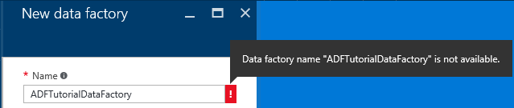
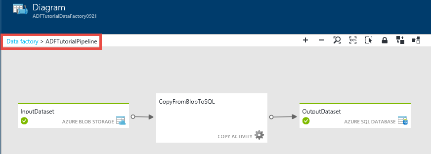
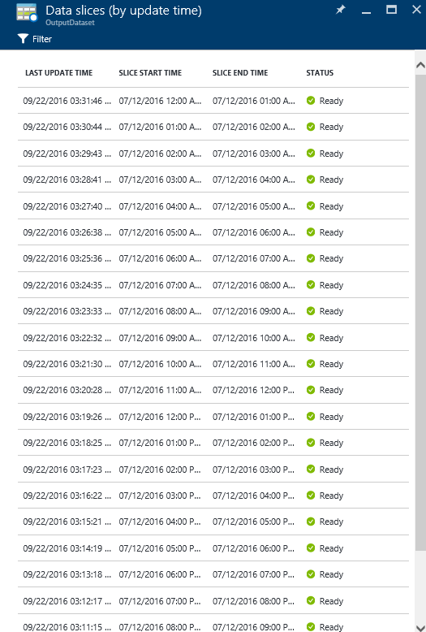

<properties 
    pageTitle="教學課程︰ 使用 Azure 入口網站複製活動建立管線 |Microsoft Azure" 
    description="在本教學課程中，您建立 Azure 資料工廠管線與複製活動 Azure 入口網站中使用資料工廠編輯器。" 
    services="data-factory" 
    documentationCenter="" 
    authors="spelluru" 
    manager="jhubbard" 
    editor="monicar"/>

<tags 
    ms.service="data-factory" 
    ms.workload="data-services" 
    ms.tgt_pltfrm="na" 
    ms.devlang="na" 
    ms.topic="get-started-article" 
    ms.date="09/16/2016" 
    ms.author="spelluru"/>

# 教學課程︰ 使用 Azure 入口網站複製活動建立管線
> [AZURE.SELECTOR]
- [概觀與先決條件](data-factory-copy-data-from-azure-blob-storage-to-sql-database.md)
- [複製精靈](data-factory-copy-data-wizard-tutorial.md)
- [Azure 入口網站](data-factory-copy-activity-tutorial-using-azure-portal.md)
- [Visual Studio](data-factory-copy-activity-tutorial-using-visual-studio.md)
- [PowerShell](data-factory-copy-activity-tutorial-using-powershell.md)
- [Azure 資源管理員範本](data-factory-copy-activity-tutorial-using-azure-resource-manager-template.md)
- [REST API](data-factory-copy-activity-tutorial-using-rest-api.md)
- [.NET API](data-factory-copy-activity-tutorial-using-dotnet-api.md)

本教學課程教您如何建立和監視使用 Azure 入口網站 Azure 資料工廠。 資料工廠管線使用複製活動，將資料複製到 Azure SQL 資料庫 Azure Blob 儲存體。

以下是您執行此教學課程的一部分的步驟︰

步驟 | 描述
-----| -----------
[建立 Azure 資料工廠](#create-data-factory) | 您可以在此步驟中，建立名為**ADFTutorialDataFactory**Azure 資料工廠。  
[建立連結的服務](#create-linked-services) | 您可以在此步驟中，建立兩個連結的服務︰ **AzureStorageLinkedService**和**AzureSqlLinkedService**。   AzureSqlLinkedService 連結 ADFTutorialDataFactory Azure SQL 資料庫並 AzureStorageLinkedService 連結 Azure 儲存空間。 輸入的資料的管線位於 blob 容器 Azure blob 儲存體和輸出資料儲存在 Azure SQL 資料庫中的資料表。 因此，您新增兩個資料儲存區為連結的服務資料 factory 至。      
[建立輸入與輸出資料集](#create-datasets) | 在上一個步驟中，您可以建立連結的服務會參照到含有輸入輸出資料的資料存放區。 在此步驟中，您可以定義兩個資料集- **InputDataset**和**OutputDataset** --代表資料存放區中輸入輸出資料。   如 InputDataset，指定包含 blob 的來源資料和 OutputDataset blob 容器，指定儲存輸出資料的 SQL 資料表。 您也可以指定其他屬性，例如結構、 可用性及原則。 
[建立管線](#create-pipeline) | 在此步驟中，您可以建立名為**ADFTutorialPipeline** ADFTutorialDataFactory 中的管線。   您輸入的將資料從 Azure blob 輸出 SQL Azure 資料表的管線新增至**複製活動**。 複製活動 Azure 資料工廠執行資料移動。 它已開啟電源，可以將資料安全、 可靠且可調整方式的各種資料儲存區之間複製全域可用服務。 如需複製活動詳細資訊，請參閱[資料移動活動](data-factory-data-movement-activities.md)文章。 
[監視器管線](#monitor-pipeline) | 在此步驟中，您可以監視輸入與輸出表格的扇形區使用 Azure 入口網站。

## 必要條件 
列出[教學課程概觀](data-factory-copy-data-from-azure-blob-storage-to-sql-database.md)，請參閱執行此教學課程之前，先完成的先決條件。

## 建立資料工廠
在此步驟中，您可以使用 [Azure 入口網站來建立名為**ADFTutorialDataFactory**Azure 資料工廠。

1.  之後[Azure 入口網站](https://portal.azure.com/)登入，按一下 [**新增**]，選取**智慧 + 分析**，然後按一下 [**資料工廠**。 

    ![新增 DataFactory]->   

6. 在**新的資料工廠**刀︰
    1. 您可以輸入**ADFTutorialDataFactory**的**名稱**。 
    
        

        Azure 資料 factory 名稱必須是**全域唯一**的。 如果您收到下列錯誤，變更資料工廠 (例如，yournameADFTutorialDataFactory) 的名稱，然後再試一次建立。 請參閱[資料工廠-命名規則](data-factory-naming-rules.md)命名規則資料工廠成品主題。
    
            Data factory name “ADFTutorialDataFactory” is not available  
     
        
    2. 選取您 Azure**訂閱**]。
    3. [資源] 群組中，請執行下列步驟︰
        1. 選取 [**使用現有的**然後從下拉式清單中選取現有的資源群組]。 
        2. 選取 [**建立新**]，然後輸入資源群組的名稱。   
    
            部分本教學課程中的步驟假設您使用的名稱︰ **ADFTutorialResourceGroup**資源群組。 若要瞭解資源群組，請參閱[使用資源群組來管理您的 Azure 資源](../azure-resource-manager/resource-group-overview.md)。  
    4. 選取資料工廠的**位置**。 支援的資料工廠服務的區域會顯示在下拉式清單中。
    5. 選取 [**固定至 Startboard**。     
    6. 按一下 [**建立**]。

        > [AZURE.IMPORTANT] 若要建立資料工廠執行個體，您必須是訂閱/資源群組層級的[資料工廠參與者](../active-directory/role-based-access-built-in-roles.md/#data-factory-contributor)角色的成員。
        >  
        >  可能在未來，因此就會公開顯示的 DNS 名稱登錄資料 factory 的名稱。              
9.  若要查看狀態/通知訊息，請按一下鐘形圖示，在工具列上。 

     
10. 建立完成後，您會看到**資料工廠**刀如下圖所示。

    

## 建立連結的服務
連結的服務連結資料存放區，或計算 Azure 資料工廠服務。 請參閱[支援的資料會儲存](data-factory-data-movement-activities.md##supported-data-stores-and-formats)所有來源和接收支援複製活動。 請參閱支援的資料工廠計算服務清單中的 [[計算連結的服務](data-factory-compute-linked-services.md)。 在本教學課程中，您不使用任何計算服務。 

您可以在此步驟中，建立兩個連結的服務︰ **AzureStorageLinkedService**和**AzureSqlLinkedService**。 AzureSqlLinkedService 連結**ADFTutorialDataFactory**Azure SQL 資料庫並 AzureStorageLinkedService 連結服務連結 Azure 儲存體帳戶。 您可以建立的管線稍後在此教學課程中將資料從 blob 容器中 AzureStorageLinkedService 複製 SQL 在中為表格 AzureSqlLinkedService。

### 建立連結 Azure 儲存體帳戶的服務
1.  在 [**資料工廠**刀中，按一下 [**撰寫及部署**啟動資料工廠的**編輯器**] 磚。

     
5. 在**編輯器]**中，按一下工具列上的 [**新的資料存放區**] 按鈕，然後從下拉式功能表中選取**Azure 儲存空間**。 您應該會看到的 JSON 範本在右窗格中建立連結的儲存空間 Azure 服務。 

    ![[編輯器新資料儲存區] 按鈕](./media/data-factory-copy-activity-tutorial-using-azure-portal/getstarted-editor-newdatastore-button.png)    
6. 取代`<accountname>`和`<accountkey>`的帳戶名稱和 Azure 儲存體帳戶的帳戶關鍵值。 

     
6. 按一下工具列] 上的 [**部署**]。 您現在應該會看到已部署的**AzureStorageLinkedService**樹狀檢視中。 

    

> [AZURE.NOTE]
> 如需 JSON 屬性的詳細資訊，請參閱[將資料從/Azure Blob](data-factory-azure-blob-connector.md#azure-storage-linked-service) 。

### 建立連結的服務 Azure SQL 資料庫
1. 在**資料工廠編輯器**中，按一下工具列上的 [**新的資料存放區**] 按鈕，然後從下拉式功能表中選取**Azure SQL 資料庫**。 您應該會看到在右窗格中建立連結的 Azure SQL 服務的 JSON 範本。
2. 取代`<servername>`， `<databasename>`， `<username>@<servername>`，及`<password>`Azure SQL server、 資料庫、 使用者帳戶和密碼的名稱。 
3. 按一下 [建立並部署**AzureSqlLinkedService**] 工具列上的 [**部署**]。
4. 確認您在樹狀檢視中看到**AzureSqlLinkedService** 。 

> [AZURE.NOTE]
> 如需 JSON 屬性的詳細資訊，請參閱[將資料從/Azure SQL 資料庫](data-factory-azure-sql-connector.md#azure-sql-linked-service-properties)。

## 建立資料集
在上一個步驟中，您可以建立連結的服務**AzureStorageLinkedService**和**AzureSqlLinkedService**連結資料 factory Azure 儲存體帳戶和 Azure SQL 資料庫︰ **ADFTutorialDataFactory**。 在此步驟中，您可以定義兩個資料集- **InputDataset**和**OutputDataset** --代表由 AzureStorageLinkedService 和 AzureSqlLinkedService 分別參照的資料存放區中輸入輸出資料。 如 InputDataset，指定包含 blob 的來源資料和 OutputDataset blob 容器，指定儲存輸出資料的 SQL 資料表。 

### 建立輸入資料集 
在此步驟中，您可以建立名為**InputDataset**指向 blob 容器 Azure 儲存體表示**AzureStorageLinkedService**連結服務中的資料集。

1. 在**編輯器]**的資料 Factory，按一下**...更多****新資料集**，然後按一下從下拉式功能表按一下**Azure Blob 儲存體**。 

    ![新增資料集] 功能表](./media/data-factory-copy-activity-tutorial-using-azure-portal/new-dataset-menu.png)
2. 在右窗格中 JSON 取代下列 JSON 程式碼片段︰ 

        {
          "name": "InputDataset",
          "properties": {
            "structure": [
              {
                "name": "FirstName",
                "type": "String"
              },
              {
                "name": "LastName",
                "type": "String"
              }
            ],
            "type": "AzureBlob",
            "linkedServiceName": "AzureStorageLinkedService",
            "typeProperties": {
              "folderPath": "adftutorial/",
              "fileName": "emp.txt",
              "format": {
                "type": "TextFormat",
                "columnDelimiter": ","
              }
            },
            "external": true,
            "availability": {
              "frequency": "Hour",
              "interval": 1
            }
          }
        }
        
     請注意下列重點︰ 
    
    - 資料集**類型**] 設定為**AzureBlob**。
    - **linkedServiceName**會設定為**AzureStorageLinkedService**。 您在步驟 2 中建立此連結的服務。
    - **folderPath**會設定為**adftutorial**容器。 您也可以指定 blob 中使用**檔案名稱**] 屬性的資料夾的名稱。 您不指定 blob 的名稱，因為所有 blob 容器中的資料會被視為輸入的資料。  
    - **類型**的格式設定為**TextFormat**
    - 以逗號字元 (**columnDelimiter**) 分隔的文字檔案 –**名字**和**姓氏**– 中有兩個欄位 
    - **顯示狀態**設定為 [**每小時**（**頻率**設為**小時**和**間隔**設為**1**）。 因此，資料工廠尋找輸入資料的每個小時 blob 容器 (**adftutorial**) 您所指定的根資料夾中。 
    
    如果您不指定的**輸入**資料集的**檔案名稱**，所有檔案/二進位大型物件從 [輸入] 資料夾 (**folderPath**) 都視為輸入。 如果您的檔案名稱] 中指定 JSON 只指定的檔案/blob 會被視為 asn 輸入。
 
    如果您沒有指定**輸出資料表中**的**檔案名稱**，在**folderPath**產生的檔案具名以下列格式︰ 資料。&lt;Guid\&gt;。txt (範例︰ Data.0a405f8a-93ff-4c6f-b3be-f69616f1df7a.txt。)。

    若要設定**folderPath**和**檔名**動態根據**SliceStart**的時間，請使用**partitionedBy**屬性。 在下列範例中，folderPath 使用年、 月和日從 SliceStart （正在處理的扇形區中的開始時間），且檔名使用從 SliceStart 小時。 例如，如果所產生的扇形區 2016-09-20T08:00:00，設定為 [wikidatagateway wikisampledataout/2016年/09/20 資料夾名稱，並 08.csv 調檔名。 

            "folderPath": "wikidatagateway/wikisampledataout/{Year}/{Month}/{Day}",
            "fileName": "{Hour}.csv",
            "partitionedBy": 
            [
                { "name": "Year", "value": { "type": "DateTime", "date": "SliceStart", "format": "yyyy" } },
                { "name": "Month", "value": { "type": "DateTime", "date": "SliceStart", "format": "MM" } }, 
                { "name": "Day", "value": { "type": "DateTime", "date": "SliceStart", "format": "dd" } }, 
                { "name": "Hour", "value": { "type": "DateTime", "date": "SliceStart", "format": "hh" } } 
            ],
2. 按一下 [建立並部署**InputDataset**資料集] 工具列上的 [**部署**]。 確認您看到**InputDataset**樹狀檢視中。

> [AZURE.NOTE]
> 如需 JSON 屬性的詳細資訊，請參閱[將資料從/Azure Blob](data-factory-azure-blob-connector.md#azure-blob-dataset-type-properties) 。

### 建立輸出資料集
在此步驟的一部份，您可以建立名為**OutputDataset**輸出資料集。 此資料集指向表示**AzureSqlLinkedService**Azure SQL 資料庫的 SQL 資料表。 

1. 在**編輯器]**的資料 Factory，按一下**...更多****新資料集**，然後按一下從下拉式功能表按一下**Azure SQL** 。 
2. 在右窗格中 JSON 取代下列 JSON 程式碼片段︰

        {
          "name": "OutputDataset",
          "properties": {
            "structure": [
              {
                "name": "FirstName",
                "type": "String"
              },
              {
                "name": "LastName",
                "type": "String"
              }
            ],
            "type": "AzureSqlTable",
            "linkedServiceName": "AzureSqlLinkedService",
            "typeProperties": {
              "tableName": "emp"
            },
            "availability": {
              "frequency": "Hour",
              "interval": 1
            }
          }
        }
        
     請注意下列重點︰ 
    
    - 資料集**類型**] 設定為**AzureSQLTable**。
    - **linkedServiceName**會設定為**AzureSqlLinkedService** （您將建立在 [步驟 2 此連結的服務）。
    - **表格名稱**會設定為**emp**中。
    - 有三個欄位 –**識別碼**、**名字**] 和**[姓氏]** – emp 資料表中的資料庫中。 ID 是識別資料行，因此您必須在這裡指定只**名字**和**姓氏**。
    - **顯示狀態**設定為 [**每小時**（**頻率**設為**小時**和**間隔**設為**1**）。  資料工廠服務會產生輸出資料扇形區每小時**emp**資料表中的 Azure SQL 資料庫。

3. 按一下 [建立並部署**OutputDataset**資料集] 工具列上的 [**部署**]。 確認您看到**OutputDataset**樹狀檢視中。 

> [AZURE.NOTE]
> 如需 JSON 屬性的詳細資訊，請參閱[將資料從/Azure SQL 資料庫](data-factory-azure-sql-connector.md#azure-sql-linked-service-properties)。

## 建立管線
在此步驟中，您必須建立管線與使用**InputDataset**做為輸入**複製活動**和**OutputDataset**作為輸出。

1. 在**編輯器]**的資料 Factory，按一下**...更多**，按一下 [**新的管線**。 或者，您可以用滑鼠右鍵按一下樹狀檢視中的**管線**，按一下 [**新的管線**。
2. 在右窗格中 JSON 取代下列 JSON 程式碼片段︰ 
        
        {
          "name": "ADFTutorialPipeline",
          "properties": {
            "description": "Copy data from a blob to Azure SQL table",
            "activities": [
              {
                "name": "CopyFromBlobToSQL",
                "type": "Copy",
                "inputs": [
                  {
                    "name": "InputDataset"
                  }
                ],
                "outputs": [
                  {
                    "name": "OutputDataset"
                  }
                ],
                "typeProperties": {
                  "source": {
                    "type": "BlobSource"
                  },
                  "sink": {
                    "type": "SqlSink",
                    "writeBatchSize": 10000,
                    "writeBatchTimeout": "60:00:00"
                  }
                },
                "Policy": {
                  "concurrency": 1,
                  "executionPriorityOrder": "NewestFirst",
                  "retry": 0,
                  "timeout": "01:00:00"
                }
              }
            ],
            "start": "2016-07-12T00:00:00Z",
            "end": "2016-07-13T00:00:00Z"
          }
        } 

    請注意下列重點︰

    - 在 [活動] 區段中，有其**類型**] 設定為**複製**只有一個活動。
    - 輸入活動設定為 [ **InputDataset**和活動的輸出效果設定為 [ **OutputDataset**。
    - 在 [ **typeProperties** ] 區段中， **BlobSource**指定為來源類型，然後**SqlSink**指定為接收類型]。

    [**開始**] 屬性的值取代目前的日期和**結束**值與 [下一天。 您可以指定日期組件，並略過的日期時間的時間部分。 例如，「 2016年-02-03 」，相當於 「 2016年-02-03T00:00:00Z 」
    
    同時開始和結束日期時間必須是[ISO 格式](http://en.wikipedia.org/wiki/ISO_8601)。 例如︰ 2016年-10-14T16:32:41Z。 **結束**時間是選擇性的但我們在本教學課程中使用。 
    
    如果您未指定的 [**結束**] 屬性的值，它會計算為 「**開始 + 48 小時**」。 若要執行管線，指定**9999-09 09**做為 [**結束**] 屬性的值。
    
    在上述範例中，有 24 資料扇形區每個資料扇形區不會產生每小時。
    
4. 按一下 [建立並部署**ADFTutorialPipeline**] 工具列上的 [**部署**]。 確認您看到的管線樹狀檢視中。 
5. 現在，請按一下**X**關閉**編輯器**刀。按一下即可看到**資料工廠**首頁**ADFTutorialDataFactory**的**X** 。

**恭喜您 ！** 您已成功建立 Azure 資料工廠、 連結的服務、 表格和管線並排程管道的郵件。   
 
### 在圖表檢視中檢視資料工廠 
1. 在**資料工廠**刀中，按一下 [**圖表**]。

    
2. 您應該會看到類似下列圖像圖表︰ 

    

    您可以放大、 縮小、 縮放為 100%，縮放以符合、 自動將管線及目錄]，以及顯示歷程資訊 （醒目提示選取的項目上游和下游項目）。  您可以按兩下物件 （輸入輸出表格或管線），請參閱屬性。 
3. 以滑鼠右鍵按一下 [圖表檢視] 中的**ADFTutorialPipeline** ，然後按一下 [**開啟管道的郵件**]。 

    
4. 您應該會看到輸入與輸出資料集的活動以及管線中的活動。 在本教學課程中，您可以有只有一個活動管道 （複製活動） 與 InputDataset 為輸入資料集和 OutputDataset 與輸出資料集。   

    
5. 按一下左上角，若要返回 [圖表] 檢視中的階層連結**資料工廠**。 [圖表] 檢視會顯示所有的管線。 在此範例中，您只建立一個管道的郵件。   
 

## 監視器管線
在此步驟中，您可以使用 Azure 入口網站監控 Azure 資料工廠運作。 

### 使用 [圖表] 檢視的監視器管線

1. 按一下 [ **X** ] 以關閉 [**圖表**] 檢視以查看資料 factory 資料工廠首頁。 如果您已關閉的網頁瀏覽器，請執行下列步驟︰ 
    2. 瀏覽至[Azure 入口網站](https://portal.azure.com/)。 
    2. 按兩下**ADFTutorialDataFactory** **Startboard**上 （或） 的左側功能表上，按一下 [**資料工廠**，ADFTutorialDataFactory 搜尋。 
3. 您應該會看到 [計數] 和 [資料表和您在此刀建立的管線的名稱。

    ![使用名稱的 [首頁] 頁面](./media/data-factory-copy-activity-tutorial-using-azure-portal/getstarted-datafactory-home-page-pipeline-tables.png)
4. 現在，請按一下**資料集**] 磚。
5. 在**資料集**刀中，按一下 [ **InputDataset**]。 此資料集是**ADFTutorialPipeline**輸入資料集。

       
5. 按一下 [ **...（省略符號）**若要查看所有資料扇形區。

      

    請注意到目前的時間的所有資料扇形區都準備**好**的因為**emp.txt**檔案 blob 容器中有任何時間︰ **adftutorial\input**。 請確認沒有扇形區顯示底部的 [**最近失敗的扇形區**] 區段中。

    **最近更新的扇形區**] 和 [**最近失敗扇形區**清單被依**上次更新時間**。 
    
    按一下 [篩選扇形區] 工具列上的 [**篩選**]。  
    
    
6. 關閉刀，直到您看到**資料集**刀。 按一下 [ **OutputDataset**]。 此資料集是**ADFTutorialPipeline**輸出資料集。

    
6. 您應該會看到**OutputDataset**刀，如下圖所示︰

     
7. 請注意具有產生進位到目前的時間資料扇形區，並**準備好**。 沒有扇形區會顯示在底部的 [**問題扇形區**] 區段中。
8. 按一下 [ **...（省略符號）**若要查看所有扇形區。

    
9. 按一下 [從清單中的任何資料扇形區，您應該會看到**資料扇形區**刀。

    
  
    如果扇形區不在**準備好**的狀態，您可以看到的不是好會封鎖執行**的是尚未準備上游扇形區**清單中的目前扇形區上游扇形區。
11. 在**資料扇形區**刀中，您應該會看到底部清單中的所有活動都執行。 按一下 [**執行的活動**，查看**執行詳細資料的活動**刀。 

    
12. 按一下 [ **X** ] 以關閉所有刀，直到您返回家用刀的**ADFTutorialDataFactory**]。
14. （選用）在 [首頁] 頁面上按一下**ADFTutorialDataFactory****管線** **ADFTutorialPipeline** **管線**刀中,，然後按一下鑽研輸入的表格 (**Consumed**) 或輸出 (**Produced**)。
15. 啟動**SQL Server Management Studio**、 連線至 Azure SQL 資料庫，並確認插入至資料庫中**列出 emp**資料表的資料列。

    

### 監視使用監控和管理應用程式的管線
您也可以使用 [監視器]，並管理應用程式來監控您的管線]。 瞭解如何使用此應用程式的詳細資訊，請參閱[監控和管理使用監控和管理應用程式的 Azure 資料工廠管線](data-factory-monitor-manage-app.md)。

1. 按一下 [**監控和管理**您資料的工廠首頁上的並排顯示]。

     
2. 您應該會看到**螢幕及管理應用程式**。 變更**開始時間**和**結束時間**，以包含開始 (12-2016年-07) 和結束您的管線的次數 (2016年-07-13)，然後按一下 [**套用**]。 

     
3. 若要查看詳細資料的**活動視窗**] 清單中選取活動視窗。 
    

## 摘要 
您可以在此教學課程中，建立複製 Azure 資料工廠資料從 Azure blob 到 Azure SQL 資料庫。 您可用於建立資料 factory、 連結的服務、 資料集，以及管線 Azure 入口網站。 以下是您在本教學課程所執行的高層級步驟︰  

1.  建立 Azure**資料工廠**。
2.  建立**連結的服務**︰
    1. 連結您持有輸入的資料的 Azure 儲存體帳戶**Azure 儲存體**連結服務。    
    2. 連結 Azure SQL 資料庫存放輸出資料連結的**SQL Azure**服務。 
3.  建立**資料集**的描述輸入的資料和管線的輸出資料。
4.  建立**管線**與**BlobSource** **複製活動**的來源和**SqlSink**為接收。  

## 另請參閱
| 主題 | 描述 |
| :---- | :---- |
| [資料移動活動](data-factory-data-movement-activities.md) | 本文提供您在本教學課程中使用複製活動的相關詳細的資訊。 |
| [排程和執行](data-factory-scheduling-and-execution.md) | 本文說明 Azure 資料 Factory 應用程式模型的排程和執行方面。 |
| [管線](data-factory-create-pipelines.md) | 本文可協助您瞭解管線和 Azure 資料工廠的活動。 |
| [資料集](data-factory-create-datasets.md) | 本文可協助您瞭解 Azure 資料工廠中的資料集。
| [監控和管理使用監視的應用程式的管線](data-factory-monitor-manage-app.md) | 本文將說明如何監控、 管理及偵錯管線使用 [監控和管理應用程式。 

