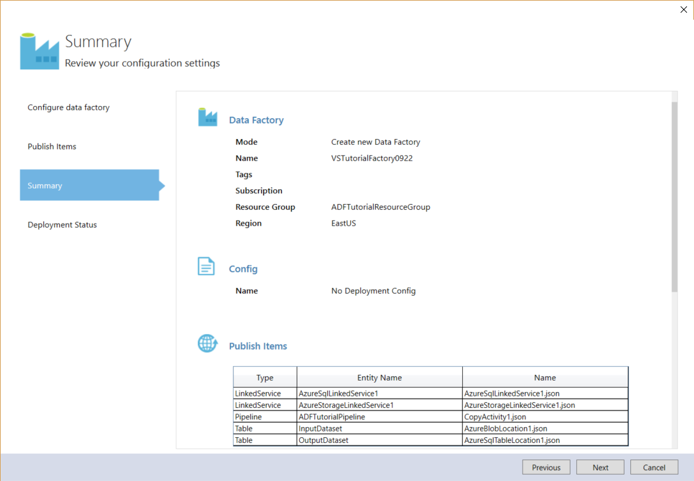
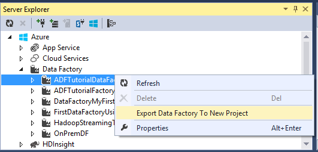

<properties 
    pageTitle="教學課程︰ 使用 [複製活動使用 Visual Studio 建立管線 |Microsoft Azure" 
    description="在此教學課程中，您建立 Azure 資料工廠管線複製活動與使用 Visual Studio。" 
    services="data-factory" 
    documentationCenter="" 
    authors="spelluru" 
    manager="jhubbard" 
    editor="monicar"/>

<tags 
    ms.service="data-factory" 
    ms.workload="data-services" 
    ms.tgt_pltfrm="na" 
    ms.devlang="na" 
    ms.topic="get-started-article" 
    ms.date="10/17/2016" 
    ms.author="spelluru"/>

# 教學課程︰ 使用 [複製活動使用 Visual Studio 建立管線
> [AZURE.SELECTOR]
- [概觀與先決條件](data-factory-copy-data-from-azure-blob-storage-to-sql-database.md)
- [複製精靈](data-factory-copy-data-wizard-tutorial.md)
- [Azure 入口網站](data-factory-copy-activity-tutorial-using-azure-portal.md)
- [Visual Studio](data-factory-copy-activity-tutorial-using-visual-studio.md)
- [PowerShell](data-factory-copy-activity-tutorial-using-powershell.md)
- [Azure 資源管理員範本](data-factory-copy-activity-tutorial-using-azure-resource-manager-template.md)
- [REST API](data-factory-copy-activity-tutorial-using-rest-api.md)
- [.NET API](data-factory-copy-activity-tutorial-using-dotnet-api.md)

本教學課程教您如何建立和監視使用 Visual Studio Azure 資料工廠。 資料工廠管線使用複製活動，將資料複製到 Azure SQL 資料庫 Azure Blob 儲存體。

以下是您執行此教學課程的一部分的步驟︰

1. 建立兩個連結的服務︰ **AzureStorageLinkedService1**和**AzureSqlinkedService1**。 

    AzureStorageLinkedService1 連結 Azure 的儲存空間 AzureSqlLinkedService1 連結並 Azure SQL 資料庫資料 factory: **ADFTutorialDataFactoryVS**。 輸入的資料的管線 blob 容器中 Azure blob 儲存體中並輸出資料都會儲存在 Azure SQL 資料庫中的資料表。 因此，您加入下列兩個資料儲存區為連結的服務資料 factory。
2. 建立兩個資料集︰ **InputDataset**和**OutputDataset**，代表資料存放區中輸入輸出資料。 

    為 InputDataset，您可以指定含有 blob 的來源資料的 blob 容器。 為 OutputDataset，您可以指定儲存輸出資料的 SQL 資料表。 您也可以指定其他屬性，例如結構、 可用性及原則。
3. 建立管線名為**ADFTutorialPipeline** ADFTutorialDataFactoryVS 中。 

    管線具有輸入的將資料從 Azure blob 輸出 Azure SQL 表格**複製的活動**。 複製活動 Azure 資料工廠執行資料移動。 全域可用服務，可以將各種資料存放區中的安全性、 可靠性，且可調整方式之間的資料複製為可活動。 如需複製活動詳細資訊，請參閱[資料移動活動](data-factory-data-movement-activities.md)文章。 
4. 建立名為**VSTutorialFactory**資料工廠。 部署資料 factory 和所有資料工廠實體 （連結的服務、 表格和管線）。    

## 必要條件

1. 閱讀[教學課程概觀](data-factory-copy-data-from-azure-blob-storage-to-sql-database.md)文章並完成的**必要**步驟。 
2. 您必須是**Azure 訂閱的管理員**，才能將資料工廠實體發佈至 Azure 資料工廠。  
3. 您必須在電腦上安裝下列動作︰ 
    - Visual Studio 2013 或 Visual Studio 2015
    - 下載 Azure SDK Visual Studio 2013 或 Visual Studio 2015。 瀏覽至[Azure 下載頁面](https://azure.microsoft.com/downloads/)，然後按一下**與 2013年**或**與 2015年** **.NET** ] 區段中。
    - 下載最新的 Azure 資料工廠外掛程式的 Visual Studio︰[與 2013年](https://visualstudiogallery.msdn.microsoft.com/754d998c-8f92-4aa7-835b-e89c8c954aa5)或[與 2015年](https://visualstudiogallery.msdn.microsoft.com/371a4cf9-0093-40fa-b7dd-be3c74f49005)。 您也可以更新的外掛程式，請執行下列步驟︰ 在功能表中，按一下 [**工具** -> **Extensions 和更新** -> **Online** -> **Visual Studio 庫** -> **Microsoft Azure 資料工廠工具 Visual Studio** -> **更新**。

## 建立 Visual Studio 專案 
1. 啟動 [ **Visual Studio 2013**]。 按一下 [**檔案]**、 指向 [**新增**]，並按一下 [**專案**]。 您應該會看到**新的專案**] 對話方塊。  
2. 在 [**新專案**] 對話方塊中選取**DataFactory**範本，然後按一下 [**空白資料工廠專案**。 如果您沒有看到 DataFactory 範本，關閉 Visual Studio，安裝 Azure SDK Visual Studio 2013，然後重新開啟 Visual Studio。  

    ![新增專案] 對話方塊](./media/data-factory-copy-activity-tutorial-using-visual-studio/new-project-dialog.png)

3. 輸入**名稱**專案、**位置**及**解決方案**的名稱，然後按一下**[確定]**。

     

## 建立連結的服務
連結的服務連結資料存放區，或計算 Azure 資料工廠服務。 請參閱[支援的資料會儲存](data-factory-data-movement-activities.md##supported-data-stores-and-formats)所有來源和接收支援複製活動。 請參閱支援的資料工廠計算服務清單中的 [[計算連結的服務](data-factory-compute-linked-services.md)。 在本教學課程中，您不使用任何計算服務。 

您可以在此步驟中，建立兩個連結的服務︰ **AzureStorageLinkedService1**和**AzureSqlLinkedService1**。 AzureStorageLinkedService1 連結服務連結 Azure 儲存體帳戶 AzureSqlLinkedService 連結並 Azure SQL 資料庫資料 factory: **ADFTutorialDataFactory**。 

### 建立連結的 Azure 儲存體服務

4. 以滑鼠右鍵按一下方案總管] 中的**連結的服務**，指向 [**新增**]，然後按一下 [**新增項目**。      
5. 在**新增新的項目**] 對話方塊中，從清單中，選取**Azure 儲存連結服務**，然後按一下 [**新增**]。 

    
 
3. 取代`<accountname>`和`<accountkey>`* Azure 儲存體帳戶及索引鍵的名稱。 

    

4. 儲存**AzureStorageLinkedService1.json**檔案。

> 如需 JSON 屬性的詳細資訊，請參閱[將資料從/Azure Blob](data-factory-azure-blob-connector.md#azure-storage-linked-service) 。

### 建立連結的 Azure SQL 服務

5. 以滑鼠右鍵按一下**方案總管]**中的 [**連結的服務**] 節點再次指向 [**新增**]，按一下 [**新增項目**。 
6. 這次請選取**Azure SQL 連結服務**]，按一下 [**新增**]。 
7. 在**AzureSqlLinkedService1.json 檔案**中，取代`<servername>`， `<databasename>`， `<username@servername>`，及`<password>`Azure SQL server、 資料庫、 使用者帳戶和密碼的名稱。    
8.  儲存**AzureSqlLinkedService1.json**檔案。 

> [AZURE.NOTE]
> 如需 JSON 屬性的詳細資訊，請參閱[將資料從/Azure SQL 資料庫](data-factory-azure-sql-connector.md#azure-sql-linked-service-properties)。

## 建立資料集
在上一個步驟中，您可以建立連結的服務**AzureStorageLinkedService1**和**AzureSqlLinkedService1**連結資料 factory Azure 儲存體帳戶和 Azure SQL 資料庫︰ **ADFTutorialDataFactory**。 在此步驟中，您可以定義兩個資料集- **InputDataset**和**OutputDataset** --代表由 AzureStorageLinkedService1 和 AzureSqlLinkedService1 分別參照的資料存放區中輸入輸出資料。 對於 InputDataset，您可以指定含有 blob 的來源資料的 blob 容器。 對於 OutputDataset，您可以指定儲存輸出資料的 SQL 資料表。

### 建立輸入資料集
在此步驟中，您可以建立名為**InputDataset**指向 blob 容器 Azure 儲存體表示**AzureStorageLinkedService1**連結服務中的資料集。 表格是矩形資料集，現在支援的資料集的唯一的類型。 

9. **表格**在**方案總管]**中以滑鼠右鍵按一下，指向 [**新增**]，然後按一下 [**新項目**。
10. 在**新增新的項目**] 對話方塊中，選取**Azure Blob**，然後按一下 [**新增**]。   
10. 使用下列的文字取代 JSON 文字和儲存**AzureBlobLocation1.json**檔案。 

        {
          "name": "InputDataset",
          "properties": {
            "structure": [
              {
                "name": "FirstName",
                "type": "String"
              },
              {
                "name": "LastName",
                "type": "String"
              }
            ],
            "type": "AzureBlob",
            "linkedServiceName": "AzureStorageLinkedService1",
            "typeProperties": {
              "folderPath": "adftutorial/",
              "format": {
                "type": "TextFormat",
                "columnDelimiter": ","
              }
            },
            "external": true,
            "availability": {
              "frequency": "Hour",
              "interval": 1
            }
          }
        }

     請注意下列重點︰ 
    
    - 資料集**類型**] 設定為**AzureBlob**。
    - **linkedServiceName**會設定為**AzureStorageLinkedService**。 您在步驟 2 中建立此連結的服務。
    - **folderPath**會設定為**adftutorial**容器。 您也可以指定 blob 中使用**檔案名稱**] 屬性的資料夾的名稱。 您不指定 blob 的名稱，因為所有 blob 容器中的資料會被視為輸入的資料。  
    - **類型**的格式設定為**TextFormat**
    - 以逗號字元 (**columnDelimiter**) 分隔的文字檔案 –**名字**和**姓氏**– 中有兩個欄位 
    - **顯示狀態**設定為 [**每小時**（**頻率**設為**小時**和**間隔**設為**1**）。 因此，資料工廠尋找輸入資料的每個小時 blob 容器 (**adftutorial**) 您所指定的根資料夾中。 
    
    如果您不指定的**輸入**資料集的**檔案名稱**，所有檔案/二進位大型物件從 [輸入] 資料夾 (**folderPath**) 都視為輸入。 如果您的檔案名稱] 中指定 JSON 只指定的檔案/blob 會被視為 asn 輸入。
 
    如果您沒有指定**輸出資料表中**的**檔案名稱**，在**folderPath**產生的檔案具名以下列格式︰ 資料。&lt;Guid\&gt;。txt (範例︰ Data.0a405f8a-93ff-4c6f-b3be-f69616f1df7a.txt。)。

    若要設定**folderPath**和**檔名**動態根據**SliceStart**的時間，請使用**partitionedBy**屬性。 在下列範例中，folderPath 使用年、 月和日從 SliceStart （正在處理的扇形區中的開始時間），且檔名使用從 SliceStart 小時。 例如，如果所產生的扇形區 2016-09-20T08:00:00，設定為 [wikidatagateway wikisampledataout/2016年/09/20 資料夾名稱，並 08.csv 調檔名。 

            "folderPath": "wikidatagateway/wikisampledataout/{Year}/{Month}/{Day}",
            "fileName": "{Hour}.csv",
            "partitionedBy": 
            [
                { "name": "Year", "value": { "type": "DateTime", "date": "SliceStart", "format": "yyyy" } },
                { "name": "Month", "value": { "type": "DateTime", "date": "SliceStart", "format": "MM" } }, 
                { "name": "Day", "value": { "type": "DateTime", "date": "SliceStart", "format": "dd" } }, 
                { "name": "Hour", "value": { "type": "DateTime", "date": "SliceStart", "format": "hh" } } 

> [AZURE.NOTE]
> 如需 JSON 屬性的詳細資訊，請參閱[將資料從/Azure Blob](data-factory-azure-blob-connector.md#azure-blob-dataset-type-properties) 。

### 建立輸出資料集
在此步驟中，您可以建立名為**OutputDataset**輸出資料集。 此資料集指向表示**AzureSqlLinkedService1**Azure SQL 資料庫的 SQL 資料表。 

11. **表格**在**方案總管]**中以滑鼠右鍵按一下，指向 [**新增**]，然後按一下 [**新增項目**。
12. 在**新增新的項目**] 對話方塊中，選取**Azure SQL**，然後按一下 [**新增**]。 
13. 使用下列 JSON 取代 JSON 文字並儲存**AzureSqlTableLocation1.json**檔案。

        {
          "name": "OutputDataset",
          "properties": {
            "structure": [
              {
                "name": "FirstName",
                "type": "String"
              },
              {
                "name": "LastName",
                "type": "String"
              }
            ],
            "type": "AzureSqlTable",
            "linkedServiceName": "AzureSqlLinkedService1",
            "typeProperties": {
              "tableName": "emp"
            },
            "availability": {
              "frequency": "Hour",
              "interval": 1
            }
          }
        }

     請注意下列重點︰ 
    
    - 資料集**類型**] 設定為**AzureSQLTable**。
    - **linkedServiceName**會設定為**AzureSqlLinkedService** （您將建立在 [步驟 2 此連結的服務）。
    - **表格名稱**會設定為**emp**。
    - 有三個欄位 –**識別碼**、**名字**] 和**[姓氏]** – emp 資料表中的資料庫中。 ID 是識別資料行，因此您必須在這裡指定只**名字**和**姓氏**。
    - **顯示狀態**設定為 [**每小時**（**頻率**設為**小時**和**間隔**設為**1**）。  資料工廠服務會產生輸出資料扇形區每小時**emp**資料表中的 Azure SQL 資料庫。

> [AZURE.NOTE]
> 如需 JSON 屬性的詳細資訊，請參閱[將資料從/Azure SQL 資料庫](data-factory-azure-sql-connector.md#azure-sql-linked-service-properties)。

## 建立管線 
您已經建立輸入輸出連結的服務和表格為止。 現在，您建立的管線複製至**複製活動**與資料從 Azure blob 到 Azure SQL 資料庫。 

1. **管線**在**方案總管]**中以滑鼠右鍵按一下，指向 [**新增**]，然後按一下 [**新增項目**。  
15. 在**新增新的項目**] 對話方塊中選取 [**複製資料管道的郵件**，然後按一下 [**新增**]。 
16. 使用下列 JSON 取代 JSON 並儲存**CopyActivity1.json**檔案。
            
        {
          "name": "ADFTutorialPipeline",
          "properties": {
            "description": "Copy data from a blob to Azure SQL table",
            "activities": [
              {
                "name": "CopyFromBlobToSQL",
                "type": "Copy",
                "inputs": [
                  {
                    "name": "InputDataset"
                  }
                ],
                "outputs": [
                  {
                    "name": "OutputDataset"
                  }
                ],
                "typeProperties": {
                  "source": {
                    "type": "BlobSource"
                  },
                  "sink": {
                    "type": "SqlSink",
                    "writeBatchSize": 10000,
                    "writeBatchTimeout": "60:00:00"
                  }
                },
                "Policy": {
                  "concurrency": 1,
                  "executionPriorityOrder": "NewestFirst",
                  "style": "StartOfInterval",
                  "retry": 0,
                  "timeout": "01:00:00"
                }
              }
            ],
            "start": "2015-07-12T00:00:00Z",
            "end": "2015-07-13T00:00:00Z",
            "isPaused": false
          }
        }

    請注意下列重點︰

    - 在 [活動] 區段中，有其**類型**] 設定為**複製**只有一個活動。
    - 輸入活動設定為 [ **InputDataset**和活動的輸出效果設定為 [ **OutputDataset**。
    - 在 [ **typeProperties** ] 區段中， **BlobSource**指定為來源類型，然後**SqlSink**指定為接收類型]。

    [**開始**] 屬性的值取代目前的日期和**結束**值與 [下一天。 您可以指定日期組件，並略過的日期時間的時間部分。 例如，「 2016年-02-03 」，相當於 「 2016年-02-03T00:00:00Z 」
    
    同時開始和結束日期時間必須是[ISO 格式](http://en.wikipedia.org/wiki/ISO_8601)。 例如︰ 2016年-10-14T16:32:41Z。 **結束**時間是選擇性的但我們在本教學課程中使用。 
    
    如果您未指定的 [**結束**] 屬性的值，它會計算為 「**開始 + 48 小時**」。 若要執行管線，指定**9999-09 09**做為 [**結束**] 屬性的值。
    
    在上述範例中，有 24 資料扇形區每個資料扇形區不會產生每小時。

## 發佈/部署資料工廠項目
您可以在此步驟中，發佈資料工廠實體 （連結的服務與資料集，管線） 先前所建立。 您也可以指定新資料工廠建立保留這些項目的名稱。  

18. 在方案總管中，以滑鼠右鍵按一下，然後按一下 [**發佈**]。 
19. 如果您看到**您的 Microsoft 帳戶登入**] 對話方塊中，輸入您的認證有 Azure 訂閱的帳戶，然後按一下 [**登入**。
20. 您應該會看到下列對話方塊中︰

    ![發佈] 對話方塊](./media/data-factory-copy-activity-tutorial-using-visual-studio/publish.png)
21. 在 [設定資料工廠頁面上，執行下列步驟︰ 
    1. 選取 [**建立新的資料工廠**選項]。
    2. 您可以輸入**VSTutorialFactory**的**名稱**。  
    
        > [AZURE.IMPORTANT]  
        > Azure 資料 factory 名稱必須是全域唯一的。 如果發佈時，您會收到錯誤的相關資料工廠的名稱，，變更資料工廠 (例如，yournameVSTutorialFactory) 並再試一次發佈的名稱。 請參閱[資料工廠-命名規則](data-factory-naming-rules.md)命名規則資料工廠成品主題。     
    3.選取 Azure 訂閱的 [**訂閱**] 欄位。
     
        > [AZURE.IMPORTANT]如果您沒有看到任何訂閱，請確定您有登入使用的是系統管理員或共同-系統訂閱的帳戶。  
    4.選取資料工廠建立**資源群組**]。 5。 選取的資料 factory 的**區域**。 支援的資料工廠服務的區域會顯示在下拉式清單中。
6。 按一下 [**下一步**切換至**發佈的項目**頁面。
    
           
23. 在 [**發佈的項目**] 頁面中，確保所有資料工廠實體已選取，並按 [**下一步**切換至 [**摘要**] 頁面。
    
    ![發佈項目] 頁面](media/data-factory-copy-activity-tutorial-using-visual-studio/publish-items-page.png)     
24. 檢閱摘要，請按 [**下一步**開始部署程序，並檢視**部署狀態**。

    
25. 在 [**部署狀態**] 頁面中，您應該會看到部署程序的狀態。 部署完成之後，請按一下 [完成]。 
    ![部署狀態] 頁面](media/data-factory-copy-activity-tutorial-using-visual-studio/deployment-status.png)請注意下列重點︰ 

- 如果您收到錯誤訊息: 「**使用命名空間 Microsoft.DataFactory 未註冊此訂閱**]，請執行下列其中一項，然後再試一次發佈︰ 

    - 在 PowerShell 的 Azure，執行下列命令以註冊資料工廠提供者。 
        
            Register-AzureRmResourceProvider -ProviderNamespace Microsoft.DataFactory
    
        您可以執行下列命令以確認的資料工廠提供者註冊。 
    
            Get-AzureRmResourceProvider
    - 使用 Azure 訂閱到[Azure 入口網站](https://portal.azure.com)登入並瀏覽至資料工廠刀 （或） Azure 入口網站中建立資料工廠。 這個動作會自動註冊您的提供者。
-   可能在未來，因此就會公開顯示的 DNS 名稱登錄資料 factory 的名稱。

> [AZURE.IMPORTANT] 若要建立資料工廠執行個體，您必須 Azure 訂閱管理員/共同管理員

## 摘要
您可以在此教學課程中，建立複製 Azure 資料工廠資料從 Azure blob 到 Azure SQL 資料庫。 您可以用於 Visual Studio 建立資料 factory、 連結的服務、 資料集，以及管線。 以下是您在本教學課程所執行的高層級步驟︰  

1.  建立 Azure**資料工廠**。
2.  建立**連結的服務**︰
    1. 連結您持有輸入的資料的 Azure 儲存體帳戶**Azure 儲存體**連結服務。    
    2. 連結 Azure SQL 資料庫存放輸出資料連結的**SQL Azure**服務。 
3.  建立**資料集**，輸入的資料和管線的輸出資料的說明。
4.  建立**管線**與**BlobSource** **複製活動**的來源和**SqlSink**為接收。 

## 若要檢視資料工廠使用伺服器總管

1. 在**Visual Studio**中，按一下 [**檢視**] 功能表，然後按一下**伺服器總管]**。
2. 在 [伺服器總管] 視窗中，展開 [ **Azure**並展開**資料工廠**。 如果您看到**Visual Studio 登入**，請輸入**帳戶**Azure 訂閱相關聯，然後按一下 [**繼續**]。 輸入**密碼**，然後按一下 [**登入**。 Visual Studio 會以取得您的訂閱中的所有 Azure 資料工廠的相關資訊。 您會看到此**資料工廠工作清單**] 視窗中作業的狀態。
    
3. 您也可以以滑鼠右鍵按一下資料工廠，並選取 [匯出資料工廠建立根據現有的資料工廠 Visual Studio 專案的新專案。
      

## Visual Studio 的更新資料工廠工具
若要更新 Visual Studio Azure 資料工廠工具，請執行下列步驟︰

1. 按一下 [在功能表上的 [**工具]** ，然後選取**Extensions 和更新**。 
2. 在左窗格中選取**的更新**，然後選取 [ **Visual Studio 圖庫**。
4. 選取**Visual Studio Azure 資料工廠工具**，然後按一下 [**更新**]。 如果您沒有看到這個項目，您已經擁有最新版本的工具。 

請參閱如何使用監控管線與資料集的 Azure 入口網站中的指示進行本教學課程中建立[監視器資料集和管道的郵件](data-factory-copy-activity-tutorial-using-azure-portal.md#monitor-pipeline)。

## 另請參閱
| 主題 | 描述 |
| :---- | :---- |
| [資料移動活動](data-factory-data-movement-activities.md) | 本文提供您在本教學課程中使用複製活動的相關詳細的資訊。 |
| [排程和執行](data-factory-scheduling-and-execution.md) | 本文說明 Azure 資料 Factory 應用程式模型的排程和執行方面。 |
| [管線](data-factory-create-pipelines.md) | 本文可協助您瞭解管線和 Azure 資料工廠的活動 |
| [資料集](data-factory-create-datasets.md) | 本文可協助您瞭解 Azure 資料工廠中的資料集。
| [監控和管理使用監視的應用程式的管線](data-factory-monitor-manage-app.md) | 本文將說明如何監控、 管理及偵錯管線使用 [監控和管理應用程式。 
