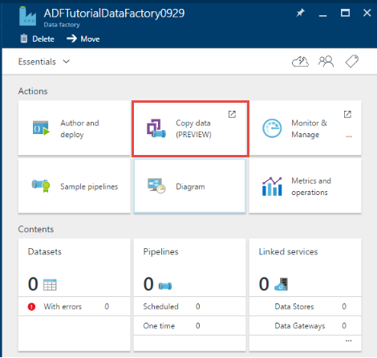

<properties
    pageTitle="資料工廠複製精靈 |Microsoft Azure"
    description="瞭解如何使用資料工廠複製精靈，將資料複製到接收支援的資料來源。"
    services="data-factory"
    documentationCenter=""
    authors="spelluru"
    manager="jhubbard"
    editor="monicar"/>

<tags
    ms.service="data-factory"
    ms.workload="data-services"
    ms.tgt_pltfrm="na"
    ms.devlang="na"
    ms.topic="article"
    ms.date="09/29/2016"
    ms.author="spelluru"/>

# 資料工廠複製精靈
Azure 資料工廠複製精靈，是為了 ingesting 資料，這通常是端對端資料整合案例的第一個步驟的程序。 透過 Azure 資料工廠複製精靈時，您不需要瞭解的連結的服務與資料集，管線任何 JSON 定義。 不過，完成精靈中的所有步驟之後，精靈會自動建立的管線，將資料複製到所選的目的地選取的資料來源。 此外，[複製] 精靈可協助您驗證的資料所 ingested 的撰寫，同時節省許多時間，尤其當您 ingesting 資料的第一次從資料來源。 若要開始複製精靈，請按一下您資料的工廠首頁上的 [**複製資料**] 方塊。

## 複製資料直覺式精靈
此精靈可讓您輕鬆地從各種不同的來源以分鐘為單位，將資料移往的目的地。 進行精靈之後, 複製活動的管線會自動為您建立以及相依資料工廠實體 （連結的服務與資料集）。 建立管線需要沒有額外的步驟。   

> [AZURE.NOTE] 如需建立範例管線複製的逐步指示，請參閱[複製精靈教學課程](data-factory-copy-data-wizard-tutorial.md)文章資料從 Azure blob Azure SQL 資料庫的資料表。 

精靈的設計記住開始顯示較大的資料。 很簡單且有效作者移動下的數百個資料夾、 檔案或使用 [複製資料精靈資料表的資料工廠管線。 精靈支援下列三個功能︰ 自動資料預覽、 結構描述擷取及對應及篩選資料。 

## 自動資料預覽 
複製精靈可讓您檢閱部分選取的資料來源，以驗證無論您是正確的資料，您想要複製的資料中的資料。 此外，如果來源資料是在文字檔案，複製精靈剖析文字檔案，以瞭解自動列與欄分隔符號和結構描述。 

## 結構描述擷取和對應 
輸入資料的結構描述可能不符合在某些情況下輸出資料的結構描述。 在此案例中，您需要從來源結構描述至目的結構描述中的資料行的資料行對應。 

複製精靈會自動將來源結構描述中的欄對應至目的結構描述中的資料行。 您可以使用下拉式清單，以覆寫對應 （或者） 指定是否需要複製資料時略過欄。   

## 篩選資料  
精靈可讓您篩選，選取所要複製到目的地/接收的資料存放區的資料來源資料。 篩選會減少大量的資料複製到接收資料存放區，並因此增強的 [複製] 作業。 會使用[資料工廠函數及變數](data-factory-functions-variables.md)Azure blob 資料夾中使用 SQL 查詢語言 （或） 檔案提供非常有彈性的方式，關聯式資料庫中篩選資料。   

### 篩選的資料庫中的資料  
在範例中，使用 SQL 查詢`Text.Format`函數和`WindowStart`變數。 

### Azure blob 資料夾中的資料的篩選
您可以使用中的資料夾路徑的變數，將資料複製在執行階段根據[系統變數](data-factory-functions-variables.md#data-factory-system-variables)決定的資料夾。 支援的變數是: **{年}**、 **{月}**、 {}、 **{小時}**、 **{分鐘}**，和**日** **{自訂}**。 範例︰ inputfolder / {年} / {月} {天} /。

假設您已輸入資料夾以下列格式︰

    2016/03/01/01
    2016/03/01/02
    2016/03/01/03
    ...

**檔案**或資料夾，按一下 [**瀏覽**] 按鈕，瀏覽至其中一個資料夾 (例如，2016年]-> [03]-> [01-> [02)，按一下 [**選擇**。 您應該會看到`2016/03/01/02`在文字方塊中。 現在，取代**2016年** **{年}**， **{月}**與**03** ，請使用**{天}**， **01**和**02** **{小時}**，並按下 Tab 鍵。 您應該會看到下拉式清單選取這些四個變數的格式︰

   

下圖所示，您也可以使用**自訂**的變數和任何[支援的格式字串](https://msdn.microsoft.com/library/8kb3ddd4.aspx)。 若要選取的結構的資料夾，請先使用 [**瀏覽**] 按鈕。 接著值取代**{自訂}**，然後按下 Tab，請參閱您可以在其中輸入格式字串的 [文字] 方塊。     

## 支援各種不同的資料和物件類型
藉由使用 [複製] 精靈，您可以有效率地移動下的數百個資料夾、 檔案或資料表。

## 排程選項
您可以執行複製作業的排程或一次 （每小時、 每日、 等等）。 這兩種選項可用於強大的連接線在內部部署與雲端，桌面的本機複本。

一次性複製一次可從來源的資料移動的目的地。 適用於任何大小和任何支援的格式的資料。 排程的複本可讓您複製並依指定的循環上的資料。 您可以使用豐富的設定 （例如重試、 逾時，以及提醒） 若要設定的排定的複本。

## 後續步驟
若要建立管線複製活動與使用資料工廠複製精靈快速地逐步解說，請參閱[教學課程︰ 建立使用 [複製] 精靈的管線](data-factory-copy-data-wizard-tutorial.md)。
