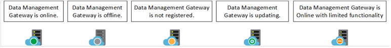
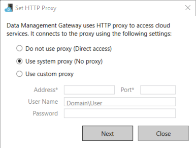
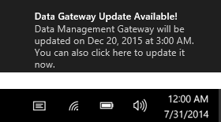
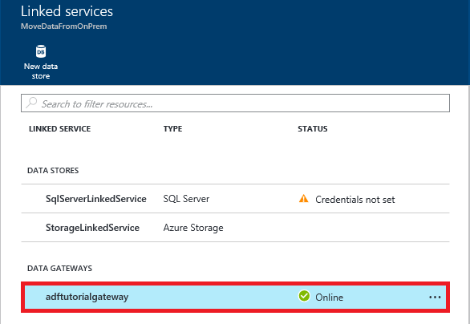

<properties 
    pageTitle="資料管理閘道器的資料工廠 |Microsoft Azure"
    description="將資料閘道器設定為內部部署與雲端之間移動資料。 Azure 資料工廠中使用資料管理閘道器移動資料。" 
    services="data-factory" 
    documentationCenter="" 
    authors="linda33wj" 
    manager="jhubbard" 
    editor="monicar"/>

<tags 
    ms.service="data-factory" 
    ms.workload="data-services" 
    ms.tgt_pltfrm="na" 
    ms.devlang="na" 
    ms.topic="article" 
    ms.date="10/11/2016" 
    ms.author="jingwang"/>

# 資料管理閘道器
資料管理閘道是您必須安裝在您要複製的內部部署環境中的用戶端代理程式雲端和內部部署資料儲存區之間的資料。 支援的資料工廠的內部部署資料儲存區會列出[支援資料來源](data-factory-data-movement-activities.md##supported-data-stores)區段內。 

> [AZURE.NOTE] 目前閘道器資料工廠支援只有複製活動和預存程序活動。 您不能使用的自訂活動的閘道器來存取內部部署資料來源。 

本文補充逐步解說[內部部署與雲端之間移動資料資料存放區](data-factory-move-data-between-onprem-and-cloud.md)文章。 在逐步解說，您可以建立使用閘道器，將資料從內部部署的 SQL Server 資料庫 Azure blob 的管線。 本文提供資料管理閘道器在您採取進階的詳細的資訊。   

## 概觀

### 資料管理閘道器的功能
資料管理閘道器會提供下列功能︰

- 模型內部部署資料來源與雲端資料來源中的相同資料工廠和移動資料。
- 有一個視窗的監控和管理閘道器狀態，從資料工廠刀完善的放大鏡。
- 安全地管理內部部署資料來源的存取權。
    - 所需公司防火牆不會變更。 閘道器只可開啟網際網路輸出 http 連線。
    - 加密認證為您的內部部署資料存放區與您的憑證。
- 有效率地移動資料 – 資料會傳送，同時間歇性網路問題，使用 [自動重試邏輯。

### Command 流程和資料流程
當您使用複製活動內部部署與雲端之間複製資料時，活動會使用閘道器從內部部署資料來源的資料傳輸至雲端，反之亦然。

此處的高層級資料的流量與摘要複製資料閘道器的步驟︰

1.  資料開發人員使用[Azure 入口網站](https://portal.azure.com)] 或 [ [PowerShell Cmdlet](https://msdn.microsoft.com/library/dn820234.aspx)Azure 資料工廠建立閘道器。 
2.  資料開發人員建立的內部部署資料存放區的連結的服務指定閘道器。 設定連結的服務，一部分資料開發人員會使用設定認證應用程式，以指定驗證類型與認證。  若要測試連線和儲存認證的閘道器的資料存放區與，通訊設定認證應用程式] 對話方塊。
3. 閘道器會加密認證 （提供資料開發人員），閘道器相關聯的憑證將認證儲存在雲端之前。
4. 資料工廠服務會與排程與管理工作，透過使用共用的 Azure 服務匯流排佇列中的控制項通道的閘道器通訊。 複製活動工作需要會開始，資料工廠佇列要求及認證資訊。 閘道器逐一之後輪詢佇列中的工作。
5.  閘道器會使用相同的憑證將認證解密並連線到內部部署資料存放區適當的驗證類型與認證。
6.  閘道器會將資料從內部部署儲存至雲端儲存空間或反向操作根據資料管道複製活動的設定方式而定。 此步驟中，直接與等 Azure Blob 儲存體的雲端儲存服務，透過安全 (HTTPS) 通道溝通 [閘道器。

### 使用 [閘道器的考量
- 資料管理閘道器的一個執行個體可以用於多個內部部署資料來源。 不過，**只有一個 Azure 資料工廠繫結單一閘道執行個體**，不能與其他資料工廠共用。
- 您可以有一部電腦上安裝**資料管理閘道器只有一個執行個體**。 假設您有兩個資料工廠需要存取內部部署資料來源時，必須先安裝兩個內部部署電腦上的閘道器。 閘道器換句話說，連結至特定資料工廠
- **閘道器不需要在同一部電腦，做為資料來源**。 然而，有往閘道器的資料來源減少閘道器至連線至資料來源的時間。 我們建議您在一個裝載內部部署資料來源的不同的電腦上安裝閘道器。 在不同的電腦上的閘道器與資料來源時，不會不會與資料來源的資源競爭閘道器。
- 您可以有**不同的電腦連線到相同的多個閘道內部部署資料來源**。 例如，您可能需要兩個閘道器提供兩個資料工廠，但這兩個資料工廠向註冊相同的內部部署資料來源。
- 如果您已經有提供**Power BI**案例您電腦上安裝的閘道器，請在另一部電腦上安裝**Azure 資料工廠的另一個閘道器**。
- 即使您使用**ExpressRoute**，則必須使用閘道器。
- 將您的資料來源為內部部署資料來源 （亦即在防火牆後） 即使當您使用**ExpressRoute**。 若要建立的服務與資料來源之間連線使用閘道器。
- 您必須**使用閘道**即使是**Azure IaaS VM**在雲端中的資料存放區。 

## 安裝

### 必要條件
- 支援的**作業系統**版本是 Windows 7、 Windows 8/8.1、 Windows 10、 Windows Server 2008 R2、 Windows Server 2012、 Windows Server 2012 R2。 目前不支援的資料管理閘道網域控制站的安裝。
- .NET framework 4.5.1 或以上必要。 如果您在 Windows 7 電腦上安裝閘道器，請安裝.NET Framework 4.5 或更新版本。 如需詳細資訊，請參閱[.NET Framework 系統需求](https://msdn.microsoft.com/library/8z6watww.aspx)。 
- 閘道器電腦的建議的**設定**是至少 2 GHz 與 4 的核心、 8 GB RAM 80 GB 的磁碟。
- 如果主機機器休眠，閘道器沒有回應的資料要求。 閘道器在安裝之前，因此，在電腦上設定適當的**電源計劃**。 如果電腦設定為休眠，閘道器安裝提示訊息。
- 您必須是在電腦上安裝和設定資料管理閘道成功的系統管理員。 您可以新增其他使用者到**資料管理閘道器使用者**本機 Windows 群組。 此群組的成員都能使用資料管理閘道器組態管理員工具來設定閘道器。 

複製活動執行當下上特定的頻率，資源使用狀況 （CPU、 記憶體） 在電腦上的也會依照相同的模式，最大使用量和空閒時間。 資源使用量也，取決於要移動的資料量。 進行中複製的多個工作時，您會看到向上最大使用量的時段的資源使用狀況。 

### 安裝選項
資料管理閘道器安裝下列方式︰ 

- 以下載 MSI 安裝程式套件從[Microsoft 下載中心](https://www.microsoft.com/download/details.aspx?id=39717)。  MSI 可以用於升級現有的資料管理閘道器至最新版本，以保留所有設定。
- 按一下 [手動設定或快速設定底下的 [**直接在這台電腦上安裝**的**下載並安裝資料閘道器**的連結。 請參閱[移動內部部署與雲端之間的資料](data-factory-move-data-between-onprem-and-cloud.md)文件的逐步指示使用快速安裝。 手動步驟會帶您到下載中心。  下載並安裝下載管理中心的閘道器的指示位於下一節。 

### 安裝的最佳作法︰
1.  設定閘道器主機上電源計劃，並不會休眠電腦。 如果主機機器休眠，閘道器沒有回應的資料要求。
2.  備份閘道器相關聯的憑證。

### 從下載中心安裝閘道器
1. 瀏覽至[Microsoft 資料管理閘道器的下載頁面](https://www.microsoft.com/download/details.aspx?id=39717)。 
2. 按一下 [**下載**]，選取適當的版本 （**32 位元**與**64 位元**）]，然後按一下 [**下一步**。 
3. 直接執行**MSI**或將它儲存到您的硬碟，並執行。
4. 在 [**歡迎**] 頁面上，選取一種**語言**按一下 [**下一步**。
5. **接受**授權合約，按一下 [**下一步**。 
6. 選取 [**資料夾**安裝閘道器，然後按一下 [**下一步**]。 
7. 在**準備好要安裝**頁面上，按一下 [**安裝**]。 
8. 按一下 [**完成**] 以完成安裝。
9. 從 Azure 入口網站取得索引鍵。 請參閱下一節的逐步指示。 
10. 在您的電腦上執行的**資料管理閘道器組態管理員**] 的 [**註冊閘道器**] 頁面中，執行下列步驟︰ 
    1. 貼上文字的索引鍵。
    2. 或者，按一下 [若要查看的重要文字的 [**顯示閘道器金鑰**。
    3. 按一下 [**註冊**]。 

### 註冊閘道器金鑰

#### 如果您還沒有建立邏輯的閘道器在入口網站
若要建立閘道器在入口網站，並從**設定**刀取得金鑰，請遵循逐步解說，[移動內部部署與雲端之間的資料，](data-factory-move-data-between-onprem-and-cloud.md)請參閱中的步驟。    

#### 如果您已經建立入口網站中的邏輯的閘道器
1. 在 Azure 入口網站中，瀏覽至**資料工廠**刀，然後按一下**連結的服務**] 方塊。

    
2. 在**連結的服務**刀中，選取您在入口網站中建立邏輯**閘道器**。 

      
2. 在**資料閘道**刀中，按一下 [**下載並安裝資料閘道器**。

       
3. 在 [**設定**刀中，按一下 [**重新建立索引鍵**]。 按一下 [是在警告訊息後請仔細閱讀。

    
4. 按一下 [複製] 按鈕旁的鍵。 索引鍵會複製到剪貼簿。
    
     

### 系統匣圖示 / 通知
下圖顯示一些您看到匣圖示。 

如果您將游標移系統匣圖示/通知訊息時，您會看到詳細的快顯視窗中的閘道器/更新作業的狀態。

### 連接埠和防火牆
有兩個必須考慮的防火牆︰**公司防火牆**路由器所執行的中央的組織和**Windows 防火牆**設定為精靈本機電腦上安裝的閘道器。  

在公司防火牆層級，您需要設定下列網域和輸出的連接埠︰

| 網域名稱 | 連接埠 | 描述 |
| ------ | --------- | ------------ |
| *。 servicebus.windows.net | 443、 80 | TCP （存取控制 token 取得的需要 443） 上的服務匯流排轉送上接聽 | 
| *。 servicebus.windows.net | 9350-9354 5671 | 透過 TCP 選擇性服務匯流排轉送 | 
| *。 core.windows.net | 443 | HTTPS | 
| *。 clouddatahub.net | 443 | HTTPS | 
| graph.windows.net | 443 | HTTPS |
| login.windows.net | 443 | HTTPS | 

在 windows 防火牆層級，通常會啟用下列輸出的連接埠。 如果不是，您可以設定的網域和連接埠會相應地閘道器電腦上。

#### 來源資料存放區將資料複製到接收資料存放區

確保正確的公司防火牆閘道器電腦上的 Windows 防火牆啟用防火牆規則和資料存放區本身。 啟用這些規則，可讓連接到兩個來源，並成功接收閘道器。 讓每個資料儲存區中，複製作業的規則。

例如，若要複製**的內部部署資料存放區 Azure SQL 資料庫接收或 Azure SQL Data Warehouse 接收**，執行下列步驟︰ 

- 在 Windows 防火牆] 及 [公司防火牆連接埠**1433年**允許輸出**TCP**通訊
- 設定將閘道器電腦的 IP 位址新增到允許的 IP 位址清單 Azure SQL server 的防火牆設定。 

### Proxy 伺服器考量
如果您的公司網路環境存取網際網路使用 proxy 伺服器，設定資料管理閘道器，使用適當的 proxy 設定。 您可以設定 proxy 註冊初始階段期間。 

閘道器會使用 proxy 伺服器連線至雲端服務。 初始設定過程中按一下 [**變更**連結]。 您會看到 [ **proxy 設定**] 對話方塊。

有三個設定選項︰ 

- **不使用 proxy**︰ 閘道不明確地使用任何 proxy 連線至雲端服務。
- **使用系統 proxy**︰ 閘道器會使用 diahost.exe.config 中設定 proxy 設定。  如果您沒有 proxy 設定中 diahost.exe.config，閘道器會連線到雲端服務直接不透過 proxy。
- **使用自訂的 proxy**︰ 設定 HTTP proxy] 設定為使用閘道器，而非使用中 diahost.exe.config 的設定。  位址和連接埠是必要。  使用者名稱和密碼是選擇性根據您的 proxy 驗證設定。  加密的閘道器的認證憑證和儲存在本機閘道器主機上所有設定。

資料管理閘道器主機服務會自動重新啟動後儲存更新的 proxy 設定。 

閘道器已經順利註冊，如果您想要檢視或更新的 proxy 設定之後，請使用 [資料管理閘道器組態管理員。 

1. 啟動資料管理閘道器組態管理員]。
2. 切換至 [**設定**] 索引標籤。
3. 按一下 [啟動**設定 HTTP Proxy** ] 對話方塊的 [ **HTTP Proxy** ] 區段中的 [**變更**] 連結。  
4. 按一下 [**下一步**] 按鈕後，您會看到您儲存 proxy 設定並重新啟動閘道主機服務的權限要求的警告對話方塊。

您可以檢視及更新 HTTP proxy]，使用組態管理員] 工具。 

> [AZURE.NOTE] 如果您設定 NTLM 驗證的 proxy 伺服器，閘道器主機服務會執行網域帳戶。 如果您變更日後的網域帳戶的密碼，請記得要更新的服務設定，也都會跟著重新啟動它。 這項需求，因為我們建議您用來存取時，不需要您經常更新密碼 proxy 伺服器的專用的網域帳戶。

### 在 [diahost.exe.config 設定 proxy 伺服器設定
如果您選取 [**使用系統 proxy**設定的 HTTP proxy]，閘道器會使用 proxy 設定 diahost.exe.config 中。  如果沒有 proxy diahost.exe.config 中指定，閘道器會連線到雲端服務直接不透過 proxy。 下列程序說明如何更新設定檔。 

1.  在檔案總管] 中，進行安全 C:\Program Files\Microsoft 資料管理 Gateway\2.0\Shared\diahost.exe.config 備份原始檔案的複本。
2.  啟動 Notepad.exe 執行身為管理員，並開啟文字檔 」 C:\Program Files\Microsoft 資料管理 Gateway\2.0\Shared\diahost.exe.config。 下列程式碼中所示，您可以找到的 system.net 的預設標籤︰

            <system.net>
                <defaultProxy useDefaultCredentials="true" />
            </system.net>   

    然後，如下列範例所示，您可以新增 proxy 伺服器的詳細資料︰

            <system.net>
                  <defaultProxy enabled="true">
                        <proxy bypassonlocal="true" proxyaddress="http://proxy.domain.org:8888/" />
                  </defaultProxy>
            </system.net>

    若要指定所需的設定，例如 scriptLocation proxy 標籤內允許其他屬性。 請參閱語法[proxy 項目 （網路設定）](https://msdn.microsoft.com/library/sa91de1e.aspx) 。

            <proxy autoDetect="true|false|unspecified" bypassonlocal="true|false|unspecified" proxyaddress="uriString" scriptLocation="uriString" usesystemdefault="true|false|unspecified "/>

3. 設定檔案儲存到原始位置，然後重新啟動資料管理閘道器主機服務中，挑選所做的變更。 若要重新啟動服務︰ 使用 [服務] 小程式從控制台] 或**資料管理閘道器組態管理員**> 按一下 [**停止服務**] 按鈕，然後按一下 [**啟動的服務**。 如果服務無法啟動，則可能不正確的 XML 標記語法，已新增到應用程式設定檔的編輯。     

除了這些點，您也需要確定 Microsoft Azure 位於貴公司的 whitelist。 有效的 Microsoft Azure IP 位址清單可以從[Microsoft 下載中心](https://www.microsoft.com/download/details.aspx?id=41653)下載。

#### 可能的徵兆的防火牆和 proxy 伺服器的相關問題
如果您遇到下列項目類似的錯誤，則可能是由於防火牆或 proxy 伺服器，會封鎖連線到資料工廠的閘道器進行自我驗證設定。 請參閱前一節，以確保您的防火牆和 proxy 伺服器設定正確。

1.  當您嘗試登錄閘道時，您會收到下列錯誤: 「 無法註冊閘道器金鑰。 嘗試再次註冊閘道器金鑰，請確認之前資料管理閘道器連線的狀態，資料管理閘道器主機服務會啟動。 」
2.  當您開啟組態管理員時，您會看到狀態為 「 已中斷連線 」 或 「 連線]。 當檢視 Windows 事件記錄]，在 [事件檢視器] 下 > 」 應用程式及服務記錄檔] > 「 資料管理閘道 」，您會看到錯誤訊息，例如下列錯誤︰`Unable to connect to the remote server` 
    `A component of Data Management Gateway has become unresponsive and restarts automatically. Component name: Gateway.`

### 開啟連接埠 8050 來加密認證 
當您將內部部署設定轉送輸入連接埠**8050**認證的閘道**設定認證**應用程式使用連結 Azure 入口網站中的服務。 閘道器在安裝期間，根據預設，資料管理閘道器安裝開啟閘道器電腦上。
 
如果您使用協力廠商的防火牆，您可以手動開啟 8050 的連接埠。 如果您在閘道器安裝期間執行防火牆問題，可嘗試使用下列命令，而不設定防火牆安裝閘道器。

    msiexec /q /i DataManagementGateway.msi NOFIREWALL=1

如果您選擇不開啟連接埠 8050 閘道器電腦上的，使用不是使用**設定認證**應用程式設定資料儲存認證機制。 例如，您可以使用 [[新增 AzureRmDataFactoryEncryptValue](https://msdn.microsoft.com/library/mt603802.aspx) PowerShell 指令程式。 請參閱[設定認證與安全性](#set-credentials-and-securityy)] 區段中的資料如何儲存的認證設定。

## 更新 
根據預設，資料管理閘道器會自動更新較新版的閘道器時可使用。 直到完成所有排程的任務，不會更新閘道器。 沒有進一步的工作會處理的閘道器，直到完成更新作業。 如果更新失敗，閘道器已復原的舊版本。 

您可以看到排程的更新時間在下列位置︰

- Azure 入口網站中閘道器屬性刀。
- 首頁上的 [資料管理閘道器組態管理員
- 系統匣通知訊息。 

[常用] 索引標籤的 [資料管理閘道器組態管理員會顯示更新排程，最後一次閘道器安裝/更新。 

您可以立即安裝更新，或在排程時自動更新閘道器等。 例如下, 圖顯示您通知訊息顯示在閘道器組態管理員以及您可以按一下 [立即安裝更新] 按鈕。 

在系統匣通知訊息如下圖所示︰ 

您會看到更新作業 （手動或自動） 系統匣中的狀態。 當您下次啟動閘道器組態管理員時，您會看到的訊息，以及連結至[新的主題](data-factory-gateway-release-notes.md)，已更新閘道器的 [通知] 列上。

### 若要停用啟用自動更新功能
您可以停用/啟用自動更新功能，請執行下列步驟︰ 

1. 啟動 Windows PowerShell 的閘道器電腦上。 
2. 切換至 C:\Program Files\Microsoft 資料管理 Gateway\2.0\PowerShellScript 資料夾。
3. 執行下列命令以開啟自動更新功能關閉 （停用）。   

        .\GatewayAutoUpdateToggle.ps1  -off

4. 若要再次開啟︰ 
    
        .\GatewayAutoUpdateToggle.ps1  -on  

## 設定管理員 
當您安裝的閘道器時，您可以在下列方法之一啟動資料管理閘道器組態管理員︰ 

- 在 [**搜尋**] 視窗中，輸入**資料管理閘道器**存取此公用程式。 
- 執行資料夾中的可執行**ConfigManager.exe** : **C:\Program Files\Microsoft 資料管理 Gateway\2.0\Shared** 
 
### 首頁
[首頁] 頁面可讓您執行下列動作︰ 

- 檢視 （連線至雲端服務等等。） 的閘道器狀態。 
- **註冊**使用從入口網站的金鑰。
- **停止**，且在閘道器電腦上的開始**資料管理閘道器主機服務**。
- 在特定時間的天數**排程更新**。
- 檢視閘道器已**上次更新**日期。 

### 設定] 頁面
[設定] 頁面可讓您執行下列動作︰

- 檢視、 變更及匯出閘道器所使用的**憑證**。 這個憑證用來加密資料來源的認證。
- 變更端點**HTTPS 的連接埠**。 閘道器隨即會開啟連接埠設定資料來源的認證。 
- 端點的**狀態**
- 檢視**SSL 憑證**入口網站和閘道器 SSL 通訊的用於設定資料來源的認證。  

### 診斷頁面
[診斷] 頁面可讓您執行下列動作︰

- 啟用**記錄功能**的詳細資訊與事件檢視器] 中檢視記錄檔，如果發生失敗，將記錄傳送給 Microsoft。
- **測試連線**至資料來源。  

### [說明] 頁面
[說明] 頁面會顯示下列資訊︰  

- 閘道器的簡短描述
- 版本號碼
- 線上說明、 隱私權聲明，並授權合約的連結。  

## 疑難排解

- 您可以找到中閘道器的詳細的資訊記錄儲存在 Windows 事件記錄檔。 您可以使用**應用程式與服務記錄檔**] 下的 Windows**事件檢視器**中找到這些 > **資料管理閘道器**。 閘道器相關問題的疑難排解，尋找錯誤層級事件在事件檢視器。
- 如果閘道器會停止運作您**變更的憑證**之後，重新啟動使用 Microsoft 資料管理閘道器組態管理員] 工具或服務控制台的**資料管理閘道服務**。 如果您仍然會看到錯誤，您可能必須授與明確的使用者權限資料管理閘道服務存取憑證管理員 (certmgr.msc) 中的憑證。  服務的預設的使用者帳戶是︰ **NT Service\DIAHostService**。 
- 如果**認證管理員**應用程式無法**加密**認證，當您按一下 [加密] 按鈕在 [資料工廠編輯器] 中，確認**閘道器電腦**上執行這個應用程式。 如果不是，在閘道器電腦上執行應用程式，並嘗試加密認證。  
- 如果您看到儲存連線或驅動程式相關的錯誤的資料，請執行下列步驟︰ 
    - 啟動 [閘道器電腦上的 [**資料管理閘道器組態管理員**]。
    - 切換至 [**診斷**] 索引標籤
    - 輸入適當的值的 [**使用此閘道器的內部部署資料來源的測試連線**] 群組中的欄位
    - 按一下 [**測試連接]，**請參閱如果您可以使用 [連線資訊] 與 [認證的閘道器電腦連線至內部部署資料來源]。 如果您安裝驅動程式之後，仍然無法的測試連線，重新啟動閘道器，選擇 [最新變更。  

    

### 將閘道器記錄傳送給 Microsoft
您連絡 Microsoft 支援，以取得協助閘道的問題進行疑難排解，您可能會要求您要共用您的閘道器記錄。 閘道器的版本可讓您輕鬆地共用透過按一下兩個按鈕閘道器組態管理員中的必要的閘道器記錄。   

1. 切換至 [閘道器組態管理員的**診斷**] 索引標籤。
 
    ![資料管理閘道診斷] 索引標籤](media/data-factory-data-management-gateway/data-management-gateway-diagnostics-tab.png)
2. 按一下 [**傳送記錄檔**的連結，以查看 [動作] 對話方塊︰ 

    
3. （選用）按一下 [**檢視記錄**檢閱事件檢視器中的記錄檔]。
4. （選用）按一下 [檢閱 Microsoft 線上服務隱私權聲明**隱私權**]。 
3. 一旦您滿意您想要上傳、 按一下 [**傳送記錄檔**實際從過去七天進行疑難排解，將記錄傳送給 Microsoft。 您應該會看到如下圖所示傳送記錄檔作業的狀態︰

    
4. 作業完成後，您看到對話方塊中，如下圖所示︰
    
    
5. 記下**報表識別碼**和 Microsoft 支援服務與共用活頁簿。 報表 ID 用來找出您上傳的疑難排解您閘道器記錄。  報表識別碼也會儲存於 [事件檢視器，供您參考。  您可以找到查看事件識別碼 」 25 」，並核取 [日期及時間。
    
        

### 封存閘道器登入閘道器主機機器
有一些情況發生閘道的問題及您無法直接共用閘道器記錄檔位置︰ 

- 手動安裝閘道器，並登錄閘道器。
- 您嘗試登錄閘道器組態管理員; 上以重新產生金鑰 
- 您嘗試傳送記錄，無法連線閘道器主機服務;

在這種情況下，您可以儲存為 zip 檔案的閘道器的記錄，並共用時稍後連絡 Microsoft 支援服務。 例如，如果您收到錯誤登錄閘道時顯示下列圖像︰   

按一下 [**封存閘道器**記錄連結到封存和儲存記錄檔，然後共用 zip 檔案與 Microsoft 支援服務。 

### 閘道器在線上與有限的功能 
您看到的閘道器狀態為**線上有限的功能與**其中一個原因如下。

- 閘道無法連線至雲端服務，透過服務匯流排。
- 雲端服務無法連線至服務匯流排透過閘道器。

當閘道器在線上與有限的功能時，您可能無法使用資料工廠複製精靈建立資料管線複製資料從內部部署資料存放區。

解決/因應措施此問題的 （有限的功能與線上） 根據是否閘道無法連線至雲端服務或另一個方式。 下列各節提供這些因應措施。 

#### 閘道無法連線至雲端服務，透過服務匯流排
請遵循下列步驟將閘道器上線︰ 

1. 啟用輸出的連接埠 9350 9354 閘道器電腦上的兩個 Windows 防火牆和公司防火牆。 [請參閱連接埠與防火牆](#ports-and-firewall)] 區段的詳細資料。
2. 在 [閘道器設定 proxy 設定。 請參閱[Proxy 伺服器考量](#proxy-server-considerations)區段的詳細資料。 

解決方法使用資料工廠編輯器中 Azure 入口網站 （或） Visual Studio （或） PowerShell 的 Azure。

#### 錯誤︰ 雲端服務，無法連線至服務匯流排透過閘道器。
請遵循下列步驟將閘道器上線︰
 
1. 啟用 5671 和 9350-9354 閘道器電腦上的兩個 Windows 防火牆和公司防火牆輸出的連接埠。 [請參閱連接埠與防火牆](#ports-and-firewall)] 區段的詳細資料。
2. 在 [閘道器設定 proxy 設定。 請參閱[Proxy 伺服器考量](#proxy-server-considerations)區段的詳細資料。
3. 移除 proxy 伺服器上的靜態 IP 限制。 

解決方法您可以使用資料工廠編輯器中 Azure 入口網站 （或） Visual Studio （或） PowerShell 的 Azure。
 
## 將閘道器移到另一台電腦
本節提供步驟移動的閘道器用戶端從一部電腦另一部電腦。 

2. 在入口網站中，瀏覽至**資料工廠首頁] 頁面**上，然後按一下 [**連結的服務**] 方塊。 

     
3. 您的閘道器的區段中選取**資料閘道器**的**連結服務**刀。
    
    
4. 在**資料閘道**刀中，按一下 [**下載並安裝資料閘道器**。
    
     
5. 在**設定**刀中，按一下 [**下載並安裝資料閘道器**] 並依指示進行安裝在電腦上的資料閘道器。 

    
6. 請在**Microsoft 資料管理閘道器組態管理員**保持開啟。 
 
     
7. 在**設定**防禦入口網站中，以在命令列中，按一下 [**重新建立索引鍵**，然後的警告訊息，請按一下**[是]** 。 按一下 [複製到剪貼簿的按鍵的按鍵文字旁的 [**複製] 按鈕**。 在舊的電腦上的閘道器會停止運作時立即重新建立索引鍵。  
    
    
     
8. **機碼**貼到 [**註冊閘道**] 頁面中的文字方塊中，在您的電腦上的**資料管理閘道器組態管理員**。 （選用）按一下 [**顯示閘道器金鑰**若要查看的重要的文字] 核取方塊。 
 
    
9. 按一下 [**註冊**閘道登錄雲端服務。
10. 在 [**設定**] 索引標籤上按一下 [**變更**選取舊的閘道器已使用相同憑證，請輸入**密碼**，然後按一下**完成**。 
 
    

    您可以從舊的閘道器匯出憑證，請執行下列步驟︰ 舊的電腦上啟動資料管理閘道器組態管理員，切換至 [**憑證**] 索引標籤、 按一下 [**匯出**] 按鈕和依照指示操作。 
10. 成功註冊後的閘道器，您應該會看到**登錄**設定為 [**已註冊**，並在首頁上的閘道器組態管理員**狀態**] 設定為 [**已啟動**。 

## 加密認證 
若要加密資料工廠編輯器中的認證，請執行下列步驟︰

1. 啟動**閘道器電腦**上的網頁瀏覽器，瀏覽至[Azure 入口網站](http://portal.azure.com)。 搜尋您的資料工廠如有需要在**資料工廠**刀開啟資料工廠，，然後按一下 [**撰寫及部署**啟動資料工廠編輯器。   
1. 按一下 [若要查看其 JSON 定義或建立連結的服務需要資料管理閘道器的樹狀檢視中現有**連結的服務**(例如︰ SQL Server 或 Oracle)。 
2. 在 [JSON 編輯器] 中的 [ **gatewayName** ] 屬性中，輸入閘道器的名稱。 
3. 輸入**連接字串**中的 [**資料來源**] 屬性的伺服器名稱。
4. 資料庫中輸入名稱的**初始目錄**屬性**連接字串**。    
5. 按一下 [啟動按一下命令列上的 [**加密**] 按鈕-一次**認證管理員**應用程式。 您應該會看到 [**設定認證**] 對話方塊。 
    ![設定認證] 對話方塊](./media/data-factory-data-management-gateway/setting-credentials-dialog.png)
6. 在 [**設定認證**] 對話方塊中，執行下列步驟︰  
    1.  選取您想要使用連線至資料庫的資料工廠服務**驗證**]。 
    2.  輸入資料庫的存取權的**使用者名稱**設定的使用者名稱。 
    3.  輸入**密碼**設定使用者的密碼。  
    4.  按一下**[確定]**若要加密認證，並關閉對話方塊。 
5.  您現在應該會看到**連接字串**的**encryptedCredential**屬性。      
        
            {
                "name": "SqlServerLinkedService",
                "properties": {
                    "type": "OnPremisesSqlServer",
                    "description": "",
                    "typeProperties": {
                        "connectionString": "data source=myserver;initial catalog=mydatabase;Integrated Security=False;EncryptedCredential=eyJDb25uZWN0aW9uU3R",
                        "gatewayName": "adftutorialgateway"
                    }
                }
            }

如果您是從閘道器電腦從不同的電腦存取入口網站，您必須確定認證管理員] 應用程式可以連接至閘道器電腦。 如果應用程式無法達到閘道器電腦，它不允許您設定的資料來源的認證，並測試資料來源的連線。  

當您使用的**設定認證**應用程式時，入口網站，加密認證的閘道器電腦上的**閘道器組態管理員**中的 [**憑證**] 索引標籤中指定的憑證。 

如果您要尋找的 API 為基礎的方式，來加密認證，您可以使用 [[新增 AzureRmDataFactoryEncryptValue](https://msdn.microsoft.com/library/mt603802.aspx) PowerShell cmdlet 來加密認證。 指令程式會使用憑證的閘道設定為使用加密認證。 您可以新增加密的憑證至**連接字串**中 JSON 的**EncryptedCredential**項目。 您可以使用 JSON 或在 [資料工廠編輯器] 中[新增 AzureRmDataFactoryLinkedService](https://msdn.microsoft.com/library/mt603647.aspx)指令程式。 

    "connectionString": "Data Source=<servername>;Initial Catalog=<databasename>;Integrated Security=True;EncryptedCredential=<encrypted credential>",

有一個更多的方法，如需使用資料工廠編輯器的認證。 如果您使用編輯器] 中建立連結的 SQL Server 服務，您以純文字輸入認證，是會使用資料工廠服務擁有的憑證來加密認證。 不使用憑證的閘道器設定為使用。 雖然這種方式可能稍有更快速地在某些情況下，但卻較不安全。 因此，建議您追蹤僅適用於開發/測試之用這種方法。 

## PowerShell cmdlet 
本節說明如何建立和註冊使用 PowerShell 的 Azure cmdlet 閘道器。 

1. 在 [系統管理員模式中啟動**PowerShell 的 Azure** 。 
2. 執行下列命令，然後輸入您的 Azure 認證登入您的 Azure 帳戶。 

    登入 AzureRmAccount
2. 您可以使用 [**新增 AzureRmDataFactoryGateway** cmdlet 來建立邏輯閘道器，如下所示︰

        $MyDMG = New-AzureRmDataFactoryGateway -Name <gatewayName> -DataFactoryName <dataFactoryName> -ResourceGroupName ADF –Description <desc>

    **範例命令和輸出**︰

        PS C:\> $MyDMG = New-AzureRmDataFactoryGateway -Name MyGateway -DataFactoryName $df -ResourceGroupName ADF –Description “gateway for walkthrough”

        Name              : MyGateway
        Description       : gateway for walkthrough
        Version           :
        Status            : NeedRegistration
        VersionStatus     : None
        CreateTime        : 9/28/2014 10:58:22
        RegisterTime      :
        LastConnectTime   :
        ExpiryTime        :
        ProvisioningState : Succeeded
        Key               : ADF#00000000-0000-4fb8-a867-947877aef6cb@fda06d87-f446-43b1-9485-78af26b8bab0@4707262b-dc25-4fe5-881c-c8a7c3c569fe@wu#nfU4aBlq/heRyYFZ2Xt/CD+7i73PEO521Sj2AFOCmiI

    
4. 在 PowerShell 的 Azure，切換至資料夾︰ * *C:\Program Files\Microsoft 資料管理 Gateway\2.0\PowerShellScript\**。執行* *RegisterGateway.ps1* *相關聯的區域變數* *$Key** 下列命令中所示。 這個指令碼註冊邏輯您先前建立的閘道器電腦上安裝的用戶端代理程式。

        PS C:\> .\RegisterGateway.ps1 $MyDMG.Key
        
        Agent registration is successful!

    您可以使用 IsRegisterOnRemoteMachine 參數註冊遠端電腦上的閘道器。 範例︰
        
        .\RegisterGateway.ps1 $MyDMG.Key -IsRegisterOnRemoteMachine true

5. 若要在您的資料工廠取得的閘道清單，您可以使用**取得 AzureRmDataFactoryGateway**指令程式。 當**狀態**] 顯示**線上**時，就表示您的閘道器已可供使用。

        Get-AzureRmDataFactoryGateway -DataFactoryName <dataFactoryName> -ResourceGroupName ADF

您可以移除使用**移除 AzureRmDataFactoryGateway**指令程式的閘道器，及更新閘道器使用**設定 AzureRmDataFactoryGateway** cmdlet 的描述。 語法和其他瞭解這些 cmdlet 的詳細資料，請參閱資料工廠 Cmdlet 參考。  

### 使用 PowerShell 清單閘道器

    Get-AzureRmDataFactoryGateway -DataFactoryName jasoncopyusingstoredprocedure -ResourceGroupName ADF_ResourceGroup

### 移除閘道使用 PowerShell
    
    Remove-AzureRmDataFactoryGateway -Name JasonHDMG_byPSRemote -ResourceGroupName ADF_ResourceGroup -DataFactoryName jasoncopyusingstoredprocedure -Force 

## 後續步驟
- 請參閱[內部部署與雲端之間移動資料資料存放區](data-factory-move-data-between-onprem-and-cloud.md)文章。 在逐步解說，您可以建立使用閘道器，將資料從內部部署的 SQL Server 資料庫 Azure blob 的管線。  
