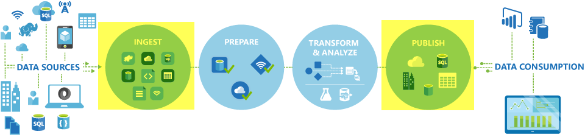

<properties
    pageTitle="使用複製活動移動資料 |Microsoft Azure"
    description="深入了解資料移動資料工廠管線︰ 資料移轉之間雲端儲存區，以及在內部部署市集和雲端儲存區。 使用複製活動。"
    keywords="複製資料、 移動資料、 資料移轉，將資料轉移"
    services="data-factory"
    documentationCenter=""
    authors="linda33wj"
    manager="jhubbard"
    editor="monicar"/>

<tags
    ms.service="data-factory"
    ms.workload="data-services"
    ms.tgt_pltfrm="na"
    ms.devlang="na"
    ms.topic="article"
    ms.date="09/22/2016"
    ms.author="jingwang"/>

# 使用複製活動移動資料

## 概觀
Azure 資料工廠，您可以使用 [複製活動來複製資料的不同圖案來自各種內部部署與雲端資料來源，以 Azure。 複製資料後，將它進一步轉換並分析。 您也可以使用 [複製活動發佈轉換及商務智慧 (BI) 和應用程式耗用的分析結果。

複製活動會由安全可靠、 可縮放和[全域可用的服務](#global)。 本文提供資料移動資料工廠和複製活動詳細資料。

首先，讓我們來看看如何資料移轉發生之間兩個雲端的資料存放區，以及在內部部署資料存放區 」 和 「 雲端的資料存放區。

> [AZURE.NOTE] 一般瞭解活動，請參閱[瞭解管線與活動](data-factory-create-pipelines.md)。

### 兩個雲端資料儲存區之間移動資料
當來源和接收資料儲存在雲端，複製活動會透過下列階段，將資料複製到接收的來源。 服務的力量複製活動︰

1. 讀取資料來源的資料存放區。
2. 執行序列化/還原序列化、 壓縮/解壓縮的資料行對應，然後輸入轉換。 它會根據輸入資料集、 輸出資料集，以及複製活動的設定這些作業。
3.  將資料至目的地資料存放區。

服務會自動選擇要執行的資料移動的最佳的區域。 此區域通常是一個最接近接收資料存放區。

### 內部部署資料存放區與雲端資料儲存區之間移動資料
安全地在雲端的資料存放區的內部部署資料存放區之間移動資料，請在您的內部部署電腦上安裝資料管理閘道器。 資料管理閘道是有代理程式可讓您混合式資料移動及處理。 您可以將其安裝在同一部電腦上的資料存放區，或在不同的電腦上有存取權的資料存放區。

在此案例中，資料管理閘道器會執行序列化/還原序列化壓縮/解壓縮、 資料行對應]，然後輸入轉換。 資料不會透過 Azure 資料工廠服務流動。 不過，資料管理閘道器直接會將資料至目的存放區。

請參閱[內部部署與雲端之間移動資料資料存放區](data-factory-move-data-between-onprem-and-cloud.md)的簡介，以及逐步解說。 此代理程式的詳細資訊，請參閱[資料管理閘道器](data-factory-data-management-gateway.md)。

您也可以移動 Azure IaaS 虛擬機器 (Vm) 裝載使用資料管理閘道器的資料的支援資料存放區。 在此情況下，您可以在同一個 VM 上安裝資料管理閘道器資料存放區，或在個別的 VM 有存取權的資料存放區。

## 支援的資料儲存區及格式
[AZURE.INCLUDE [data-factory-supported-data-stores](../../includes/data-factory-supported-data-stores.md)]

如果您要移動的資料的資料存放區複製活動不支援，使用**自訂活動**資料工廠您自己的邏輯複製/移動資料。 建立及使用自訂活動的詳細資訊，請參閱[使用自訂活動 Azure 資料工廠管道](data-factory-use-custom-activities.md)。

### 支援的檔案格式
您可以使用 [複製活動來複製檔案另存為-介於兩個檔案為基礎的資料存放區，例如 Azure Blob、 檔案系統和 HDFS。 若要這麼做，您可以略過[格式] 區段](data-factory-create-datasets.md)中的輸入與輸出資料集定義。 沒有任何序列化/還原序列化有效率地複製資料。

複製的活動也會從讀取和寫入檔案中指定的格式︰ 文字、 Avro、 ORC、 Parquet 和 JSON。 您可以執行下列複製活動，例如︰

-   將資料從 Azure Blob 複製文字 (CSV) 格式和寫入到 Azure SQL 資料庫。
-   將檔案從檔案系統內部複製文字 (CSV) 格式和寫入權 Azure Blob Avro 格式。
-   Azure SQL 資料庫中複製資料和寫入 HDFS 內部部署 ORC 格式。

## 移動全域可用的資料
Azure 資料工廠位於只能在 [美國西、 東亞美國及北美歐洲地區。 不過，力量複製活動的服務，可以全面在下列區域和地區。 全域可用拓撲可確保有效資料的動作，通常可避免跨地區躍點。 有可用的資料工廠和移動區域中的資料，請參閱[依地區的服務](https://azure.microsoft.com/regions/#services)。

### 雲端資料存放區之間移動資料
當來源和接收資料儲存在雲端，資料工廠會使用服務部署中，在相同的地理位置來移動資料中的接收最接近的區域。 請參閱下表中的對應︰

目的地資料存放區的區域 | 移動資料的區域
:----------------------------------- | :----------------------------
設定適用於美國 | 設定適用於美國
設定適用於美國 2 | 設定適用於美國 2
西美制]。 | 西美制]。
西美國 2 | 西美制]。
美國中部 | 美國中部
西部美國中部 | 美國中部
北美美國中部 | 北美美國中部
美國中部南美洲 | 美國中部南美洲
北美歐洲 | 北美歐洲
西歐 | 西歐
東南亞 | 東南亞
中式地址 | 東南亞
日本東亞 | 日本東亞
日本西部 | 日本東亞
巴西南部 | 巴西南部
澳大利亞東亞 | 澳大利亞東亞
澳大利亞 Southeast | 澳大利亞 Southeast
中央印度 | 中央印度
南美洲印度 | 中央印度
西印度 | 中央印度

> [AZURE.NOTE] 如果目的地資料存放區的地區不前面清單中，複製活動失敗，而不是透過替代的區域。

### 內部部署資料存放區與雲端資料儲存區之間移動資料
當內部部署 （或 Azure 虛擬機器/IaaS） 之間複製資料和雲端儲存區，[資料管理閘道器](data-factory-data-management-gateway.md)在內部部署電腦或虛擬機器上執行資料移動。 資料不會流動透過在雲端，服務，除非您使用的[分段複製](data-factory-copy-activity-performance.md#staged-copy)的功能。 在此情況下，資料經由暫存的 Azure Blob 儲存體寫入到接收資料儲存區之前。

## 建立管線與複製活動
您可以建立管線與複製活動，有幾種方法︰

### 使用 [複製] 精靈
資料工廠複製精靈可協助您建立的管線與複製活動。 此管線可讓您將支援的來源資料複製到目的地*而不需要撰寫 JSON*用於連結的服務與資料集，管線定義。 精靈的詳細資料，請參閱[資料工廠複製精靈](data-factory-copy-wizard.md)。  

### 使用 JSON 指令碼
您可以使用 Azure 入口網站、 Visual Studio 中或 PowerShell 的 Azure 中的資料工廠編輯器建立 （藉由使用複製活動） 的管線 JSON 定義。 然後，您可以將其部署建立管線資料工廠。 請參閱[教學課程︰ 使用 Azure 資料工廠管道的複製活動](data-factory-copy-data-from-azure-blob-storage-to-sql-database.md)的逐步教學課程。    

JSON 屬性 （例如名稱、 描述、 輸入與輸出資料表和原則），可針對所有類型的活動。 所提供的屬性`typeProperties`的活動] 區段會隨著每個活動類型。

複製活動`typeProperties`而有所不同的來源類型及接收] 區段。 按一下 [來源/中接收[支援來源和接收](#supported-data-stores)] 區段，若要深入瞭解複製活動支援的資料存放區的類型屬性]。   

以下是範例 JSON 定義︰

    {
      "name": "ADFTutorialPipeline",
      "properties": {
        "description": "Copy data from Azure blob to Azure SQL table",
        "activities": [
          {
            "name": "CopyFromBlobToSQL",
            "type": "Copy",
            "inputs": [
              {
                "name": "InputBlobTable"
              }
            ],
            "outputs": [
              {
                "name": "OutputSQLTable"
              }
            ],
            "typeProperties": {
              "source": {
                "type": "BlobSource"
              },
              "sink": {
                "type": "SqlSink",
                "writeBatchSize": 10000,
                "writeBatchTimeout": "60:00:00"
              }
            },
            "Policy": {
              "concurrency": 1,
              "executionPriorityOrder": "NewestFirst",
              "retry": 0,
              "timeout": "01:00:00"
            }
          }
        ],
        "start": "2016-07-12T00:00:00Z",
        "end": "2016-07-13T00:00:00Z"
      }
    }

定義輸出資料集內的排程會決定活動執行時 (例如︰**每日**，**一天**]，與頻率間隔為**1**)。 活動會將資料從輸入資料集 （**來源**） 輸出資料集 （**接收**）。

您可以指定一個以上的輸入資料集複製活動。 他們會用來執行的活動之前，請確認相依性。 不過，從第一個資料集的資料複製到目的地資料集。 如需詳細資訊，請參閱[排程和執行](data-factory-scheduling-and-execution.md)。  

## 效能及調整
請參閱[複製活動效能與調整輔助線](data-factory-copy-activity-performance.md)，說明主要因素的影響 Azure 資料工廠資料移動 （複製活動） 的效能。 也會列出內部測試期間觀察的效能，並討論最佳化效能的複製活動的各種方法。

## 排程與循序進行複製
排程與執行資料工廠運作方式的詳細資訊，請參閱[排程和執行](data-factory-scheduling-and-execution.md)。 一個接一個連續/排列方式執行多個複本作業可能是。 請參閱[排序複本](data-factory-scheduling-and-execution.md#ordered-copy)。

## 類型轉換
不同的資料儲存區有不同的原生類型系統。 複製活動執行自動輸入轉換，從來源類型接收類型與下列兩種方法︰

1. 原生來源類型轉換的.NET 類型。
2. .NET 類型轉換的原生接收類型。

原生類型系統對應到資料存放區的.NET 類型是個別的資料存放區文件中。 （按一下特定的連結，[支援的資料存放區](#supported-data-stores)資料表中）。 您可以使用這些對應時建立表格，判斷適當的類型，以便複製活動執行正確轉換。

## 後續步驟
- 若要深入瞭解複製活動，請參閱[複製資料到 Azure SQL 資料庫的 Azure Blob 儲存體](data-factory-copy-data-from-azure-blob-storage-to-sql-database.md)。
- 若要瞭解如何將資料從內部部署資料儲存到雲端的資料存放區，請參閱[移動資料從內部部署至雲端的資料會儲存](data-factory-move-data-between-onprem-and-cloud.md)。
