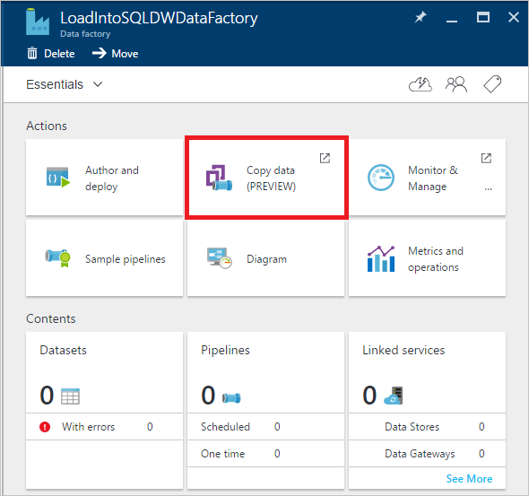
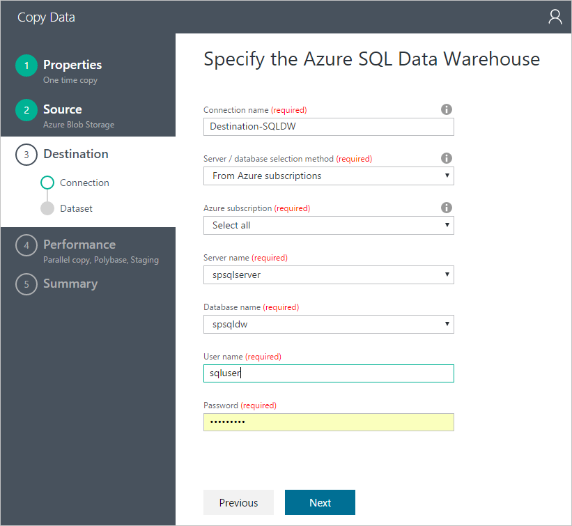
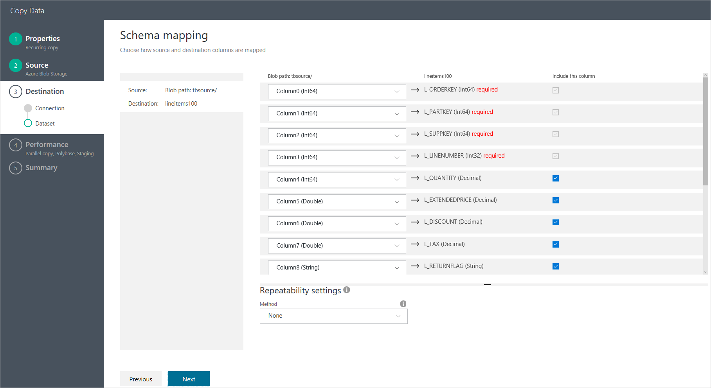
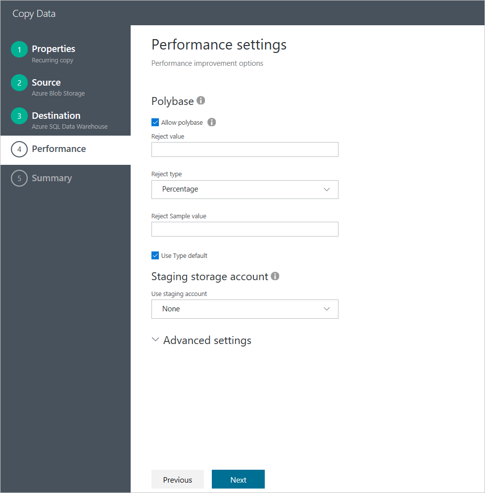

<properties 
    pageTitle="Tb 資料載入 SQL Data Warehouse |Microsoft Azure" 
    description="示範如何 1 TB 的資料可載入 Azure SQL Data Warehouse 與 Azure 資料廠下 15 分鐘" 
    services="data-factory" 
    documentationCenter="" 
    authors="linda33wj" 
    manager="jhubbard" 
    editor="monicar"/>

<tags 
    ms.service="data-factory" 
    ms.workload="data-services" 
    ms.tgt_pltfrm="na" 
    ms.devlang="na" 
    ms.topic="article" 
    ms.date="10/28/2016" 
    ms.author="jingwang"/>

# 載入 1 TB Azure SQL Data Warehouse 底下 15 分鐘與 Azure 資料工廠 [複製精靈]
[Azure SQL Data Warehouse](../sql-data-warehouse/sql-data-warehouse-overview-what-is.md)是雲端、 擴充能夠處理龐大的大量資料內容，關聯式及非關聯式資料庫。  內建在人連線平行處理 (MPP) 架構，SQL Data Warehouse 最適合企業資料倉庫工作量。  使用不按比例縮放儲存空間，並且計算獨立的彈性提供雲端 elasticity。

快速入門 Azure SQL Data Warehouse 現在也能使用**Azure 資料工廠**容易得多。  Azure 資料工廠為完全受管理的雲端基礎資料整合服務，可以用來填入 SQL Data Warehouse 您現有的系統之後，將寶貴的時間，同時評估 SQL Data Warehouse 和建置您分析解決方案的上方，儲存您的資料。  以下是使用 Azure 資料工廠 Azure SQL Data Warehouse 將資料載入的主要優點︰

- **若要設定容易**︰ 處理不需要指令檔的步驟 5 直覺式精靈。
- **豐富的資料儲存支援**︰ 內建支援豐富的內部部署和雲端的資料存放區。
- **安全與相容性**︰ 資料經由 HTTPS 或 ExpressRoute，傳送和全域服務的目前狀態，可確保您的資料永遠不會離開地理邊界
- **使用 PolyBase 獲致前所未有的效能**-使用 Polybase 是最有效方法，將資料移到 Azure SQL Data Warehouse。 您可以使用暫存 blob 功能，來達成從所有類型的資料存放區，除了 Azure Blob 儲存體，Polybase 支援預設高的載入速度。

本文將示範如何使用資料工廠複製精靈 1 TB 資料載入從 Azure Blob 儲存體 Azure SQL Data Warehouse 在底下 15 分鐘，超過 1.2 GBps 處理量。

本文提供將資料移到 Azure SQL Data Warehouse，使用 [複製] 精靈的逐步指示。 

> [AZURE.NOTE] 請參閱[移動到資料，並從 Azure SQL Data Warehouse 使用 Azure 資料工廠](data-factory-azure-sql-data-warehouse-connector.md)文章的一般資訊功能的資料工廠中將資料移到或從 Azure SQL Data Warehouse。 
> 
> 您也可以建立使用 Azure 入口網站，Visual Studio 中，PowerShell 的管線等。請參閱[教學課程︰ 資料複製到 Azure SQL 資料庫 Azure Blob](data-factory-copy-data-from-azure-blob-storage-to-sql-database.md)快速的逐步解說，使用複製活動 Azure 資料工廠的逐步指示。  

## 必要條件
- Azure Blob 儲存體中︰ 這項實驗使用 Azure Blob 儲存體 (GRS) 來儲存-測試資料集。  如果您沒有 Azure 儲存體帳戶，請瞭解[如何建立儲存的帳戶](../storage/storage-create-storage-account.md#create-a-storage-account)。
- [-](http://www.tpc.org/tpch/)資料︰ 我們-作為測試資料集。  若要執行這項作業，您需要使用`dbgen`從-工具組，您就可以產生資料集。  您可能可以下載原始程式碼`dbgen` [TPC](http://www.tpc.org/tpc_documents_current_versions/current_specifications.asp)工具和自行編譯，或從[GitHub](https://github.com/Azure/Azure-DataFactory/tree/master/Samples/TPCHTools)下載編譯的二進位。  執行下列命令以產生 1 TB 一般檔案的 dbgen.exe`lineitem`表格模式跨 10 個檔案︰
    - `Dbgen -s 1000 -S **1** -C 10 -T L -v`
    - `Dbgen -s 1000 -S **2** -C 10 -T L -v`
    - …
    - `Dbgen -s 1000 -S **10** -C 10 -T L -v` 

    現在請將產生的檔案複製到 Azure Blob。  [移動資料使用 Azure 資料工廠內部部署檔案系統](data-factory-onprem-file-system-connector.md)如何執行這項作業使用 ADF 複製。   
- Azure SQL Data Warehouse︰ 這項實驗就會將資料載入至 Azure SQL Data Warehouse 6000 DWUs 以建立

    如需如何建立 SQL Data Warehouse 資料庫的詳細指示，請參閱[建立 Azure SQL Data Warehouse](../sql-data-warehouse/sql-data-warehouse-get-started-provision/) 。  若要取得最佳效能，可能載入到 SQL Data Warehouse 使用 Polybase，選擇 [資料倉庫單位 (DWUs) 中的效能設定值，也就是 6000 DWUs 允許的最大數目。

    > [AZURE.NOTE] 
    > 從 Azure Blob 載入，當資料載入的效能是直接按比例 DWUs 您在 SQL Data Warehouse 設定的數︰
    > 
    > 載入 1000 的 1 TB DWU SQL Data Warehouse 採用 87 最小值 (~ 200MBps 處理量) 1 TB 載入 2000 DWU SQL Data Warehouse 採用 46 最小值 (~ 380MBps 處理量) 1 TB 載入 6000 DWU SQL Data Warehouse 採用 14 最小值 （~1.2GBps 處理量） 

    若要建立 SQL Data Warehouse 與 6000 DWUs，將效能滑桿移到最右側︰

    

    針對未設定 6000 DWUs 與現有的資料庫，您可以使用 Azure 入口網站調整。  瀏覽至資料庫中 Azure 入口網站，並顯示在下圖中的 [**概觀**] 面板中沒有**小數位數**] 按鈕︰

    ![縮放比例] 按鈕](media/data-factory-load-sql-data-warehouse/scale-button.png)    

    按一下 [**縮放比例**] 按鈕，開啟下列控制台]，將滑桿移至最大值]，然後按一下 [**儲存**] 按鈕。

    ![縮放比例] 對話方塊](media/data-factory-load-sql-data-warehouse/scale-dialog.png)
    
    這項實驗資料載入 Azure SQL Data Warehouse 使用`xlargerc`資源類別。

    若要達到最佳可能處理量，複製需要執行使用 SQL Data Warehouse 使用者屬於`xlargerc`資源類別。  瞭解如何進行下列[變更使用者資源類別範例](../sql-data-warehouse/sql-data-warehouse-develop-concurrency.md#change-a-user-resource-class-example)。  

- 建立 Azure SQL Data Warehouse 資料庫中的目的資料表結構描述，執行下列 DDL 陳述式︰

        CREATE TABLE [dbo].[lineitem]
        (
            [L_ORDERKEY] [bigint] NOT NULL,
            [L_PARTKEY] [bigint] NOT NULL,
            [L_SUPPKEY] [bigint] NOT NULL,
            [L_LINENUMBER] [int] NOT NULL,
            [L_QUANTITY] [decimal](15, 2) NULL,
            [L_EXTENDEDPRICE] [decimal](15, 2) NULL,
            [L_DISCOUNT] [decimal](15, 2) NULL,
            [L_TAX] [decimal](15, 2) NULL,
            [L_RETURNFLAG] [char](1) NULL,
            [L_LINESTATUS] [char](1) NULL,
            [L_SHIPDATE] [date] NULL,
            [L_COMMITDATE] [date] NULL,
            [L_RECEIPTDATE] [date] NULL,
            [L_SHIPINSTRUCT] [char](25) NULL,
            [L_SHIPMODE] [char](10) NULL,
            [L_COMMENT] [varchar](44) NULL
        )
        WITH
        (
            DISTRIBUTION = ROUND_ROBIN,
            CLUSTERED COLUMNSTORE INDEX
        )

完成的必要步驟，我們已準備好要設定使用 [複製] 精靈的複製活動。

## 啟動複製精靈

1.  [Azure 入口網站](https://portal.azure.com)登入。
2.  按一下 [ **+ 新增**從左上角，按一下**智慧 + 分析**，然後按一下**資料工廠**。 
6. 在**新的資料工廠**刀︰
    1. 您可以輸入**LoadIntoSQLDWDataFactory**的**名稱**。
        Azure 資料 factory 名稱必須是全域唯一的。 如果您收到錯誤訊息︰**資料工廠名稱 「 LoadIntoSQLDWDataFactory 」 會無法使用**，變更資料工廠 (例如，yournameLoadIntoSQLDWDataFactory) 的名稱，然後再次嘗試建立。 請參閱[資料工廠-命名規則](data-factory-naming-rules.md)命名規則資料工廠成品主題。  
     
    2. 選取您 Azure**訂閱**]。
    3. 資源群組，請執行下列步驟︰ 
        1. 選取 [**使用現有**選取現有的資源群組]。
        2. 選取 [**建立新**輸入資源群組的名稱。
    3. 選取資料工廠的**位置**。
    4. 選取 [**固定至儀表板**底部的刀] 核取方塊。  
    5. 按一下 [**建立**]。
10. 建立完成後，您會看到**資料工廠**刀下圖所示︰

    
11. 在 [資料工廠首頁] 頁面中，按一下 [**複製資料**磚以啟動**複製精靈**。 

    > [AZURE.NOTE] 如果您看到的網頁瀏覽器停滯在 [授權...]，停用/取消核取 [**區塊第三方 cookie 與網站資料]**設定 （或） 保留啟用並建立**login.microsoftonline.com**例外，然後嘗試再次啟動精靈。

## 步驟 1︰ 將資料載入排程
第一步是設定資料載入排程。  

在 [**屬性**] 頁面︰
1. 輸入**任務名稱** **CopyFromBlobToAzureSqlDataWarehouse**
2. 選取**一次立即執行**的選項。   
3. 按一下 [**下一步**]。  

![複製精靈-屬性] 頁面](media/data-factory-load-sql-data-warehouse/copy-wizard-properties-page.png)

## 步驟 2︰ 設定來源
本節說明的步驟，設定來源︰ Azure Blob 包含 1 TB TPC-H 行項目檔案。

儲存資料，並按一下 [**下一步**，請選取 [ **Azure Blob 儲存體**]。

![複製精靈-選取來源] 頁面](media/data-factory-load-sql-data-warehouse/select-source-connection.png)

填入 Azure Blob 儲存體帳戶的連線資訊，然後按一下 [**下一步**]。

選擇包含-項目，將檔案的**資料夾**，然後按一下 [**下一步**]。

按 [**下一步**，會自動偵測檔案格式設定。  檢查並確定該資料行分隔符號是 ' | '，而不是預設逗號'，'。  預覽資料之後，請按一下 [**下一步**]。

## 步驟 3︰ 設定目的地
本節會說明如何設定目的地︰ `lineitem` Azure SQL Data Warehouse 資料庫中的資料表。

選擇**Azure SQL Data Warehouse**目標儲存為，然後按一下 [**下一步**]。

填入 Azure SQL Data Warehouse 的連線資訊]。  請確定您指定的成員角色的使用者`xlargerc`（請參閱**先決條件**區段的詳細指示），然後按一下 [**下一步**。 

選擇目的資料表，然後按一下 [**下一步**]。

接受預設值的資料行對應，然後按一下 [**下一步**]。

## 步驟 4︰ 效能設定

根據預設，**允許 polybase**已核取。  按一下 [**下一步**]。

## 步驟 5︰ 部署，並監控載入結果
按一下 [**完成**] 按鈕，部署]。 

部署完畢之後，請按一下`Click here to monitor copy pipeline`監控執行進度的複本。

選取您在 [**活動視窗**] 清單中建立的複製管線。

您可以檢視執行右側的面板，包括資料量從來源讀取和寫入目的地、 工期及執行平均處理能力**活動視窗檔案總管**] 中的詳細資訊的複本。

您可以看到從以下的螢幕擷取畫面，從 Azure Blob 儲存體的 1 TB 複製 SQL Data Warehouse 原本 14 分鐘，有效達到需要 1.22 GBps 處理量 ！

![複製精靈-成功] 對話方塊](media/data-factory-load-sql-data-warehouse/succeeded-info.png)

## 最佳作法
以下是執行 Azure SQL Data Warehouse 資料庫的一些最佳作法︰

- 載入叢集 COLUMNSTORE 索引時，請使用較大的資源類別。
- 更有效率的聯結，請考慮使用選取資料行，而不是預設圓環分配雜湊通訊群組。
- 更快速的載入速度，請考慮使用堆積暫時性的資料。
- 完成載入 Azure SQL Data Warehouse 後，請建立統計資料。

如需詳細資訊，請參閱[Azure SQL Data Warehouse 的最佳作法](../sql-data-warehouse/sql-data-warehouse-best-practices.md)。 

## 後續步驟
- [資料工廠複製精靈](data-factory-copy-wizard.md)-本文提供有關複製精靈的詳細資訊。 
- [複製活動效能與調整輔助線](data-factory-copy-activity-performance.md)-本文包含參考效能測量結果及調整輔助線。

