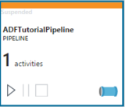
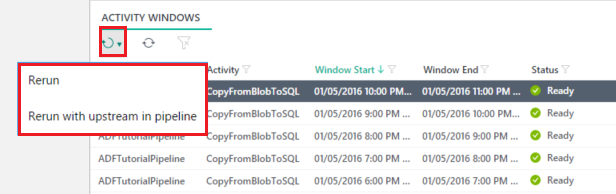

<properties 
    pageTitle="監控和管理 Azure 資料工廠管線" 
    description="瞭解如何使用監控和管理 Azure 資料工廠和管線的監控和管理應用程式。" 
    services="data-factory" 
    documentationCenter="" 
    authors="spelluru" 
    manager="jhubbard" 
    editor="monicar"/>

<tags 
    ms.service="data-factory" 
    ms.workload="data-services" 
    ms.tgt_pltfrm="na" 
    ms.devlang="na" 
    ms.topic="article" 
    ms.date="09/06/2016" 
    ms.author="spelluru"/>

# 監控和管理 Azure 資料工廠管線使用新的監控和管理應用程式
> [AZURE.SELECTOR]
- [使用 PowerShell 的 Azure 入口網站/Azure](data-factory-monitor-manage-pipelines.md)
- [使用 [監控和管理應用程式](data-factory-monitor-manage-app.md)

本文將說明如何監控、 管理及偵錯管線，以及建立通知，以取得通知上使用的**監控和管理應用程式**的失敗次數。 您也可以觀看以下影片，瞭解使用監控和管理應用程式。
   

> [AZURE.VIDEO azure-data-factory-monitoring-and-managing-big-data-piplines]
      
## 啟動 [監控和管理應用程式
若要啟動 [監視器] 和 [管理應用程式，按一下**監控和管理**磚上用您的資料工廠**資料工廠**刀。

 

您應該會看到在個別的索引標籤/視窗中啟動的監控和管理應用程式。  

> [AZURE.NOTE] 如果您看到的網頁瀏覽器停滯在 [授權...]，停用/取消核取 [**封鎖第三方 cookie 與網站資料]**設定 （或） 保留啟用並建立**login.microsoftonline.com**例外，然後嘗試重新啟動應用程式。

如果您沒有看到 [底部] 清單中的活動視窗，請按一下 [重新整理清單] 工具列上的 [**重新整理**] 按鈕。 此外，設定**開始時間**] 和 [**結束時間**篩選的正確值。  

## 了解監控和管理應用程式
有三個索引標籤 （**資源檔案總管**、**監控檢視**，以及**提醒**） 的左側，預設會選取第一個索引標籤 (資源 Explorer)。 

### 資源檔案總管
您會看到下列動作︰ 

- 資源檔案總管**樹狀檢視**的左窗格中。
- 頂端的**[圖表檢視**。
- 在中間窗格底部的 [**活動視窗**] 清單。
- **屬性**/**活動視窗 Explorer**在右窗格中的索引標籤。 

在 [資源總管] 中，您會看到資料工廠在樹狀檢視中的所有資源 （管線、 資料集，連結的服務）。 當您在資源總管] 中選取的物件時，您會看到下列動作︰ 

- 在 [圖表檢視中醒目提示相關聯的資料工廠實體。
- 相關聯的活動 windows (按一下[這裡](data-factory-scheduling-and-execution.md)，瞭解如何活動 windows) 底部的 [活動視窗] 清單中醒目提示。  
- 在右窗格中的 [屬性] 視窗中選取的物件的屬性。 
- 選取的物件視 JSON 定義。 例如︰ 連結的服務或資料集或管線。 

請參閱[排程和執行](data-factory-scheduling-and-execution.md)本文活動視窗概念的詳細資訊。 

### 在圖表檢視
[圖表] 檢視的資料工廠提供單一窗格的監控和管理資料 factory 和其資產的放大鏡。 當您在圖表檢視中選取資料工廠實體 （資料集/管線） 時，您會看到下列動作︰
 
- 在樹狀檢視中選取資料工廠實體
- 相關聯的活動 windows 會醒目提示的活動視窗] 清單中。
- 在 [屬性] 視窗中選取的物件的屬性

啟用管線時 （不在暫停狀態），其會顯示綠色的線條。 

您會發現有三個管線圖表檢視] 中的命令按鈕。 您可以使用 [第二個] 按鈕以暫停管道的郵件。 暫停不結束目前正在執行的活動，並讓他們完成。 第三個按鈕暫停管道的郵件，並結束它現有的執行的活動。 第一個按鈕會繼續管道的郵件。 當您的管線暫停時，您會發現色彩變更為管線並排顯示，如下所示。

您可以多重選取兩個或多個管線 （使用 CTRL），並使用命令列按鈕，以暫停/繼續多個管線一次。

您可以看到管道的郵件中的所有活動，以滑鼠右鍵按一下 [管道的郵件] 方塊中，按一下 [**開啟管道的郵件**。

![開啟管道的郵件] 功能表](./media/data-factory-monitor-manage-app/OpenPipelineMenu.png)

在開啟的管線] 檢視中，您會看到所有管道的活動。 在此範例中，有一個活動︰ 複製活動。 若要回到先前的檢視中，按一下頂端的階層連結] 功能表中的資料工廠名稱。

在 [管道的郵件] 檢視中，當您按一下 [輸出資料集或是當您將滑鼠移至輸出資料集，您會看到該資料集的活動 Windows 快顯視窗。

您可以按一下看到詳細資料，它在右窗格中的 [**屬性**] 視窗中的 [活動] 視窗。 

在右窗格中，切換至**活動視窗檔案總管**] 索引標籤以查看更多詳細資料。

 

您也可以查看**解決變數**的每個活動執行嘗試在**嘗試**] 區段中。 

切換至 [**指令碼**] 索引標籤以查看所選物件的 JSON 指令碼定義。   

![指令碼] 索引標籤](./media/data-factory-monitor-manage-app/ScriptTab.png)

您會看到三個位置的活動視窗︰

- 在圖表檢視 （中間窗格） 中的活動 Windows 快顯。
- 在右窗格中的活動視窗總管。
- 在下方窗格中的活動 Windows 清單。

在快顯的活動 Windows 和活動視窗檔案總管中，您可以捲動到前一週] 及 [下一週使用向左鍵和向右箭號。

在底部的 [圖表] 檢視，您會看到以拉近顯示，拉遠顯示，縮放以符合、 縮放 100%，請鎖定版面配置] 按鈕。 鎖定版面配置] 按鈕可防止您不小心移動表格和管線圖表檢視] 中，預設為開啟。 您可以將其關閉，並在圖表中移動項目。 當您關閉時，您可以使用 [姓氏] 按鈕來自動放置表格和管線的位置。 您也可以放大 / 縮小使用滑鼠滾輪。

![[圖表檢視縮放比例] 命令](./media/data-factory-monitor-manage-app/DiagramViewZoomCommands.png)

### 活動視窗] 清單
在中間窗格的底部的 [活動視窗] 清單會顯示您在資源總管] 或 [圖表檢視中選取的資料集的所有活動視窗。 根據預設，清單是以遞減順序，這表示您看到最新的 [活動] 視窗頂端。 

![活動視窗] 清單](./media/data-factory-monitor-manage-app/ActivityWindowsList.png)

這份清單，不會自動重新整理，以手動重新整理，因此使用工具列上的 [重新整理] 按鈕。  

活動 windows 可在其中一個動作狀態︰

<table>
<tr>
    <th align="left">狀態</th><th align="left">子狀態</th><th align="left">描述</th>
</tr>
<tr>
    <td rowspan="8">等待</td><td>ScheduleTime</td><td>時間具有都不會執行的活動] 視窗。</td>
</tr>
<tr>
<td>DatasetDependencies</td><td>準備好不到上游相依性。</td>
</tr>
<tr>
<td>ComputeResources</td><td>計算資源無法使用。</td>
</tr>
<tr>
<td>ConcurrencyLimit</td> <td>所有活動的執行個體都是忙碌執行其他活動視窗。</td>
</tr>
<tr>
<td>ActivityResume</td><td>活動已暫停，直到它會繼續無法執行的活動視窗。</td>
</tr>
<tr>
<td>再試一次</td><td>活動執行重試一次。</td>
</tr>
<tr>
<td>驗證</td><td>驗證尚未啟動。</td>
</tr>
<tr>
<td>ValidationRetry</td><td>等待重試驗證。</td>
</tr>
<tr>
<tr
<td rowspan="2">InProgress</td><td>驗證</td><td>進行中的驗證。</td>
</tr>
<td></td>
<td>正在處理活動視窗。</td>
</tr>
<tr>
<td rowspan="4">失敗</td><td>逾時</td><td>執行所花費的時間比的所允許的活動。</td>
</tr>
<tr>
<td>取消</td><td>取消使用者動作。</td>
</tr>
<tr>
<td>驗證</td><td>驗證失敗。</td>
</tr>
<tr>
<td></td><td>無法產生及/或驗證 [活動] 視窗。</td>
</tr>
<td>準備好</td><td></td><td>[活動] 視窗，可供使用。</td>
</tr>
<tr>
<td>略過</td><td></td><td>[活動] 視窗不會處理。</td>
</tr>
<tr>
<td>無</td><td></td><td>用來與其他狀態，但已重設活動視窗。</td>
</tr>
</table>

當您按一下清單中的 [活動] 視窗時，您會看到右側的**活動 Windows 檔案總管**] 或 [**內容**] 視窗中的詳細資訊。

### 重新整理 windows 活動  
詳細資料才會自動重新整理，因此您使用的**重新整理**] 按鈕 （第二個] 按鈕），以手動重新整理 [活動的視窗] 清單中的命令列上。  
 

### 內容] 視窗
[屬性] 視窗會最右邊的窗格中的監控和管理應用程式。 

![內容] 視窗](./media/data-factory-monitor-manage-app/PropertiesWindow.png)

會顯示您在資源瀏覽器 （樹狀目錄檢視） （或） 圖表檢視 （或） 活動視窗] 清單中選取的項目的內容。 

### 活動視窗總管

監控和管理應用程式的最右邊的窗格中，是 [**活動視窗總管**] 視窗。 會顯示您在快顯的活動 Windows 或活動視窗] 清單中選取 [活動] 視窗的詳細資料。 

您可以按一下頂端的 [行事曆] 檢視中，切換到另一個活動視窗。 您也可以使用**向左箭號**/若要查看的前一個/下週的活動視窗頂端的**向右箭號**按鈕。

您可以在窗格中使用**重新執行**[活動] 視窗或**重新整理**的下方窗格中的 [工具列] 按鈕的詳細資料。 

### 指令碼 
若要檢視的 [選取的資料工廠實體 （連結的服務與資料集，管線） JSON 定義，您可以使用 [**指令碼**] 索引標籤。 

![指令碼] 索引標籤](./media/data-factory-monitor-manage-app/ScriptTab.png)

## 使用系統檢視
監控和管理應用程式包含預先建立的系統檢視**最近的活動 windows**、**失敗活動 windows**（[**進度活動 windows**），可讓您檢視您的資料工廠最近/失敗/進行中的活動視窗。 

切換至左側的 [**監控檢視**] 索引標籤，按一下它。 

![監控檢視] 索引標籤](./media/data-factory-monitor-manage-app/MonitoringViewsTab.png)

目前，有三種系統檢視支援。 若要查看最近的活動 windows （或） 失敗的活動 windows （或） 進行中的活動 windows （在中間窗格底部） 的活動視窗] 清單中選擇。 

當您選取**最近的活動 windows** ] 選項時，您會看到所有最近活動視窗中的**最後一個嘗試時間**遞減順序。 

若要查看清單中的所有失敗的活動視窗，您可以使用 [**失敗活動視窗**檢視。 若要查看詳細資料在**內容**視窗 （或）**活動視窗總管**清單中選取失敗的活動視窗。 您也可以下載失敗的活動視窗的任何記錄。 

## 排序及篩選活動 windows
變更篩選活動 windows 的命令列上的**開始時間**] 和 [**結束時間**設定。 變更開始時間] 和 [結束時間後，按一下 [結束時間，以重新整理活動 Windows 清單旁的按鈕。

> [AZURE.NOTE] 目前，所有時間都都 UTC 監控和管理應用程式中的格式。 

在**活動視窗] 清單**中，按一下 [資料行的名稱 (例如︰ 狀態)。 

![活動 Windows 清單] 欄功能表](./media/data-factory-monitor-manage-app/ActivityWindowsListColumnMenu.png)

您可以執行下列動作︰

- 以遞增順序排序。
- 以遞減順序排序。
- 篩選依據一或多個值 （就緒，等待等等。）

當您指定的資料行上的篩選時，您會看到啟用指出欄中的值是篩選的值的資料行的 [篩選] 按鈕。 

![篩選資料行的活動視窗] 清單中](./media/data-factory-monitor-manage-app/ActivityWindowsListFilterInColumn.png)

您可以使用相同的快顯視窗，以清除篩選。 若要清除所有篩選活動的 [視窗] 清單，請按一下命令列上的 [都清除篩選] 按鈕。 

![清除活動視窗] 清單中的所有篩選](./media/data-factory-monitor-manage-app/ClearAllFiltersActivityWindowsList.png)

## 執行批次動作

### 重新執行選取的活動視窗
選取 [活動] 視窗，按一下第一個命令列] 按鈕的向下箭號並選取**重新執行** / **重新執行與上游管道**。 當您選取**重新執行與上游管道**的選項時，將其重新執行所有上游活動視窗以及。 
    

您也可以選取清單中的多個活動視窗，然後重新進行執行一次。 您可能會想要篩選依據的狀態的活動 windows (例如︰**失敗**)，然後重新失敗的活動 windows 執行之後修正問題導致失敗的 [活動] 視窗。 請參閱下一節的詳細資料篩選清單中的活動視窗。  

### 暫停繼續多個管線
您可以多重選取兩個或多個管線 （使用 CTRL），並使用命令列按鈕 （在下圖中的紅色矩形中醒目提示），以暫停/繼續進行一次。

## 建立提醒 
[提醒] 頁面可讓您建立的提醒，檢視或編輯刪除現有的警示。 您可以也停用/啟用通知。 若要查看 [提醒] 頁面，請按一下 [通知] 索引標籤。

![通知] 索引標籤](./media/data-factory-monitor-manage-app/AlertsTab.png)

### 若要建立提醒

1. 按一下 [**新增提醒**新增提醒]。 您看到詳細資料頁面。 

    ![建立提醒的詳細資料] 頁面](./media/data-factory-monitor-manage-app/CreateAlertDetailsPage.png)
1. 指定**名稱**和**描述**的通知，然後按一下 [**下一步**]。 您應該會看到 [**篩選**] 頁面。

    

2. 選取 [**事件**]、 [**狀態**] 和 [**子狀態**（選用） 您想要通知您，資料工廠服務，然後按一下 [**下一步**]。 您應該會看到 [**收件者**] 頁面。

    ![建立提醒-收件者] 頁面](./media/data-factory-monitor-manage-app/CreateAlertRecipientsPage.png) 
3. 選取**電子郵件訂閱管理員**選項及/或輸入**其他的系統管理員電子郵件**，然後按一下 [**完成]**。 您應該會看到清單中的提醒。 
    
    

[提醒] 清單中使用 [編輯/刪除/停用/啟用通知提醒與相關聯的按鈕。 

### 子狀態事件/狀態
下表提供可用的事件與狀態 （和子狀態） 的清單。

事件名稱 | 狀態 | Sub 狀態
-------------- | ------ | ----------
開始執行的活動 | 開始使用 | 啟動
執行完成的活動 | 成功 | 成功 
執行完成的活動 | 失敗| 失敗的資源分派  執行失敗  逾時  驗證失敗  放棄
視需要 HDI 叢集建立入門 | 開始使用 | &nbsp; |
視需要 HDI 叢集成功建立 | 成功 | &nbsp; |
視需要 HDI 叢集刪除 | 成功 | &nbsp; |
### 若要編輯或刪除/停用通知

![通知] 按鈕](./media/data-factory-monitor-manage-app/AlertButtons.png)

    
 

