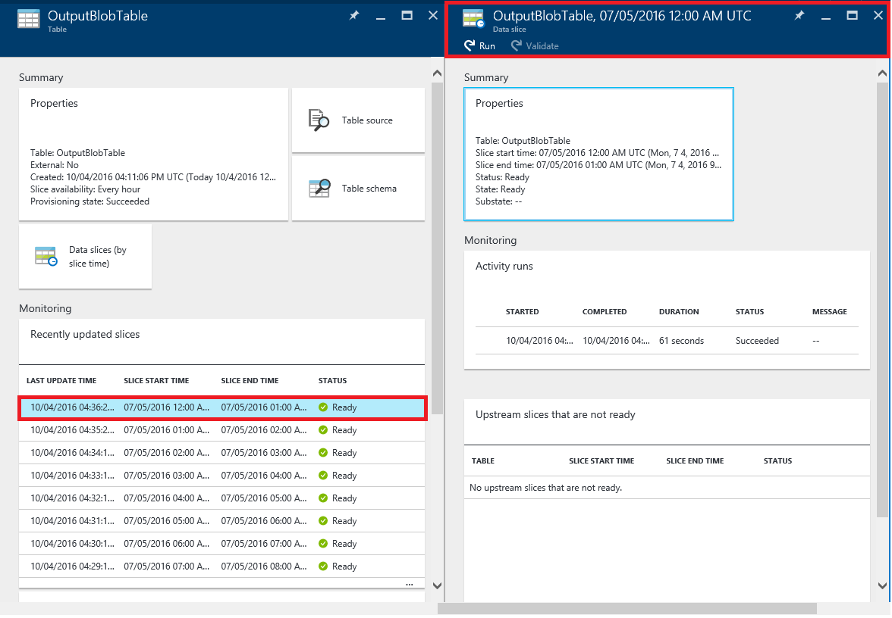
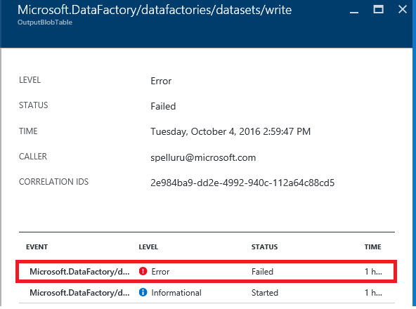
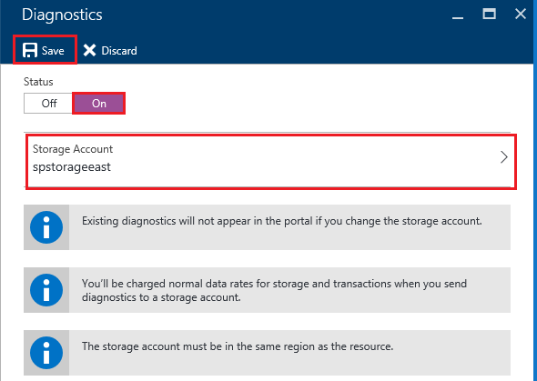

<properties 
    pageTitle="監控和管理 Azure 資料工廠管線" 
    description="瞭解如何使用 Azure 入口網站與 PowerShell 的 Azure 監控和管理 Azure 資料工廠和您所建立的管線。" 
    services="data-factory" 
    documentationCenter="" 
    authors="spelluru" 
    manager="jhubbard" 
    editor="monicar"/>

<tags 
    ms.service="data-factory" 
    ms.workload="data-services" 
    ms.tgt_pltfrm="na" 
    ms.devlang="na" 
    ms.topic="article" 
    ms.date="09/06/2016" 
    ms.author="spelluru"/>

# 監控和管理 Azure 資料工廠管線
> [AZURE.SELECTOR]
- [使用 Azure 入口網站/Azure PowerShell](data-factory-monitor-manage-pipelines.md)
- [使用 [監控和管理應用程式](data-factory-monitor-manage-app.md)

資料 Factory 服務，提供儲存空間、 處理和資料移動服務可靠和完整的檢視。 服務可讓您監控的儀表板可協助您可以用來執行下列工作︰ 

- 快速評估端對端資料管線健康狀況。
- 找出問題，並視需要採取矯正。 
- 追蹤資料歷程。 
- 追蹤之間跨任何來源資料的關聯。
- 檢視完整歷史會計專用的作業執行、 系統運作情況和相依性。

本文將說明如何監控、 管理及偵錯管線。 它也會提供如何建立提醒和收到通知失敗的資訊。

## 瞭解管線與活動的狀態
使用 [Azure 入口網站，您可以︰

- 圖表以檢視您的資料工廠
- 檢視活動的管線
- 檢視輸入與輸出資料集
- 及其他內容。 

本節提供的扇形區轉換到另一個狀態方式。   

### 瀏覽至您的資料工廠
1.  [Azure 入口網站](https://portal.azure.com)登入。
2.  按一下左側功能表中的 [**資料工廠**]。 如果您沒有看到它，按一下 [**更多服務 >**按一下**資料工廠****智慧 + 分析**類別下。 

    ![瀏覽所有]-> [資料工廠](./media/data-factory-monitor-manage-pipelines/browseall-data-factories.png)

    您應該會看到**資料工廠**刀中的所有資料工廠。 
4. 在資料工廠刀中，選取您感興趣的資料工廠。

      
5.  然後，您應該會看到資料工廠的 [首頁] 頁面 （**資料工廠**刀）。

    

#### 您資料的工廠的圖表檢視
[圖表] 檢視的資料工廠提供單一窗格的監控和管理資料 factory 和其資產的放大鏡。

若要查看您的資料工廠的圖表檢視中，按一下 [在資料工廠首頁上的 [**圖表**]。

您可以放大、 拉遠顯示縮放符合縮放為 100%、 鎖定的圖表] 版面配置，自動將管線和表格。 您也可以查看資料歷程資訊 （顯示上游和下游的項目選取的項目）。
 

### 管線內的活動 
1. 以滑鼠右鍵按一下管線，然後按一下以查看所有活動的活動的輸入與輸出資料集以及管線中**開啟管道的郵件**]。 此功能時，您的管線分成多個活動，而且您想要瞭解的單一管線操作的歷程。

    ![開啟管道的郵件] 功能表](./media/data-factory-monitor-manage-pipelines/open-pipeline-menu.png)  
2. 在下列範例中，您會看到兩個管線的輸入與輸出中的活動。 標題為 [ **JoinData** HDInsight 登錄區活動類型的及**EgressDataAzure**類型複製活動的活動是在此範例管道的郵件中。 
    
     
3. 您可以導覽返回資料工廠首頁上，按一下左上角的階層連結資料工廠連結。

    

### 檢視狀態的每個管線內的活動
您可以檢視的活動所產生的資料任何的集狀態檢視目前狀態的活動。 

例如︰ 在下列範例中， **BlobPartitionHiveActivity**已順利執行並產生資料集名為**PartitionedProductsUsageTable**，即**準備好**的狀態。

按兩下**PartitionedProductsUsageTable**圖表檢視] 中展示所產生的不同活動就會執行管線內的所有扇形區。 您可以看到**BlobPartitionHiveActivity**已順利執行每個月的最後一八個月，並產生**準備**狀態的扇形區。

資料工廠資料集的扇形區可能會有下列狀態其中一項︰

<table>
<tr>
    <th align="left">狀態</th><th align="left">子</th><th align="left">描述</th>
</tr>
<tr>
    <td rowspan="8">等待</td><td>ScheduleTime</td><td>時間具有都不會用來執行的扇形區。</td>
</tr>
<tr>
<td>DatasetDependencies</td><td>準備好不到上游相依性。</td>
</tr>
<tr>
<td>ComputeResources</td><td>計算資源無法使用。</td>
</tr>
<tr>
<td>ConcurrencyLimit</td> <td>所有活動的執行個體都是忙碌執行其他的扇形區。</td>
</tr>
<tr>
<td>ActivityResume</td><td>已暫停的活動和無法執行扇形區，直到它會繼續。</td>
</tr>
<tr>
<td>再試一次</td><td>活動執行重試一次。</td>
</tr>
<tr>
<td>驗證</td><td>驗證尚未啟動。</td>
</tr>
<tr>
<td>ValidationRetry</td><td>等待重試驗證。</td>
</tr>
<tr>
<tr
<td rowspan="2">InProgress</td><td>驗證</td><td>進行中的驗證。</td>
</tr>
<td></td>
<td>正在處理的扇形區。</td>
</tr>
<tr>
<td rowspan="4">失敗</td><td>逾時</td><td>執行所花費的時間比的所允許的活動。</td>
</tr>
<tr>
<td>取消</td><td>取消使用者動作。</td>
</tr>
<tr>
<td>驗證</td><td>驗證失敗。</td>
</tr>
<tr>
<td></td><td>無法產生及/或驗證扇形區。</td>
</tr>
<td>準備好</td><td></td><td>扇形區可供使用。</td>
</tr>
<tr>
<td>略過</td><td></td><td>扇形區不會處理。</td>
</tr>
<tr>
<td>無</td><td></td><td>用來與其他狀態，但已重設的扇形區。</td>
</tr>
</table>

您可以檢視詳細資料的扇形區扇形區中的項目**最近更新扇形區**刀] 即可。

 
如果有多個時間執行扇形區，您會看到**活動執行**清單中的多個資料列。 您可以檢視**活動執行**清單中執行的項目，即可執行的活動相關詳細資料。 清單會顯示一則錯誤訊息，如果有任何以及所有記錄檔。 此功能來檢視和偵錯記錄檔，而不必離開您的資料 factory 非常有用。

如果扇形區不在**準備好**的狀態，您可以看到的不是好會封鎖執行**的是尚未準備上游扇形區**清單中的目前扇形區上游扇形區。 此功能時，您的扇形區**等待**的狀態，而您想要瞭解上游的扇形區正在等候的相依性。

### 資料集狀態圖表
一旦您部署資料 factory 管線有有效的作用中期間，資料集切的取切換到另一個。 目前的扇形區狀態遵循下列狀態圖表︰

資料集狀態的轉場效果傳送資料工廠︰ 等候]-> [在進度/正在進行 (Validating)]-> [準備/失敗

扇形區開始測試的條件，以符合執行之前**等待**狀態。 然後活動開始執行扇形區會在**進行中**的狀態。 活動執行成功或失敗。 扇形區標記為**準備**' 或**失敗**根據執行的結果。 

您可以重設回到從**好**或**失敗**狀態**等候**狀態的扇形區。 您可以也標示 [**略過**，可避免活動的執行狀態的扇形區，而且不會處理扇形區。

## 管理管線
您可以管理使用 PowerShell 的 Azure 管線。 比方說，您可以將游標暫停於，並繼續執行 Azure PowerShell cmdlet 的管線。 

### 將游標暫停並繼續管線
您可以暫停/暫停管線使用**暫停 AzureRmDataFactoryPipeline** Powershell 指令程式。 這個指令程式時，您不想要修正問題之前，請執行管線。

例如︰ 以下的螢幕擷取畫面，在問題已識別與**PartitionProductsUsagePipeline** **productrecgamalbox1dev**資料工廠，我們要暫停管道的郵件。

若要暫停管線，執行下列 PowerShell 命令︰

    Suspend-AzureRmDataFactoryPipeline [-ResourceGroupName] <String> [-DataFactoryName] <String> [-Name] <String>

例如︰

    Suspend-AzureRmDataFactoryPipeline -ResourceGroupName ADF -DataFactoryName productrecgamalbox1dev -Name PartitionProductsUsagePipeline 

一旦已與**PartitionProductsUsagePipeline**修正問題，可以繼續已擱置的管線藉由執行下列動作的 PowerShell 命令︰

    Resume-AzureRmDataFactoryPipeline [-ResourceGroupName] <String> [-DataFactoryName] <String> [-Name] <String>

例如︰

    Resume-AzureRmDataFactoryPipeline -ResourceGroupName ADF -DataFactoryName productrecgamalbox1dev -Name PartitionProductsUsagePipeline 

## 偵錯管線
Azure 資料工廠提供透過 Azure 入口網站及偵錯和疑難排解管線 PowerShell 的 Azure 豐富的功能。

### 在管線尋找錯誤
如果活動執行失敗管線中，請管線所產生的資料集是發生錯誤，因為失敗。 您可以為偵錯和疑難排解中使用下列機制 Azure 資料工廠的錯誤。

#### 使用偵錯 Azure 入口網站︰

3.  在 [**表格**刀中，按一下問題扇形區**狀態**設定為 [**失敗**。

    
4.  在**資料扇形區**刀中，按一下 [執行失敗的活動]。
    
    
5.  在**活動執行詳細資料**刀中，您可以下載 HDInsight 處理相關聯的檔案。 按一下 [下載狀態/stderr 下載包含錯誤的詳細資訊的錯誤記錄檔]。

      

#### 使用 PowerShell 來偵錯
1.  啟動**Azure PowerShell**。
3.  執行**取得 AzureRmDataFactorySlice**命令，請參閱扇形區和其狀態。 您應該會看到扇形區狀態︰**失敗**。       

            Get-AzureRmDataFactorySlice [-ResourceGroupName] <String> [-DataFactoryName] <String> [-TableName] <String> [-StartDateTime] <DateTime> [[-EndDateTime] <DateTime> ] [-Profile <AzureProfile> ] [ <CommonParameters>]
    
    例如︰
        
            Get-AzureRmDataFactorySlice -ResourceGroupName ADF -DataFactoryName LogProcessingFactory -TableName EnrichedGameEventsTable -StartDateTime 2014-05-04 20:00:00

    **StartDateTime**換成您指定的設定 AzureRmDataFactoryPipelineActivePeriod StartDateTime 值。
4. 現在，請執行**取得 AzureRmDataFactoryRun** cmdlet，以取得詳細資料的扇形區執行的活動。

        Get-AzureRmDataFactoryRun [-ResourceGroupName] <String> [-DataFactoryName] <String> [-TableName] <String> [-StartDateTime] 
        <DateTime> [-Profile <AzureProfile> ] [ <CommonParameters>]
    
    例如︰

        Get-AzureRmDataFactoryRun -ResourceGroupName ADF -DataFactoryName LogProcessingFactory -TableName EnrichedGameEventsTable -StartDateTime "5/5/2014 12:00:00 AM"

    StartDateTime 的值是您的上一個步驟所述的錯誤/問題扇形區的開始時間。 日期-時間都應該用雙引號括住。
5.  您應該會看到的輸出 （類似下列） 錯誤的詳細資訊︰

            Id                      : 841b77c9-d56c-48d1-99a3-8c16c3e77d39
            ResourceGroupName       : ADF
            DataFactoryName         : LogProcessingFactory3
            TableName               : EnrichedGameEventsTable
            ProcessingStartTime     : 10/10/2014 3:04:52 AM
            ProcessingEndTime       : 10/10/2014 3:06:49 AM
            PercentComplete         : 0
            DataSliceStart          : 5/5/2014 12:00:00 AM
            DataSliceEnd            : 5/6/2014 12:00:00 AM
            Status                  : FailedExecution
            Timestamp               : 10/10/2014 3:04:52 AM
            RetryAttempt            : 0
            Properties              : {}
            ErrorMessage            : Pig script failed with exit code '5'. See wasb://     adfjobs@spestore.blob.core.windows.net/PigQuery
                                            Jobs/841b77c9-d56c-48d1-99a3-
                        8c16c3e77d39/10_10_2014_03_04_53_277/Status/stderr' for
                        more details.
            ActivityName            : PigEnrichLogs
            PipelineName            : EnrichGameLogsPipeline
            Type                    :
    
    
6.  您可以使用您從輸出查看和下載**-DownloadLogsoption**用 cmdlet 的記錄檔的識別碼值來執行**儲存 AzureRmDataFactoryLog**指令程式。

            Save-AzureRmDataFactoryLog -ResourceGroupName "ADF" -DataFactoryName "LogProcessingFactory" -Id "841b77c9-d56c-48d1-99a3-8c16c3e77d39" -DownloadLogs -Output "C:\Test"

## 重新執行管道失敗

### 使用 Azure 入口網站

疑難排解並偵錯管道的失敗次數之後，您可以瀏覽至錯誤扇形區，按一下 [**執行**] 按鈕上的命令列來重新執行失敗。

萬一原則錯誤而驗證失敗的扇形區 (的 365&ex︰ 無法使用的資料)，您可以修正錯誤，並再次驗證按一下命令列上的 [**驗證**] 按鈕。

### 使用 PowerShell 的 Azure

您可以使用設定 AzureRmDataFactorySliceStatus cmdlet，以重新執行失敗。 請參閱[設定 AzureRmDataFactorySliceStatus](https://msdn.microsoft.com/library/mt603522.aspx)主題的語法和 cmdlet 的相關的其他詳細資料。 

**範例︰**下列範例設定的狀態為資料表的所有扇形區 'DAWikiAggregatedData' '有人正在' Azure 資料工廠 'WikiADF'。

UpdateType 設定為 UpstreamInPipeline，表示資料表的每個扇形區及所有從屬參照 （上游） 資料表的狀態會設定為 「 正在等待 」。 其他可能的值，此參數是 「 個人 」。

    Set-AzureRmDataFactorySliceStatus -ResourceGroupName ADF -DataFactoryName WikiADF -TableName DAWikiAggregatedData -Status Waiting -UpdateType UpstreamInPipeline -StartDateTime 2014-05-21T16:00:00 -EndDateTime 2014-05-21T20:00:00

## 建立提醒
建立、 更新，或刪除 azure 記錄使用者事件時 Azure 資源 (例如，資料 factory)。 您可以建立通知這些事件。 資料工廠可讓您擷取各種不同的指標，然後在指標建立提醒。 我們建議即時監視及指標使用事件，歷程記錄的用途。 

### 在 [事件的提醒
Azure 的事件提供有助於瞭解有什麼新鮮事中 Azure 資源。 建立、 更新，或刪除 azure 記錄使用者事件時 Azure 資源 (例如，資料 factory)。 在使用 Azure 資料工廠時，會產生事件時︰

- Azure 資料工廠是建立或更新/刪除。
- 資料處理 （稱為執行時） 開始/完成。
- 視需要 HDInsight 叢集，建立並移除。

您可以建立這些使用者事件的提醒，並將其設定為傳送電子郵件通知給系統管理員和訂閱的共同管理員。 此外，您可以指定額外的電子郵件地址接收電子郵件通知，在條件符合時所需要的使用者。 此功能時，您想要收到通知失敗，而且不想要持續監視您資料的工廠。

> [AZURE.NOTE] 目前，入口網站不會顯示通知的事件。 若要查看所有通知使用的[監控和管理應用程式](data-factory-monitor-manage-app.md)。

#### 指定通知的定義︰
若要指定通知的定義，您可以建立 JSON 檔案描述您要在收到的作業。 在下列範例中，提醒會傳送電子郵件通知 RunFinished 作業。 為特定時執行資料工廠已完成，而且無法執行,，會傳送電子郵件通知 (狀態 = FailedExecution)。

    {
        "contentVersion": "1.0.0.0",
         "$schema": "http://schema.management.azure.com/schemas/2014-04-01-preview/deploymentTemplate.json#",
        "parameters": {},
        "resources": 
        [
            {
                "name": "ADFAlertsSlice",
                "type": "microsoft.insights/alertrules",
                "apiVersion": "2014-04-01",
                "location": "East US",
                "properties": 
                {
                    "name": "ADFAlertsSlice",
                    "description": "One or more of the data slices for the Azure Data Factory has failed processing.",
                    "isEnabled": true,
                    "condition": 
                    {
                        "odata.type": "Microsoft.Azure.Management.Insights.Models.ManagementEventRuleCondition",
                        "dataSource": 
                        {
                            "odata.type": "Microsoft.Azure.Management.Insights.Models.RuleManagementEventDataSource",
                            "operationName": "RunFinished",
                            "status": "Failed",
                            "subStatus": "FailedExecution"   
                        }
                    },
                    "action": 
                    {
                        "odata.type": "Microsoft.Azure.Management.Insights.Models.RuleEmailAction",
                        "customEmails": [ "<your alias>@contoso.com" ]
                    }
                }
            }
        ]
    }

從 JSON 定義，如果您不想要在特定的錯誤提醒可以移除**子狀態**。

此範例中設定您的訂閱中的所有資料工廠提醒。 如果您想要為特定資料原廠設定提醒，您可以指定資料工廠**resourceUri**中**的資料來源**︰

    "resourceUri" : "/SUBSCRIPTIONS/<subscriptionId>/RESOURCEGROUPS/<resourceGroupName>/PROVIDERS/MICROSOFT.DATAFACTORY/DATAFACTORIES/<dataFactoryName>"

下表提供可用的作業的狀態 （和子狀態） 的清單。

作業名稱 | 狀態 | Sub 狀態
-------------- | ------ | ----------
RunStarted | 開始使用 | 啟動
RunFinished | 無法 / 成功 | FailedResourceAllocation  成功  FailedExecution  逾時  < 取消  FailedValidation  放棄
OnDemandClusterCreateStarted | 開始使用
OnDemandClusterCreateSuccessful | 成功
OnDemandClusterDeleted | 成功

如需 JSON 元素範例中的詳細資訊，請參閱[建立提醒的規則](https://msdn.microsoft.com/library/azure/dn510366.aspx)。 

#### 部署提醒 
若要部署提醒，使用 PowerShell 的 Azure cmdlet:**新增 AzureRmResourceGroupDeployment**，如下列範例所示︰

    New-AzureRmResourceGroupDeployment -ResourceGroupName adf -TemplateFile .\ADFAlertFailedSlice.json  

資源群組部署已順利完成之後, 您會看到下列訊息︰

    VERBOSE: 7:00:48 PM - Template is valid.
    WARNING: 7:00:48 PM - The StorageAccountName parameter is no longer used and will be removed in a future release.
    Please update scripts to remove this parameter.
    VERBOSE: 7:00:49 PM - Create template deployment 'ADFAlertFailedSlice'.
    VERBOSE: 7:00:57 PM - Resource microsoft.insights/alertrules 'ADFAlertsSlice' provisioning status is succeeded
    
    DeploymentName    : ADFAlertFailedSlice
    ResourceGroupName : adf
    ProvisioningState : Succeeded
    Timestamp         : 10/11/2014 2:01:00 AM
    Mode              : Incremental
    TemplateLink      :
    Parameters        :
    Outputs           :

> [AZURE.NOTE] 您可以使用[建立提醒規則](https://msdn.microsoft.com/library/azure/dn510366.aspx)REST API，若要建立提醒的規則。 JSON 內容是類似 JSON 範例。  

#### 擷取 Azure 資源群組部署的清單
若要擷取的部署 Azure 資源群組部署清單，請使用 cmdlet:**取得 AzureRmResourceGroupDeployment**，如下列範例所示︰

    Get-AzureRmResourceGroupDeployment -ResourceGroupName adf
    
    DeploymentName    : ADFAlertFailedSlice
    ResourceGroupName : adf
    ProvisioningState : Succeeded
    Timestamp         : 10/11/2014 2:01:00 AM
    Mode              : Incremental
    TemplateLink      :
    Parameters        :
    Outputs           :

#### 疑難排解使用者事件

1. 您可以看到所有後按一下 [**指標和作業**] 方塊中產生的事件。

    

2. 按一下**事件**圖磚以查看的事件。 

    
3. 在**事件**刀中，您可以事件的詳細資料，等篩選事件。 

    
4. 按一下 [會造成錯誤的 [作業] 清單中的 [**作業**]。
    
     
5. 按一下 [**錯誤**事件，請參閱錯誤的相關詳細資料]。

    
  

您可以使用 [新增/取得/移除提醒的 PowerShell cmdlet，請參閱[Azure 充分 Cmdlet](https://msdn.microsoft.com/library/mt282452.aspx)本文。 以下是使用**取得 AlertRule**指令程式的一些範例︰ 

    PS C:\> get-alertrule -res $resourceGroup -n ADFAlertsSlice -det
        
            Properties :
            Action      : Microsoft.Azure.Management.Insights.Models.RuleEmailAction
            Condition   :
            DataSource :
            EventName             :
            Category              :
            Level                 :
            OperationName         : RunFinished
            ResourceGroupName     :
            ResourceProviderName  :
            ResourceId            :
            Status                : Failed
            SubStatus             : FailedExecution
            Claims                : Microsoft.Azure.Management.Insights.Models.RuleManagementEventClaimsDataSource
            Condition   :
            Description : One or more of the data slices for the Azure Data Factory has failed processing.
            Status      : Enabled
            Name:       : ADFAlertsSlice
            Tags       :
            $type          : Microsoft.WindowsAzure.Management.Common.Storage.CasePreservedDictionary, Microsoft.WindowsAzure.Management.Common.Storage
            Id: /subscriptions/<subscription ID>/resourceGroups/<resource group name>/providers/microsoft.insights/alertrules/ADFAlertsSlice
            Location   : West US
            Name       : ADFAlertsSlice
    
    PS C:\> Get-AlertRule -res $resourceGroup

            Properties : Microsoft.Azure.Management.Insights.Models.Rule
            Tags       : {[$type, Microsoft.WindowsAzure.Management.Common.Storage.CasePreservedDictionary, Microsoft.WindowsAzure.Management.Common.Storage]}
            Id         : /subscriptions/<subscription id>/resourceGroups/<resource group name>/providers/microsoft.insights/alertrules/FailedExecutionRunsWest0
            Location   : West US
            Name       : FailedExecutionRunsWest0
    
            Properties : Microsoft.Azure.Management.Insights.Models.Rule
            Tags       : {[$type, Microsoft.WindowsAzure.Management.Common.Storage.CasePreservedDictionary, Microsoft.WindowsAzure.Management.Common.Storage]}
            Id         : /subscriptions/<subscription id>/resourceGroups/<resource group name>/providers/microsoft.insights/alertrules/FailedExecutionRunsWest3
            Location   : West US
            Name       : FailedExecutionRunsWest3

    PS C:\> Get-AlertRule -res $resourceGroup -Name FailedExecutionRunsWest0
    
            Properties : Microsoft.Azure.Management.Insights.Models.Rule
            Tags       : {[$type, Microsoft.WindowsAzure.Management.Common.Storage.CasePreservedDictionary, Microsoft.WindowsAzure.Management.Common.Storage]}
            Id         : /subscriptions/<subscription id>/resourceGroups/<resource group name>/providers/microsoft.insights/alertrules/FailedExecutionRunsWest0
            Location   : West US
            Name       : FailedExecutionRunsWest0

執行下列取得說明命令，請參閱詳細資料] 與 [取得 AlertRule cmdlet 的範例。 

    get-help Get-AlertRule -detailed 
    get-help Get-AlertRule -examples

- 如果您在入口網站的刀上看到通知代事件，但您沒有收到電子郵件通知，請檢查是否設定所指定的電子郵件地址接收來自外部寄件者的電子郵件。 您的電子郵件設定可能會被封鎖的通知的電子郵件。

### 在標準的提醒
資料工廠可讓您擷取各種不同的指標，然後在指標建立提醒。 您可以監視並建立提醒的扇形區下列指標上，在您的資料工廠。
 
- 執行失敗
- 順利執行

這些計量很有用，可讓您概略整體失敗和成功執行其資料工廠。 指標會發出每當有扇形區執行。 掌握小時，這些指標彙總而推入您儲存的帳戶。 因此，若要啟用指標，請設定儲存帳戶。

#### 啟用指標︰
若要啟用指標，按一下 [從資料工廠刀下列︰

**監控** -> **公制** -> **診斷設定** -> **診斷**

在**診斷**刀中，按一下**上**的 [選取的儲存空間帳戶和儲存。

儲存之後，可能需要一個小時，因為指標彙總每小時發生要顯示於監控刀，眼。

### 設定提醒] 指標︰

按一下**資料工廠指標**刀︰ 

在**公制**刀中，按一下 [ **+ 新增提醒**] 工具列上。 

在 [**新增提醒的規則**] 頁面上，執行下列步驟，，然後按一下**[確定]**。
 
- 輸入提醒的名稱 (範例︰ 失敗通知)。
- 輸入警示描述 (範例︰ 傳送電子郵件時發生錯誤)。
- 選取 [公制 （與成功執行失敗執行）。
- 指定條件和臨界值。   
- 指定時限。 
- 指定是否擁有人、 參與者及讀者以傳送電子郵件。
- 及其他內容。 

一旦成功新增提醒的規則，刀隨即關閉，且您在 [**公制**] 頁面上看到新的警示。 

您也應該會看到通知數**通知**圖磚上。 按一下 [**通知**] 方塊。

在**通知**刀中，您會看到任何現有的通知。 若要新增提醒，按一下 [**新增提醒**工具列上的。

### 提醒通知︰
一旦警示規則符合條件，您應收到通知啟動電子郵件。 問題已解決，並通知的條件不符合任何更多，您會收到通知解決電子郵件。

這項行為是不同的事件會傳送通知每失敗的通知規則符合。

### 使用 PowerShell 部署通知
事件的方式，您可以針對指標通知部署以相同的方式。 

**通知定義︰**

    {
        "contentVersion" : "1.0.0.0",
        "$schema" : "http://schema.management.azure.com/schemas/2014-04-01-preview/deploymentTemplate.json#",
        "parameters" : {},
        "resources" : [
        {
                "name" : "FailedRunsGreaterThan5",
                "type" : "microsoft.insights/alertrules",
                "apiVersion" : "2014-04-01",
                "location" : "East US",
                "properties" : {
                    "name" : "FailedRunsGreaterThan5",
                    "description" : "Failed Runs greater than 5",
                    "isEnabled" : true,
                    "condition" : {
                        "$type" : "Microsoft.WindowsAzure.Management.Monitoring.Alerts.Models.ThresholdRuleCondition, Microsoft.WindowsAzure.Management.Mon.Client",
                        "odata.type" : "Microsoft.Azure.Management.Insights.Models.ThresholdRuleCondition",
                        "dataSource" : {
                            "$type" : "Microsoft.WindowsAzure.Management.Monitoring.Alerts.Models.RuleMetricDataSource, Microsoft.WindowsAzure.Management.Mon.Client",
                            "odata.type" : "Microsoft.Azure.Management.Insights.Models.RuleMetricDataSource",
                            "resourceUri" : "/SUBSCRIPTIONS/<subscriptionId>/RESOURCEGROUPS/<resourceGroupName
    >/PROVIDERS/MICROSOFT.DATAFACTORY/DATAFACTORIES/<dataFactoryName>",
                            "metricName" : "FailedRuns"
                        },
                        "threshold" : 5.0,
                        "windowSize" : "PT3H",
                        "timeAggregation" : "Total"
                    },
                    "action" : {
                        "$type" : "Microsoft.WindowsAzure.Management.Monitoring.Alerts.Models.RuleEmailAction, Microsoft.WindowsAzure.Management.Mon.Client",
                        "odata.type" : "Microsoft.Azure.Management.Insights.Models.RuleEmailAction",
                        "customEmails" : ["abhinav.gpt@live.com"]
                    }
                }
            }
        ]
    }
 
適當的值取代 subscriptionId resourceGroupName，與 dataFactoryName 樣本中。

目前的*metricName*支援兩個值︰
- FailedRuns
- SuccessfulRuns

**部署提醒︰**

若要部署提醒，使用 PowerShell 的 Azure cmdlet:**新增 AzureRmResourceGroupDeployment**，如下列範例所示︰

    New-AzureRmResourceGroupDeployment -ResourceGroupName adf -TemplateFile .\FailedRunsGreaterThan5.json

您應該會看到下列訊息成功部署︰

    VERBOSE: 12:52:47 PM - Template is valid.
    VERBOSE: 12:52:48 PM - Create template deployment 'FailedRunsGreaterThan5'.
    VERBOSE: 12:52:55 PM - Resource microsoft.insights/alertrules 'FailedRunsGreaterThan5' provisioning status is succeeded
    
    
    DeploymentName    : FailedRunsGreaterThan5
    ResourceGroupName : adf
    ProvisioningState : Succeeded
    Timestamp         : 7/27/2015 7:52:56 PM
    Mode              : Incremental
    TemplateLink      :
    Parameters        :
    Outputs           

您也可以使用 [**新增 AlertRule** cmdlet 部署通知的規則。 請參閱[新增 AlertRule](https://msdn.microsoft.com/library/mt282468.aspx)主題的詳細資料] 與 [範例。  

## 將資料工廠移到不同的資源群組或訂閱
您可以為不同的資源群組] 或 [不同的訂閱移動資料 factory 您資料的工廠首頁上使用 [**移動**] 命令列] 按鈕。 

您也可以移動 （例如資料 factory 相關聯的通知） 的任何相關的資源，以及資料 factory。

![移動 [資源] 對話方塊](./media/data-factory-monitor-manage-pipelines/MoveResources.png)
