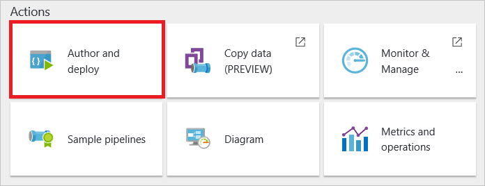
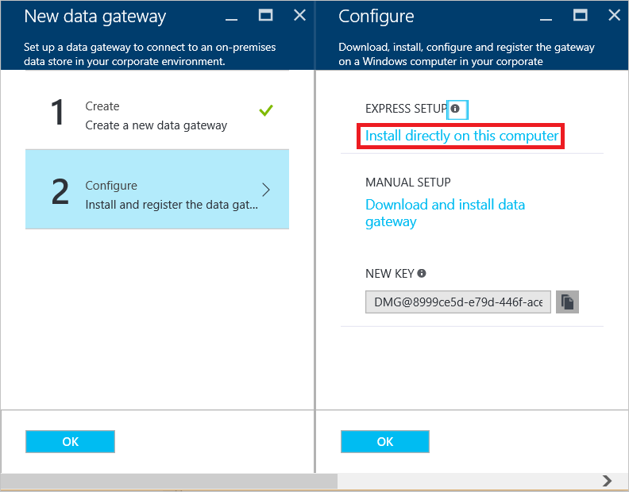
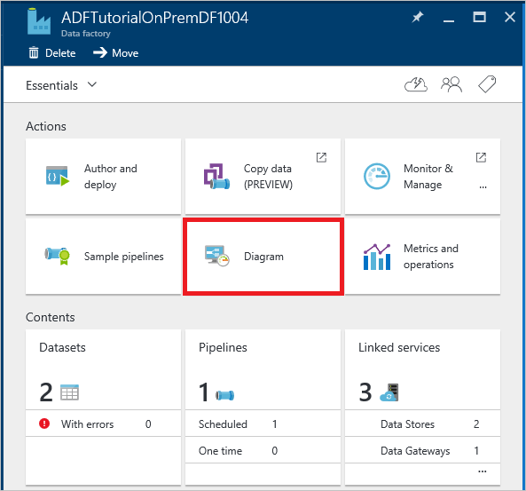

<properties 
    pageTitle="移動資料的資料管理閘道器 |Microsoft Azure"
    description="將資料閘道器設定為內部部署與雲端之間移動資料。 Azure 資料工廠中使用資料管理閘道器移動資料。" 
    keywords="資料閘道器，資料整合移動資料，閘道器的認證"
    services="data-factory" 
    documentationCenter="" 
    authors="linda33wj" 
    manager="jhubbard" 
    editor="monicar"/>

<tags 
    ms.service="data-factory" 
    ms.workload="data-services" 
    ms.tgt_pltfrm="na" 
    ms.devlang="na" 
    ms.topic="article" 
    ms.date="10/18/2016" 
    ms.author="jingwang"/>

# 資料管理閘道器內部部署與雲端之間移動資料
本文提供資料整合內部部署資料存放區與使用資料工廠雲端的資料存放區的概觀。 根據[資料移動活動](data-factory-data-movement-activities.md)文件及其他資料工廠核心概念文章︰[資料集](data-factory-create-datasets.md)和[管線](data-factory-create-pipelines.md)。 

## 資料管理閘道器
若要啟用移動資料從內部部署資料存放區內部部署電腦上，您必須安裝資料管理閘道器。 閘道器可以安裝在同一台機器資料存放區上，或在不同的電腦上，只要閘道器可以連線至資料存放區。 

> [AZURE.IMPORTANT] 請參閱[資料管理閘道器](data-factory-data-management-gateway.md)的文件的資料管理閘道器的詳細資料。   

下列逐步解說示範如何建立資料工廠管線將資料從內部部署的**SQL Server**資料庫移至 Azure blob 儲存體。 逐步解說的一部分，您可以安裝並設定您的電腦上的資料管理閘道器。 

## 逐步解說︰ 複製到雲端的內部部署資料
  
## 建立資料工廠
在此步驟中，您可以使用 [Azure 入口網站建立名為**ADFTutorialOnPremDF**Azure 資料工廠執行個體。 

1.  [Azure 入口網站](https://portal.azure.com)登入。 
2.  按一下 [ **+] 新增**、 按一下**智慧 + 分析**，然後按一下**資料工廠**。

    ![新增 DataFactory]->   
2. 在**新的資料工廠**刀中，輸入**ADFTutorialOnPremDF**名稱。

    

    > [AZURE.IMPORTANT] 
    > Azure 資料 factory 名稱必須是全域唯一的。 如果您收到錯誤訊息︰**資料工廠名稱 「 ADFTutorialOnPremDF 」 會無法使用**，變更資料工廠 (例如，yournameADFTutorialOnPremDF) 的名稱，然後再次嘗試建立。 使用此名稱取代 ADFTutorialOnPremDF 執行在本教學課程的其餘的步驟。
    > 
    > 可能在未來，因此就會公開顯示的**DNS**名稱登錄資料 factory 的名稱。
3. 選取您要建立的資料工廠**Azure 訂閱**]。 
4.  選取現有的**資源群組**或建立資源群組。 教學課程中，建立 [資源群組名稱︰ **ADFTutorialResourceGroup**。 
5.  按一下 [**新資料工廠**刀上的 [**建立**]。

    > [AZURE.IMPORTANT] 若要建立資料工廠執行個體，您必須是訂閱/資源群組層級的[資料工廠參與者](../active-directory/role-based-access-built-in-roles.md/#data-factory-contributor)角色的成員。 
11. 建立完成後，您會看到**資料工廠**刀下圖所示︰

    

## 建立閘道器
5. 在 [**資料工廠**刀中，按一下 [**撰寫及部署**啟動資料工廠的**編輯器**] 磚。

     
6.  在 [資料工廠編輯器] 中，按一下 [ **...更多**的工具列上，然後按一下 [**新資料閘道器**。 或者，您可以在樹狀檢視中，以**資料閘道器**滑鼠右鍵按一下，然後按一下 [**新資料閘道器**。 

    
2. 在**建立**刀中，輸入**adftutorialgateway** **名稱**]，然後按一下**[確定]**。    

    
3. 在**設定**刀中，按一下 [**直接在這台電腦上安裝**。 此動作閘道器安裝套件的下載、 安裝、 設定和註冊閘道器電腦上。  

    > [AZURE.NOTE] 
    > 使用 Internet Explorer 或 Microsoft ClickOnce 相容的網頁瀏覽器。
    > 
    > 如果您使用 Chrome，請移至[Chrome web store](https://chrome.google.com/webstore/)，搜尋 「 ClickOnce 」 關鍵字，選擇其中一個 [ClickOnce 副檔名]，並將其安裝。 
    >  
    > 若是 Firefox （安裝增益集） 執行相同的結果。 按一下 [**開啟功能表]**工具列上的按鈕 （在右上角的**三個水平**）、 按一下 [**附加元件**、 搜尋關鍵字 「 ClickOnce 」 相關、 選擇其中一個 ClickOnce 延伸模組，並將其安裝。    

    

    此方法是簡單的方法 （按一下） 下載、 安裝、 設定和註冊閘道器，以一個單一步驟。 您可以看到您電腦上已安裝**Microsoft 資料管理閘道器組態管理員**應用程式。 您也可以在資料夾中找到可執行**ConfigManager.exe** : **C:\Program Files\Microsoft 資料管理 Gateway\2.0\Shared**。

    您可以也下載及安裝閘道器以手動方式在此刀中使用的連結及註冊使用**新的索引鍵**的 [文字] 方塊中顯示的金鑰。
    
    請參閱[資料管理閘道器](data-factory-data-management-gateway.md)的文件的閘道器的所有細節。

    >[AZURE.NOTE] 您必須是本機電腦上安裝和設定資料管理閘道成功的系統管理員。 您可以新增其他使用者到**資料管理閘道器使用者**本機 Windows 群組。 此群組的成員可以使用 [資料管理閘道器組態管理員] 工具來設定閘道器。 

5. 等待幾分鐘的或等候，直到您看到下列通知訊息︰

     
6. 啟動您的電腦上的**資料管理閘道器組態管理員**應用程式。 在 [**搜尋**] 視窗中，輸入**資料管理閘道器**存取此公用程式。 您也可以在資料夾中找到可執行**ConfigManager.exe** : **C:\Program Files\Microsoft 資料管理 Gateway\2.0\Shared** 

    
6. 確認您看到`adftutorialgateway is connected to the cloud service`訊息。 底部的狀態列會顯示**已連線至雲端服務**，以及一個**綠色核取記號**。

    在 [**常用**] 索引標籤上，您也可以執行下列作業︰ 
    - **註冊**閘道器金鑰從 Azure 入口網站以使用 [註冊] 按鈕。 
    - **停止**資料管理閘道器主機服務閘道器電腦上執行。 
    - 安裝在特定時間每日**排程更新**。 
    - 檢視閘道器的時間**上次更新日期**。
    - 指定用以安裝的更新閘道器的時間。 

8. 切換至 [**設定**] 索引標籤。 [**憑證**] 區段中指定的憑證用於加密/解密您指定入口網站上的內部部署資料來源的認證。 （選用）按一下 [**變更**，請改為使用您自己的憑證。 根據預設，閘道器會使用自動產生的資料工廠服務的憑證。

    

    您也可以執行下列動作，在 [**設定**] 索引標籤上︰ 
    - 檢視或匯出所用的閘道器的憑證。
    - 變更使用的閘道器的 HTTPS 結束點。    
    - 設定的閘道器會使用 HTTP proxy]。   
9. （選用）切換至 [**診斷**] 索引標籤，如果您想要啟用可用來疑難排解閘道器的任何問題的詳細資訊記錄，請核取 [**啟用詳細資訊記錄**] 選項。 [**應用程式及服務記錄檔**的**事件檢視器**中找的記錄資訊 -> **資料管理閘道器**節點。 

    ![診斷] 索引標籤](./media/data-factory-move-data-between-onprem-and-cloud/diagnostics-tab.png)

    您也可以在 [**診斷**] 索引標籤中，執行下列動作︰ 
    
    - 使用內部部署資料來源使用閘道器的**測試連線]**區段。
    - 按一下 [**檢視記錄檔**以查看 [事件檢視器] 視窗中的資料管理閘道器登入]。 
    - 按一下 [**傳送記錄檔**上傳至 Microsoft，以協助您問題的疑難排解的 zip 檔案具有過去七天的記錄。 
10. **診斷**] 索引標籤的 [**測試連接**] 區段中，選取**SqlServer**類型的資料存放區，輸入資料庫伺服器的資料庫名稱的名稱、 指定驗證類型、 輸入使用者名稱和密碼，然後按一下**測試**，測試是否閘道器可以連線至資料庫。 
11. 切換至的網頁瀏覽器中，然後在**Azure 入口網站**中，**設定**刀，然後在**新的資料閘道**刀上，按一下**[確定]** 。
6. 您應該會看到**adftutorialgateway** **資料閘道器**在左側的樹狀檢視中。  如果您按一下它，您應該會看到相關聯的 JSON。 
    

## 建立連結的服務 
您可以在此步驟中，建立兩個連結的服務︰ **AzureStorageLinkedService**和**SqlServerLinkedService**。 **SqlServerLinkedService**連結資料 factory 內部部署的 SQL Server 資料庫和 Azure blob 儲存**AzureStorageLinkedService**連結的服務連結。 您可以建立的管線更新版本中將資料從內部部署的 SQL Server 資料庫 Azure blob 儲存到此逐步解說。 

#### 新增連結的服務至內部部署的 SQL Server 資料庫
1.  在**資料工廠編輯器**中，按一下工具列上的 [**新的資料存放區**，然後選取 [ **SQL Server**。 

     
3.  在**JSON 編輯器**右側，請執行下列步驟︰ 
    1. **GatewayName**中，指定**adftutorialgateway**。 
    2. 在 [**連接字串**，請執行下列步驟︰ 
        1. **伺服器名稱**，輸入主控 SQL Server 資料庫伺服器的名稱。
        2. **資料庫名稱**，輸入資料庫的名稱。
        3. 按一下工具列] 上的 [**加密**] 按鈕。 此下載並啟動 [認證管理員] 應用程式。
        
            
        5. 在 [**設定認證**] 對話方塊中，指定驗證類型、 使用者名稱和密碼，然後按一下**[確定]**。 如果是成功的連線，加密的認證儲存於 JSON，然後關閉對話方塊。 
        6. 關閉 [啟動] 對話方塊中，如果它不會自動關閉空白的瀏覽器索引標籤，並返回 Azure 入口網站的索引標籤。 
  
            閘道器在電腦上，這些認證是**加密**使用資料工廠服務擁有的憑證。 如果您想要使用的是與資料管理閘道器相關聯的憑證，請參閱[安全地設定認證](#set-credentials-and-security)。    
    1.  按一下 [部署連結 SQL Server 服務的命令列上的 [**部署**]。 您應該會看到樹狀檢視中的連結的服務。 
        
          

#### 新增連結的服務，用於 Azure 儲存體帳戶
 
1. 在**資料工廠編輯器**中，按一下**新的資料存放區**上的命令列然後按一下**Azure 儲存空間**。
2. **帳戶名稱**，請輸入您的 Azure 儲存體帳戶名稱。
3. 輸入 Azure 儲存體帳戶金鑰**帳戶金鑰]**。
4. 按一下 [部署**AzureStorageLinkedService****部署**]。
   
 
## 建立資料集
在此步驟中，建立輸入與輸出資料集代表複製作業的輸入與輸出資料 (內部部署的 SQL Server 資料庫 = > Azure blob 儲存體)。 建立之前資料集，請執行下列步驟 （詳細的步驟追蹤清單）︰

- 建立一個名為您新增為連結的服務資料 factory SQL Server 資料庫中**列出 emp**資料表及插入數個範例到資料表中的項目。
- 建立名為您新增為連結的服務資料 factory Azure blob 儲存體帳戶中**adftutorial** blob 容器。

### 內部部署的 SQL Server 準備教學課程

1. 在您指定的內部部署的 SQL Server 資料庫中連結的服務 (**SqlServerLinkedService**)，會使用下列 SQL 指令碼資料庫中建立**emp**資料表。

        CREATE TABLE dbo.emp
        (
            ID int IDENTITY(1,1) NOT NULL, 
            FirstName varchar(50),
            LastName varchar(50),
            CONSTRAINT PK_emp PRIMARY KEY (ID)
        )
        GO 
2. 插入表格中的一些範例︰ 

        INSERT INTO emp VALUES ('John', 'Doe')
        INSERT INTO emp VALUES ('Jane', 'Doe')

### 建立輸入資料集

1. 在**資料工廠編輯器**中，按一下 [ **...更多**命令列上，按一下 [**新的資料集**，按一下 [ **SQL Server 資料表**。 
2.  在右窗格中的 JSON 取代下列文字︰
        
            {       
                "name": "EmpOnPremSQLTable",
                "properties": {
                    "type": "SqlServerTable",
                    "linkedServiceName": "SqlServerLinkedService",
                    "typeProperties": {
                        "tableName": "emp"
                    },
                    "external": true,
                    "availability": {
                        "frequency": "Hour",
                        "interval": 1
                    },
                    "policy": {
                        "externalData": {
                            "retryInterval": "00:01:00",
                            "retryTimeout": "00:10:00",
                            "maximumRetry": 3
                        }
                    }
                }
            }    

    請注意下列重點︰ 

    - **類型**] 設定為**SqlServerTable**。
    - **表格名稱**會設定為**emp**。
    - **linkedServiceName**會設定為**SqlServerLinkedService** （您有此逐步解說中建立此連結的服務）。。
    - 輸入資料集的不由另一個管線 Azure 資料工廠產生，您必須設定**外部**為**true**。 它表示輸入的資料產生外部 Azure 資料工廠服務。 您可以選擇指定**原則**] 區段中使用**externalData**項目任何外部資料原則。    

    如需 JSON 屬性的詳細資訊，請參閱[將資料從 SQL Server](data-factory-sqlserver-connector.md) 。
2. 按一下 [部署資料集的命令列上的 [**部署**]。  

### 建立輸出資料集

1.  在**資料工廠編輯器**中，按一下**新的資料集**] 命令列上，然後按一下**Azure Blob 儲存體**。
2.  在右窗格中的 JSON 取代下列文字︰ 

            {
                "name": "OutputBlobTable",
                "properties": {
                    "type": "AzureBlob",
                    "linkedServiceName": "AzureStorageLinkedService",
                    "typeProperties": {
                        "folderPath": "adftutorial/outfromonpremdf",
                        "format": {
                            "type": "TextFormat",
                            "columnDelimiter": ","
                        }
                    },
                    "availability": {
                        "frequency": "Hour",
                        "interval": 1
                    }
                }
            }
  
    請注意下列重點︰ 
    
    - **類型**] 設定為**AzureBlob**。
    - **linkedServiceName**會設定為**AzureStorageLinkedService** （在步驟 2 中已建立此連結的服務）。
    - **folderPath**會設定為**adftutorial/outfromonpremdf** outfromonpremdf adftutorial 容器中的資料夾] 位於何處。 如果不存在，請建立**adftutorial**容器。 
    - **顯示狀態**設定為 [**每小時**（**頻率**設為**小時**和**間隔**設為**1**）。  資料工廠服務會產生輸出資料扇形區每小時**emp**資料表中 Azure SQL 資料庫。 

    如果您沒有指定**輸出資料表中**的**檔案名稱**，在**folderPath**產生的檔案具名以下列格式︰ 資料。<Guid>.txt (例如:: Data.0a405f8a-93ff-4c6f-b3be-f69616f1df7a.txt。)。

    若要設定**folderPath**和**檔名**動態根據**SliceStart**的時間，請使用 partitionedBy 屬性。 在下列範例中，folderPath 使用年、 月和日從 SliceStart （正在處理的扇形區中的開始時間），且檔名使用從 SliceStart 小時。 例如，如果所產生的扇形區 2014 年-10-20T08:00:00，設定為 [wikidatagateway wikisampledataout/2014年/10/20 資料夾名稱，並 08.csv 調檔名。 

        "folderPath": "wikidatagateway/wikisampledataout/{Year}/{Month}/{Day}",
        "fileName": "{Hour}.csv",
        "partitionedBy": 
        [
            { "name": "Year", "value": { "type": "DateTime", "date": "SliceStart", "format": "yyyy" } },
            { "name": "Month", "value": { "type": "DateTime", "date": "SliceStart", "format": "MM" } }, 
            { "name": "Day", "value": { "type": "DateTime", "date": "SliceStart", "format": "dd" } }, 
            { "name": "Hour", "value": { "type": "DateTime", "date": "SliceStart", "format": "hh" } } 
        ],

 
    如需 JSON 屬性的詳細資訊，請參閱[將資料從 Azure Blob 儲存體](data-factory-azure-blob-connector.md)。
2.  按一下 [部署資料集的命令列上的 [**部署**]。 確認 [請參閱在樹狀檢視中的兩個資料集]。  

## 建立管線
在此步驟中，您必須建立**管線**含使用**EmpOnPremSQLTable**做為輸入的一個**複製活動**和**OutputBlobTable**作為輸出。

1.  在 [資料工廠編輯器] 中，按一下 [ **...更多**，按一下 [**新的管線**。 
2.  在右窗格中的 JSON 取代下列文字︰ 
    
            {
                "name": "ADFTutorialPipelineOnPrem",
                "properties": {
                "description": "This pipeline has one Copy activity that copies data from an on-prem SQL to Azure blob",
                "activities": [
                {
                    "name": "CopyFromSQLtoBlob",
                    "description": "Copy data from on-prem SQL server to blob",
                    "type": "Copy",
                    "inputs": [
                    {
                        "name": "EmpOnPremSQLTable"
                    }
                    ],
                    "outputs": [
                    {
                        "name": "OutputBlobTable"
                      }
                    ],
                    "typeProperties": {
                      "source": {
                        "type": "SqlSource",
                        "sqlReaderQuery": "select * from emp"
                      },
                      "sink": {
                        "type": "BlobSink"
                      }
                    },
                    "Policy": {
                      "concurrency": 1,
                      "executionPriorityOrder": "NewestFirst",
                      "style": "StartOfInterval",
                      "retry": 0,
                      "timeout": "01:00:00"
                    }
                  }
                ],
                "start": "2016-07-05T00:00:00Z",
                "end": "2016-07-06T00:00:00Z",
                "isPaused": false
              }
            }

    > [AZURE.IMPORTANT]
    > [**開始**] 屬性的值取代目前的日期和**結束**值與 [下一天。

    請注意下列重點︰
 
    - 在 [活動] 區段中，有其**類型**設定為 [**複本**的活動。
    - **輸入**活動設定為 [ **EmpOnPremSQLTable**和活動的**輸出**設為**OutputBlobTable**。
    - **TypeProperties** ] 區段中**SqlSource**指定做為**來源類型**和**BlobSink ****接收類型**。
    - SQL 查詢`select * from emp` **SqlSource** **sqlReaderQuery**屬性會指定。

     同時開始和結束日期時間必須是[ISO 格式](http://en.wikipedia.org/wiki/ISO_8601)。 例如︰ 2014年-10-14T16:32:41Z。 **結束**時間是選擇性的但我們在本教學課程中使用。 
    
    如果您未指定的 [**結束**] 屬性的值，它會計算為 「**開始 + 48 小時**」。 若要執行的管線，指定**9/9/9999**做為 [**結束**] 屬性的值。 
    
    定義的資料扇形區的處理依據**可用性**屬性所定義的每個 Azure 資料工廠資料集的持續時間。
    
    在範例中，有 24 資料扇形區每個資料扇形區不會產生每小時。     
2. 按一下 [部署資料集的命令列上的 [**部署**（資料表是矩形資料集）。 確認管線顯示**管線**節點] 下的樹狀檢視中。  
5. 現在，請按一下 [ **X** ，關閉 [若要返回**資料工廠**刀的**ADFTutorialOnPremDF**刀]。

**恭喜您 ！** 您已成功建立 Azure 資料工廠、 連結的服務、 資料集，以及管線並排程管道的郵件。

#### 在圖表檢視中檢視資料工廠 
1. 在**Azure 入口網站**中，按一下**ADFTutorialOnPremDF**資料工廠首頁上的 [**圖表**] 磚。 :

    

2. 您應該會看到類似下列圖像圖表︰

    

    您可以放大、 縮小、 縮放為 100%，縮放以符合、 自動將管線和資料集，以及顯示歷程資訊 （醒目提示選取的項目上游和下游項目）。  您可以按兩下物件 （輸入輸出資料集或管線），請參閱屬性。 

## 監視器管線
在此步驟中，您可以使用 Azure 入口網站監控 Azure 資料工廠運作。 您也可以使用 PowerShell cmdlet 來監視資料集和管線。 如需關於監控的詳細資訊，請參閱[監控和管理的管線](data-factory-monitor-manage-pipelines.md)。

5. 在圖表中，按兩下**EmpOnPremSQLTable**。  

    

6. 注意到所有資料切割設定已**準備好**的狀態，因為管線工期 （結束時間的開始時間） 是在過去。 這也是因為您已插入 SQL Server 資料庫中的資料，並有任何時間。 請確認沒有扇形區顯示底部的 [**問題扇形區**] 區段中。 若要檢視所有扇形區，按一下 [**查看更多**的扇形區清單的底部。 
7. 現在，在**資料集**刀中，按一下 [ **OutputBlobTable**。

    
9. 按一下 [從清單中的任何資料扇形區，您應該會看到**資料扇形區**刀。 您會看到的扇形區可執行的活動。 您看到執行通常只有一個活動。  

    

    如果扇形區不在**準備好**的狀態，您可以看到的不是好會封鎖執行**的是尚未準備上游扇形區**清單中的目前扇形區上游扇形區。

10. 按一下 [**執行的活動**從清單底部，看看**活動執行詳細資料**]。

    

    您會看到例如處理量、 工期及閘道器用來將資料傳送的資訊。 
11. 按一下 [ **X** ]，直到您關閉所有刀 
12. 取得回至常用刀**ADFTutorialOnPremDF**。
14. （選用）按一下 [**管線** **ADFTutorialOnPremDF**，，然後按一下鑽研輸入的資料表 (**Consumed**) 或輸出資料集 (**Produced**)。
15. 使用工具，例如使用工具，例如[Microsoft 儲存檔案總管](http://storageexplorer.com/)驗證 blob/檔案會建立的每個小時。

    

## 後續步驟

- 資料管理閘道器的所有細節，請參閱[資料管理閘道器](data-factory-data-management-gateway.md)本文。
- 請參閱[Azure sql Azure Blob 的複製資料](data-factory-copy-data-from-azure-blob-storage-to-sql-database.md)，瞭解如何使用複製活動，將資料從來源資料存放區接收資料存放區。 
