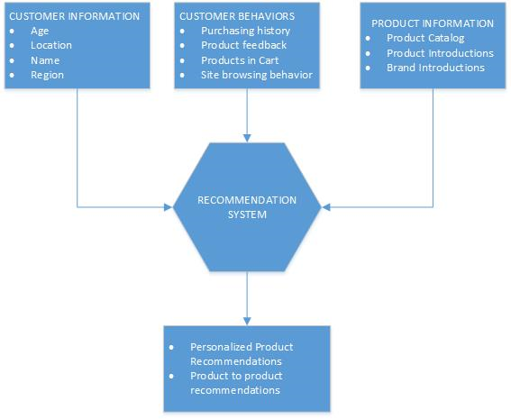

<properties 
    pageTitle="資料工廠使用案例產品建議" 
    description="深入了解以及其他服務中使用 Azure 資料工廠實作使用大小寫。" 
    services="data-factory" 
    documentationCenter="" 
    authors="sharonlo101" 
    manager="jhubbard" 
    editor="monicar"/>

<tags 
    ms.service="data-factory" 
    ms.workload="data-services" 
    ms.tgt_pltfrm="na" 
    ms.devlang="na" 
    ms.topic="article" 
    ms.date="09/01/2016" 
    ms.author="shlo"/>

# 使用案例-產品建議 

Azure 資料工廠是用來實作 Cortana 智慧的套件解決方案加速器的許多服務。  如需詳細資訊此套件，請參閱[Cortana 智慧套件](http://www.microsoft.com/cortanaanalytics)頁面。 在此文件中，我們會說明常見的使用案例 Azure 使用者已解決，實作 Azure 資料工廠和其他 Cortana 智慧元件服務使用。

## 案例

線上零售商經常想要其顧客他們提供與這些是最可能會感興趣的以及因此很可能是購買的產品購買的產品。 若要這麼做，線上零售商需要使用該特定使用者的個人化的產品建議自訂使用者的線上體驗。 可根據目前和歷史購物行為資料、 產品資訊、 新的品牌，以及產品與客戶分割資料是這些個人化的建議。  此外，他們可以提供使用者產品的建議根據整體的使用狀況行為，其結合的所有使用者從的分析。

這些零售商的目標是要最佳化以用於使用者按一下-銷售轉換及更高的收益。  他們達到這個轉換發表內容行為產品建議根據客戶的興趣和動作。 此使用案例中，我們使用線上零售商為要最佳化以用於客戶的企業的範例。 不過，這些原則適用於任何想要加入周圍其產品與服務客戶增強他們的客戶購買經驗的個人化的產品建議的企業。

## 挑戰

有許多挑戰的線上零售商美元嘗試實作此類型的使用案例。 

首先，必須 ingested 資料的不同的大小和形狀多個資料來源，兩個內部部署和雲端中。 此資料包含產品資料、 歷史客戶行為資料，以及使用者資料，為使用者瀏覽線上零售網站。 

第二個個人化產品建議必須合理而正確地計算並預測。 產品、 品牌和客戶的行為和瀏覽器的資料，除了線上零售商也必須包含要納入判定的最佳產品建議使用者過去購買客戶意見反應。 

第三，建議必須立即交付使用者提供順暢瀏覽及購買的體驗，並提供最新且相關的建議。 

最後，零售商需要測量的方式來追蹤整體向上銷售交叉銷售按一下-轉換銷售成功，並調整其未來的建議。

## 解決方案概觀

此範例使用案例具有已解決，實作的實際 Azure 使用者使用 Azure 資料工廠和其他 Cortana 智慧元件服務，包括[HDInsight](https://azure.microsoft.com/services/hdinsight/)和[Power BI](https://powerbi.microsoft.com/)。

線上零售商使用 Azure Blob 儲存、 內部部署的 SQL server、 Azure SQL 資料庫和關聯式資料超市為整個工作流程其資料儲存選項。  Blob 儲存包含客戶資訊、 客戶行為資料，以及產品資訊的資料。 產品資訊的資料包含產品品牌資訊和產品類別目錄儲存於內部部署的 SQL 資料倉庫。 

所有的資料結合，而送入產品建議系統進行個人化的建議時使用者瀏覽目錄] 網站上的產品，根據客戶的興趣和動作。 客戶，請參閱它們位於的產品相關的產品根據任何一位使用者與不相關的整體網站使用模式。

Gb 的原始 web 記錄檔會產生每天從線上的零售商網站為半結構化的檔案。 原始的 web 記錄檔和客戶及產品目錄的資訊會定期 ingested 到以服務中使用資料工廠全域部署的資料移動 Azure Blob 儲存體。 一天的原始的記錄檔是長期存放 blob 儲存體中的分割 （依 year 和 month）。  [Azure HDInsight](https://azure.microsoft.com/services/hdinsight/)用來分割 blob 存放區中的原始記錄檔案和 ingested 的記錄在使用登錄區] 與 [豬指令碼處理程序。 分割的 web 記錄資料擷取電腦，學習建議系統產生的個人化的產品建議的視需要的輸入，然後再處理。

開啟來源電腦，學習[Apache Mahout](http://mahout.apache.org/)從建議平台機器學習在此範例中使用建議系統。  任何[Azure 電腦學習](https://azure.microsoft.com/services/machine-learning/)或自訂的模型，都可以套用到此案例。  Mahout 模型用來預測根據整體的使用狀況模式，網站上的項目之間的相似處，並產生根據個別使用者的個人化的建議。

最後，結果集中的個人化的產品建議移到關聯式資料超市耗用的零售商網站。  結果集無法也會直接從 blob 儲存體存取另一個應用程式，或移到其他儲存的其他消費者與使用情況。

## 優點

最佳化其產品建議策略，並將其對齊與商務目標，方案符合線上的零售商商品和行銷目標。 此外，結果 operationalize 和有效、 可靠且成本有效的方式管理產品建議工作流程。 方法無比更新它們的模型，以及微調根據的量值的銷售按一下-轉換成功其效果。 藉由使用 Azure 資料工廠，結果能夠放棄其耗時而昂貴手動雲端資源管理，並且移到視雲端資源管理。 因此，結果仍可節省時間，金錢和解決方案部署減少其時間。 資料歷程檢視和操作的服務健康狀況成為容易以視覺化方式呈現及直覺化的資料工廠監控和管理 UI Azure 入口網站提供疑難排解。 其解決方案可以立即排程與管理，好讓可靠產生並傳送給使用者，已完成的資料和資料和處理相依性自動管理不會出現人力互動。

提供此個人化的購物體驗，線上零售商建立更、 吸引人的客戶體驗，因此增加銷售與整體客戶滿意度。

  