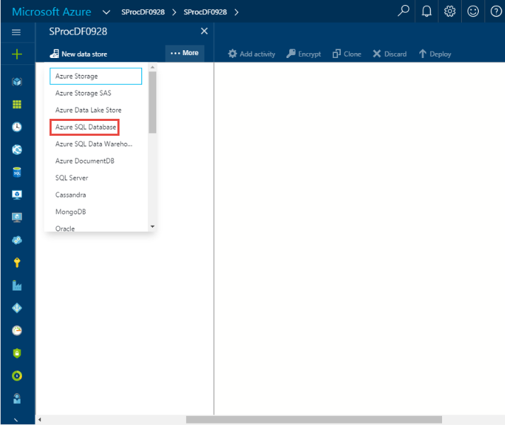
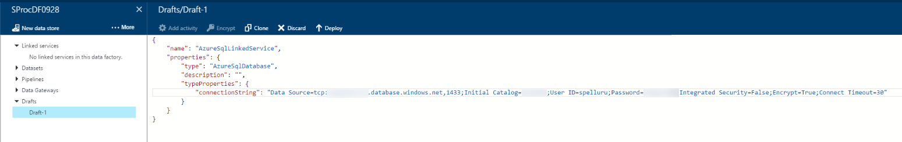

<properties 
    pageTitle="SQL Server 預存程序活動" 
    description="瞭解如何使用 SQL Server 預存程序活動叫用 Azure SQL 資料庫或 Azure SQL Data Warehouse 中的從資料工廠管線預存程序。" 
    services="data-factory" 
    documentationCenter="" 
    authors="spelluru" 
    manager="jhubbard" 
    editor="monicar"/>

<tags 
    ms.service="data-factory" 
    ms.workload="data-services" 
    ms.tgt_pltfrm="na" 
    ms.devlang="na" 
    ms.topic="article" 
    ms.date="09/30/2016" 
    ms.author="spelluru"/>

# SQL Server 預存程序活動
> [AZURE.SELECTOR]
[登錄區](data-factory-hive-activity.md)  
[豬](data-factory-pig-activity.md)  
[MapReduce](data-factory-map-reduce.md)  
[Hadoop 串流](data-factory-hadoop-streaming-activity.md)
[電腦學習](data-factory-azure-ml-batch-execution-activity.md) 
[預存程序](data-factory-stored-proc-activity.md)
[資料湖分析 U SQL](data-factory-usql-activity.md)
[.NET 自訂](data-factory-use-custom-activities.md)

您可以使用資料工廠[管道的郵件](data-factory-create-pipelines.md)中的 SQL Server 預存程序活動叫用其中下列資料存放區中的預存程序︰ 

- Azure SQL 資料庫 
- Azure SQL Data Warehouse  
- 在您的企業或 Azure VM 的 SQL Server 資料庫。 您需要安裝資料管理閘道器，裝載資料庫的同一部電腦上或在不同的電腦，避免佔用與資料庫的資源。 資料管理閘道是有連線軟體內部部署資料來源/資料來源，將其以安全和受管理的方式受到影響中 Azure Vm 至雲端服務。 請參閱[移動內部部署與雲端之間的資料](data-factory-move-data-between-onprem-and-cloud.md)文件的詳細資料管理閘道器。 

本文是根據提供一般的概觀資料轉換及支援的轉換活動的[資料轉換活動](data-factory-data-transformation-activities.md)文件。

## 逐步解說

### 範例表格及預存程序
1. 使用 SQL Server Management Studio 或任何其他您熟悉的工具 Azure SQL 資料庫中建立下列**表格**。 Datetimestamp 欄是日期和時間時產生的相對應的識別碼。 

        CREATE TABLE dbo.sampletable
        (
            Id uniqueidentifier,
            datetimestamp nvarchar(127)
        )
        GO

        CREATE CLUSTERED INDEX ClusteredID ON dbo.sampletable(Id);
        GO

    Id 是唯一識別和 datetimestamp 資料行是日期和時間時產生的相對應的識別碼。
    

    > [AZURE.NOTE] 此範例使用 Azure SQL 資料庫，但是 Azure SQL Data Warehouse 和 SQL Server 資料庫運作的方式相同。 
2. 建立下列**預存程序**插入至**sampletable**中的資料。

        CREATE PROCEDURE sp_sample @DateTime nvarchar(127)
        AS
        
        BEGIN
            INSERT INTO [sampletable]
            VALUES (newid(), @DateTime)
        END

    > [AZURE.IMPORTANT] **名稱**] 和 [**大小寫**的參數 （在此範例中的日期時間） 必須符合的管線/活動 JSON 中指定參數。 在 [預存程序定義，確定**@**參數作為前置字元。
    
### 建立資料工廠  
4. [Azure](https://portal.azure.com/)入口網站登入。 
5. 按一下 [**新增**]，請在左功能表上按一下**智慧 + 分析**]，按一下 [**資料工廠**。
    
       
4.  在**新的資料工廠**刀中，輸入**SProcDF**名稱。 Azure 資料工廠名稱是**全域唯一**的。 您要加上字首的資料 factory 名稱與您的名稱，以啟用工廠的成功建立。

          
3.  選取您**Azure 訂閱**]。 
4.  [**資源] 群組**中，請執行下列步驟︰ 
    1.  按一下 [**建立新**，然後輸入 [資源] 群組的名稱。
    2.  按一下 [**使用現有的**然後選取現有的資源群組。  
5.  選取資料工廠的**位置**。
6.  讓您可以看到資料 factory 儀表板上下次您再登入，請選取 [**固定至儀表板**]。 
6.  按一下 [**新資料工廠**刀上的 [**建立**]。
6.  您會看到在**儀表板**的 Azure 入口網站中建立資料工廠。 資料 factory 成功建立之後，您會看到資料工廠頁面上，顯示您的資料 factory 內容。
    

### 建立連結的 Azure SQL 服務  
建立資料 factory 之後, 您要建立連結的資料工廠 Azure SQL 資料庫連結 Azure SQL 服務。 此資料庫包含 sampletable 資料表和 sp_sample 預存程序。

7.  按一下 [**撰寫及部署** **SProcDF**以啟動 [資料工廠編輯器] 中的**資料工廠**刀上。
2.  按一下 [命令列中的 [**新的資料存放區**，並選擇**Azure SQL 資料庫**。 您應該會看到編輯器] 中建立連結的 Azure SQL 服務的 JSON 指令碼。 

    
4. 在 [JSON 指令碼進行下列變更︰ 
    1. 取代**&lt;伺服器名稱&gt;**Azure SQL 資料庫伺服器的名稱。
    2. 取代**&lt;資料庫&gt;**與資料庫建立資料表和預存程序。
    3. 取代**&lt;username@servername**有資料庫的存取權的使用者帳戶。
    4. 取代**&lt;密碼&gt;**與使用者帳戶的密碼。 

    
5. 按一下 [部署連結的服務的命令列上的 [**部署**]。 確認您看到 AzureSqlLinkedService 左側的樹狀檢視中。 

    

### 建立輸出資料集
6. 按一下 [ **...更多**的工具列上，按一下 [**新的資料集**，然後按一下**Azure SQL**]。 **新的資料集**的命令列，然後選取**Azure SQL**。

    
7. 複製/貼上下列 JSON 中的指令碼至 JSON 編輯器。

        {               
            "name": "sprocsampleout",
            "properties": {
                "type": "AzureSqlTable",
                "linkedServiceName": "AzureSqlLinkedService",
                "typeProperties": {
                    "tableName": "sampletable"
                },
                "availability": {
                    "frequency": "Hour",
                    "interval": 1
                }
            }
        }
7. 按一下 [部署資料集的命令列上的 [**部署**]。 確認您看到的樹狀檢視中的資料集。 

    

### 建立管線與 SqlServerStoredProcedure 活動
現在讓我們來建立含 SqlServerStoredProcedure 活動的管線。
 
9. 按一下 [ **...更多**] 的命令列，然後按一下 [**新的管線**。 
9. 複製/貼上下列的 JSON 程式碼片段。 設定為 [ **sp_sample** **storedProcedureName** 。 名稱] 和 [大小寫的參數**DateTime**必須符合 [名稱] 和 [預存程序定義中參數的大小寫。  

        {
            "name": "SprocActivitySamplePipeline",
            "properties": {
                "activities": [
                    {
                        "type": "SqlServerStoredProcedure",
                        "typeProperties": {
                            "storedProcedureName": "sp_sample",
                            "storedProcedureParameters": {
                                "DateTime": "$$Text.Format('{0:yyyy-MM-dd HH:mm:ss}', SliceStart)"
                            }
                        },
                        "outputs": [
                            {
                                "name": "sprocsampleout"
                            }
                        ],
                        "scheduler": {
                            "frequency": "Hour",
                            "interval": 1
                        },
                        "name": "SprocActivitySample"
                    }
                ],
                "start": "2016-08-02T00:00:00Z",
                "end": "2016-08-02T05:00:00Z",
                "isPaused": false
            }
        }

    如果您需要傳遞的參數 null，使用此語法︰ 參數 「 1 」: null （全部小寫）。 
9. 按一下 [部署管線] 工具列上的 [**部署**]。  

### 監控管線

6. 按一下**X**關閉資料工廠編輯器刀，並回到資料工廠刀中，瀏覽]，然後按一下 [**圖表**]。

    
7. 在**圖表檢視**中，您會看到管線和在本教學課程中使用的資料集的概觀。 

    
8. 在 [圖表] 檢視中，按兩下 [資料集**sprocsampleout**。 您會看到準備狀態的扇形區。 因為扇形區不會產生之間的開始時間和結束時間 JSON 每小時時，則應該是五個扇形區。

     
10. **準備好**狀態扇形區後，請執行 [ *sampletable 從 [*選取*** 對 Azure SQL 資料庫，以確認的資料已插入表格預存程序的查詢。

    

    監控 Azure 資料工廠管線的詳細資訊，請參閱[監視器管道的郵件](data-factory-monitor-manage-pipelines.md)。  

> [AZURE.NOTE] 在此範例中，SprocActivitySample 會有未輸入。 如果您想要鍊此活動的活動，上游 （也就是先前處理）、 上游活動的輸出可做為輸入此活動。 在這種情況下，此活動不會執行，直到上游活動完成且上游活動的輸出 （在準備好狀態]）。 輸入不能直接作為預存程序活動的參數

## JSON 格式
    {
        "name": "SQLSPROCActivity",
        "description": "description", 
        "type": "SqlServerStoredProcedure",
        "inputs":  [ { "name": "inputtable"  } ],
        "outputs":  [ { "name": "outputtable" } ],
        "typeProperties":
        {
            "storedProcedureName": "<name of the stored procedure>",
            "storedProcedureParameters":  
            {
                "param1": "param1Value"
                …
            }
        }
    }

## JSON 屬性

屬性 | 描述 | 所需
-------- | ----------- | --------
名稱 | 活動名稱 | [是]
描述 | 描述 [活動用途的文字 | 無
類型 | SqlServerStoredProcedure | [是]
輸入 | 選用。 如果您指定輸入資料集，它必須提供 （'好' 狀態]） 來執行預存程序活動。 輸入資料集無法使用預存程序，做為參數。 它只會用來啟動預存程序活動之前，請先檢查相依性。 | 無
輸出 | 您必須指定預存程序活動輸出資料集。 輸出資料集 （每小時、 週、 每月、 等），指定**排程**的預存程序活動。   輸出資料集必須使用 Azure SQL 資料庫或 Azure SQL Data Warehouse 或您想要執行的預存程序的 SQL Server 資料庫是指在**連結的服務**。   輸出資料集可以做為傳遞的預存程序結果後續處理管道另一個活動 （[鏈結活動](data-factory-scheduling-and-execution.md#chaining-activities)） 的方式。 不過，資料工廠不會自動寫入預存程序的輸出此資料集。 則寫入輸出資料集指向 SQL 資料表的預存程序。   在某些情況下，輸出資料集可以是**空的資料集**，它只會用來指定執行預存程序活動的排程。 | [是]
storedProcedureName | Azure SQL 資料庫或表示連結服務輸出資料表所使用的 Azure SQL Data Warehouse 中指定的預存程序的名稱。 | [是]
storedProcedureParameters | 指定預存程序參數的值。 如果您要傳遞的參數 null，請使用此語法︰ 參數 「 1 」: null （小寫）。 請參閱下面的範例，瞭解使用此屬性。| 無

## 將靜態值傳遞 
現在，我們來看新增另一個名為 「 案例 」 的資料行中包含稱為 「 文件範例' 靜態值的資料表。

    CREATE PROCEDURE sp_sample @DateTime nvarchar(127) , @Scenario nvarchar(127)
    
    AS
    
    BEGIN
        INSERT INTO [sampletable]
        VALUES (newid(), @DateTime, @Scenario)
    END

現在，請從 [預存程序活動傳遞案例參數和值。 上述範例中的 [typeProperties] 區段看起來像下列程式碼片段︰

    "typeProperties":
    {
        "storedProcedureName": "sp_sample",
        "storedProcedureParameters": 
        {
            "DateTime": "$$Text.Format('{0:yyyy-MM-dd HH:mm:ss}', SliceStart)",
            "Scenario": "Document sample"
        }
    }

