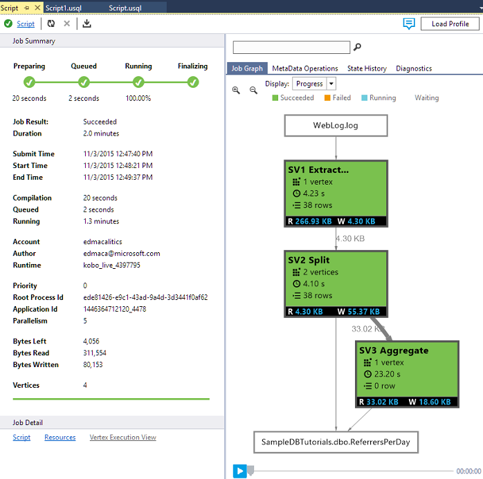

<properties
   pageTitle="分析網站記錄使用 Azure 資料湖分析 |Azure"
   description="瞭解如何分析網站使用資料湖分析的記錄。 "
   services="data-lake-analytics"
   documentationCenter=""
   authors="edmacauley"
   manager="jhubbard"
   editor="cgronlun"/>

<tags
   ms.service="data-lake-analytics"
   ms.devlang="na"
   ms.topic="article"
   ms.tgt_pltfrm="na"
   ms.workload="big-data"
   ms.date="05/16/2016"
   ms.author="edmaca"/>

# 教學課程︰ 分析網站記錄使用 Azure 資料湖狀況分析

瞭解如何分析網站使用資料湖分析，特別是在找出哪些推薦者 」 發生錯誤時，嘗試造訪網站上的記錄。

>[AZURE.NOTE] 如果您只想查看使用的應用程式，它會將儲存[使用 Azure 資料湖分析互動式教學課程](data-lake-analytics-use-interactive-tutorials.md)的完整的時間。 本教學課程為基礎的相同情況和相同的程式碼。 本教學課程中的目的是讓開發的建立和執行資料湖分析應用程式的端對端體驗。

## 先決條件︰

- **Visual Studio 2015、 Visual Studio 2013 更新 4 或使用 Visual c + + 安裝的 Visual Studio 2012**。
- **Microsoft Azure SDK.net 2.5 版或上方**。  安裝並使用[Web 平台安裝程式](http://www.microsoft.com/web/downloads/platform.aspx)。
- [**[資料湖 Tools for Visual Studio](http://aka.ms/adltoolsvs)**]。

    Visual Studio 資料湖工具安裝後，您會看到**資料湖**功能表在 Visual Studio 中︰

    

- **資料湖分析及 Visual Studio 資料湖工具的基本知識**。 若要開始，請參閱︰

    - [開始使用 Azure 資料湖分析使用 Azure 入口網站](data-lake-analytics-get-started-portal.md)。
    - [使用資料湖工具的 Visual Studio 開發的 U SQL 指令碼](data-lake-analytics-data-lake-tools-get-started.md)。

- **以資料湖分析帳戶。**  請參閱[建立 Azure 資料湖分析帳戶](data-lake-analytics-get-started-portal.md#create_adl_analytics_account)。

    資料湖工具不支援建立資料湖分析帳戶。  因此，您必須建立並使用 Azure 入口網站、 PowerShell 的 Azure、.NET SDK 或 Azure CLI。
- **上傳的範例資料，資料湖分析帳戶。** 請參閱[將 SearchLog.tsv 上傳到您的預設資料湖儲存帳戶](data-lake-analytics-get-started-portal.md#update-data-to-the-default-adl-storage-account)。

    若要執行資料湖分析工作，您需要一些資料。 即使資料湖工具支援上傳的資料，您會使用入口網站上傳輕鬆遵循此教學課程的範例資料。

## 連線至 Azure

您可以建立並測試任何 U SQL 指令碼之前，您必須先連線到 Azure。

**連線至資料湖狀況分析**

1. 開啟 Visual Studio。
2. 從 [**資料湖**] 功能表中，按一下 [**選項和設定**]。
4. 如果某人已登入，請按一下**登入**，或**變更使用者**，然後依照指示進行。
5. 按一下**[確定**] 關閉 [選項和設定] 對話方塊。

**若要瀏覽您的資料湖分析帳戶**

1. 從 Visual Studio 中，按下**CTRL + ALT + S**開啟**伺服器總管]** 。
2. 從**伺服器總管**] 中，展開**Azure**，然後再展開**資料湖分析**。 如果有的話，您應該看到您的資料湖分析帳戶清單。 您無法從 studio 建立資料湖分析帳戶。 若要建立帳戶，請參閱[開始使用 Azure 資料湖分析使用 Azure 入口網站](data-lake-analytics-get-started-portal.md)，或[使用 PowerShell 的 Azure Azure 資料湖分析快速入門](data-lake-analytics-get-started-powershell.md)。

## 開發 U SQL 應用程式

U SQL 應用程式是大多 U SQL 指令碼。 若要進一步瞭解 U SQL，請參閱[開始使用 U SQL](data-lake-analytics-u-sql-get-started.md)。

您可以新增應用程式新增使用者定義的運算子。  如需詳細資訊，請參閱[開發 U SQL 使用者定義資料湖分析工作的運算子](data-lake-analytics-u-sql-develop-user-defined-operators.md)。

**建立及提交資料湖分析工作**

1. 從 [**檔案**] 功能表中，按一下 [**新增**]，然後按一下**專案**。
2. 選取 [U SQL 專案類型]。

    

3. 按一下**[確定]**。 Visual studio 建立 Script.usql 檔案的解決方案。
4. Script.usql 檔案中，輸入下列指令碼︰

        // Create a database for easy reuse, so you don't need to read from a file every time.
        CREATE DATABASE IF NOT EXISTS SampleDBTutorials;

        // Create a Table valued function. TVF ensures that your jobs fetch data from the weblog file with the correct schema.
        DROP FUNCTION IF EXISTS SampleDBTutorials.dbo.WeblogsView;
        CREATE FUNCTION SampleDBTutorials.dbo.WeblogsView()
        RETURNS @result TABLE
        (
            s_date DateTime,
            s_time string,
            s_sitename string,
            cs_method string,
            cs_uristem string,
            cs_uriquery string,
            s_port int,
            cs_username string,
            c_ip string,
            cs_useragent string,
            cs_cookie string,
            cs_referer string,
            cs_host string,
            sc_status int,
            sc_substatus int,
            sc_win32status int,
            sc_bytes int,
            cs_bytes int,
            s_timetaken int
        )
        AS
        BEGIN

            @result = EXTRACT
                s_date DateTime,
                s_time string,
                s_sitename string,
                cs_method string,
                cs_uristem string,
                cs_uriquery string,
                s_port int,
                cs_username string,
                c_ip string,
                cs_useragent string,
                cs_cookie string,
                cs_referer string,
                cs_host string,
                sc_status int,
                sc_substatus int,
                sc_win32status int,
                sc_bytes int,
                cs_bytes int,
                s_timetaken int
            FROM @"/Samples/Data/WebLog.log"
            USING Extractors.Text(delimiter:' ');
            RETURN;
        END;

        // Create a table for storing referrers and status
        DROP TABLE IF EXISTS SampleDBTutorials.dbo.ReferrersPerDay;
        @weblog = SampleDBTutorials.dbo.WeblogsView();
        CREATE TABLE SampleDBTutorials.dbo.ReferrersPerDay
        (
            INDEX idx1
            CLUSTERED(Year ASC)
            PARTITIONED BY HASH(Year)
        ) AS

        SELECT s_date.Year AS Year,
            s_date.Month AS Month,
            s_date.Day AS Day,
            cs_referer,
            sc_status,
            COUNT(DISTINCT c_ip) AS cnt
        FROM @weblog
        GROUP BY s_date,
                cs_referer,
                sc_status;

    若要瞭解 U SQL，請參閱[開始使用資料湖分析 U SQL 語言](data-lake-analytics-u-sql-get-started.md)。    

5. 新的 U SQL 指令碼新增至專案，然後輸入下列資訊︰

        // Query the referrers that ran into errors
        @content =
            SELECT *
            FROM SampleDBTutorials.dbo.ReferrersPerDay
            WHERE sc_status >=400 AND sc_status < 500;

        OUTPUT @content
        TO @"/Samples/Outputs/UnsuccessfulResponses.log"
        USING Outputters.Tsv();

6. 切換回第一個 U SQL 指令碼和 [**送出**] 按鈕旁，指定您分析的帳戶。
7. 從**方案總管**] 中，請以滑鼠右鍵按一下**Script.usql**，，，然後按一下 [**建立指令碼**。 確認 [輸出] 窗格中的結果。
8. 從**方案總管**] 中，請以滑鼠右鍵按一下**Script.usql**，，，然後按一下 [**送出指令碼**。
9. 請確認**分析帳戶**所要執行的工作，然後按一下 [**送出**的位置。 送出的結果和工作連結時，可在 Visual Studio 視窗的 [資料湖工具中送出已完成。
10. 請等待已順利完成作業。  如果工作失敗，很可能會遺失來源檔案。  請參閱本教學課程中的 [必要] 區段。 如需詳細的疑難排解資訊，請參閱[監視器和疑難排解 Azure 資料湖分析工作](data-lake-analytics-monitor-and-troubleshoot-jobs-tutorial.md)。

    工作完成時，您應該會看到下列畫面︰

    

11. 現在**Script1.usql**重複步驟 7-10。

>[AZURE.NOTE]您無法讀取或寫入 U SQL 資料表已建立或修改在相同的指令碼。  會使用此範例使用兩個指令碼。

**若要查看工作輸出**

1. 從**伺服器總管**] 中，展開**Azure**、 展開**資料湖分析**、 展開資料湖分析帳戶、 展開**儲存帳戶**、 預設資料湖儲存的帳戶，以滑鼠右鍵按一下，然後按一下**檔案總管**。
2.  按兩下 [**範例**] 來開啟資料夾]，然後再按兩下 [**輸出**。
3.  按兩下**UnsuccessfulResponsees.log**。
4.  您也可以瀏覽至輸出直接按兩下輸出檔案在 [圖表] 檢視的工作。

## 另請參閱

若要開始使用資料湖分析使用不同的工具，請參閱︰

- [開始使用資料湖分析使用 Azure 入口網站](data-lake-analytics-get-started-portal.md)
- [使用 PowerShell 的 Azure 資料湖分析快速入門](data-lake-analytics-get-started-powershell.md)
- [使用.NET SDK 資料湖分析快速入門](data-lake-analytics-get-started-net-sdk.md)

若要查看更多開發主題︰

- [開發 U SQL 指令碼的 Visual Studio 中使用資料湖工具](data-lake-analytics-data-lake-tools-get-started.md)
- [開始使用 Azure 資料湖分析 U SQL 語言](data-lake-analytics-u-sql-get-started.md)
- [開發 U SQL 資料湖分析工作的使用者定義的運算子](data-lake-analytics-u-sql-develop-user-defined-operators.md)
