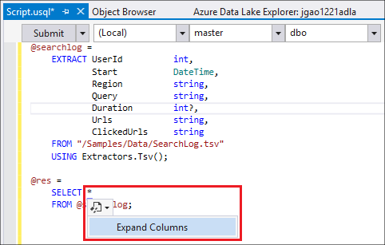

<properties
   pageTitle="開發 U SQL 指令碼的 Visual Studio 中使用資料湖工具 |Azure"
   description="瞭解如何安裝 Visual Studio、 開發及測試 U SQL 指令碼的資料湖工具。 "
   services="data-lake-analytics"
   documentationCenter=""
   authors="edmacauley"
   manager="jhubbard"
   editor="cgronlun"/>

<tags
   ms.service="data-lake-analytics"
   ms.devlang="na"
   ms.topic="get-started-article"
   ms.tgt_pltfrm="na"
   ms.workload="big-data"
   ms.date="05/16/2016"
   ms.author="edmaca"/>

# 教學課程︰ 開發 U SQL 指令碼的 Visual Studio 中使用資料湖工具

[AZURE.INCLUDE [get-started-selector](../../includes/data-lake-analytics-selector-get-started.md)]

瞭解如何安裝 Visual Studio 中，資料湖工具，以及使用 Visual studio 的資料湖工具來撰寫及測試 U SQL 指令碼。

U SQL 是超可調整的高度可延伸的語言，準備、 轉換及分析中資料湖和以外的所有資料。 如需詳細資訊，請參閱 [U SQL 參考] (http://go.microsoft.com/fwlink/p/?LinkId=691348)。

##必要條件

- **Visual Studio 2015、 Visual Studio 2013 更新 4 或 Visual Studio 2012。企業 （Ultimate/進階版）、 專業，社群支援的版本。Express 版不支援。目前不支援 visual Studio 」 15 「 與我們正在處理的。**
- **Microsoft Azure SDK.net 版本 2.7.1 或上方**。  安裝並使用[Web 平台安裝程式](http://www.microsoft.com/web/downloads/platform.aspx)。
- [**[資料湖 Tools for Visual Studio](http://aka.ms/adltoolsvs)**]。

    Visual Studio 資料湖工具安裝後，您會看到 「 Azure 」 節點 （您可以藉由按下 Ctrl + Alt + S 開啟伺服器總管） 下的 [伺服器總管] 中的 「 資料湖分析 「 節點。

- [**[快速入門 Azure 資料湖分析使用 Azure 入口網站](data-lake-analytics-get-started-portal.md)的下列兩個章節瀏覽**]。

    - [建立 Azure 資料湖分析帳戶](data-lake-analytics-get-started-portal.md#create_adl_analytics_account)。
    - [上傳到您的預設資料湖儲存帳戶的 SearchLog.tsv](data-lake-analytics-get-started-portal.md#update-data-to-the-default-adl-storage-account)。

    方便您建立的資料分析湖服務及上傳來源資料檔案的 PowerShell 範例指令碼可以[Appx-A PowerShell 範例準備教學課程](data-lake-analytics-data-lake-tools-get-started.md#appx-a-powershell-sample-for-preparing-the-tutorial)中找到。

    資料湖工具不支援建立資料湖分析帳戶。 因此，您必須建立並使用 Azure 入口網站，PowerShell 的 Azure、.NET SDK 或 Azure CLI。 若要執行資料湖分析工作，您將需要一些資料。 即使資料湖工具支援上傳的資料，您會使用入口網站上傳輕鬆遵循此教學課程的範例資料。

## 連線至 Azure

**連線至資料湖狀況分析**

1. 開啟 Visual Studio。
2. 從 [**檢視**] 功能表中，按一下 [**伺服器總管**]，開啟 [伺服器總管]。 或按下**[CTRL] [替代] + S**。
3. 以滑鼠右鍵按一下**Azure**，按一下 [連線至 Microsoft Azure 訂閱]，，然後依照指示進行。
4. 從**伺服器總管**] 中，展開**Azure**，然後再展開**資料湖分析**。 如果有的話，您應該看到您的資料湖分析帳戶清單。 您無法從 Visual Studio 建立資料湖分析帳戶。 若要建立帳戶，請參閱[開始使用 Azure 資料湖分析使用 Azure 入口網站](data-lake-analytics-get-started-portal.md)，或[使用 PowerShell 的 Azure Azure 資料湖分析快速入門](data-lake-analytics-get-started-powershell.md)。

## 上傳來源資料檔案

您之前在教學課程中已上傳的一些 [**必要**] 區段中的資料。  

您要使用您自己的資料，以下是上傳資料湖工具中的資料的程序。

**若要上傳檔案到相依 Azure 資料湖帳戶**

1. 從**伺服器總管**] 中，展開**Azure**展開**資料湖分析**、 展開資料湖分析帳戶、 展開**儲存帳戶**。 您應該會看到預設資料湖儲存的帳戶，並連結的資料湖儲存帳戶及連結的 Azure 儲存體帳戶。 預設資料湖帳戶有標籤 「 預設儲存帳戶 」。
2. 預設資料湖儲存的帳戶，以滑鼠右鍵按一下，然後按一下 [**檔案總管**。  它會開啟 Visual Studio 總管] 窗格的 [資料湖工具。  在左側，其會顯示樹狀檢視中，內容檢視右側。
3. 瀏覽至您要上傳檔案的資料夾
4. 以滑鼠右鍵按一下任何空白區域，然後再按一下 [**上傳**。

    

**若要上傳檔案到連結的 Azure Blob 儲存體帳戶**

1. 從**伺服器總管**] 中，展開**Azure**展開**資料湖分析**、 展開資料湖分析帳戶、 展開**儲存帳戶**。 您應該會看到預設資料湖儲存的帳戶，並連結的資料湖儲存帳戶及連結的 Azure 儲存體帳戶。
2. 展開 Azure 儲存體帳戶。
3. 以滑鼠右鍵按一下您要上傳檔案，的容器，然後按一下 [**檔案總管**。 如果您沒有安裝容器，您必須先建立一個使用 Azure 入口網站、 PowerShell 的 Azure 或其他工具。
4. 瀏覽至您要上傳檔案的資料夾
5. 以滑鼠右鍵按一下任何空白區域，然後再按一下 [**上傳**。

## 開發 U SQL 指令碼

資料湖分析工作語言撰寫的 U SQL。 若要進一步瞭解 U SQL，請參閱[開始使用 U SQL 語言](data-lake-analytics-u-sql-get-started.md)和[U SQL 語言參考](http://go.microsoft.com/fwlink/?LinkId=691348)。

**建立及提交資料湖分析工作**

1. 從 [**檔案**] 功能表中，按一下 [**新增**]，然後按一下**專案**。
2. 選取 [ **U SQL 專案**類型]。

    

3. 按一下**[確定]**。 Visual studio 建立**Script.usql**檔案的解決方案。
4. 輸入**Script.usql**下列指令碼︰

        @searchlog =
            EXTRACT UserId          int,
                    Start           DateTime,
                    Region          string,
                    Query           string,
                    Duration        int?,
                    Urls            string,
                    ClickedUrls     string
            FROM "/Samples/Data/SearchLog.tsv"
            USING Extractors.Tsv();

        @res =
            SELECT *
            FROM @searchlog;        

        OUTPUT @res   
            TO "/Output/SearchLog-from-Data-Lake.csv"
        USING Outputters.Csv();

    這個 U SQL 指令碼會讀取使用**Extractors.Tsv()**的來源資料檔案，，然後建立使用**Outputters.Csv()**csv 檔案。

    請勿修改兩個路徑，除非您複製到另一個位置的來源檔案。  如果不存在，資料湖分析會建立輸出的資料夾。

    會更容易使用的檔案儲存在預設資料湖帳戶的相對路徑。 您也可以使用絕對的路徑。  例如

        adl://<Data LakeStorageAccountName>.azuredatalakestore.net:443/Samples/Data/SearchLog.tsv

    若要存取連結的儲存帳戶檔案，您必須使用絕對的路徑。  儲存在連結的 Azure 儲存體帳戶檔案的語法是︰

        wasb://<BlobContainerName>@<StorageAccountName>.blob.core.windows.net/Samples/Data/SearchLog.tsv

    >[AZURE.NOTE] 目前不支援 azure Blob 容器公用 blob 或公用容器存取權限。  

    請注意下列功能︰

    - **IntelliSense**

        名稱自動已接來電與成員就會顯示的資料列集、 類別、 資料庫、 結構描述和使用者定義的物件 (UDOs)。

        IntelliSense 目錄項目 （資料庫結構描述、 表格、 UDOs 等） 的相關您計算的帳戶。 您可以核取 [目前使用中的計算帳戶、 資料庫及在上方工具列中的結構描述，然後切換至的下拉式清單。

    - **展開*資料行**

        按一下右邊的*，您應該看到下方的藍色底線*。 將游標暫留在藍色底線，將滑鼠游標，然後按一下 [向下箭號。
        

        按一下 [**展開資料行**，將會取代工具 * 與資料行名稱。

    - **自動套用格式**

        使用者可以變更縮排 U SQL 指令碼依據的程式碼的編輯] 底下的 [結構]-> [進階]:

        - 文件的格式 （Ctrl + E，D）︰ 格式整份文件   
        - 格式化選取範圍 （Ctrl + K，Ctrl + F）︰ 格式化選取範圍。 如果沒有選取範圍做了，這個捷徑格式游標位於的行。  

        設定工具] 底下的所有格式設定規則]-> [選項]-> 文字編輯器]-> SIP]-> [格式設定。  
    - **智慧縮排**

        Visual Studio 資料湖工具就可以自動排運算式，而您正在撰寫指令碼。 預設為停用此功能，使用者必須將它啟用透過檢查 U-SQL]-> [選項和設定-> [選項]-> [啟用智慧縮排。

    - **移至定義，並找到所有參照**

        以滑鼠右鍵按一下 [資料列集/參數/欄/UDO 等的名稱，然後按一下 [移至定義 (F12) 可讓您瀏覽至其定義。 按一下 [尋找所有參考 (Shift + F12)，會顯示所有參照。

    - **插入 Azure 路徑**

        而不記得 Azure 檔案路徑]，然後輸入時手動撰寫指令碼，Visual Studio 資料湖工具提供的簡單方法︰ 以滑鼠右鍵按一下編輯器] 中，按一下 [插入 Azure 路徑。 瀏覽至 Azure Blob 瀏覽器] 對話方塊中的檔案。 按一下**[確定]**。 檔案路徑會插入程式碼。

5. 指定資料湖分析帳戶、 資料庫及結構描述。 您可以選取**（本機）**的測試目的本機執行指令碼。 如需詳細資訊，請參閱[執行 U-SQL 本機](#run-u-sql-locally)。

    

    如需詳細資訊，請參閱[使用 U SQL 目錄](data-lake-analytics-use-u-sql-catalog.md)。

5. 從**方案總管**] 中， **Script.usql**，以滑鼠右鍵按一下，然後按一下**建立指令碼**。 確認 [輸出] 窗格中的結果。
6. 從**方案總管**] 中， **Script.usql**，以滑鼠右鍵按一下，然後按一下**送出指令碼**。 或者，您也可以按一下 Script.usql 窗格**送出**。  請參閱先前的螢幕擷取畫面。  按一下送出使用 [進階] 選項的 [送出] 按鈕旁的向下箭號︰
7. 指定**的工作名稱**，請確認**分析帳戶**，然後按一下 [**提交]**。 送出的結果和工作連結時，可在 Visual Studio 視窗的 [資料湖工具中送出已完成。

    

8. 您必須按一下 [重新整理] 按鈕，以查看最新的工作狀態，並重新整理畫面。 當工作成功，隨即會顯示您**工作圖形**，**中繼資料作業**，**狀態記錄**、**診斷**︰

    

    * 工作摘要。 顯示目前的工作，摘要資訊，例如︰ 狀態進度、 執行時間、 執行階段名稱、 要是等等。   
    * 工作詳細資料。 提供這項工作的詳細的資訊，包括指令碼、 資源頂點執行檢視。
    * 工作圖形。 四個圖形會提供視覺化工作的資訊︰ 進度讀取的資料、 寫入資料、 執行時間、 平均節點的執行時間、 輸入處理量、 輸出處理量。
    * 中繼資料的作業。 它會顯示所有的中繼資料作業。
    * 狀態的歷程記錄。
    * 診斷。 Visual Studio 資料湖工具會自動診斷作業執行。 有一些錯誤或工作的效能問題時，您會收到通知。 如需詳細資訊，第診斷 （連結 TBD） 的工作，請參閱。

**若要檢查工作狀態**

1. 從伺服器總管] 中，依序展開**Azure**、 展開**資料湖分析**、 資料湖分析帳戶名稱
2. 按兩下**工作**清單的工作。
2. 按一下工作，請參閱狀態]。

**若要查看工作輸出**

1. 從**伺服器總管**] 中，展開**Azure**、 展開**資料湖分析**、 展開資料湖分析帳戶、 展開**儲存帳戶**、 預設資料湖儲存的帳戶，以滑鼠右鍵按一下，然後按一下**檔案總管**。
2.  按兩下以開啟資料夾的**輸出**
3.  按兩下**SearchLog 從 adltools.csv**。

###工作播放

工作播放可讓您以觀看工作執行進度，並以視覺化方式偵測效能異常和瓶頸。 「 工作 」 完成 （也就是在執行工作的時間） 執行之前，以及執行完畢後，可以用這項功能。 作業執行期間的播放，可讓使用者，以播放進度進位到目前的時間。

**若要檢視工作執行進度**  

1. 按一下右上角的**載入設定檔**。 請參閱先前的螢幕擷取畫面。
2. 按一下 [檢閱工作執行進度左下角的 [播放] 按鈕上。
3. 在播放時，按一下 [**暫停**]，以停止，或直接將進度列拖曳至特定的位置]。

###熱力圖

資料湖工具的 Visual Studio 提供使用者可選取的色彩覆疊工作檢視中，以表示進度、 資料 I/O、 執行時間、 每個階段的 I/O 處理量。 透過此方法，使用者可以找出潛在問題及通訊群組的工作屬性，直接和以直覺方式。 您可以選擇要顯示下拉式清單中的資料來源。  

## 在本機上執行 U SQL

使用 U SQL 本機 Visual Studio 中執行的體驗，您可以︰

- 執行 U SQL 指令碼本機，以及 C# 組件。
- 偵錯 C# 組件至本機。
- 建立/刪除/檢視本機資料庫、 組件、 結構描述和就像您可以執行 Azure 資料湖分析服務的伺服器總管] 中的資料表。

您會看到*本機*帳戶在 Visual Studio 中，並安裝程式建立*DataRoot*資料夾位於*C:\LocalRunRoot*。 將會用於 DataRoot 資料夾︰

- 儲存庫的中繼資料包括資料表，好處、 Tvf 等。
- 取得特定指令碼︰ 如果輸入輸出路徑中參照的相對路徑，我們將查詢 DataRoot （以及指令碼的路徑，如果 it 的輸入）
- 如果您嘗試登錄組件，並使用相對路徑，就不會參考 DataRoot 資料夾 （請參閱更多詳細資料 」 使用的組件時執行本機執行 「 組件）

以下影片為您示範 U SQL 本機執行的功能︰

>[AZURE.VIDEO usql-localrun]

### 已知的問題和限制

- 無法建立表格 DB 等伺服器總管] 中的本機帳戶。
- 當參照的相對路徑︰

    - 在 [指令碼輸入 (擷取 * 從 「 / 路徑/abc 」)-搜尋 DataRoot 路徑和指令碼路徑。
    - 在 （輸出為 「 路徑/abc 」） 的指令碼輸出︰ DataRoot 路徑將作為輸出資料夾。
    - 在 [組件登錄 (從建立組件 xyz 」 / 路徑/abc 」): 要搜尋的指令碼路徑，但不是 DataRoot。
    - 註冊 TVF/檢視或其他中繼資料實體︰ DataRoot 路徑便會搜尋，但不是指令碼路徑。

    指令碼資料湖服務，預設儲存帳戶作為根資料夾，並將會相應地搜尋。

### 測試本機 U SQL 指令碼
如需開發 U SQL 指令碼的指示，請參閱[開發 U 指令碼](#develop-and-test-u-sql-scripts)。 若要建立並執行 U SQL 指令碼，在本機叢集下拉式清單中，選取 [ **（本機）** ，然後按一下 [**送出**進行相關的設定。 請確定您有正確參照的資料: [參考絕對路徑或資料放置的 DataRoot 資料夾下。

您也可以以滑鼠右鍵按一下 [指令碼，然後的操作功能表中按一下 [**執行本機規劃**或按**CTRL + F5**來觸發程序本機執行。

### 使用 [本機執行中的 [組件

有兩種方式執行自訂的 C# 檔案︰

- 撰寫程式碼後置檔案中的組件和組件會自動註冊並卸除指令碼完成之後。
- 建立 C# 組件專案，並登錄輸出 dll 類似以下的指令碼透過本機帳戶。 請注意路徑是相對於指令碼，而不是 DataRoot 資料夾。

### 偵錯指令碼及 C# 組件至本機

您可以偵錯 C# 組件，而不傳送，而且註冊 Azure 資料湖分析服務。 參照 C# 專案和兩個檔案後的程式碼中，您可以設定中斷點。

**若要為本機檔案後的程式碼中的程式碼偵錯**
1.  在中設定中斷點檔案後的程式碼。
2.  若要在本機的指令碼偵錯按**F5** 。

下列程序只能在 Visual Studio 2015 中。 在舊版的 Visual Studio 中，您可能需要手動新增 pdb 檔案。

**若要偵錯參照 C# 專案中的本機程式碼**
1.  建立 C# 組件的專案，並建置產生輸出 dll。
2.  註冊使用 U SQL 陳述式 dll:

        CREATE ASSEMBLY assemblyname FROM @"..\..\path\to\output\.dll";
3.  設定中斷點 C# 程式碼。
4.  若要使用參照 C# dll 本機指令碼偵錯按**F5** 。  

##另請參閱

若要開始使用資料湖分析使用不同的工具，請參閱︰

- [開始使用資料湖分析使用 Azure 入口網站](data-lake-analytics-get-started-portal.md)
- [使用 PowerShell 的 Azure 資料湖分析快速入門](data-lake-analytics-get-started-powershell.md)
- [使用.NET SDK 資料湖分析快速入門](data-lake-analytics-get-started-net-sdk.md)
- [偵錯 C# 程式碼中 U SQL 作業](data-lake-analytics-debug-u-sql-jobs.md)

若要查看更多開發主題︰

- [分析網誌使用資料湖狀況分析](data-lake-analytics-analyze-weblogs.md)
- [開發 U SQL 指令碼的 Visual Studio 中使用資料湖工具](data-lake-analytics-data-lake-tools-get-started.md)
- [開始使用 Azure 資料湖分析 U SQL 語言](data-lake-analytics-u-sql-get-started.md)
- [開發 U SQL 資料湖分析工作的使用者定義的運算子](data-lake-analytics-u-sql-develop-user-defined-operators.md)

##準備教學課程 Appx A PowerShell 範例

下列 PowerShell 指令碼備妥 Azure 資料湖分析帳戶與來源資料，因此您可以直接跳到[開發 U 指令碼](data-lake-analytics-data-lake-tools-get-started.md#develop-u-sql-scripts)。

    #region - used for creating Azure service names
    $nameToken = "<Enter an alias>"
    $namePrefix = $nameToken.ToLower() + (Get-Date -Format "MMdd")
    #endregion

    #region - service names
    $resourceGroupName = $namePrefix + "rg"
    $dataLakeStoreName = $namePrefix + "adas"
    $dataLakeAnalyticsName = $namePrefix + "adla"
    $location = "East US 2"
    #endregion

    # Treat all errors as terminating
    $ErrorActionPreference = "Stop"

    #region - Connect to Azure subscription
    Write-Host "`nConnecting to your Azure subscription ..." -ForegroundColor Green
    try{Get-AzureRmContext}
    catch{Login-AzureRmAccount}
    #endregion

    #region - Create an Azure Data Lake Analytics service account
    Write-Host "Create a resource group ..." -ForegroundColor Green
    New-AzureRmResourceGroup `
        -Name  $resourceGroupName `
        -Location $location

    Write-Host "Create a Data Lake account ..."  -ForegroundColor Green
    New-AzureRmDataLakeStoreAccount `
        -ResourceGroupName $resourceGroupName `
        -Name $dataLakeStoreName `
        -Location $location

    Write-Host "Create a Data Lake Analytics account ..."  -ForegroundColor Green
    New-AzureRmDataLakeAnalyticsAccount `
        -Name $dataLakeAnalyticsName `
        -ResourceGroupName $resourceGroupName `
        -Location $location `
        -DefaultDataLake $dataLakeStoreName

    Write-Host "The newly created Data Lake Analytics account ..."  -ForegroundColor Green
    Get-AzureRmDataLakeAnalyticsAccount `
        -ResourceGroupName $resourceGroupName `
        -Name $dataLakeAnalyticsName  
    #endregion

    #region - prepare the source data
    Write-Host "Import the source data ..."  -ForegroundColor Green
    $localFolder = "C:\Tutorials\Downloads\" # A temp location for the file.
    $storageAccount = "adltutorials"  # Don't modify this value.
    $container = "adls-sample-data"  #Don't modify this value.

    # Create the temp location  
    New-Item -Path $localFolder -ItemType Directory -Force

    # Download the sample file from Azure Blob storage
    $context = New-AzureStorageContext -StorageAccountName $storageAccount -Anonymous
    $blobs = Azure\Get-AzureStorageBlob -Container $container -Context $context
    $blobs | Get-AzureStorageBlobContent -Context $context -Destination $localFolder

    # Upload the file to the default Data Lake Store account    
    Import-AzureRmDataLakeStoreItem -AccountName $dataLakeStoreName -Path $localFolder"SearchLog.tsv" -Destination "/Samples/Data/SearchLog.tsv"

    Write-Host "List the source data ..."  -ForegroundColor Green
    Get-AzureRmDataLakeStoreChildItem -Account $dataLakeStoreName -Path  "/Samples/Data/"
    #endregion
