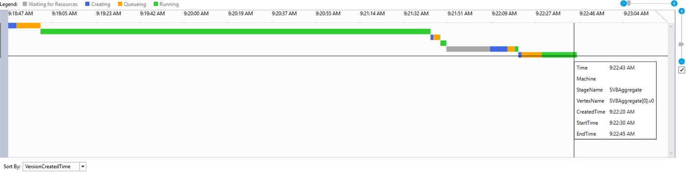

<properties 
   pageTitle="使用 Visual Studio 資料湖工具] 中的頂點執行檢視 |Microsoft Azure" 
   description="瞭解如何使用頂點執行檢視測驗資料湖分析工作。" 
   services="data-lake-analytics" 
   documentationCenter="" 
   authors="mumian" 
   manager="jhubbard" 
   editor="cgronlun"/>
 
<tags
   ms.service="data-lake-analytics"
   ms.devlang="na"
   ms.topic="article"
   ms.tgt_pltfrm="na"
   ms.workload="big-data" 
   ms.date="10/13/2016"
   ms.author="jgao"/>

# 使用 Visual Studio 資料湖工具中的頂點執行檢視

瞭解如何使用頂點執行檢視測驗資料湖分析工作。

## 必要條件

- 使用資料湖工具的 Visual Studio 開發 U SQL 指令碼的一些基本知識。  請參閱[教學課程︰ 開發 U SQL 指令碼的 Visual Studio 中使用資料湖工具](data-lake-analytics-data-lake-tools-get-started.md)。

## 開啟 [頂點執行檢視

某些工作，您可以按一下左下角中的 「 頂點執行檢視 」 連結。 您可能會提示您第一次載入設定檔，可能需要一些時間，視您的網路連線而定。

## 瞭解頂點執行檢視

輸入後頂點執行檢視，有三個部分︰

- 頂點選取器︰ 左邊是頂點選取器。  （例如前 10 資料讀取，或以階段選擇），您可以選取頂點的功能。

    其中一個最常用的使用篩選器是要徑上的頂點。 要徑是 U SQL 工作的最長的路徑。 很有用最佳化您的工作，請核取的頂點採用的最長的時間。

- 頂端中央窗格中︰

    

    此檢視也會顯示所有的頂點的執行狀態。 會相應地轉換時間至本機電腦，並顯示不同的狀態，以不同的色彩。

- [底部中心] 窗格中︰

    

    - 處理程序名稱︰ 頂點執行個體的名稱。 組成 StageName 中的不同部分 |VertexName |VertexRunInstance。 SV7_Split [62].v1 頂點，例如，代表第二個執行個體 （.v1、 索引自 0） 的階段 SV7_Split 中的頂點數字 62。
    - 總資料讀/寫︰ 資料已讀/寫此頂點。
    - 狀態/結束狀態︰ 最後狀態時結束頂點。
    - 結束碼/失敗類型︰ 時發生錯誤頂點失敗。
    - 建立原因︰ 為什麼頂點的建立。
    - 資源延遲/程序延遲/PN 佇列中延遲︰ 處理資料，並保持在佇列中的頂點，等待資源所需的時間。
    - 目前正在執行頂點的建立者的程序/建立者 GUID: GUID。
    - 版本︰ 第 N 個執行個體執行頂點 （系統可能會排程新的執行個體的頂點的多個原因，例如容錯移轉時，計算重複等。）
    - 建立版本的時間。
    - 處理程序建立開始時間/程序佇列時間/程序開始時間/程序完成時間︰ 當頂點程序開始建立;當頂點程序啟動佇列;當啟動特定的頂點程序。當完成特定頂點。

## 後續步驟

- 若要取得資料湖分析的概觀，請參閱[Azure 資料湖分析概觀](data-lake-analytics-overview.md)。
- 若要開始開發 U SQL 應用程式，請參閱[使用資料湖工具的 Visual Studio 開發的 U SQL 指令碼](data-lake-analytics-data-lake-tools-get-started.md)。
- 若要瞭解 U SQL，請參閱[開始使用 Azure 資料湖分析 U SQL 語言](data-lake-analytics-u-sql-get-started.md)。
- 管理工作，請參閱[管理 Azure 資料湖分析使用 Azure 入口網站](data-lake-analytics-manage-use-portal.md)。
- 若要登入的診斷資訊，請參閱[Azure 資料湖分析存取診斷記錄](data-lake-analytics-diagnostic-logs.md)
- 若要查看較複雜的查詢，請參閱[使用 Azure 資料湖分析分析網站記錄](data-lake-analytics-analyze-weblogs.md)。
- 若要檢視工作詳細資料，請參閱[使用工作瀏覽器和 Azure 資料湖分析工作的工作檢視](data-lake-analytics-data-lake-tools-view-jobs.md)