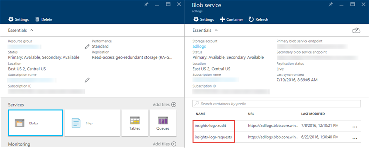

<properties 
   pageTitle="Azure 資料湖分析檢視診斷記錄 |Microsoft Azure" 
   description="瞭解如何設定和存取 Azure 資料湖分析診斷記錄 " 
   services="data-lake-analytics" 
   documentationCenter="" 
   authors="Blackmist" 
   manager="jhubbard" 
   editor="cgronlun"/>
 
<tags
   ms.service="data-lake-analytics"
   ms.devlang="na"
   ms.topic="article"
   ms.tgt_pltfrm="na"
   ms.workload="big-data" 
   ms.date="08/11/2016"
   ms.author="larryfr"/>

# Azure 資料湖分析存取診斷記錄

進一步瞭解如何啟用診斷記錄您的資料湖分析帳戶，來檢視您的帳戶收集的記錄的方式。

組織可以啟用診斷記錄以收集資料存取稽核追蹤其 Azure 資料湖分析帳戶。 這些記錄例如提供資訊︰

* 存取資料的使用者清單。
* 存取資料的頻率。
* 在帳戶儲存的資料量。

## 必要條件

- **Azure 訂閱**。 請參閱[取得 Azure 免費試用版](https://azure.microsoft.com/pricing/free-trial/)。
- **啟用 Azure 訂閱**資料湖分析公用預覽。 請參閱[相關指示](data-lake-analytics-get-started-portal.md#signup)。
- **Azure 資料湖分析帳戶**。 請遵循在[開始使用 Azure 資料湖分析使用 Azure 入口網站](data-lake-analytics-get-started-portal.md)的指示進行。

## 啟用記錄功能

1. 登入新的[Azure 入口網站](https://portal.azure.com)。

2. 開啟您的資料湖分析帳戶，然後從您的資料湖分析帳戶刀，按一下 [**設定**]，然後按一下**診斷設定**。

3. 在 [**診斷**刀，變更下列設定診斷記錄。

    

    * 若要**在**啟用診斷記錄設定**狀態**。
    * 您可以選擇儲存/處理程序資料兩種方式。
        * 選取 [**匯出到事件集線器**串流到 Azure 事件集線器的日誌資料。 如果您有下游處理管線分析即時內送的記錄，請使用這個選項。 如果您選取此選項時，您必須提供您想要使用 [Azure 事件中心詳細資料。
        * 選取 [儲存記錄檔給 Azure 儲存體帳戶的 [**匯出到儲存的帳戶**。 如果您想要保存資料，請使用這個選項。 如果您選取此選項時，您必須提供儲存記錄檔給 Azure 儲存體帳戶。
    * 指定您是否要取得稽核記錄或要求記錄檔或兩者。
    * 指定其必須保留資料的天數。
    * 按一下 [**儲存**]。

一旦您已啟用診斷設定，您可以觀看 [**診斷記錄**] 索引標籤中的記錄。

## 檢視記錄檔

有兩種方式檢視資料湖分析帳戶記錄的資料。

* 從資料湖分析帳戶設定
* 從 Azure 儲存體帳戶儲存資料的位置

### 使用資料湖分析設定檢視

1. 從您的資料湖分析帳戶**設定**刀 」，按一下 [**診斷記錄**]。

     

2. 在 [**診斷記錄**刀中，您應該會看到依**稽核記錄**，以及**要求記錄**分類的記錄。
    * 要求記錄檔擷取資料湖分析帳戶所做的每個 API 邀請。
    * 稽核記錄類似要求記錄，但提供更詳細的分析資料湖分析帳戶所執行的作業。 例如，要求記錄中的單一上傳 API 呼叫可能會導致稽核記錄中的多個 「 新增 」 作業。

3. 按一下 [下載記錄的記錄項目的**下載**連結]。

### 從 Azure 儲存體帳戶含有記錄資料

1. 開啟記錄，相關聯的資料湖分析 Azure 儲存體帳戶刀，然後按一下 [二進位大型物件。 **Blob 服務**刀列出兩個容器。

    

    * 容器**的深入見解-記錄-稽核**包含稽核記錄。
    * 容器**的深入見解記錄要求**包含要求記錄檔。

2. 這些容器內的記錄儲存在下列結構。

        resourceId=/
          SUBSCRIPTIONS/
            <<SUBSCRIPTION_ID>>/
              RESOURCEGROUPS/
                <<RESOURCE_GRP_NAME>>/
                  PROVIDERS/
                    MICROSOFT.DATALAKEANALYTICS/
                      ACCOUNTS/
                        <DATA_LAKE_ANALYTICS_NAME>>/
                          y=####/
                            m=##/
                              d=##/
                                h=##/
                                  m=00/
                                    PT1H.json
    
    > [AZURE.NOTE] `##`路徑中的項目中有年、 月、 日和小時所建立的記錄中。 資料湖分析會建立一個檔案每小時，因此`m=`一定含有值的`00`。

    例如，可能是稽核記錄檔的完整路徑︰
    
        https://adllogs.blob.core.windows.net/insights-logs-audit/resourceId=/SUBSCRIPTIONS/<sub-id>/RESOURCEGROUPS/myresourcegroup/PROVIDERS/MICROSOFT.DATALAKEANALYTICS/ACCOUNTS/mydatalakeanalytics/y=2016/m=07/d=18/h=04/m=00/PT1H.json

    同樣地，可能是要求記錄的完整路徑︰
    
        https://adllogs.blob.core.windows.net/insights-logs-requests/resourceId=/SUBSCRIPTIONS/<sub-id>/RESOURCEGROUPS/myresourcegroup/PROVIDERS/MICROSOFT.DATALAKEANALYTICS/ACCOUNTS/mydatalakeanalytics/y=2016/m=07/d=18/h=14/m=00/PT1H.json

## 記錄結構

稽核與要求記錄位於 JSON 格式。 在此區段中，我們會查看要求 JSON 結構，並稽核記錄。

### 要求記錄檔

在 [JSON 格式化要求登入，以下是範例項目。 每個 blob 有一個名為包含陣列的記錄物件的**記錄**的根物件。

    {
    "records": 
      [     
        . . . .
        ,
        {
             "time": "2016-07-07T21:02:53.456Z",
             "resourceId": "/SUBSCRIPTIONS/<subscription_id>/RESOURCEGROUPS/<resource_group_name>/PROVIDERS/MICROSOFT.DATALAKEANALYTICS/ACCOUNTS/<data_lake_analytics_account_name>",
             "category": "Requests",
             "operationName": "GetAggregatedJobHistory",
             "resultType": "200",
             "callerIpAddress": "::ffff:1.1.1.1",
             "correlationId": "4a11c709-05f5-417c-a98d-6e81b3e29c58",
             "identity": "1808bd5f-62af-45f4-89d8-03c5e81bac30",
             "properties": {
                 "HttpMethod":"POST",
                 "Path":"/JobAggregatedHistory",
                 "RequestContentLength":122,
                 "ClientRequestId":"3b7adbd9-3519-4f28-a61c-bd89506163b8",
                 "StartTime":"2016-07-07T21:02:52.472Z",
                 "EndTime":"2016-07-07T21:02:53.456Z"
                 }
        }
        ,
        . . . .
      ]
    }

#### 要求記錄結構描述

| 名稱            | 類型   | 描述                                                                    |
|-----------------|--------|--------------------------------------------------------------------------------|
| 時間            | 字串 | 記錄檔的時間戳記 （以 utc 表示）                                              |
| 預設      | 字串 | 作業的資源的識別碼置於                            |
| 類別        | 字串 | [記錄] 類別中。 例如，**要求**。                                   |
| operationName   | 字串 | 作業的記錄名稱。 例如，GetAggregatedJobHistory。              |
| resultType      | 字串 | 例如，200 作業的狀態。                                 |
| callerIpAddress | 字串 | 提出要求的用戶端 IP 位址                                |
| 相互關聯識別碼   | 字串 | 登入 id。 此值可將一組相關的記錄項目 |
| 身分識別        | 物件 | 產生的登入身分識別                                            |
| 屬性      | JSON   | 請參閱下一節 （要求記錄屬性結構描述），如需詳細資訊 |

#### 要求記錄屬性結構描述

| 名稱                 | 類型   | 描述                                               |
|----------------------|--------|-----------------------------------------------------------|
| HttpMethod           | 字串 | HTTP 方法用於作業。 例如，取得。 |
| 路徑                 | 字串 | 在上執行作業的路徑                   |
| RequestContentLength | int    | HTTP 要求的內容的長度                    |
| ClientRequestId      | 字串 | 可唯一識別此要求 Id              |
| 開始時間            | 字串 | 用以伺服器收到要求的時間         |
| 結束時間              | 字串 | 在其伺服器傳送回應的時間              |

### 稽核記錄

以下是範例項目 JSON 格式化稽核記錄中。 每個 blob 有一個名為包含陣列的記錄物件的**記錄**的根物件

    {
    "records": 
      [     
        . . . .
        ,
        {
             "time": "2016-07-28T19:15:16.245Z",
             "resourceId": "/SUBSCRIPTIONS/<subscription_id>/RESOURCEGROUPS/<resource_group_name>/PROVIDERS/MICROSOFT.DATALAKEANALYTICS/ACCOUNTS/<data_lake_ANALYTICS_account_name>",
             "category": "Audit",
             "operationName": "JobSubmitted",
             "identity": "user@somewhere.com",
             "properties": {
                 "JobId":"D74B928F-5194-4E6C-971F-C27026C290E6",
                 "JobName": "New Job", 
                 "JobRuntimeName": "default",
                 "SubmitTime": "7/28/2016 7:14:57 PM"
                 }
        }
        ,
        . . . .
      ]
    }

#### 稽核記錄檔結構描述

| 名稱            | 類型   | 描述                                                                    |
|-----------------|--------|--------------------------------------------------------------------------------|
| 時間            | 字串 | 記錄檔的時間戳記 （以 utc 表示）                                              |
| 預設      | 字串 | 作業的資源的識別碼置於                            |
| 類別        | 字串 | [記錄] 類別中。 例如，**稽核**。                                      |
| operationName   | 字串 | 作業的記錄名稱。 例如，JobSubmitted。              |
| resultType | 字串 | 針對工作狀態 (operationName) 次狀態。 |
| resultSignature | 字串 | 在 [工作狀態 (operationName) 上的其他詳細資料。 |
| 身分識別      | 字串 | 要求作業的使用者。 例如， susan@contoso.com。                                 |
| 屬性      | JSON   | 請參閱下一節 （稽核記錄檔的屬性結構描述），如需詳細資訊 |

> [AZURE.NOTE] __resultType__ __resultSignature__提供運算的結果的資訊，並只包含的值，如果已經完成作業。 例如，其包含的值， __operationName__包含__JobStarted__或__JobEnded__的值時。

#### 稽核記錄檔的屬性結構描述

| 名稱       | 類型   | 描述                              |
|------------|--------|------------------------------------------|
| JobId | 字串 | 指派工作給的識別碼  |
| 工作名稱 | 字串 | 所提供的工作名稱 |
| JobRunTime | 字串 | 執行階段用來處理工作 |
| SubmitTime | 字串 | 時間 （UTC) 的工作提交 |
| 開始時間 | 字串 | 時間 （以 utc 表示） 的送出後所執行的工作開始。 |
| 結束時間 | 字串 | 工作的結束時間。 |
| 平行 | 字串 | 此工作要求期間送出資料湖分析單位的數字。 |

> [AZURE.NOTE] __SubmitTime__、__開始時間__、__結束時間__及__平行__提供運算的資訊，只包含的值，如果開始或完成作業。 例如， __SubmitTime__包含的值之後__operationName__指出__JobSubmitted__。

## 程序記錄資料

Azure 資料湖分析如何處理程序及分析該記錄的資料提供的範例。 您可以在[https://github.com/Azure/AzureDataLake/tree/master/Samples/AzureDiagnosticsSample](https://github.com/Azure/AzureDataLake/tree/master/Samples/AzureDiagnosticsSample)上找到的範例。 

## 後續步驟

- [Azure 資料湖分析的概觀](data-lake-analytics-overview.md)

