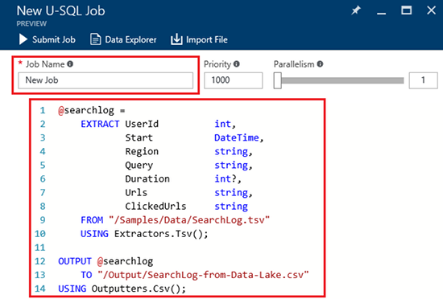

<properties 
   pageTitle="開始使用 Azure 資料湖分析使用 Azure 入口網站 |Azure" 
   description="瞭解如何建立資料湖分析帳戶，請建立使用 U SQL 資料湖分析工作使用 Azure 入口網站，並提交工作。 " 
   services="data-lake-analytics" 
   documentationCenter="" 
   authors="edmacauley" 
   manager="jhubbard" 
   editor="cgronlun"/>
 
<tags
   ms.service="data-lake-analytics"
   ms.devlang="na"
   ms.topic="hero-article"
   ms.tgt_pltfrm="na"
   ms.workload="big-data" 
   ms.date="10/06/2016"
   ms.author="edmaca"/>

# 教學課程︰ 開始使用 Azure 資料湖分析使用 Azure 入口網站

[AZURE.INCLUDE [get-started-selector](../../includes/data-lake-analytics-selector-get-started.md)]

瞭解如何使用 Azure 入口網站建立 Azure 資料湖分析帳戶，在[U SQL](data-lake-analytics-u-sql-get-started.md)中，定義資料湖分析工作提交資料湖分析服務中的工作。 如需有關資料湖分析的詳細資訊，請參閱[Azure 資料湖分析概觀](data-lake-analytics-overview.md)。

在本教學課程中，您可以開發讀取分隔值 (TSV) 檔案] 索引標籤，並將其轉換成逗點分隔值 (CSV) 檔案的工作。 若要移到同一個教學課程中使用其他支援的工具，請按一下上方的這一節的索引標籤。 當您第一份工作成功時，您可以開始撰寫更複雜的資料轉換的 U SQL。

##必要條件

本教學課程之前，您必須具備下列項目︰

- **Azure 訂閱**。 請參閱[取得 Azure 免費試用版](https://azure.microsoft.com/pricing/free-trial/)。

##建立資料湖分析帳戶

您必須有資料湖分析帳戶，才能執行任何工作。

每個資料湖分析帳戶有[Azure 資料湖存放]()帳戶相依性。  此帳戶被指為預設資料湖存放帳戶。  事先或建立您的資料湖分析帳戶時，您可以建立的資料湖存放帳戶。 在本教學課程中，您將建立的資料湖存放帳戶資料湖分析帳戶。

**若要建立資料湖分析帳戶**

1. [Azure 入口網站](https://portal.azure.com)登入。
2. 按一下 [**新增**]，按一下 [**智慧 + 分析**]，再按一下 [**資料湖分析**。
3. 輸入或選取下列值︰

    

    - **名稱**︰ 資料湖分析帳戶的名稱。
    - **訂閱**︰ 選擇 [使用狀況分析帳戶 Azure 訂閱。
    - **資源群組**]。 選取現有的 Azure 資源群組或建立新的項目。 Azure 資源管理員可讓您使用的應用程式群組中的資源。 如需詳細資訊，請參閱[Azure 資源管理員的概觀](resource-group-overview.md)。 
    - **位置**。 選取資料湖分析帳戶 Azure 資料中心。 
    - **資料湖存放**︰ 每個資料湖分析帳戶擁有相依資料湖存放帳戶。 資料湖分析帳戶和相依資料湖存放帳戶必須位於相同的 Azure 資料中心。 請依照下列指示建立新的資料湖存放帳戶，或選取現有的項目。

8. 按一下 [**建立**]。 它會帶您到入口網站的主畫面。 新方塊會新增至 StartBoard，顯示 「 部署 Azure 資料湖分析] 標籤。 花一些時間才建立的資料湖分析帳戶。 建立帳戶時，入口網站隨即會開啟新的刀上的帳戶。

建立資料湖分析帳戶之後，您可以新增其他資料湖存放帳戶和 Azure 儲存體帳戶。 如需相關指示，請參閱[管理資料湖分析帳戶資料來源](data-lake-analytics-manage-use-portal.md#manage-account-data-sources)。

##準備來源資料

在本教學課程中，您可以處理某些搜尋記錄檔。  搜尋記錄可以存 dData 湖市集或 Azure Blob 儲存體。 

Azure 入口網站提供使用者介面複製預設資料湖存放帳戶，其中包含搜尋記錄檔中的一些範例資料檔案。

**若要複製的範例資料檔案**

1. 從[Azure 入口網站](https://portal.azure.com)中，開啟您的資料湖分析帳戶。  請參閱建立和開啟的帳戶，在入口網站[管理資料湖分析帳戶](data-lake-analytics-get-started-portal.md#manage-accounts)。
3. 展開**基本功能**窗格]，然後按一下 [**瀏覽範例指令碼**。 它會開啟另一個刀稱為**指令碼範例**。

    

4. 按一下要複製的範例資料檔案的**範例資料遺失**。 完成之後，入口網站會顯示**成功更新的範例資料**。
7. 從資料湖分析帳戶刀中，按一下 [頁首中的 [**資料總管**]。 

    ![Azure 資料湖分析資料檔案總管] 按鈕](./media/data-lake-analytics-get-started-portal/data-lake-analytics-data-explorer-button.png)

    它會開啟兩個刀。 其中一個**資料檔案總管**] 中，而另一個是預設資料湖存放帳戶。
8. 在預設資料湖存放帳戶刀中，按一下 [**範例**] 來展開資料夾，然後再按一下 [**資料**以展開資料夾]。 您應該會看到下列檔案和資料夾︰

    - AmbulanceData /
    - AdsLog.tsv
    - SearchLog.tsv
    - version.txt
    - WebLog.log
    
    在本教學課程中，您可以使用 SearchLog.tsv。

在練習中，[程式資料寫入連結的儲存空間帳戶或上傳資料應用程式。 上傳的檔案，請參閱[上傳至資料湖存放區的資料](data-lake-analytics-manage-use-portal.md#upload-data-to-adls)，或[上傳至 Blob 儲存體的資料](data-lake-analytics-manage-use-portal.md#upload-data-to-wasb)。

##建立及提交資料湖分析工作

您準備好的來源資料後，您就可以開始開發 U SQL 指令碼。  

**送出工作**

1. 從資料湖分析帳戶刀入口網站上，按一下 [**新工作**]。 

    ![Azure 資料湖分析新增工作] 按鈕](./media/data-lake-analytics-get-started-portal/data-lake-analytics-new-job-button.png)

    如果您沒有看到刀，請參閱[開啟資料湖分析帳戶從入口網站](data-lake-analytics-manage-use-portal.md#access-adla-account)。
2. 輸入**作業名稱**和下列 U SQL 指令碼︰

        @searchlog =
            EXTRACT UserId          int,
                    Start           DateTime,
                    Region          string,
                    Query           string,
                    Duration        int?,
                    Urls            string,
                    ClickedUrls     string
            FROM "/Samples/Data/SearchLog.tsv"
            USING Extractors.Tsv();
        
        OUTPUT @searchlog   
            TO "/Output/SearchLog-from-Data-Lake.csv"
        USING Outputters.Csv();

    

    這個 U SQL 指令碼會讀取使用**Extractors.Tsv()**的來源資料檔案，，然後建立使用**Outputters.Csv()**csv 檔案。 
    
    請勿修改兩個路徑，除非您將來源檔案複製到不同的位置。  如果不存在，資料湖分析所建立的輸出資料夾。  在此案例中，我們會使用簡單、 相對路徑。  
    
    會更容易使用的檔案儲存在預設資料湖帳戶中的相對路徑。 您也可以使用絕對的路徑。  例如 
    
        adl://<Data LakeStorageAccountName>.azuredatalakestore.net:443/Samples/Data/SearchLog.tsv
      

    如需 U SQL 相關資訊，請參閱[開始使用 Azure 資料湖分析 U SQL 語言](data-lake-analytics-u-sql-get-started.md)和[U SQL 語言參考](http://go.microsoft.com/fwlink/?LinkId=691348)。
     
3. 按一下 [從上方的 [**送出工作**]。   
4. 請等待工作狀態會變更為**成功**。 您可以看到工作完成所大約一分鐘。
    
    以避免工作失敗，請參閱[螢幕和疑難排解資料湖分析工作](data-lake-analytics-monitor-and-troubleshoot-jobs-tutorial.md)。

5. 在刀底部，按一下 [**輸出**] 索引標籤，然後按一下**SearchLog 從資料 Lake.csv**。 您可以預覽、 下載、 重新命名及刪除輸出檔案。

    

##另請參閱

- 若要查看較複雜的查詢，請參閱[使用 Azure 資料湖分析分析網站記錄](data-lake-analytics-analyze-weblogs.md)。
- 若要開始開發 U SQL 應用程式，請參閱[使用資料湖工具的 Visual Studio 開發的 U SQL 指令碼](data-lake-analytics-data-lake-tools-get-started.md)。
- 若要瞭解 U SQL，請參閱[開始使用 Azure 資料湖分析 U SQL 語言](data-lake-analytics-u-sql-get-started.md)。
- 管理工作，請參閱[管理 Azure 資料湖分析使用 Azure 入口網站](data-lake-analytics-manage-use-portal.md)。
- 若要取得資料湖分析的概觀，請參閱[Azure 資料湖分析概觀](data-lake-analytics-overview.md)。
- 若要查看同一個教學課程中使用其他工具，請按一下 [上方的頁面] 索引標籤選擇器]。
- 若要登入的診斷資訊，請參閱[Azure 資料湖分析存取診斷記錄](data-lake-analytics-diagnostic-logs.md)
