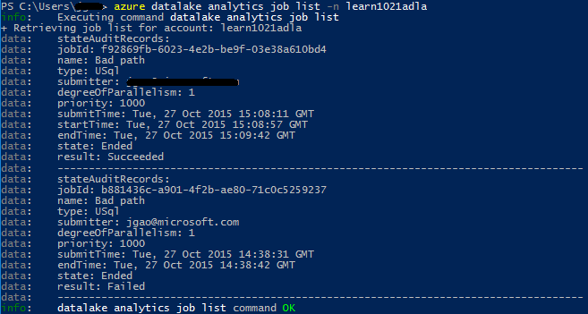

<properties 
   pageTitle="管理 Azure 資料湖分析使用 Azure 命令列介面 |Azure" 
   description="瞭解如何管理資料湖分析帳戶、 資料來源、 工作和使用者使用 Azure CLI" 
   services="data-lake-analytics" 
   documentationCenter="" 
   authors="edmacauley" 
   manager="jhubbard" 
   editor="cgronlun"/>
 
<tags
   ms.service="data-lake-analytics"
   ms.devlang="na"
   ms.topic="article"
   ms.tgt_pltfrm="na"
   ms.workload="big-data" 
   ms.date="05/16/2016"
   ms.author="edmaca"/>

# 管理 Azure 資料湖分析使用 Azure 命令列介面 (CLI)

[AZURE.INCLUDE [manage-selector](../../includes/data-lake-analytics-selector-manage.md)]

瞭解如何管理 Azure 資料湖分析帳戶、 資料來源、 使用者，以及使用 Azure 的工作。 若要查看管理主題使用其他工具，按一下 [] 索引標籤選取上方。

**必要條件**

本教學課程之前，您必須具備下列項目︰

- **Azure 訂閱**。 請參閱[取得 Azure 免費試用版](https://azure.microsoft.com/pricing/free-trial/)。
- **Azure CLI**。 請參閱[安裝及設定 Azure CLI](../xplat-cli-install.md)。
    - 下載並安裝**測試版** [Azure CLI 工具](https://github.com/MicrosoftBigData/AzureDataLake/releases)，才能完成此示範。
- **驗證**，使用下列命令︰

        azure login
    如需有關使用公司或學校帳戶驗證的詳細資訊，請參閱[連線至 Azure CLI 從 Azure 訂閱](../xplat-cli-connect.md)。
- **切換至 Azure 資源管理員模式**，請使用下列命令︰

        azure config mode arm

**清單資料湖存放區 」 和 「 資料湖 Analytics 命令︰**

    azure datalake store
    azure datalake analytics

<!-- ################################ -->
<!-- ################################ -->
## 管理帳戶

之前執行任何資料湖分析工作，您必須有資料湖分析帳戶。 不同於 Azure HDInsight 您不是每年支付分析帳戶時不執行工作。  您只是付款時執行工作的時間。  如需詳細資訊，請參閱[Azure 資料湖分析概觀](data-lake-analytics-overview.md)。  

###建立帳戶

    azure datalake analytics account create "<Data Lake Analytics Account Name>" "<Azure Location>" "<Resource Group Name>" "<Default Data Lake Account Name>"

###更新帳戶

下列命令更新現有的資料湖分析帳戶的內容
    
    azure datalake analytics account set "<Data Lake Analytics Account Name>"

###帳戶清單

清單資料湖分析帳戶 

    azure datalake analytics account list

在特定的資源群組內的清單資料湖分析帳戶

    azure datalake analytics account list -g "<Azure Resource Group Name>"

取得特定資料湖分析帳戶的詳細資料

    azure datalake analytics account show -g "<Azure Resource Group Name>" -n "<Data Lake Analytics Account Name>"

###刪除資料湖分析帳戶

    azure datalake analytics account delete "<Data Lake Analytics Account Name>"

<!-- ################################ -->
<!-- ################################ -->
## 管理帳戶資料來源

資料湖分析目前支援下列資料來源︰

- [Azure 資料湖存放區](../data-lake-store/data-lake-store-overview.md)
- [Azure 儲存體](../storage/storage-introduction.md)

當您建立的分析帳戶時，您必須指定為預設儲存帳戶 Azure 資料湖儲存體帳戶。 預設 ADL 儲存帳戶用來儲存工作中繼資料] 及 [工作稽核記錄。 建立分析帳戶後，您可以新增其他資料湖儲存帳戶及/或 Azure 儲存體帳戶。 

### 尋找預設 ADL 儲存帳戶

    azure datalake analytics account show "<Data Lake Analytics Account Name>"

值會列在 [屬性︰ datalakeStoreAccount:name。

### 新增其他 Azure Blob 儲存體帳戶

    azure datalake analytics account datasource add -n "<Data Lake Analytics Account Name>" -b "<Azure Blob Storage Account Short Name>" -k "<Azure Storage Account Key>"

>[AZURE.NOTE] 支援只有 Blob 儲存體簡短名稱。  不要使用 FQDN，例如 「 myblob.blob.core.windows.net 」。

### 新增其他資料湖存放區帳戶

    azure datalake analytics account datasource add -n "<Data Lake Analytics Account Name>" -l "<Data Lake Store Account Name>" [-d]

[-d] 是一個選擇性的選項，以表示新增資料湖是否預設資料湖帳戶。 

### 更新現有的資料來源

若要設定為預設現有的資料湖存放區帳戶︰

    azure datalake analytics account datasource set -n "<Data Lake Analytics Account Name>" -l "<Azure Data Lake Store Account Name>" -d
      
若要更新現有的 Blob 儲存體帳戶金鑰︰

    azure datalake analytics account datasource set -n "<Data Lake Analytics Account Name>" -b "<Blob Storage Account Name>" -k "<New Blob Storage Account Key>"

### 清單資料來源︰

    azure datalake analytics account show "<Data Lake Analytics Account Name>"
    

### 刪除資料來源︰

若要刪除的資料湖存放區帳戶︰

    azure datalake analytics account datasource delete "<Data Lake Analytics Account Name>" "<Azure Data Lake Store Account Name>"

若要刪除 Blob 儲存體帳戶︰

    azure datalake analytics account datasource delete "<Data Lake Analytics Account Name>" "<Blob Storage Account Name>"

## 管理工作

您必須有資料湖分析帳戶，才能建立工作。  如需詳細資訊，請參閱[管理資料湖分析帳戶](#manage-accounts)。

### 工作清單

    azure datalake analytics job list -n "<Data Lake Analytics Account Name>"

### 取得工作詳細資料

    azure datalake analytics job show -n "<Data Lake Analytics Account Name>" -j "<Job ID>"
    
### 送出工作

> [AZURE.NOTE] 預設工作的優先順序 1000，而工作平行預設度為 1。

    azure datalake analytics job create  "<Data Lake Analytics Account Name>" "<Job Name>" "<Script>"

### 取消工作

使用 [清單] 命令來尋找作業識別碼，然後使用 [取消] 以取消作業。

    azure datalake analytics job list -n "<Data Lake Analytics Account Name>"
    azure datalake analytics job cancel "<Data Lake Analytics Account Name>" "<Job ID>"

## 管理目錄

U SQL 目錄用來讓他們可以共用 U SQL 指令碼的結構資料和程式碼。 目錄] 可讓最高的效能可能 Azure 資料湖中的資料。 如需詳細資訊，請參閱[使用 U SQL 目錄](data-lake-analytics-use-u-sql-catalog.md)。
 
###清單目錄項目

    #List databases
    azure datalake analytics catalog list -n "<Data Lake Analytics Account Name>" -t database

    #List tables
    azure datalake analytics catalog list -n "<Data Lake Analytics Account Name>" -t table
    
類型包括資料庫、 結構描述、 組件、 外部資料來源、 資料表、 資料表值函式或資料表統計資料。

###建立目錄密碼

    azure datalake analytics catalog secret create -n "<Data Lake Analytics Account Name>" <databaseName> <hostUri> <secretName>

### 修改目錄密碼

    azure datalake analytics catalog secret set -n "<Data Lake Analytics Account Name>" <databaseName> <hostUri> <secretName>

###刪除目錄密碼

    azure datalake analytics catalog secrete delete -n "<Data Lake Analytics Account Name>" <databaseName> <hostUri> <secretName>

<!-- ################################ -->
<!-- ################################ -->
## 使用 ARM 群組

應用程式通常是許多元件，例如在 web 應用程式、 資料庫、 資料庫伺服器、 儲存及第 3 廠商服務。 Azure 資源管理員 (ARM) 可讓您使用應用程式] 群組中，稱為 Azure 資源] 群組中的資源。 您可以部署、 更新、 監控或刪除的所有資源在單一、 協同作業應用程式。 使用範本，以供部署，該範本能夠為不同的環境，例如執行與生產測試。 您可以檢視上顯型成本給整個群組，計費釐清為您的組織。 如需詳細資訊，請參閱[Azure 資源管理員的概觀](../azure-resource-manager/resource-group-overview.md)。 

資料湖分析服務可以包含下列元件︰

- Azure 資料湖分析帳戶
- 必要的預設 Azure 資料湖儲存體帳戶
- 其他 Azure 資料湖儲存帳戶
- 其他 Azure 儲存體帳戶

您可以建立一個 ARM 群組，若要使其更易於管理] 底下的所有這些元件。

資料湖分析帳戶從屬參照儲存帳戶必須放在同一個 Azure 資料中心。
ARM 群組不過可以位於不同的資料中心。  

##另請參閱 

- [Microsoft Azure 資料湖分析的概觀](data-lake-analytics-overview.md)
- [使用 Azure 入口網站的資料湖分析快速入門](data-lake-analytics-get-started-portal.md)
- [管理 Azure 資料湖分析使用 Azure 入口網站](data-lake-analytics-manage-use-portal.md)
- [監控和疑難排解 Azure 資料湖分析工作使用 Azure 入口網站](data-lake-analytics-monitor-and-troubleshoot-jobs-tutorial.md)

