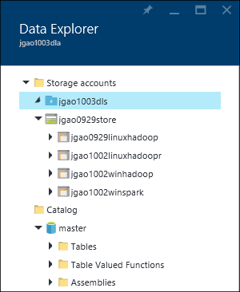

<properties 
   pageTitle="管理 Azure 資料湖分析使用 Azure 入口網站 |Azure" 
   description="瞭解如何管理資料湖分析 acounts、 資料來源、 使用者及工作。" 
   services="data-lake-analytics" 
   documentationCenter="" 
   authors="edmacauley" 
   manager="jhubbard" 
   editor="cgronlun"/>
 
<tags
   ms.service="data-lake-analytics"
   ms.devlang="na"
   ms.topic="article"
   ms.tgt_pltfrm="na"
   ms.workload="big-data" 
   ms.date="10/06/2016"
   ms.author="edmaca"/>

# 管理 Azure 資料湖分析使用 Azure 入口網站

[AZURE.INCLUDE [manage-selector](../../includes/data-lake-analytics-selector-manage.md)]

瞭解如何管理 Azure 資料湖分析帳戶與帳戶資料來源、 的使用者，請使用 [Azure 入口網站的工作。 若要查看管理主題使用其他工具，請按一下頁面上方的定位點選取器。

**必要條件**

本教學課程之前，您必須具備下列項目︰

- **Azure 訂閱**。 請參閱[取得 Azure 免費試用版](https://azure.microsoft.com/pricing/free-trial/)。

<!-- ################################ -->
<!-- ################################ -->
## 管理帳戶

之前執行任何資料湖分析工作，您必須有資料湖分析帳戶。 不同於 Azure HDInsight 您只是付款資料湖分析帳戶時執行的工作。  您只是付款時執行工作的時間。  如需詳細資訊，請參閱[Azure 資料湖分析概觀](data-lake-analytics-overview.md)。  

**若要建立資料湖分析帳戶**

1. [Azure 入口網站](https://portal.azure.com)登入。
2. 按一下 [**新增**]，按一下 [**智慧 + 分析**]，再按一下 [**資料湖分析**。
3. 輸入或選取下列值︰

    

    - **名稱**︰ 資料湖分析帳戶的名稱。
    - **訂閱**︰ 選擇 [使用狀況分析帳戶 Azure 訂閱。
    - **資源群組**]。 選取現有的 Azure 資源群組或建立新的項目。 Azure 資源管理員可讓您使用的應用程式群組中的資源。 如需詳細資訊，請參閱[Azure 資源管理員的概觀](resource-group-overview.md)。 
    - **位置**。 選取資料湖分析帳戶 Azure 資料中心。 
    - **資料湖存放**︰ 每個資料湖分析帳戶擁有相依資料湖存放帳戶。 資料湖分析帳戶和相依資料湖存放帳戶必須位於相同的 Azure 資料中心。 請依照下列指示建立新的資料湖存放帳戶，或選取現有的項目。

8. 按一下 [**建立**]。 它會帶您到入口網站的主畫面。 新方塊會新增至 StartBoard，顯示 「 部署 Azure 資料湖分析] 標籤。 花一些時間才建立的資料湖分析帳戶。 建立帳戶時，入口網站隨即會開啟新的刀上的帳戶。

建立資料湖分析帳戶之後，您可以新增其他資料湖存放帳戶和 Azure 儲存體帳戶。 如需相關指示，請參閱[管理資料湖分析帳戶資料來源](data-lake-analytics-manage-use-portal.md#manage-account-data-sources)。

**若要存取開啟資料湖分析帳戶**

1. [Azure 入口網站](https://portal.azure.com/)登入。
2. 在左功能表上，按一下 [**資料湖分析**。  如果您沒有看到它，按一下 [**更多服務**]，然後再按一下 [**智慧 + 分析**] 下的 [**資料湖分析**。
3. 按一下您要存取資料湖分析帳戶。 它會在新的刀開啟該帳戶。

**若要刪除資料湖分析帳戶**

1. 開啟您想要刪除的資料湖分析帳戶。 如需相關指示，請參閱[Access 資料湖分析帳戶](#access-adla-account)。
2. 按一下上方的刀按鈕] 功能表上的 [**刪除**]。
3. 輸入帳戶名稱，然後再按一下 [**刪除**]。

刪除資料湖分析帳戶並不會刪除相依資料湖存放帳戶。 如需刪除資料湖儲存帳戶的指示，請參閱[刪除資料湖存放帳戶](data-lake-store-get-started-portal.md#delete-azure-data-lake-store-account)。

<!-- ################################ -->
<!-- ################################ -->
## 管理帳戶資料來源

資料湖分析目前支援下列資料來源︰

- [Azure 資料湖存放區](../data-lake-store/data-lake-store-overview.md)
- [Azure 儲存體](../storage/storage-introduction.md)

當您建立的資料湖分析帳戶時，您必須指定為預設儲存帳戶 Azure 資料湖存放區帳戶。 預設資料湖存放帳戶用來儲存工作中繼資料] 及 [工作稽核記錄。 建立資料湖分析帳戶後，您可以新增其他資料湖存放帳戶及/或 Azure 儲存體帳戶。 

**若要尋找的預設資料湖儲存帳戶**

- 開啟您想要管理的資料湖分析帳戶。 如需相關指示，請參閱[Access 資料湖分析帳戶](#access-adla-account)。 預設資料湖存放區會顯示在**非常重要**︰

    

**若要新增其他資料來源**

1. 開啟您想要管理的資料湖分析帳戶。 如需相關指示，請參閱[Access 資料湖分析帳戶](#access-adla-account)。
2. 按一下 [**設定]** ，然後按一下 [**資料來源**。 您應該會看到那里列出的預設資料湖存放帳戶。 
3. 按一下 [**新增資料來源**]。

    

    若要新增 Azure 資料湖存放帳戶，您需要帳戶名稱和帳戶的存取權能夠進行查詢。
    若要新增 Azure Blob 儲存體，您需要儲存帳戶和帳戶金鑰]，您可以瀏覽至儲存帳戶入口網站中找到。

**瀏覽資料來源**  

1. 開啟您想要管理的分析帳戶。 如需相關指示，請參閱[Access 資料湖分析帳戶](#access-adla-account)。
2. 按一下 [**設定]** ，然後按一下 [**資料檔案總管**。 
 
    
    
3. 按一下 [資料湖存放帳戶，以開啟 [帳戶]。

    
    
    針對每個資料湖存放帳戶，您可以
    
    - **新的資料夾**︰ 加入新的資料夾。
    - **上傳**︰ 從工作站上傳檔案到儲存帳戶。
    - **Access**︰ 設定的存取權限。
    - **重新命名資料夾**︰ 重新命名資料夾。
    - **資料夾內容**︰ 顯示檔案或資料夾的內容，例如 WASB 路徑，WEBHDFS 路徑上次修改時間等等。
    - **刪除資料夾**︰ 刪除的資料夾。

**若要上傳至資料湖儲存帳戶檔案**

1. 從入口網站中，從左側功能表中，按一下 [**瀏覽]** ，然後按一下**資料湖存放區**。
2. 按一下您要上傳資料以資料湖存放帳戶。 若要尋找的預設資料湖儲存帳戶，請參閱[以下](#default-adl-account)。
3. 從上方的功能表中按一下 [**資料檔案總管**]。
4. 按一下**新的目錄**]，以建立新的資料夾，或按一下 [變更資料夾的資料夾名稱。
6. 上傳檔案頂端的功能表中，按一下 [**上傳**]。

**若要上傳檔案至 Azure Blob 儲存體帳戶**

請參閱[上傳 Hadoop 工作 HDInsight 的資料](../hdinsight/hdinsight-upload-data.md)。  資訊適用於資料湖分析。

## 管理使用者

資料湖分析會使用 Azure Active Directory 中的角色型存取控制。 當您建立的資料湖分析帳戶時，「 訂閱管理員 」 角色會新增到您的帳戶。 您可以新增其他使用者和安全性群組的下列角色︰

|角色|描述|
|----|-----------|
|擁有者|可讓您管理所有項目，包括資源的存取權。|
|參與者|存取入口網站。送出及監視作業。 若要送出工作，參與者必須資料湖存放帳戶 [已讀取] 或 [寫入] 權限。|
|DataLakeAnalyticsDeveloper | 送出、 監控及取消工作。  這些使用者只能取消自己的工作。 無法管理自己的帳戶，例如，將使用者新增、 變更權限，或刪除帳戶。 若要執行的工作，需要讀取或寫入存取權的資料湖存放區帳戶     | 
|閱讀程式|可讓您檢視所有項目，但無法進行任何變更。|  
|DevTest 實驗室使用者|可讓您檢視所有項目，並連線，開始、 重新開機及關閉虛擬機器。|  
|使用者存取系統管理員|可讓您管理 Azure 資源的使用者存取權。|  

建立 Azure Active Directory 使用者和安全性群組的資訊，請參閱[什麼是 Azure Active Directory](../active-directory/active-directory-whatis.md)。

**若要將使用者或安全性群組新增至資料湖分析帳戶**

1. 開啟您想要管理的分析帳戶。 如需相關指示，請參閱[Access 資料湖分析帳戶](#access-adla-account)。
2. 按一下 [**設定**]，然後按一下 [**使用者**。 您也可以在以下的螢幕擷取畫面所示的**基礎**標題列上按一下**存取**︰

    
3. 從**使用者**刀中，按一下 [**新增**]。
4. 選取角色及新增使用者，，然後按一下**[確定]**。

**注意︰ 如果這個使用者或安全性群組需要提交工作，需要獲得資料湖存放在權限。如需詳細資訊，請參閱[安全資料湖存放區中的資料](../data-lake-store/data-lake-store-secure-data.md)。**

<!-- ################################ -->
<!-- ################################ -->
## 管理工作

您必須有資料湖分析帳戶，才能執行任何 U SQL 作業。  如需詳細資訊，請參閱[管理資料湖分析帳戶](#manage-data-lake-analytics-accounts)。

**若要建立工作**

1. 開啟您想要管理的分析帳戶。 如需相關指示，請參閱[Access 資料湖分析帳戶](#access-adla-account)。
2. 按一下 [**新工作**]。

    

    您應該會看到新的刀類似︰

    

    每個工作，您可以設定

  	|名稱|描述|
  	|----|-----------|
  	|工作名稱|輸入工作的名稱。|
  	|優先順序|較低的數字有較高的優先順序。 如果兩個工作是兩者佇列中，具有較低優先順序第一次執行|
  	|平行 |計算程序可以一次發生這種情形的最大數目。 提高此數字可改善效能，但也可以增加成本。|
  	|指令碼|輸入工作的 U SQL 指令碼。|

    您也可以使用相同的介面，探索連結資料來源，並新增其他檔案連結的資料來源。 
3. 如果您想要送出工作，請按一下 [**送出工作**]。

**送出工作**

請參閱[建立資料湖分析工作](#create-job)。

**監視工作**

1. 開啟您想要管理的分析帳戶。 如需相關指示，請參閱[Access 資料湖分析帳戶](#access-adla-account)。 [工作管理面板] 中顯示的基本工作資訊︰

    

3. 在先前的螢幕擷取畫面所示，請按一下 [**工作管理**]。

    

4. 按一下 [從清單的工作]。 或按一下 [**篩選**]，以協助您尋找工作︰

    

    您可以篩選**的時間範圍**、**工作名稱**，以及**作者**的工作。
5. 如果您想要重新送出工作，請按一下 [**重新送出**]。

**若要重新送出工作**

請參閱[監視器資料湖分析工作](#monitor-jobs)。

##監視帳戶使用

**若要監視帳戶使用**

1. 開啟您想要管理的分析帳戶。 如需相關指示，請參閱[Access 資料湖分析帳戶](#access-adla-account)。 [使用狀況] 面板會顯示使用狀況︰

    

2. 按兩下 [若要查看更多詳細資料] 窗格。

##檢視 U SQL 目錄

[U SQL 目錄](data-lake-analytics-use-u-sql-catalog.md)用來讓他們可以共用 U SQL 指令碼的結構資料和程式碼。 目錄] 可讓最高的效能可能 Azure 資料湖中的資料。 從 Azure 入口網站，您就可以檢視 U SQL 目錄項目。

**瀏覽 U SQL 目錄**

1. 開啟您想要管理的分析帳戶。 如需相關指示，請參閱[Access 資料湖分析帳戶](#access-adla-account)。
2. 從上方的功能表中按一下 [**資料檔案總管**]。
3. 展開**目錄**，展開 [**母片**]，展開**表格或**資料表值函式**，或**組件 * *。 以下螢幕擷取畫面顯示一個資料表值函式。

    

<!-- ################################ -->
<!-- ################################ -->
## 使用 Azure 資源管理員群組

應用程式通常是許多元件，例如在 web 應用程式、 資料庫、 資料庫伺服器、 儲存和協力廠商服務。 Azure 資源管理員可讓您使用應用程式] 群組中，稱為 Azure 資源] 群組中的資源。 您可以部署、 更新、 監控或刪除所有資源在單一、 協同作業應用程式。 使用範本，以供部署，該範本能不同環境中測試、 臨時和生產等。 您可以檢視上顯型成本給整個群組，計費釐清為您的組織。 如需詳細資訊，請參閱[Azure 資源管理員的概觀](../azure-resource-manager/resource-group-overview.md)。 

資料湖分析服務可以包含下列元件︰

- Azure 資料湖分析帳戶
- 必要的預設 Azure 資料湖存放區帳戶
- 其他 Azure 資料湖存放區帳戶
- 其他 Azure 儲存體帳戶

您可以建立一個資源管理群組，若要使其更易於管理] 底下的所有這些元件。

資料湖分析帳戶從屬參照儲存帳戶必須放在同一個 Azure 資料中心。
資源管理群組不過可以位於不同的資料中心。  

##另請參閱 

- [Microsoft Azure 資料湖分析的概觀](data-lake-analytics-overview.md)
- [開始使用資料湖分析使用 Azure 入口網站](data-lake-analytics-get-started-portal.md)
- [管理使用 Azure PowerShell 的 Azure 資料湖狀況分析](data-lake-analytics-manage-use-powershell.md)
- [監控和疑難排解 Azure 資料湖分析工作使用 Azure 入口網站](data-lake-analytics-monitor-and-troubleshoot-jobs-tutorial.md)

