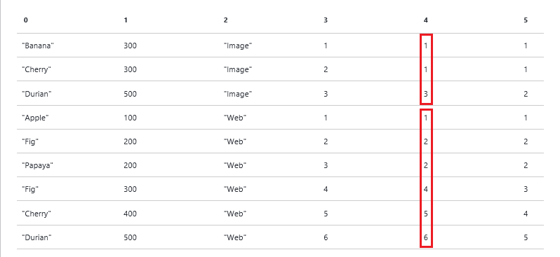

<properties 
   pageTitle="使用 U SQL 視窗函數 Azure 資料湖 Aanlytics 工作 |Azure" 
   description="瞭解如何使用 U SQL 視窗函數。 " 
   services="data-lake-analytics" 
   documentationCenter="" 
   authors="edmacauley" 
   manager="jhubbard" 
   editor="cgronlun"/>
 
<tags
   ms.service="data-lake-analytics"
   ms.devlang="na"
   ms.topic="article"
   ms.tgt_pltfrm="na"
   ms.workload="big-data" 
   ms.date="05/16/2016"
   ms.author="edmaca"/>

# Azure 資料湖分析工作使用 U SQL 視窗函數  

視窗函數所採用 ISO/ANSI SQL 標準 2003年中。 U SQL 會採用子集視窗函數所定義的 ANSI SQL 標準。

視窗函數用來執行計算中的列稱為*windows*。 Windows 是由移轉子句定義。 視窗函數解決一些重要的情況相當有效的方式。

此學習指南逐步引導您完成一些範例案例，您可以套用視窗函數使用兩個範例資料集。 如需詳細資訊，請參閱[U SQL 參考](http://go.microsoft.com/fwlink/p/?LinkId=691348)。

視窗函數被歸納為︰ 

- [報告彙總函式](#reporting-aggregation-functions)，例如加總] 或 [平均
- [排名函數](#ranking-functions)，例如 DENSE_RANK、 即、 NTILE 及排名
- [分析的函數](#analytic-functions)，例如累加分配、 的百分位數或上一個] 列中相同的結果，而不使用自我聯結設定存取資料

**先決條件︰**

- 請透過下列兩個教學課程︰

    - [使用 Visual Studio Azure 資料湖工具快速入門](data-lake-analytics-data-lake-tools-get-started.md)。
    - [開始使用 U SQL Azure 資料湖分析工作](data-lake-analytics-u-sql-get-started.md)。
- [開始使用 Visual Studio Azure 資料湖工具](data-lake-analytics-data-lake-tools-get-started.md)中的指示，請建立一個資料分析湖的帳戶。
- [開始使用 U SQL Azure 資料湖分析工作](data-lake-analytics-u-sql-get-started.md)中的指示，請建立 Visual Studio U SQL 專案。

## 範例資料集

本教學課程中使用兩個資料集︰

- QueryLog 

    QueryLog 代表清單的人員搜尋引擎中的搜尋。 每個查詢記錄包括︰
    
        - Query - What the user was searching for.
        - Latency - How fast the query came back to the user in milliseconds.
        - Vertical - What kind of content the user was interested in (Web links, Images, Videos).
    
    複製並貼上下列的指令碼至您 U SQL project 建構 QueryLog 資料列︰
    
        @querylog = 
            SELECT * FROM ( VALUES
                ("Banana"  , 300, "Image" ),
                ("Cherry"  , 300, "Image" ),
                ("Durian"  , 500, "Image" ),
                ("Apple"   , 100, "Web"   ),
                ("Fig"     , 200, "Web"   ),
                ("Papaya"  , 200, "Web"   ),
                ("Avocado" , 300, "Web"   ),
                ("Cherry"  , 400, "Web"   ),
                ("Durian"  , 500, "Web"   ) )
            AS T(Query,Latency,Vertical);
    
    在練習中，資料會很可能會儲存於資料檔案。 您想要存取該資料 eml tab 字元分隔的檔案，請使用下列程式碼︰ 
    
        @querylog = 
        EXTRACT 
            Query    string, 
            Latency  int, 
            Vertical string
        FROM "/Samples/QueryLog.tsv"
        USING Extractors.Tsv();

- 員工

    員工資料集包含下列欄位︰
   
        - EmpID - Employee ID.
        - EmpName  Employee name.
        - DeptName - Department name. 
        - DeptID - Deparment ID.
        - Salary - Employee salary.

    複製並貼上下列的指令碼至您 U SQL project 的 construcint 員工資料列︰

        @employees = 
            SELECT * FROM ( VALUES
                (1, "Noah",   "Engineering", 100, 10000),
                (2, "Sophia", "Engineering", 100, 20000),
                (3, "Liam",   "Engineering", 100, 30000),
                (4, "Emma",   "HR",          200, 10000),
                (5, "Jacob",  "HR",          200, 10000),
                (6, "Olivia", "HR",          200, 10000),
                (7, "Mason",  "Executive",   300, 50000),
                (8, "Ava",    "Marketing",   400, 15000),
                (9, "Ethan",  "Marketing",   400, 10000) )
            AS T(EmpID, EmpName, DeptName, DeptID, Salary);
    
    下列陳述式中，示範如何建立資料列集來擷取資料檔案。
    
        @employees = 
        EXTRACT 
            EmpID    int, 
            EmpName  string, 
            DeptName string, 
            DeptID   int, 
            Salary   int
        FROM "/Samples/Employees.tsv"
        USING Extractors.Tsv();

當您在教學課程中測試範例時，您必須包含的資料列集定義。 U SQL 要求您定義只的資料列集所使用的。 部分範例只需要一個資料列集。

您也必須新增下列陳述式輸出資料檔案的結果資料列集︰

    OUTPUT @result TO "/wfresult.csv" 
        USING Outputters.Csv();
 
 大部分的範例使用變數稱為 「**@result**的結果。

## 比較群組視窗函數

視窗和分組的概念關聯也不同。 還是有幫助瞭解此關聯。

### 使用彙總及群組

下列查詢會使用彙總，來計算所有員工的薪資總和︰

    @result = 
        SELECT 
            SUM(Salary) AS TotalSalary
        FROM @employees;
    
>[AZURE.NOTE] 測試和檢查輸出的指示，請參閱[開始使用 U SQL Azure 資料湖分析工作](data-lake-analytics-u-sql-get-started.md)。

結果為具有單一資料行的單一資料列。 $165000 是從整個表格的薪資值的總和。 

|TotalSalary
|-----------
|165000

>[AZURE.NOTE] 如果您是新 windows 函數，還是有幫助記住輸出內的數字。  

下列陳述式來計算每個部門總 salery 使用 GROUP BY 子句︰

    @result=
        SELECT DeptName, SUM(Salary) AS SalaryByDept
        FROM @employees
        GROUP BY DeptName;

結果是︰

|DeptName|SalaryByDept
|--------|------------
|工程|60000
|人力資源|30000
|高階主管|50000
|行銷|25000

SalaryByDept 欄的總和為 $165000，符合中的最後一個指令碼量。
 
在下列情況下該處的數種較少輸出資料列數比輸入的列數
 
- 群組依據]，而彙總會摺到單一資料列的所有資料列。 
- 使用 [群組依據]，還有 N 輸出資料列 N 是出現在資料，如此一來，您會收到 4 列輸出中的唯一值的數目。

###  使用視窗函數

在下列範例中，對子句是空的。 定義要包含的所有資料列 」 視窗]。 在此範例中總和會套用至其早於移轉子句。

您可以閱讀此查詢作為: 」 的總和薪資移到視窗的所有資料列上方 」。

    @result=
        SELECT
            EmpName,
            SUM(Salary) OVER( ) AS SalaryAllDepts
        FROM @employees;

不同於 [群組依據]，有許多輸出以輸入的資料列的資料列︰ 

|EmpName|TotalAllDepts
|-------|--------------------
|時局|165000
|Sophia|165000
|Liam|165000
|Emma|165000
|因此|165000
|灣|165000
|Mason|165000
|Ava|165000
|Ethan|165000

165000 （所有薪資的總計） 的值會放在每個輸出資料列。 總計是來自 「 視窗 」 的所有資料列，讓它包含所有的薪資。 

下一個範例會示範如何以縮小列出所有員工、 部門] 和 [總薪資部門 」 視窗]。 分割區以會新增至移轉子句。

    @result=
    SELECT
        EmpName, DeptName,
        SUM(Salary) OVER( PARTITION BY DeptName ) AS SalaryByDept
    FROM @employees;

結果是︰

|EmpName|DeptName|SalaryByDep
|-------|--------|-------------------
|時局|工程|60000
|Sophia|工程|60000
|Liam|工程|60000
|Mason|高階主管|50000
|Emma|人力資源|30000
|因此|人力資源|30000
|灣|人力資源|30000
|Ava|行銷|25000
|Ethan|行銷|25000

同樣地，有輸出資料列數相同的輸入資料列。 然而每個資料列都有相對應的部門的總薪資。

## 報表彙總函式

視窗函數也支援下列彙總︰

- 字數統計
- 加總
- 最小值
- 最大值
- 平均
- STDEV 函數
- VAR

語法︰

    <AggregateFunction>( [DISTINCT] <expression>) [<OVER_clause>]

附註︰ 

- 根據預設，彙總函數，除了字數統計，會忽略 null 值。
- 當移轉子句以及指定彙總函式時，移轉子句中不允許 ORDER BY 子句。

### 使用加總

下列範例會新增至每個輸入的資料列的部門所薪資總和︰
 
    @result=
        SELECT 
            *,
            SUM(Salary) OVER( PARTITION BY DeptName ) AS TotalByDept
        FROM @employees;

輸出如下︰

|EmpID|EmpName|DeptName|DeptID|薪資|TotalByDept
|-----|-------|--------|------|------|-----------
|1|時局|工程|100|10000|60000
|2|Sophia|工程|100|20000|60000
|3|Liam|工程|100|30000|60000
|7|Mason|高階主管|300|50000|50000
|4|Emma|人力資源|200|10000|30000
|5|因此|人力資源|200|10000|30000
|6|灣|人力資源|200|10000|30000
|8|Ava|行銷|400|15000|25000
|9|Ethan|行銷|400|10000|25000

### 使用字數統計

下列範例顯示在每個部門的總的數字員工的每個資料列中加入額外的欄位。

    @result =
        SELECT *, 
            COUNT(*) OVER(PARTITION BY DeptName) AS CountByDept 
        FROM @employees;

結果︰

|EmpID|EmpName|DeptName|DeptID|薪資|CountByDept
|-----|-------|--------|------|------|-----------
|1|時局|工程|100|10000|3
|2|Sophia|工程|100|20000|3
|3|Liam|工程|100|30000|3
|7|Mason|高階主管|300|50000|1
|4|Emma|人力資源|200|10000|3
|5|因此|人力資源|200|10000|3
|6|灣|人力資源|200|10000|3
|8|Ava|行銷|400|15000|2
|9|Ethan|行銷|400|10000|2

### 使用 MIN 與 MAX

下列範例會額外的欄位，以顯示每個部門的最低薪資每個資料列︰

    @result =
        SELECT 
            *,
            MIN(Salary) OVER( PARTITION BY DeptName ) AS MinSalary
        FROM @employees;

結果︰

|EmpID|EmpName|DeptName|DeptID|薪資|MinSalary
|-----|-------|--------|------|-------------|----------------
|1|時局|工程|100|10000|10000
|2|Sophia|工程|100|20000|10000
|3|Liam|工程|100|30000|10000
|7|Mason|高階主管|300|50000|50000
|4|Emma|人力資源|200|10000|10000
|5|因此|人力資源|200|10000|10000
|6|灣|人力資源|200|10000|10000
|8|Ava|行銷|400|15000|10000
|9|Ethan|行銷|400|10000|10000

取代最大值的最小值，然後嘗試一下。

## 排名函數

所定義的磁碟分割及透過子句排名函數︰ 傳回每個資料列中每個資料分割等級值 (long)。 排名的順序會控制 ORDER BY 移轉子句中。

以下被支援的排名函數︰

- 排名
- DENSE_RANK 
- NTILE
- 即

**語法︰**

    [ RANK() | DENSE_RANK() | ROW_NUMBER() | NTILE(<numgroups>) ]
        OVER (
            [PARTITION BY <identifier, > …[n]]
            [ORDER BY <identifier, > …[n] [ASC|DESC]] 
    ) AS <alias>

- ORDER BY 子句都是選擇性的排名函數。 如果指定順序，它會決定排序的順序。 如果 ORDER BY 未指定 U SQL 會指派順序所根據的值，然後將其讀取記錄。 因此所產生的列或數字，rank 密集非確定值中的大小寫在 rank 已排序子句未指定。
- NTILE 需要正整數評估的運算式。 這個數字指定群組，您必須分割為每個資料分割的數目。 使用此識別碼只能與 NTILE 排名函數。 

如需移轉子句的詳細資訊，請參閱[U SQL 參考]()。

即排名]，與 DENSE_RANK 所有指定數字在視窗中的資料列。 而不是個別封面，則若要查看他們如何回應相同的輸入一目了然。

    @result =
    SELECT 
        *,
        ROW_NUMBER() OVER (PARTITION BY Vertical ORDER BY Latency) AS RowNumber,
        RANK() OVER (PARTITION BY Vertical ORDER BY Latency) AS Rank, 
        DENSE_RANK() OVER (PARTITION BY Vertical ORDER BY Latency) AS DenseRank 
    FROM @querylog;
        
請注意，移轉子句相同。 結果︰

|查詢|Int 延遲︰|垂直|RowNumber|排名|DenseRank
|-----|-----------|--------|--------------|---------|--------------
|香蕉|300|圖像|1|1|1
|櫻桃|300|圖像|2|1|1
|Durian|500|圖像|3|3|2
|Apple|100|網頁|1|1|1
|Fig|200|網頁|2|2|2
|Papaya|200|網頁|3|2|2
|Fig|300|網頁|4|4|3
|櫻桃|400|網頁|5|5|4
|Durian|500|網頁|6|6|5

### 即

每個視窗內 (垂直圖像或網頁)，1 列增加排序的延遲。  

### 排名

不同 ROW_NUMBER()，RANK() 會考慮的延遲視窗 ORDER BY 子句中所指定的值。

排名開頭 (1,1,3)，因為延遲的前兩個值相同。 然後下一個值是 3，因為已經到 500 開啟 [延遲] 的值。 索引鍵指向在於即使重複的值會提供相同的排名，數字的次序將 「 略過 」 的下一個即值。 您可以查看網頁垂直中重複使用的順序 (2,2,4) 這個模式。

### DENSE_RANK
    
DENSE_RANK 就像時請改為至下一個即，排列除了它不會 「 略過]，移至下一個的編號順序。 請注意順序 (1,1,2) 和 (2,2,3) 範例中。

### 註解

- 如果 ORDER BY 不指定超過排名函數將會套用到資料列集不含任何順序。 這樣會將非確定的行為方式套用排名函數
- 有的使用即查詢所傳回的資料列會訂購完全相同的每次執行除非滿足下列條件不保證。

    - 分割資料行的值都是唯一的。
    - ORDER BY 資料行的值都是唯一的。
    - 組合的資料分割資料行和順序循欄的值都是唯一的。

### NTILE

NTILE 散佈到群組的指定數字的中排序的磁碟分割的資料列。 編號的群組，從 1 開始。 

下列範例會分割 4 的群組，以的查詢延遲，順序 （垂直） 中每個資料分割的資料列的設定，並傳回每個資料列的群組數字。 

圖像垂直有 3 個資料列，因此有 3 的群組。 

Web 垂直有 6 的列，兩個額外的資料列散發前兩個群組。 已有群組 1 和 2，] 群組中的資料列 2 和僅 1 列中的原因群組 3 和群組的 4。  

    @result =
        SELECT 
            *,
            NTILE(4) OVER(PARTITION BY Vertical ORDER BY Latency) AS Quartile   
        FROM @querylog;
        
結果︰

|查詢|延遲|垂直|四分位數
|-----|-----------|--------|-------------
|香蕉|300|圖像|1
|櫻桃|300|圖像|2
|Durian|500|圖像|3
|Apple|100|網頁|1
|Fig|200|網頁|1
|Papaya|200|網頁|2
|Fig|300|網頁|2
|櫻桃|400|網頁|3
|Durian|500|網頁|4

NTILE 採用參數 (「 numgroups 」)。 Numgroups 是正數 int 或 long 常數的運算式，指定的群組，您必須分割為每個資料分割數目。 

- 如果除以 numgroups 的磁碟分割的資料列數目的群組會具有相同大小。 
- 如果在磁碟分割的資料列數目不能被 numgroups 整除，會有一個成員的不同的兩個大小的群組。 較大型群組的前面移轉子句所指定的順序較小的群組。 

例如︰

- 100 個資料列分成 4 的群組: [25、 25、 25、 25]
- 102 devided 4 分組的資料列: [26、 26、 25、 25]

### 每個透過排名、 DENSE_RANK 或即的磁碟分割的前 n 個記錄

許多使用者想要選取只前 n 個資料列的每個群組。 這不是使用傳統群組依據。 

您已經看到範例開頭的排名函數一節。 不會顯示每個資料分割的前 n 個記錄︰

    @result =
    SELECT 
        *,
        ROW_NUMBER() OVER (PARTITION BY Vertical ORDER BY Latency) AS RowNumber,
        RANK() OVER (PARTITION BY Vertical ORDER BY Latency) AS Rank,
        DENSE_RANK() OVER (PARTITION BY Vertical ORDER BY Latency) AS DenseRank
    FROM @querylog;

結果︰

|查詢|延遲|垂直|排名|DenseRank|RowNumber
|-----|-----------|--------|---------|--------------|--------------
|香蕉|300|圖像|1|1|1
|櫻桃|300|圖像|1|1|2
|Durian|500|圖像|3|2|3
|Apple|100|網頁|1|1|1
|Fig|200|網頁|2|2|2
|Papaya|200|網頁|2|2|3
|Fig|300|網頁|4|3|4
|櫻桃|400|網頁|5|4|5
|Durian|500|網頁|6|5|6

### 使用密集排名前 N

下列範例會傳回從無間距連續 rank 編號中每個視窗分割的資料列的每個群組的前 3 個記錄。

    @result =
    SELECT 
        *,
        DENSE_RANK() OVER (PARTITION BY Vertical ORDER BY Latency) AS DenseRank
    FROM @querylog;
    
    @result = 
        SELECT *
        FROM @result
        WHERE DenseRank <= 3;

結果︰

|查詢|延遲|垂直|DenseRank
|-----|-----------|--------|--------------
|香蕉|300|圖像|1
|櫻桃|300|圖像|1
|Durian|500|圖像|2
|Apple|100|網頁|1
|Fig|200|網頁|2
|Papaya|200|網頁|2
|Fig|300|網頁|3

### 排名前 N

    @result =
        SELECT 
            *,
            RANK() OVER (PARTITION BY Vertical ORDER BY Latency) AS Rank
        FROM @querylog;
    
    @result = 
        SELECT *
        FROM @result
        WHERE Rank <= 3;

結果︰    

|查詢|延遲|垂直|排名
|-----|-----------|--------|---------
|香蕉|300|圖像|1
|櫻桃|300|圖像|1
|Durian|500|圖像|3
|Apple|100|網頁|1
|Fig|200|網頁|2
|Papaya|200|網頁|2

### 使用即的前 n 個

    @result =
        SELECT 
            *,
            ROW_NUMBER() OVER (PARTITION BY Vertical ORDER BY Latency) AS RowNumber
        FROM @querylog;
    
    @result = 
        SELECT *
        FROM @result
        WHERE RowNumber <= 3;

結果︰   
    
|查詢|延遲|垂直|RowNumber
|-----|-----------|--------|--------------
|香蕉|300|圖像|1
|櫻桃|300|圖像|2
|Durian|500|圖像|3
|Apple|100|網頁|1
|Fig|200|網頁|2
|Papaya|200|網頁|3

### 指派全域唯一資料列數目

通常是幫助以指派給每個資料列的 [全域唯一的數字。 這是 （和效率，比使用減壓器） 使用排名函數。

    @result =
        SELECT 
            *,
            ROW_NUMBER() OVER () AS RowNumber
        FROM @querylog;

<!-- ################################################### -->
## 分析函數

分析函數用來瞭解 windows 中的數值分配。 最常見的案例的使用分析函數是百分位數的計算。

**支援分析視窗函數**

- CUME_DIST 
- PERCENT_RANK
- PERCENTILE_CONT
- PERCENTILE_DISC

### CUME_DIST  

CUME_DIST 計算指定值的值] 群組中的相對位置。 它會計算百分比的同一個垂直中有延遲小於或等於目前的查詢延遲的查詢。 R 資料列，假設遞增順序，CUME_DIST 的 R 值低於或等於的 R 值的資料列的數字除以的評估分割或查詢結果集中的列數。 CUME_DIST 會傳回介於 0 的數字 < x < = 1。

**語法**

    CUME_DIST() 
        OVER (
            [PARTITION BY <identifier, > …[n]]
            ORDER BY <identifier, > …[n] [ASC|DESC] 
    ) AS <alias>

下列範例會使用 CUME_DIST 函數來計算的每一個查詢內垂直延遲百分位數。 

    @result=
        SELECT 
            *,
            CUME_DIST() OVER(PARTITION BY Vertical ORDER BY Latency) AS CumeDist
        FROM @querylog;

結果︰
    
|查詢|延遲|垂直|CumeDist
|-----|-----------|--------|---------------
|Durian|500|圖像|1
|香蕉|300|圖像|0.666666666666667
|櫻桃|300|圖像|0.666666666666667
|Durian|500|網頁|1
|櫻桃|400|網頁|0.833333333333333
|Fig|300|網頁|0.666666666666667
|Fig|200|網頁|0.5
|Papaya|200|網頁|0.5
|Apple|100|網頁|0.166666666666667

分割分割索引鍵是 」 Web 」 的位置中有 6 的資料列 (4th 列，並向下):

- 有 6 的資料列的值等於或小於 500，因此 CUME_DIST 等於 6/6 = 1
- 有 5 的資料列的值等於或小於 400，因此 CUME_DIST 等於 5/6 = 0.83
- 有 4 列的值等於或低於 300，因此 CUME_DIST 等於 4/6 = 0.66
- 有 3 個資料列的值等於或小於 200，因此 CUME_DIST 等於 3/6 = 0.5。 有兩個資料列具有相同的延遲時間值。
- 1 的資料列的值等於或小於 100，因此 CUME_DIST 等於 1/6 = 0.16。 

**使用方式的附註︰**

- 繫結值一定會評估為相同的累加分配值。
- NULL 值會被視為最低的可能值。
- 您必須指定計算 CUME_DIST ORDER BY 子句。
- CUME_DIST 是類似 PERCENT_RANK 函數

注意︰ 如果 SELECT 陳述式不後面輸出不允許 ORDER BY 子句。 因此輸出陳述式中的 ORDER BY 子句會決定結果集的顯示順序。

### PERCENT_RANK

PERCENT_RANK 計算資料列的群組內的資料列相關的排名。 PERCENT_RANK 用來評估內的資料列集或磁碟分割的相對位置。 範圍 PERCENT_RANK 所傳回的值大於 0 且小於或等於 1。 與 CUME_DIST，PERCENT_RANK 永遠是 0 的第一列。
    
**語法**

    PERCENT_RANK() 
        OVER (
            [PARTITION BY <identifier, > …[n]]
            ORDER BY <identifier, > …[n] [ASC|DESC] 
        ) AS <alias>

**備忘稿**

- 在任何設定的第一列有 PERCENT_RANK 為 0。
- NULL 值會被視為最低的可能值。
- 您必須指定計算 PERCENT_RANK ORDER BY 子句。
- CUME_DIST 是類似 PERCENT_RANK 函數 

下列範例會使用 PERCENT_RANK 函數來計算的每一個查詢內垂直延遲百分位數。 

分割 BY 子句會指定要分割垂直將結果中的資料列。 ORDER BY 子句移轉子句中的排序資料列中每個資料分割。 

PERCENT_RANK 函數所傳回的值表示垂直內的查詢的延遲的百分比的排名。 

    @result=
        SELECT 
            *,
            PERCENT_RANK() OVER(PARTITION BY Vertical ORDER BY Latency) AS PercentRank
        FROM @querylog;

結果︰

|查詢|Int 延遲︰|垂直|PercentRank
|-----|-----------|--------|------------------
|香蕉|300|圖像|0
|櫻桃|300|圖像|0
|Durian|500|圖像|1
|Apple|100|網頁|0
|Fig|200|網頁|0.2
|Papaya|200|網頁|0.2
|Fig|300|網頁|0.6
|櫻桃|400|網頁|0.8
|Durian|500|網頁|1

### PERCENTILE_CONT 與 PERCENTILE_DISC

這兩個函數會計算根據 [接續本頁] 分或不連續的資料行值分配百分位數。

**語法**

    [PERCENTILE_CONT | PERCENTILE_DISC] ( numeric_literal ) 
        WITHIN GROUP ( ORDER BY <identifier> [ ASC | DESC ] )
        OVER ( [ PARTITION BY <identifier,>…[n] ] ) AS <alias>

**numeric_literal** -來計算百分位數。 值必須 0.0 到 1.0 之間的範圍。

群組內 (依<identifier>[ASC |遞減]）-指定數字排序，並透過計算百分位數的值清單。 允許只有一個資料行的識別碼。 運算式必須評估為數值類型。 不允許其他資料類型。 預設的排序順序遞增。

透過 （[分割由 < 識別碼] >...[n]])-會將輸入的資料列分成磁碟分割區依照 percentile 函數所套用的磁碟分割鍵。 如需詳細資訊，請參閱排名這份文件的區段。
附註︰ 在資料集的任何 null 值會略過。

**PERCENTILE_CONT**計算百分位數根據連續的通訊群組的資料行的值。 結果補，而且可能不等於欄中的任何特定的值。 

**PERCENTILE_DISC**計算根據不連續的通訊群組的資料行值的百分位數。 結果是等於欄中的特定值。 換句話說，PERCENTILE_DISC，相反至 PERCENTILE_CONT，一律會傳回實際 （原始輸入） 值。

您可以看到兩哪些嘗試尋找中位數下列範例中的運作方式 (百分位數 = 0.50) 值中每個垂直延遲

    @result = 
        SELECT 
            Vertical, 
            Query,
            PERCENTILE_CONT(0.5) 
                WITHIN GROUP (ORDER BY Latency)
                OVER ( PARTITION BY Vertical ) AS PercentileCont50,
            PERCENTILE_DISC(0.5) 
                WITHIN GROUP (ORDER BY Latency) 
                OVER ( PARTITION BY Vertical ) AS PercentileDisc50 
        
        FROM @querylog;

結果︰

|查詢|Int 延遲︰|垂直|PercentileCont50|PercentilDisc50
|-----|-----------|--------|-------------------|----------------
|香蕉|300|圖像|300|300
|櫻桃|300|圖像|300|300
|Durian|500|圖像|300|300
|Apple|100|網頁|250|200
|Fig|200|網頁|250|200
|Papaya|200|網頁|250|200
|Fig|300|網頁|250|200
|櫻桃|400|網頁|250|200
|Durian|500|網頁|250|200

針對 PERCENTILE_CONT 可以補值，因為 web 的中位數為 250 個即使沒有垂直網頁版中的查詢具有 250 延遲時間。 

PERCENTILE_DISC 不會插入的值，網站的中位數為 200-實際找到中輸入的資料列的值。

## 另請參閱

- [Microsoft Azure 資料湖分析的概觀](data-lake-analytics-overview.md)
- [開始使用資料湖分析使用 Azure 入口網站](data-lake-analytics-get-started-portal.md)
- [使用 PowerShell 的 Azure 資料湖分析快速入門](data-lake-analytics-get-started-powershell.md)
- [開發 U SQL 指令碼的 Visual Studio 中使用資料湖工具](data-lake-analytics-data-lake-tools-get-started.md)
- [使用 Azure 資料湖分析互動式教學課程](data-lake-analytics-use-interactive-tutorials.md)
- [分析網站記錄使用 Azure 資料湖狀況分析](data-lake-analytics-analyze-weblogs.md)
- [開始使用 Azure 資料湖分析 U SQL 語言](data-lake-analytics-u-sql-get-started.md)
- [管理 Azure 資料湖分析使用 Azure 入口網站](data-lake-analytics-manage-use-portal.md)
- [管理使用 Azure PowerShell 的 Azure 資料湖狀況分析](data-lake-analytics-manage-use-powershell.md)
- [監控和疑難排解 Azure 資料湖分析工作使用 Azure 入口網站](data-lake-analytics-monitor-and-troubleshoot-jobs-tutorial.md)
