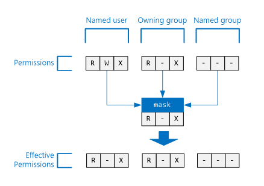
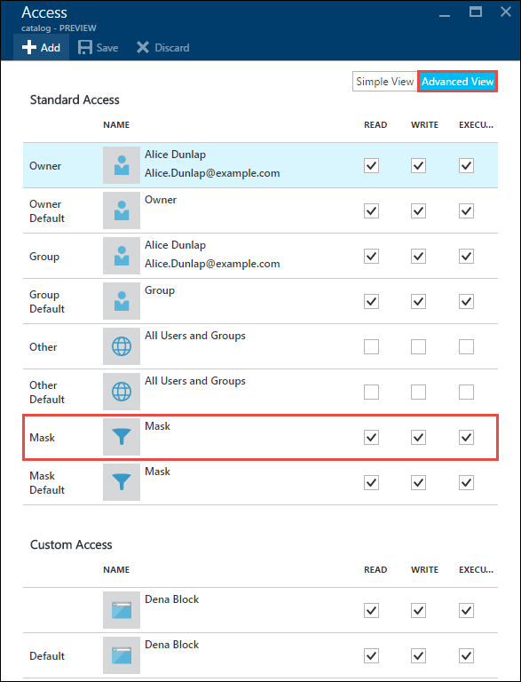

<properties
   pageTitle="存取控制資料湖存放區中的概觀 |Microsoft Azure"
   description="瞭解如何存取 Azure 資料湖存放區中的控制項"
   services="data-lake-store"
   documentationCenter=""
   authors="nitinme"
   manager="jhubbard"
   editor="cgronlun"/>

<tags
   ms.service="data-lake-store"
   ms.devlang="na"
   ms.topic="get-started-article"
   ms.tgt_pltfrm="na"
   ms.workload="big-data"
   ms.date="09/06/2016"
   ms.author="nitinme"/>

# Azure 資料湖存放區中存取控制

資料湖存放實作便會從 HDFS，和從 POSIX 存取控制模型，因此存取控制模型。 本文概述存取控制模型資料湖市集的基本概念。 若要瞭解更多關於 HDFS 存取控制模型，請參閱[HDFS 權限指南](https://hadoop.apache.org/docs/current/hadoop-project-dist/hadoop-hdfs/HdfsPermissionsGuide.html)。

## 存取控制清單上的檔案和資料夾

有兩種類型的存取控制清單 (Acl)-**存取 Acl**及**預設 Acl**。

* **存取 Acl** – 這些控制項物件的存取權。 檔案和資料夾都有存取 Acl。

* **預設 Acl** – 「 範本 」 Acl 的資料夾，以決定存取 Acl 該資料夾下建立任何子項目相關聯。 檔案沒有預設 Acl。

存取 Acl 和預設 Acl 都有相同的結構。

>[AZURE.NOTE] 變更預設 ACL 上層上並不會影響存取 ACL 或子項目已存在的預設 ACL。

## 使用者與身分識別

每個檔案與資料夾具有這些身分識別的唯一權限︰

* 主控使用者的檔案
* [擁有者] 群組
* 使用者名稱
* 具名的群組
* 所有其他的使用者

使用者和群組的身分識別的 Azure Active Directory (AAD) 的身分識別，除非另行註明 「 使用者 」，資料湖存放區的內容中可能表示 AAD 使用者或 AAD 安全性群組。

## 權限

在檔案系統物件上的權限**讀取**、**撰寫**，而**執行**和他們能在檔案和資料夾下表所示。

|            |    檔案     |   資料夾 |
|------------|-------------|----------|
| **Read (R)** | 可以讀取檔案的內容 | 需要**讀取**和**執行**清單] 資料夾的內容。|
| **寫入 (W)** | 可以撰寫或附加檔案 | 需要**寫入與執行**以建立子資料夾中的項目。 |
| **執行 (X)** | 不代表資料湖存放區的內容中的任何項目 | 需要往返子資料夾的項目。 |

### 簡短的權限的表單

**RWX**用來表示**閱讀 + 撰寫 + 執行**。 更多壓縮的數字形式存在的**閱讀 = 4**，**撰寫 = 2**，及**執行 = 1**其總和代表權限。 以下是一些範例。

| 數字的表單 | 簡短的表單 |      意義     |
|--------------|------------|------------------------|
| 7            | RWX        | 閱讀 + 撰寫 + 執行 |
| 5            | R X        | 讀取 + 執行         |
| 4            | R-        | 已讀取                   |
| 0            | ---        | 沒有權限         |

### 不會權限繼承

POSIX 樣式模型資料湖市集使用中的項目權限會儲存在項目本身。 換句話說，無法用某個項目的權限繼承的父項目。

## 常見的案例相關權限

以下是一些常見的案例，若要瞭解哪些權限所需執行某些操作，在資料湖儲存的帳戶。

### 若要閱讀檔案所需的權限

* 若要閱讀的檔案來電者需要**讀取**權限
* 所有資料夾] 資料夾結構中含有檔案的來電者都需要**執行**的權限

### 附加檔案至所需的權限

* 檔案附加到-呼叫者需要**寫入**權限
* 所有包含檔案的資料夾，來電者需要**執行**的權限

### 若要刪除檔案所需的權限

* 來電者將需要上層資料夾-**撰寫 + 執行**的權限
* 所有其他資料夾中檔案的路徑-來電者需要**執行**的權限

>[AZURE.NOTE] 撰寫檔案的權限不一定要刪除的檔案，只要在上述兩個條件為真。

### 列舉資料夾所需的權限

* 列舉-資料夾來電者需要**閱讀 + 執行**的權限
* 所有的上階資料夾-來電者需要**執行**的權限

## Azure 入口網站中檢視權限

從資料湖存放客戶**資料總管**刀，按一下 [若要查看的檔案或資料夾的 Acl**存取**]。 在以下的螢幕擷取畫面，按一下 [若要查看的 Acl **mydatastore**帳號] 之下的 [**目錄**] 資料夾的存取]。

之後，從**Access**刀中，按一下 [**簡單的檢視**以查看簡單的檢視。

按一下 [**進階檢視**来查看更多進階的檢視。

## 進階使用者

進階使用者資料湖存放區中有最的所有使用者的權限。 進階的使用者︰

* 具有 RWX 權限**所有**檔案和資料夾
* 可以變更任何檔案或資料夾的權限。
* 可以變更擁有者的使用者或擁有者] 群組中的任何檔案或資料夾。

在 Azure 資料湖存放帳戶會有數種 Azure 角色︰

* 擁有者
* 參與者
* 助讀程式
* 等。

資料湖存放帳戶**擁有者**角色的每一位使用者會自動超級使用者使用該帳戶。 若要瞭解更多關於 Azure 角色基礎存取控制 (RBAC) 請參閱[角色型存取控制](../active-directory/role-based-access-control-configure.md)。

## 擁有者的使用者

建立項目的使用者會自動項目的擁有者的使用者。 擁有者的使用者可以︰

* 變更檔案是所擁有的權限
* 變更主控群組所擁有的檔案，只要主控使用者也是目標群組的成員。

>[AZURE.NOTE] 主控使用者**不可以**變更擁有的另一個檔案的擁有者的使用者。 只有超級使用者可以變更檔案或資料夾的擁有者的使用者。

## [擁有者] 群組

在 POSIX Acl，每位使用者是 「 主要群組 」 與相關聯。 例如，使用者 」 alice 」 可能屬於 「 財務 」 群組。 Alice 可能屬於多個群組，但一個群組一律會指定為其主要的群組。 在 POSIX，當 Alice 建立的檔案]，該檔案的擁有者的群組設定其主要的群組，在本例中為 「 財務 」。
 
建立新的檔案系統項目時，資料湖存放會指派值擁有的群組。 

* **案例 1**的根資料夾 」 / 」。 建立資料湖存放帳戶時，會建立此資料夾。 在此情況下擁有的群組會設定為使用者建立帳戶。
* **案例 2**（每個其他的情況）-建立新的項目時，就會從上層資料夾複製擁有的群組。

可以變更擁有的群組︰
* 任何超級使用者
* 主控使用者，如果使用者擁有者也是目標群組的成員。

## Access 核取演算法

下圖所表示的 access 核取演算法資料湖存放帳戶。

## 遮罩及 [有效權限]

**遮罩**是用來限制**為使用者**、**擁有] 群組中**，，**為群組**的存取權時執行的 Access 檢查演算法 RWX 值。 以下是遮罩的重要概念。 

* 遮罩建立 [有效權限]，也就是一次的核取 [存取修改權限。
* 遮罩可直接編輯檔案的擁有者及任何超級使用者。
* 遮罩有移除權限可建立的有效權限的能力。 遮罩**不可以**將有效的權限的權限。 

讓我們看看一些範例。 以下，遮罩會設定為**RWX**，這表示遮罩不會移除任何權限。 請注意名稱的使用者、 擁有者] 群組中，及命名的群組的有效權限存取檢查時不會變更。

在下面的範例中，遮罩已設為**R X**。 因此，將其用於**名為使用者****擁有] 群組中**，與**命名為 [群組**的存取權限時的 [**關閉 [寫入] 權限**核取。

參照，以下是檔案或資料夾的遮罩 Azure 入口網站中出現的位置。

>[AZURE.NOTE] 為新的資料湖存放帳戶，存取 ACL 和的根資料夾 （「 / 」） 的預設 ACL 遮罩會預設為 RWX。

## 在新的檔案和資料夾的權限

在 [現有的資料夾下建立新的檔案或資料夾，決定預設 ACL 上層資料夾︰

* 子資料夾的預設 ACL 與存取 ACL
* 子檔案的存取 ACL （檔案沒有預設的 ACL）

### 子檔案或資料夾的存取 ACL

建立子檔案或資料夾時，會將父預設 ACL 複製為子檔案或資料夾的存取 ACL。 此外，如果**其他**使用者中父項的預設 ACL RWX 權限，就會完全移除從子項目的存取 ACL。

在大多數情況下，上述資訊是您所應該要瞭解如何決定子項目存取 ACL。 不過，如果您熟悉 POSIX 系統，並且想要了解探討如何達到這個轉換，請參閱本文稍後的一節[中建立新的檔案與資料夾的存取 ACL Umask 的角色](#umasks-role-in-creating-the-access-acl-for-new-files-and-folders)。
 

### 子資料夾的預設 ACL

上層資料夾下建立子資料夾時，因為它是與子資料夾的預設 ACL 複製上層資料夾的預設 ACL 循列列印]。

## 了解 Acl 資料湖存放區中的進階的主題

以下是幾個進階主題可協助您瞭解如何決定 Acl 資料湖存放檔案或資料夾。

### 建立新的檔案與資料夾的存取 ACL Umask 的角色

在 POSIX 相容的系統，一般的概念會是該 umask 是用來轉換**擁有使用者****擁有] 群組中**，與**其他**新的子檔案或資料夾的存取 ACL 上的權限的上層資料夾 9 位元值。 Umask 的位元識別關閉子項目的存取 ACL 中的位元。 因此是用來選擇性地防止傳播擁有擁有] 群組中，使用者的權限及其他。
  
Umask HDFS 系統，通常是由系統管理員控制的全網站的設定選項。 資料湖存放區使用不能變更**帳戶整個 umask** 。 下表顯示資料湖存放區的 umask。

| 使用者群組  | 設定 | 在新子項目的存取 ACL 的效果 |
|------------ |---------|---------------------------------------|
| 擁有者的使用者 | ---     | 不會影響                             |
| 擁有的群組| ---     | 不會影響                             |
| 其他       | RWX     | 移除閱讀 + 撰寫 + 執行         | 

下圖顯示此 umask 的實際操作。 若要移除**延伸 + 撰寫 + 執行**的**其他**使用者是最後的結果。 由於 umask 未指定的**擁有使用者**和**群組的擁有**的位元，會不會轉換這些權限。

 

### 自黏元

自黏元是 POSIX 檔案系統的更多進階的功能。 在資料湖存放區的內容，不太自黏元將會需要。

下表顯示自黏元資料湖存放區中的運作方式。

| 使用者群組         | 檔案    | 資料夾 |
|--------------------|---------|-------------------------|
| 自黏元**關閉** | 沒有作用   | 沒有作用           |
| 自黏元**開啟**  | 沒有作用   | 防止**超級使用者**並**擁有使用者**的子項目刪除或重新命名該子項目以外的任何人。               |

自黏元不會顯示在 Azure 入口網站。

## Acl 資料湖存放區中的常見問題

以下是一些得到通常提供資料湖存放區中的 Acl 解答的問題。

### 必須啟用 Acl 的支援嗎？

[否]。 Access 控制項透過 Acl 一律會在資料湖存放帳戶。

### 哪些權限，才能遞迴刪除的資料夾和其內容項目？

* **撰寫 + 執行**，必須具備上層資料夾。
* 要刪除的資料夾，每一個資料夾內，需要**閱讀 + 撰寫 + 執行**。
>[AZURE.NOTE] 刪除資料夾中的檔案並不需要寫入的這些檔案。 此外，根資料夾 」 / 」**會刪除**。

### 誰是設定的檔案或資料夾的擁有者？

檔案或資料夾的建立者會變成擁有者。

### 誰是在建立設定為擁有者] 群組中的檔案或資料夾？

複製從上層資料夾建立新的檔案或資料夾的擁有者的群組。

### 我擁有使用者的檔案，但沒有我需要 RWX 權限。 我該怎麼做？

擁有者的使用者可以只要變更檔案的權限，讓自己所需的任何 RWX 權限。

### 資料湖存放是否支援 Acl 的繼承？

[否]。

### 什麼是遮罩與 umask 之間的差異？

| 遮罩 | umask|
|------|------|
| 在每個檔案與資料夾位於 [**遮罩**] 屬性。 | **Umask**是資料湖存放帳戶的屬性。 因此，有只單一 umask 資料湖存放區。    |
| 擁有者的使用者或擁有者] 群組中的檔案或超級使用者可以變更的檔案或資料夾的遮罩屬性。 | 任何使用者，甚至是進階使用者無法修改 umask 屬性。 就無法變更、 固定的值。|
| [遮罩] 屬性用來存取檢查演算法在執行階段期間來判斷使用者是否具有執行作業的檔案或資料夾的權限。 遮罩的角色是建立 [有效權限] 時的存取權的核取。 | Umask 不完全使用期間存取核取。 Umask 用來決定存取 ACL 的新的子資料夾的項目。 |
| 遮罩是適用於名稱的使用者名稱] 群組中，與主控的使用者存取檢查時的 3 位元 RWX 值。| Umask 是擁有者的使用者、 擁有者] 群組中，以及其他新的子系適用於 9 元值。| 

### 何處可以進一步瞭解 POSIX 存取控制模型？

* [http://www.vanemery.com/Linux/ACL/POSIX_ACL_on_Linux.html](http://www.vanemery.com/Linux/ACL/POSIX_ACL_on_Linux.html)

* [HDFS 權限指南](http://hadoop.apache.org/docs/current/hadoop-project-dist/hadoop-hdfs/HdfsPermissionsGuide.html) 

* [POSIX 常見問題集](http://www.opengroup.org/austin/papers/posix_faq.html)

* [POSIX 1003.1 2008年](http://standards.ieee.org/findstds/standard/1003.1-2008.html)

* [POSIX 1003.1e 1997年](http://users.suse.com/~agruen/acl/posix/Posix_1003.1e-990310.pdf)

* [Linux POSIX ACL](http://users.suse.com/~agruen/acl/linux-acls/online/)

* [使用 [Linux 中的 [存取控制清單 ACL](http://bencane.com/2012/05/27/acl-using-access-control-lists-on-linux/)

## 另請參閱

* [Azure 資料湖存放區的概觀](data-lake-store-overview.md)

* [開始使用 Azure 資料湖狀況分析](../data-lake-analytics/data-lake-analytics-get-started-portal.md)

