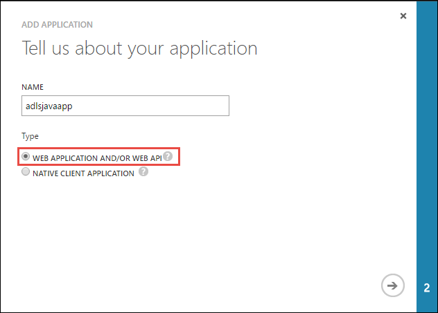

<properties
   pageTitle="使用資料湖存放使用 Active Directory 驗證 |Microsoft Azure"
   description="瞭解如何使用 Active Directory 資料湖存放驗證方法"
   services="data-lake-store"
   documentationCenter=""
   authors="nitinme"
   manager="jhubbard"
   editor="cgronlun"/>

<tags
   ms.service="data-lake-store"
   ms.devlang="na"
   ms.topic="article"
   ms.tgt_pltfrm="na"
   ms.workload="big-data"
   ms.date="10/17/2016"
   ms.author="nitinme"/>

# 使用資料湖存放區使用 Azure Active Directory 服務-服務驗證

> [AZURE.SELECTOR]
- [若要服務驗證](data-lake-store-authenticate-using-active-directory.md)
- [使用者驗證](data-lake-store-end-user-authenticate-using-active-directory.md)

Azure 資料湖存放使用 Azure Active Directory 進行驗證。 前撰寫搭配 Azure 資料湖存放區 」 或 「 Azure 資料湖分析的應用程式，您必須先決定您要驗證您的應用程式與 Azure Active Directory (Azure AD) 的方式。 可用的兩個主要選項是︰

* 使用者驗證]，然後 
* 若要服務驗證。 

兩個這些選項產生 OAuth 2.0 權杖，取得附加至每一條 Azure 資料湖存放或 Azure 資料湖分析所提供的應用程式。

此文件是在瞭解如何建立 Azure AD web 應用程式服務-服務驗證。 如需有關使用者驗證的 Azure AD 應用程式設定指示請參閱[資料湖存放區的 [使用者驗證使用 Azure Active Directory](data-lake-store-end-user-authenticate-using-active-directory.md)。

## 必要條件

* Azure 的訂閱。 請參閱[取得 Azure 免費試用版](https://azure.microsoft.com/pricing/free-trial/)。
* 您的訂閱 id。 您可以擷取它從 Azure 入口網站。 例如，是提供資料湖存放帳戶刀。

    

* Azure AD 網域名稱。 您可以移動滑鼠 Azure 入口網站的右上角中擷取。 從下方的螢幕擷取畫面的網域名稱是**contoso.microsoft.com**，，括弧內 GUID 是租用戶識別碼。 

    

## 若要服務驗證

如果您想要自動使用 Azure AD，而不需要提供其認證使用者進行驗證您的應用程式，這是建議的方法。 您的應用程式無法如只要是有效的其認證自訂的年數往往是自我驗證。

### 我需要使用此方法？

* Azure AD 網域名稱。 這是已會列在本文的必要條件。

* Azure AD **web 應用程式**。

* Azure AD web 應用程式的用戶端識別碼。

* 用戶端 Azure AD web 應用程式的密碼。

* Azure AD web 應用程式的權杖端點。

* 在上啟用 Azure AD web 應用程式存取資料湖存放檔案/資料夾或您想要使用的資料湖分析帳戶。

如需如何建立 Azure AD web 應用程式，並將它設定為上述的需求的相關指示，請參閱[建立 Active Directory 應用程式](#create-an-active-directory-application)的下方。

>[AZURE.NOTE] 依預設 Azure AD 應用程式設定為使用用戶端 [私人]，您可以從 Azure AD 應用程式中擷取。 不過，如果您想要改為使用憑證的 Azure AD 應用程式，您必須先建立使用 Azure PowerShell 的 Azure AD web 應用程式，所述，[建立憑證的主體服務](../resource-group-authenticate-service-principal.md#create-service-principal-with-certificate)。

## 建立 Active Directory 應用程式

此區段中我們進一步瞭解如何建立與設定 Azure 資料湖存放服務-服務驗證 Azure AD web 應用程式的使用 Azure Active Directory。 

### 步驟 1︰ 建立的 Azure Active Directory 應用程式

>[AZURE.NOTE] 下列步驟使用 [Azure 入口網站。 您也可以建立使用[PowerShell 的 Azure](../resource-group-authenticate-service-principal.md)或[Azure CLI](../resource-group-authenticate-service-principal-cli.md)Azure AD 應用程式。

1. 登入您的 Azure 帳戶透過[傳統入口網站](https://manage.windowsazure.com/)。

2. 從左窗格中選取 [ **Active Directory** ]。

     
     
3. 選取您想要建立新的應用程式的使用 Active Directory。 如果您有多個 Active Directory，您通常要建立您的訂閱的所在位置的目錄中的應用程式。 您僅可以在您的訂閱，與您的訂閱相同的目錄中的應用程式中授與存取權資源。  

     
    
    
3. 若要檢視應用程式目錄中，按一下**應用程式**。

     

4. 如果您尚未建立應用程式中的目錄之前，您應該會看到類似下列圖像。 按一下 [**新增應用程式**

     

     或者，按一下 [**新增**]，請在下方窗格中。

     

6. 提供應用程式的名稱，然後選取您想要建立的應用程式類型。 在此教學課程中，建立**WEB 應用程式和/或 WEB API** ，然後按一下 [下一步] 按鈕。

     

7. 填入您的應用程式的內容。 **登開啟 URL**，提供 URI 描述您的應用程式的網站。 不會驗證存在的網站。 **應用程式識別碼 URI**，提供識別您的應用程式的 URI。

     

    按一下 [核取記號，以完成精靈，並建立應用程式]。

### 步驟 2︰ 取得用戶端識別碼]、 [用戶端 [私人] 及 [token 端點

以程式設計方式登入，您會需要應用程式的識別碼。 如果 [它自己的認證] 底下，執行應用程式，您也必須驗證金鑰。

1. 按一下 [**設定**] 索引標籤來設定您的應用程式的密碼。

     

2. 將複製的 [**用戶端識別碼**。
  
     

3. 如果應用程式會執行 [它自己的認證] 底下，向下**鍵**捲動並選取您想要您的密碼是有效的時間長度。

     

4. 選取 [**儲存**]，建立您的金鑰。

    

    會顯示 [儲存] 鍵，您可以將其複製。 您無法，必須將其複製現在，以便稍後聽取索引鍵。

    

5. 擷取 token 端點，請選取在畫面底部的**檢視結束點**，並擷取**OAuth 2.0 Token 端點**欄位的值，如下所示。  

    

### 步驟 3︰ 指派 Azure AD 應用程式 Azure 資料湖儲存帳戶檔案或資料夾 （僅適用於服務-服務驗證）

1. 登入新的[Azure 入口網站](https://portal.azure.com)，並開啟您想要與您先前建立的 Azure Active Directory 應用程式建立關聯的 Azure 資料湖存放帳戶。

1. 在您的資料湖存放帳戶刀，按一下 [**資料檔案總管**]。

    

2. 在**資料總管**刀中，按一下檔案或資料夾，您想要提供存取 Azure AD 應用程式，然後按一下**存取**。 若要設定檔案權限，您必須從**檔案預覽**刀按一下**存取**。

    

3. **Access**刀列出的標準存取和已指派給根目錄的自訂存取權。 按一下 [**新增**] 圖示，若要新增自訂層級 Acl。

    

4. 按一下 [**新增**] 圖示以開啟 [**新增自訂 Access**刀。 在此刀，按一下 [**選取使用者或群組**]，然後在**選取的使用者或群組**刀尋找您之前在 Azure Active Directory 中建立的安全性群組。 如果您有許多要搜尋的群組，請使用 [文字] 方塊頂端篩選的群組名稱。 按一下您想要新增，然後按一下 [**選取**的群組。

    

5. 按一下 [**選取的權限**的權限，然後選取是否要作為預設 ACL 指派權限，存取 ACL，或兩者。 按一下**[確定]**。

    

    如需有關資料湖存放區及預設/存取 Acl 中的權限的詳細資訊，請參閱[Access 資料湖存放區中的控制項](data-lake-store-access-control.md)。

6. 在 [**新增自訂 Access**刀中，按一下**[確定]**。 新增的群組中，具有相關聯的權限，現在會列在 [**存取**刀。

     

## 後續步驟

本文中，您建立的 Azure AD web 應用程式並收集您需要在您撰寫使用.NET SDK、 Java SDK 等的用戶端應用程式中的資訊。您現在可以就下列文章，關於如何使用第一次驗證資料湖存放區，然後再執行存放區上的其他操作 Azure AD web 應用程式。

- [使用.NET SDK Azure 資料湖存放快速入門](data-lake-store-get-started-net-sdk.md)
- [Azure 資料湖存放區使用 Java SDK 快速入門](data-lake-store-get-started-java-sdk.md)
