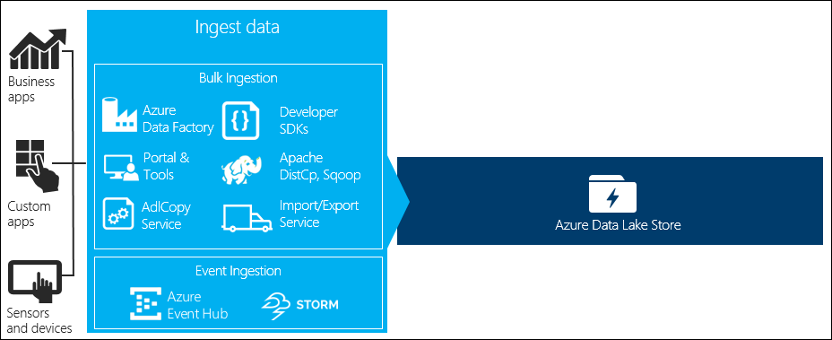
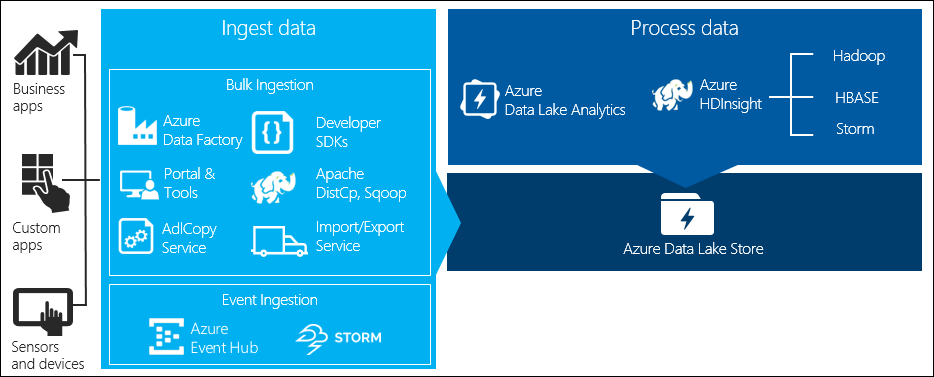
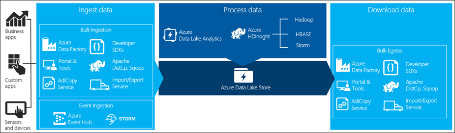
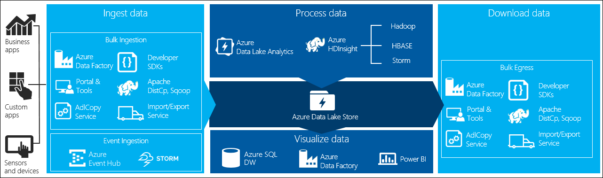

<properties 
   pageTitle="資料湖存放資料案例 |Microsoft Azure" 
   description="瞭解不同情況和工具使用的資料可以 ingested、 處理、 下載，以及以視覺化方式檢視資料湖存放區中" 
   services="data-lake-store" 
   documentationCenter="" 
   authors="nitinme" 
   manager="jhubbard" 
   editor="cgronlun"/>
 
<tags
   ms.service="data-lake-store"
   ms.devlang="na"
   ms.topic="article"
   ms.tgt_pltfrm="na"
   ms.workload="big-data" 
   ms.date="09/06/2016"
   ms.author="nitinme"/>

# 使用 Azure 資料湖存放區來顯示較大資料需求

顯示較大資料處理中有四個主要階段︰

* 將資料儲存、 即時或分批 ingesting 大量的資料
* 處理資料
* 下載資料
* 視覺化資料

本文中，我們看看這些階段提供了解選項及工具，可顯示較大資料需求 Azure 資料湖存放解答。

## 內嵌資料至資料湖存放區

本節會醒目提示不同來源的資料，可以將資料湖存放帳戶 ingested 該資料的不同方式。

### 臨機操作的資料

這表示較小的資料集的用於原型大型資料應用程式。 有不同的 ingesting 臨機操作的資料，根據資料來源的方式。

| 資料來源        | 使用內嵌                                                                        |
|--------------------|----------------------------------------------------------------------------------------|
| 本機電腦     | <ul> <li>[Azure 入口網站](/data-lake-store-get-started-portal.md)</li> <li>[Azure PowerShell](data-lake-store-get-started-powershell.md)</li> <li>[Azure 跨平台 CLI](data-lake-store-get-started-cli.md)</li> <li>[使用 Visual Studio 資料湖工具](../data-lake-analytics/data-lake-analytics-data-lake-tools-get-started.md#upload-source-data-files) </li></ul> |
| Azure 儲存體 Blob | <ul> <li>[Azure 資料工廠](../data-factory/data-factory-azure-datalake-connector.md#sample-copy-data-from-azure-blob-to-azure-data-lake-store)</li> <li>[AdlCopy 工具](data-lake-store-copy-data-azure-storage-blob.md)</li><li>[DistCp HDInsight 叢集上執行](data-lake-store-copy-data-wasb-distcp.md)</li> </ul> |

 
### 串流的資料

這代表可以產生等應用程式、 裝置、 感應器等各種來源的資料。此資料可以 ingested 資料湖存放區，以使用各種不同的工具。 這些工具通常會擷取及處理程序中的事件，事件根據資料即時，並將資料湖存放區批次然後寫入事件，讓他們可以進一步處理。 

以下是您可以使用的工具︰
 
* [Azure 資料流分析](../ 資料流-分析的資料-湖-輸出）-事件到事件集線器 ingested 可寫入 Azure 資料湖使用 Azure 資料湖存放成果。
* [Azure HDInsight 大量](../hdinsight/hdinsight-storm-write-data-lake-store.md)-您可以直接對資料湖存放區的大量來撰寫資料。
* [EventProcessorHost](../event-hubs/event-hubs-csharp-ephcs-getstarted.md#receive-messages-with-eventprocessorhost) – 您可以接收來自事件集線器的事件，然後撰寫其資料湖存放區使用[資料湖市集.NET SDK](data-lake-store-get-started-net-sdk.md)。

### 關聯式資料

您也可以來源從關聯式資料庫的資料。 在一段時間，關聯式資料庫會收集大量的資料可以提供索引鍵的深入見解，如果透過大型資料管線處理。 您可以使用下列工具，將資料移到資料湖存放區。

* [Apache Sqoop](data-lake-store-data-transfer-sql-sqoop.md)
* [Azure 資料工廠](../data-factory/data-factory-data-movement-activities.md)

### 網頁伺服器記錄資料 （上傳使用自訂的應用程式）

此類型的資料集特別稱為因為網頁伺服器記錄的資料分析常見的使用案例的大型資料應用程式，且需要發掘大量資料湖存放區上傳的記錄檔。 您可以使用下列工具的撰寫您自己的指令碼或應用程式上傳此類資訊。

* [Azure 跨平台 CLI](data-lake-store-get-started-cli.md)
* [Azure PowerShell](data-lake-store-get-started-powershell.md)
* [Azure 資料湖存放.NET SDK](data-lake-store-get-started-net-sdk.md)
* [Azure 資料工廠](../data-factory/data-factory-data-movement-activities.md)

上傳網頁伺服器記錄的資料，以及也的上傳其他類型的資料 （例如社交 sentiments 資料），則撰寫您的自訂指令碼/應用程式，因為它會包含您的資料傳元件為較大的大型資料應用程式的一部分的彈性的好方法。 在某些情況下將此程式碼可能需要指令碼或簡單的命令列公用程式的表單。 在其他情況下，程式碼可能會用來處理大型資料整合的商務應用程式或解決方案。

### Azure HDInsight 叢集相關聯的資料

大部分的 HDInsight 叢集類型 （Hadoop，HBase，大量） 支援資料湖存放區為資料儲存區儲存機制。 HDInsight 叢集存取資料從 Azure 儲存體二進位大型物件 (WASB)。 效能，您可以從 WASB 複製資料至資料湖存放帳戶叢集相關聯。 若要複製的資料，您可以使用下列工具。

* [Apache DistCp](data-lake-store-copy-data-wasb-distcp.md)
* [AdlCopy 服務](data-lake-store-copy-data-azure-storage-blob.md)
* [Azure 資料工廠](../data-factory/data-factory-azure-datalake-connector.md#sample-copy-data-from-azure-blob-to-azure-data-lake-store)

### 儲存在內部部署或 IaaS Hadoop 叢集的資料

可在現有的 Hadoop 叢集，使用 HDFS 的電腦上的本機儲存大量的資料。 Hadoop 叢集可能的內部部署中，或可能在 Azure IaaS 叢集內。 可能有需求，以將資料複製到 Azure 資料湖存放區，一次性方法或週期性的方式。 有各種不同的選項，您可用來達到這個目的。 以下是替代方案與相關聯的取捨清單。

| 方法  | 詳細資料 | 優點   | 考量  |
|-----------|---------|--------------|-----------------|
| 使用 Azure 資料工廠 (ADF)，將資料複製直接 Hadoop 叢集 Azure 資料湖存放區 | [ADF 支援 HDFS 做為資料來源](../data-factory/data-factory-hdfs-connector.md) | ADF 提供的方塊出支援 HDFS 以及頭等端對端管理和監視 | 需要內部部署或 IaaS 叢集部署的資料管理閘道 |
| 將資料從 Hadoop 匯出為檔案。 然後，將檔案複製至 Azure 資料湖存放區使用適當的機制。                                   | 您可以將檔案複製到 Azure 資料湖存放使用︰ <ul><li>[Azure PowerShell 的 Windows 作業系統](data-lake-store-get-started-powershell.md)</li><li>[Azure 跨平台 CLI 的非 Windows 作業系統](data-lake-store-get-started-cli.md)</li><li>使用任何資料湖市集 SDK 的自訂應用程式</li></ul> | 快速開始使用。 如何自訂上傳                                                   | 多重步驟的程序包含多個技術。 管理及監視會放大要進行一段時間指定自訂的性質的工具 |
| 使用 Distcp Hadoop 將資料複製到 Azure 儲存體。 使用適當的機制資料湖存放區，然後從 Azure 儲存體複製資料。 | 您可以從 Azure 儲存體中複製資料，資料湖存放使用︰ <ul><li>[Azure 資料工廠](../data-factory/data-factory-data-movement-activities.md)</li><li>[AdlCopy 工具](data-lake-store-copy-data-azure-storage-blob.md)</li><li>[Apache DistCp HDInsight 叢集上執行](data-lake-store-copy-data-wasb-distcp.md)</li></ul>| 您可以使用 [開啟來源工具。 | 多個步驟的程序包含多個技術 |

### 大型資料集

上傳的幾個 tb 的資料集的使用上述方法有時會變得很慢，耗費資源。 在這種情況下，您可以使用下列選項。

* **使用 Azure ExpressRoute**。 Azure ExpressRoute 可讓您私人之間建立關聯 Azure 地理和基礎架構在您的內部部署。 這會提供可靠的方式傳送大量的資料。 如需詳細資訊，請參閱[Azure ExpressRoute 文件](../expressroute/expressroute-introduction.md)。

* **[離線] 上傳的資料**。 如果使用 Azure ExpressRoute 不可行基於任何原因，您可以使用[Azure 匯入/匯出服務](../storage/storage-import-export-service.md)隨附硬碟 Azure 資料中心資料。 Azure 儲存體 blob 第一次上傳您的資料。 您可以再使用[Azure 資料工廠](../data-factory/data-factory-azure-datalake-connector.md#sample-copy-data-from-azure-blob-to-azure-data-lake-store)或[AdlCopy 工具](data-lake-store-copy-data-azure-storage-blob.md)，將資料複製到資料湖存放區 Azure 儲存體二進位大型物件。

    >[AZURE.NOTE] 同時使用匯入/匯出服務，您將運送 Azure 資料中心的磁碟上的檔案大小不得超過 200 GB。

## 處理資料湖存放區中的資料

一旦資料湖存放區中使用資料您可以使用支援大型資料應用程式的資料來執行分析。 目前，您可以使用 Azure HDInsight 和 Azure 資料湖分析資料湖存放區中的資料上執行資料分析工作。 

您可以查看下列範例。

* [建立資料湖存放 HDInsight 叢集做儲存空間](data-lake-store-hdinsight-hadoop-use-portal.md)
* [使用資料湖存放 Azure 資料湖狀況分析](../data-lake-analytics/data-lake-analytics-get-started-portal.md)

## 從資料湖市集下載資料

您也可以下載或將資料從 Azure 資料湖存放移案例，例如︰

* 將資料移到您現有的資料處理管線介面的其他儲存機制。 例如，您可能要將資料移資料湖存放 Azure SQL 資料庫或內部部署的 SQL Server。
* 下載至本機電腦，以便在 IDE 環境中建立的應用程式原型時的處理。

在這種情況下，您可以使用下列選項之一︰

* [Apache Sqoop](data-lake-store-data-transfer-sql-sqoop.md)
* [Azure 資料工廠](../data-factory/data-factory-data-movement-activities.md)
* [Apache DistCp](data-lake-store-copy-data-wasb-distcp.md)

您也可以使用下列方法來撰寫您自己的指令碼/應用程式下載資料湖存放區中的資料。

* [Azure 跨平台 CLI](data-lake-store-get-started-cli.md)
* [Azure PowerShell](data-lake-store-get-started-powershell.md)
* [Azure 資料湖存放.NET SDK](data-lake-store-get-started-net-sdk.md)

## 以視覺化方式呈現資料湖存放區中的資料

若要以視覺表示方式儲存資料湖存放區中的資料，您可以使用的服務。

* 您可以開始使用[Azure 資料工廠移動至 Azure SQL Data Warehouse 資料湖存放區](../data-factory/data-factory-data-movement-activities.md#supported-data-stores)
* 之後，您可以[整合 Azure SQL Data Warehouse 與 Power BI](../sql-data-warehouse/sql-data-warehouse-integrate-power-bi.md)建立的資料視覺化的方式呈現。
