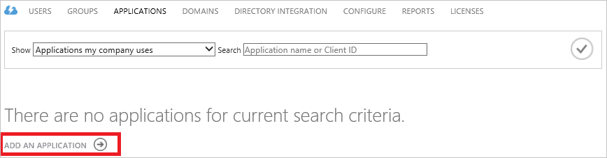
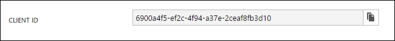

<properties
   pageTitle="使用資料湖存放使用 Active Directory 驗證 |Microsoft Azure"
   description="瞭解如何使用 Active Directory 資料湖存放驗證方法"
   services="data-lake-store"
   documentationCenter=""
   authors="nitinme"
   manager="jhubbard"
   editor="cgronlun"/>

<tags
   ms.service="data-lake-store"
   ms.devlang="na"
   ms.topic="article"
   ms.tgt_pltfrm="na"
   ms.workload="big-data"
   ms.date="10/17/2016"
   ms.author="nitinme"/>

# 使用 Azure Active Directory 資料湖存放區的 [使用者驗證

> [AZURE.SELECTOR]
- [服務-服務驗證](data-lake-store-authenticate-using-active-directory.md)
- [使用者驗證](data-lake-store-end-user-authenticate-using-active-directory.md)

Azure 資料湖存放使用 Azure Active Directory 進行驗證。 前撰寫搭配 Azure 資料湖存放區 」 或 「 Azure 資料湖分析的應用程式，您必須先決定您要驗證您的應用程式與 Azure Active Directory (Azure AD) 的方式。 可用的兩個主要選項是︰

* 使用者驗證]，然後 
* 若要服務驗證。 

兩個這些選項產生 OAuth 2.0 權杖，取得附加至每一條 Azure 資料湖存放或 Azure 資料湖分析所提供的應用程式。

此文件是在瞭解如何建立使用者驗證 Azure AD web 應用程式。 Azure AD 應用程式設定服務-服務驗證的指示請參閱[服務-服務驗證資料湖存放區使用 Azure Active Directory](data-lake-store-authenticate-using-active-directory.md)。

## 必要條件

* Azure 的訂閱。 請參閱[取得 Azure 免費試用版](https://azure.microsoft.com/pricing/free-trial/)。
* 您的訂閱 id。 您可以擷取它從 Azure 入口網站。 例如，是提供資料湖存放帳戶刀。

    

* Azure AD 網域名稱。 您可以移動滑鼠 Azure 入口網站的右上角中擷取。 從下方的螢幕擷取畫面的網域名稱是**contoso.microsoft.com**，，括弧內 GUID 是租用戶識別碼。 

    

## 使用者驗證

如果您希望使用者登入您的應用程式，透過 Azure AD，這是建議的方法。 您的應用程式無法存取 Azure 資源相同層級的存取權的使用者的身分登入。 您的使用者必須提供定期順序維護 access 應用程式的認證。

無法登入使用者的結果是存取權杖並重新整理權杖提供的應用程式。 對資料湖儲存或資料湖分析，每個要求取得附加存取權杖，是預設的一個小時有效。 重新整理權杖可用來取得新的存取權杖，而如果經常使用適用於最根據預設，兩週才能完成。 您可以使用兩種不同方法的使用者登入。

### 使用 OAuth 2.0 快顯

您的應用程式，即可觸發 OAuth 2.0 授權快顯視窗，讓使用者可以輸入其認證。 此快顯也會搭配 Azure AD 雙因素驗證 (2FA) 程序，如有必要。 

>[AZURE.NOTE] 這個方法是尚未支援 Python 或 Java 中 Azure AD 驗證文件庫 (ADAL)。

### 直接傳入使用者認證

您的應用程式至 Azure AD，可以直接提供使用者認證。 這個方法只能搭配組織識別碼的使用者帳戶。不相容的個人 / 以結尾的 「 即時識別碼 」 使用者帳戶，包括@outlook.com或@live.com。 此外，此方法不相容於需要 Azure AD 雙因素驗證 (2FA) 的使用者帳戶。

### 我需要使用此方法？

* Azure AD 網域名稱。 這是已會列在本文的必要條件。

* Azure AD **web 應用程式**

* Azure AD web 應用程式的用戶端識別碼

* Azure AD web 應用程式回覆 URI

* 設定委派的權限

如需如何建立 Azure AD web 應用程式，並將它設定為上述的需求的相關指示，請參閱[建立 Active Directory 應用程式](#create-an-active-directory-application)的下方。 

## 建立 Active Directory 應用程式

此區段中我們進一步瞭解如何建立及設定 Azure 資料湖存放區的 [使用者驗證 Azure AD web 應用程式使用 Azure Active Directory。

### 步驟 1︰ 建立的 Azure Active Directory 應用程式

>[AZURE.NOTE] 下列步驟使用 [Azure 入口網站。 您也可以建立使用[PowerShell 的 Azure](../resource-group-authenticate-service-principal.md)或[Azure CLI](../resource-group-authenticate-service-principal-cli.md)Azure AD 應用程式。

1. 登入您的 Azure 帳戶透過[傳統入口網站](https://manage.windowsazure.com/)。

2. 從左窗格中選取 [ **Active Directory** ]。

     
     
3. 選取您想要建立新的應用程式的使用 Active Directory。 如果您有多個 Active Directory，您通常要建立您的訂閱的所在位置的目錄中的應用程式。 您僅可以在您的訂閱，與您的訂閱相同的目錄中的應用程式中授與存取權資源。  

     
    
    
3. 若要檢視應用程式目錄中，按一下**應用程式**。

     

4. 如果您尚未建立應用程式中的目錄之前，您應該會看到類似下列圖像。 按一下 [**新增應用程式**

     

     或者，按一下 [**新增**]，請在下方窗格中。

     

6. 提供應用程式的名稱，然後選取您想要建立的應用程式類型。 在此教學課程中，建立**WEB 應用程式和/或 WEB API** ，然後按一下 [下一步] 按鈕。

     

7. 填入您的應用程式的內容。 **登開啟 URL**，提供 URI 描述您的應用程式的網站。 不會驗證存在的網站。 **應用程式識別碼 URI**，提供識別您的應用程式的 URI。

     

    按一下 [核取記號，以完成精靈，並建立應用程式]。

### 步驟 2︰ 取得用戶端識別碼、 回覆 URI，並設定委派的權限

1. 按一下 [**設定**] 索引標籤來設定您的應用程式的密碼。

     

2. 將複製的 [**用戶端識別碼**。
  
     

3. 在**單一登入**] 區段中，複製**回覆 URI**。

    

4. 按一下 [**其他應用程式的權限**] 底下的 [**新增應用程式**

    

5. 在**權限，以其他應用程式**精靈] 中，選取**Azure 資料湖**和**Windows** **Azure 服務管理 API**，然後按一下核取記號。

6. 依預設會設定為零的最近新增的服務的**委派權限**。 按一下 [**委派的權限**Azure 資料湖和 Windows Azure 管理服務] 下拉式清單，然後選取 [可用的核取方塊以設定值為 1。 結果看起來應該像這樣。

     

7. 按一下 [**儲存**]。

## 後續步驟

本文中，您建立的 Azure AD web 應用程式並收集您需要在您撰寫使用.NET SDK、 Java SDK 等的用戶端應用程式中的資訊。您現在可以就下列文章，關於如何使用第一次驗證資料湖存放區，然後再執行存放區上的其他操作 Azure AD web 應用程式。

- [使用.NET SDK Azure 資料湖存放快速入門](data-lake-store-get-started-net-sdk.md)
- [Azure 資料湖存放區使用 Java SDK 快速入門](data-lake-store-get-started-java-sdk.md)
