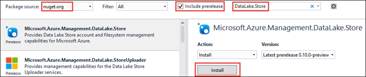

<properties
   pageTitle="使用資料湖市集.NET SDK 開發應用程式 |Microsoft Azure"
   description="使用 Azure 資料湖市集.NET SDK 開發應用程式"
   services="data-lake-store"
   documentationCenter=""
   authors="nitinme"
   manager="jhubbard"
   editor="cgronlun"/>

<tags
   ms.service="data-lake-store"
   ms.devlang="na"
   ms.topic="get-started-article"
   ms.tgt_pltfrm="na"
   ms.workload="big-data"
   ms.date="09/27/2016"
   ms.author="nitinme"/>

# 使用.NET SDK Azure 資料湖存放快速入門

> [AZURE.SELECTOR]
- [入口網站](data-lake-store-get-started-portal.md)
- [PowerShell](data-lake-store-get-started-powershell.md)
- [.NET SDK](data-lake-store-get-started-net-sdk.md)
- [Java SDK](data-lake-store-get-started-java-sdk.md)
- [REST API](data-lake-store-get-started-rest-api.md)
- [Azure CLI](data-lake-store-get-started-cli.md)
- [Node.js](data-lake-store-manage-use-nodejs.md)

瞭解如何使用[Azure 資料湖市集.NET SDK](https://msdn.microsoft.com/library/mt581387.aspx)執行基本作業，例如建立資料夾上, 傳和下載等資料檔案。如需有關資料湖的詳細資訊，請參閱[Azure 資料湖存放區](data-lake-store-overview.md)。

## 必要條件

* **Visual Studio 2013 或 2015年**。 下列指示使用 Visual Studio 2015。

* **Azure 訂閱**。 請參閱[取得 Azure 免費試用版](https://azure.microsoft.com/pricing/free-trial/)。

* **Azure 資料湖存放帳戶**。 如需如何建立帳戶的相關指示，請參閱[Azure 資料湖存放快速入門](data-lake-store-get-started-portal.md)

* **建立的 Azure Active Directory 應用程式**。 您可以使用 Azure AD 應用程式來驗證 Azure AD 資料湖市集應用程式。 有驗證 Azure AD，也就是**使用者驗證**或**服務-服務驗證**的不同方法。 如需相關指示與驗證方法的詳細資訊，請參閱[驗證資料湖存放區使用 Azure Active Directory](data-lake-store-authenticate-using-active-directory.md)。

## 建立.NET 應用程式

1. 開啟 Visual Studio 並建立主控台應用程式。

2. 從 [**檔案**] 功能表中，按一下 [**新增**]，然後按一下**專案**。

3. 從**新的專案**中，輸入或選取下列值︰

  	| 屬性 | 值                       |
  	|----------|-----------------------------|
  	| 類別 | 範本/Visual C# / Windows |
  	| 範本 | 主控台應用程式         |
  	| 名稱     | CreateADLApplication        |

4. 按一下**[確定**] 以建立專案。

5. 新增 Nuget 封裝至專案。

    1. 以滑鼠右鍵按一下 [方案總管] 中的專案名稱，再按一下 [**管理 NuGet 套件**。
    2. 在 [ **Nuget 封裝管理員**] 索引標籤，請確定**套件來源**設定成 [ **nuget.org** ，並**包含搶鮮版**核取方塊已選取。
    3. 搜尋並安裝下列 NuGet 套件︰

        * `Microsoft.Azure.Management.DataLake.Store`-本教學課程中使用 v0.12.5 預覽。
        * `Microsoft.Azure.Management.DataLake.StoreUploader`-本教學課程中使用 v0.10.6 預覽。
        * `Microsoft.Rest.ClientRuntime.Azure.Authentication`-本教學課程中使用 v2.2.8 預覽。

        

    4. 關閉**Nuget 封裝管理員**]。

6. 開啟**Program.cs**、 刪除現有的程式碼，然後再包含下列的陳述式，以新增命名空間的參考。

        using System;
        using System.Threading;
        
        using Microsoft.Rest.Azure.Authentication;
        using Microsoft.Azure.Management.DataLake.Store;
        using Microsoft.Azure.Management.DataLake.StoreUploader;

7. 宣告變數，如下所示，並提供值資料湖存放名稱] 和 [已經存在的資源群組名稱。 此外，請確定您在此提供本機路徑和檔名必須在電腦上。 新增下列程式碼片段之後的命名空間宣告。

        namespace SdkSample
        {
            class Program
            {
                private static DataLakeStoreAccountManagementClient _adlsClient;
                private static DataLakeStoreFileSystemManagementClient _adlsFileSystemClient;
                
                private static string _adlsAccountName;
                private static string _resourceGroupName;
                private static string _location;
                private static string _subId;

                
                private static void Main(string[] args)
                {
                    _adlsAccountName = "<DATA-LAKE-STORE-NAME>"; // TODO: Replace this value with the name of your existing Data Lake Store account.
                    _resourceGroupName = "<RESOURCE-GROUP-NAME>"; // TODO: Replace this value with the name of the resource group containing your Data Lake Store account.
                    _location = "East US 2";
                    _subId = "<SUBSCRIPTION-ID>";
                    
                    string localFolderPath = @"C:\local_path\"; // TODO: Make sure this exists and can be overwritten.
                    string localFilePath = localFolderPath + "file.txt"; // TODO: Make sure this exists and can be overwritten.
                    string remoteFolderPath = "/data_lake_path/";
                    string remoteFilePath = remoteFolderPath + "file.txt";
                }
            }
        }

在文件的剩餘區段中，您可以瞭解如何使用可用的.NET 方法執行作業，例如驗證、 檔案上傳等等。

## 驗證

### 如果您使用的使用者驗證 （在此教學課程建議使用）

使用此與現有 Azure AD 原生用戶端] 應用程式。其中一個提供您下方。 若要協助您更快完成本教學課程中，我們建議使用此方法。

    // User login via interactive popup
    // Use the client ID of an existing AAD "Native Client" application.
    SynchronizationContext.SetSynchronizationContext(new SynchronizationContext());
    var domain = "common"; // Replace this string with the user's Azure Active Directory tenant ID or domain name, if needed.
    var nativeClientApp_clientId = "1950a258-227b-4e31-a9cf-717495945fc2";
    var activeDirectoryClientSettings = ActiveDirectoryClientSettings.UsePromptOnly(nativeClientApp_clientId, new Uri("urn:ietf:wg:oauth:2.0:oob"));
    var creds = UserTokenProvider.LoginWithPromptAsync(domain, activeDirectoryClientSettings).Result;

只需要幾個項目，瞭解上述此程式碼片段。

* 若要協助您更快完成教學課程，使用此程式碼片段 Azure AD 並依預設，所有 Azure 訂閱可使用的網域和用戶端識別碼。 因此，您可以**使用為此程式碼片段-在應用程式中**。
* 不過，如果想要使用您自己的 Azure AD 網域和應用程式用戶端識別碼，您必須建立 Azure AD 原生應用程式，然後使用 Azure AD 網域，用戶端識別碼和 URI 重新導向您所建立的應用程式。 如需相關指示，請參閱[建立 Active Directory 應用程式](../resource-group-create-service-principal-portal.md#create-an-active-directory-application)。

>[AZURE.NOTE] Azure AD web 應用程式是上述的連結中的指示進行。 不過，步驟會完全相同即使您選擇要改為建立的原生的用戶端應用程式。 

### 如果您使用的服務-服務驗證與用戶端密碼 

下列程式碼片段可以用來驗證您的應用程式非互動方式，使用用戶端私人 / 應用程式 / 服務的主體鍵。 您可以使用這個現有[Azure AD 「 Web 應用程式 」 應用程式](../resource-group-create-service-principal-portal.md)。

    // Service principal / appplication authentication with client secret / key
    // Use the client ID and certificate of an existing AAD "Web App" application.
    SynchronizationContext.SetSynchronizationContext(new SynchronizationContext());
    var domain = "<AAD-directory-domain>";
    var webApp_clientId = "<AAD-application-clientid>";
    var clientSecret = "<AAD-application-client-secret>";
    var clientCredential = new ClientCredential(webApp_clientId, clientSecret);
    var creds = ApplicationTokenProvider.LoginSilentAsync(domain, clientCredential).Result;

### 如果您使用服務-服務驗證憑證

第三個選項，如下列程式碼片段可用來非互動方式，驗證您的應用程式的應用程式 / 服務的本金使用的憑證。 您可以使用這個現有[Azure AD 「 Web 應用程式 」 應用程式](../resource-group-create-service-principal-portal.md)。

    // Service principal / application authentication with certificate
    // Use the client ID and certificate of an existing AAD "Web App" application.
    SynchronizationContext.SetSynchronizationContext(new SynchronizationContext());
    var domain = "<AAD-directory-domain>";
    var webApp_clientId = "<AAD-application-clientid>";
    System.Security.Cryptography.X509Certificates.X509Certificate2 clientCert = <AAD-application-client-certificate>
    var clientAssertionCertificate = new ClientAssertionCertificate(webApp_clientId, clientCert);
    var creds = ApplicationTokenProvider.LoginSilentWithCertificateAsync(domain, clientAssertionCertificate).Result;

## 建立用戶端物件

下列程式碼片段會建立資料湖存放帳戶與檔案系統的用戶端物件，這用來發出的服務要求。

    // Create client objects and set the subscription ID
    _adlsClient = new DataLakeStoreAccountManagementClient(creds);
    _adlsFileSystemClient = new DataLakeStoreFileSystemManagementClient(creds);

    _adlsClient.SubscriptionId = _subId;

## 清單訂閱中的所有資料湖存放區帳戶

下列程式碼片段列出指定 Azure 訂閱中的所有資料湖存放帳戶。

    // List all ADLS accounts within the subscription
    public static List<DataLakeStoreAccount> ListAdlStoreAccounts()
    {
        var response = _adlsClient.Account.List();
        var accounts = new List<DataLakeStoreAccount>(response);
        
        while (response.NextPageLink != null)
        {
            response = _adlsClient.Account.ListNext(response.NextPageLink);
            accounts.AddRange(response);
        }
        
        return accounts;
    }

## 建立目錄

下列程式碼片段顯示`CreateDirectory`方法可供您建立的目錄中的資料湖存放帳戶。

    // Create a directory
    public static void CreateDirectory(string path)
    {
        _adlsFileSystemClient.FileSystem.Mkdirs(_adlsAccountName, path);
    }

## 上傳檔案

下列程式碼片段顯示`UploadFile`可用來上傳檔案到資料湖存放帳戶的方法。

    // Upload a file
    public static void UploadFile(string srcFilePath, string destFilePath, bool force = true)
    {
        var parameters = new UploadParameters(srcFilePath, destFilePath, _adlsAccountName, isOverwrite: force);
        var frontend = new DataLakeStoreFrontEndAdapter(_adlsAccountName, _adlsFileSystemClient);
        var uploader = new DataLakeStoreUploader(parameters, frontend);
        uploader.Execute();
    }

`DataLakeStoreUploader`支援遞迴上傳和下載之間本機檔案路徑和資料湖存放檔案路徑。    

## 取得檔案或目錄的資訊

下列程式碼片段顯示`GetItemInfo`可用來擷取檔案或資料湖存放區中可用的目錄的相關資訊的方法。 

    // Get file or directory info
    public static FileStatusProperties GetItemInfo(string path)
    {
        return _adlsFileSystemClient.FileSystem.GetFileStatus(_adlsAccountName, path).FileStatus;
    }

## 清單的檔案或目錄

下列程式碼片段顯示`ListItem`可用於] 清單中的檔案及目錄中的資料湖存放帳戶的方法。

    // List files and directories
    public static List<FileStatusProperties> ListItems(string directoryPath)
    {
        return _adlsFileSystemClient.FileSystem.ListFileStatus(_adlsAccountName, directoryPath).FileStatuses.FileStatus.ToList();
    }

## Concatenate 的檔案

下列程式碼片段顯示`ConcatenateFiles`可用來串連檔案的方法。 

    // Concatenate files
    public static void ConcatenateFiles(string[] srcFilePaths, string destFilePath)
    {
        _adlsFileSystemClient.FileSystem.Concat(_adlsAccountName, destFilePath, srcFilePaths);
    }

## 附加檔案

下列程式碼片段顯示`AppendToFile`您使用的方法將資料新增至資料湖存放帳戶中已儲存的檔案。

    // Append to file
    public static void AppendToFile(string path, string content)
    {
        var stream = new MemoryStream(Encoding.UTF8.GetBytes(content));
        
        _adlsFileSystemClient.FileSystem.Append(_adlsAccountName, path, stream);
    }

## 下載檔案

下列程式碼片段顯示`DownloadFile`您用來從資料湖存放帳戶下載的檔案的方法。

    // Download file
    public static void DownloadFile(string srcPath, string destPath)
    {
        var stream = _adlsFileSystemClient.FileSystem.Open(_adlsAccountName, srcPath);
        var fileStream = new FileStream(destPath, FileMode.Create);
        
        stream.CopyTo(fileStream);
        fileStream.Close();
        stream.Close();
    }

## 後續步驟

- [保護資料湖存放區中的資料](data-lake-store-secure-data.md)
- [使用資料湖存放 Azure 資料湖狀況分析](../data-lake-analytics/data-lake-analytics-get-started-portal.md)
- [使用資料湖存放 Azure HDInsight](data-lake-store-hdinsight-hadoop-use-portal.md)
- [資料湖存放.NET SDK 參考](https://msdn.microsoft.com/library/mt581387.aspx)
- [資料湖存放其他參考](https://msdn.microsoft.com/library/mt693424.aspx)
