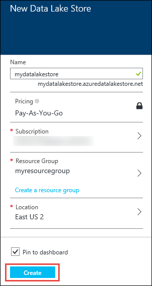
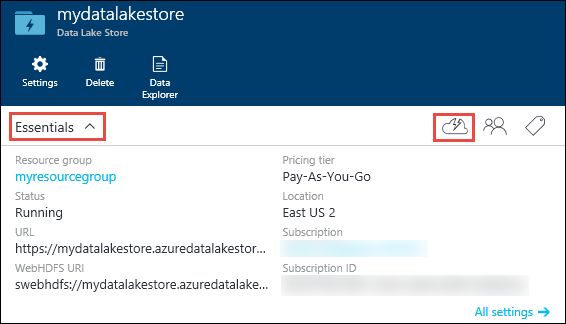
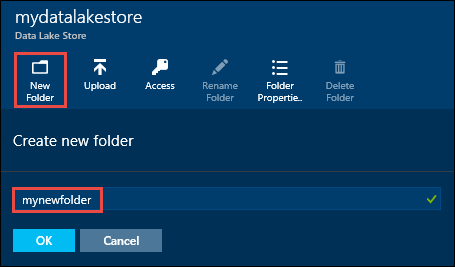
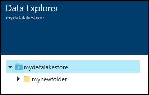
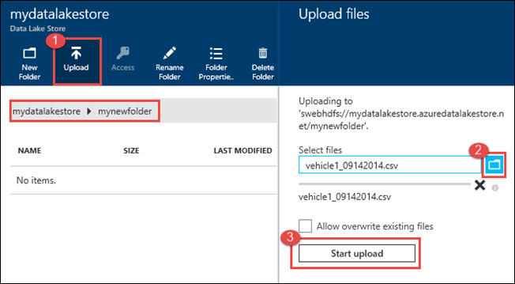
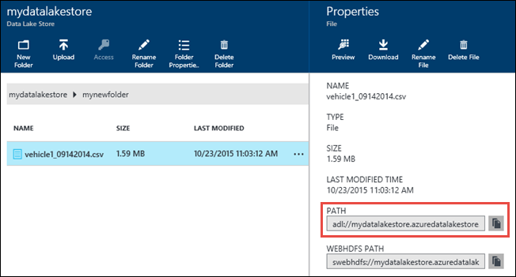
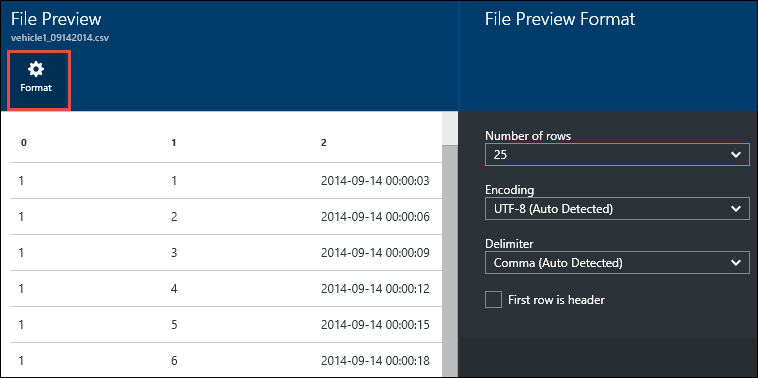
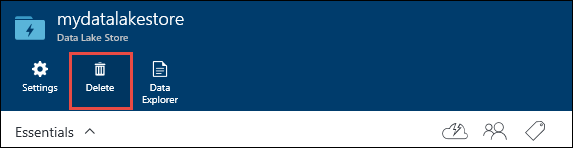

<properties 
   pageTitle="開始使用資料湖存放 |Azure" 
   description="若要建立資料湖存放帳戶，並在 [資料湖存放區中執行基本作業使用入口網站" 
   services="data-lake-store" 
   documentationCenter="" 
   authors="nitinme" 
   manager="jhubbard" 
   editor="cgronlun"/>
 
<tags
   ms.service="data-lake-store"
   ms.devlang="na"
   ms.topic="hero-article"
   ms.tgt_pltfrm="na"
   ms.workload="big-data" 
   ms.date="09/13/2016"
   ms.author="nitinme"/>

# Azure 資料湖存放區使用 Azure 入口網站快速入門

> [AZURE.SELECTOR]
- [入口網站](data-lake-store-get-started-portal.md)
- [PowerShell](data-lake-store-get-started-powershell.md)
- [.NET SDK](data-lake-store-get-started-net-sdk.md)
- [Java SDK](data-lake-store-get-started-java-sdk.md)
- [REST API](data-lake-store-get-started-rest-api.md)
- [Azure CLI](data-lake-store-get-started-cli.md)
- [Node.js](data-lake-store-manage-use-nodejs.md)

瞭解如何使用 Azure 入口網站，以建立 Azure 資料湖存放帳戶，並執行基本作業，例如建立資料夾上, 傳和下載資料檔案，刪除您的帳戶、 等等。如需有關資料湖存放區的詳細資訊，請參閱[概觀的 Azure 資料湖存放區](data-lake-store-overview.md)。

## 必要條件

本教學課程之前，您必須具備下列項目︰

- **Azure 訂閱**。 請參閱[取得 Azure 免費試用版](https://azure.microsoft.com/pricing/free-trial/)。

## 您學到快速與影片嗎？

觀看下列影片，瞭解如何開始使用資料湖存放區。

* [建立資料湖存放區帳戶](https://mix.office.com/watch/1k1cycy4l4gen)
* [管理資料湖存放使用資料檔案總管中的資料](https://mix.office.com/watch/icletrxrh6pc)

## 建立 Azure 資料湖存放區帳戶

1. 登入新的[Azure 入口網站](https://portal.azure.com)。

2. 按一下 [**新增**]，按一下 [**資料 + 的儲存空間**]，再按一下 [ **Azure 資料湖存放區**。 閱讀**Azure 資料湖存放**刀中的資訊，然後按一下 [刀左上角的 [**建立**。

3. 螢幕擷取畫面下方所示，請在**新增資料湖存放**防禦，以提供值︰

    

    - **訂閱**。 選取您想要建立新的資料湖存放客戶的訂閱。
    - **資源群組**]。 選取現有的資源群組，或按一下 [**建立資源群組**]，建立一個。 資源群組是保留應用程式的相關的資源的容器。 如需詳細資訊，請參閱[Azure 中的 [資源群組](azure-resource-manager/resource-group-overview.md#resource-groups)。
    - **位置**︰ 選取您要建立資料湖存放帳戶的位置。

4. 如果您想要從 Startboard 存取資料湖存放帳戶，請選取 [**固定至 Startboard** 。

5. 按一下 [**建立**]。 如果您選擇將其釘選到 startboard 帳戶，您會回到 startboard，而且您可以看到您資料湖存放帳戶佈建的進度。 一旦資料湖存放帳戶佈建後，帳戶刀就會出現。

6. 展開**基礎**下拉式清單以查看資料湖存放帳戶相關資訊例如資源群組的一部分、 位置、 等等。按一下 [**快速入門**的圖示，以查看相關資料湖存放其他資源連結。

    

## Azure 資料湖存放帳戶中建立資料夾

您可以建立資料夾，您可用於管理及儲存資料的資料湖存放帳號] 之下。

1. 開啟您剛剛建立的資料湖存放帳戶。 從左側的窗格中，按一下 [**瀏覽****資料湖存放**區，然後按一下然後從資料湖存放刀中，按一下 [帳戶名稱，而您想要建立資料夾。 如果您已釘選到 startboard 帳戶，按一下該帳戶的方塊。

2. 在您的資料湖存放帳戶刀，按一下 [**資料檔案總管**]。

    

3. 在您的資料湖存放帳戶刀，按一下 [**新增資料夾**，為新的資料夾中，輸入名稱，然後按一下**[確定]**。
    
    
    
    新建立的資料夾會列在 [**資料總管**刀。 您可以建立巢狀的資料夾最多到任何層級。

    

## 上傳至 Azure 資料湖存放帳戶的資料

直接在根層級 Azure 資料湖存放帳戶或您帳戶中建立的資料夾，您可以上傳您的資料。 在螢幕擷取畫面] 下方，追蹤**資料總管**刀從上傳檔案到子資料夾的步驟。 在此螢幕擷取畫面，上傳檔案時提示路徑 （標示為紅色方塊） 中顯示的子資料夾。

如果您要尋找的上傳的一些範例資料，您可以取得[Azure 資料湖給存放庫](https://github.com/MicrosoftBigData/usql/tree/master/Examples/Samples/Data/AmbulanceData)**政策救護車資料**的資料夾。

## 屬性和儲存的資料上可用的動作

按一下 [最近新增的檔案，以開啟**內容**刀]。 相關檔案和檔案，您可以執行的動作內容可在此刀。 您也可以複製檔案的完整路徑 Azure 資料湖存放帳戶，在螢幕擷取畫面下方的紅色方塊中醒目提示中。

* 按一下 [**預覽**] 以查看該檔案，直接從瀏覽器的預覽]。 您可以指定的格式，以及的預覽。 按一下 [**預覽**] 中**的檔案預覽**刀中，按一下 [**格式**與**檔案預覽格式**刀在指定的列數等選項，顯示，請使用，分隔符號來使用等等編碼方式。

  

* 按一下 [檔案下載到您的電腦的 [**下載**]。

* 按一下 [**重新命名檔案**重新命名的檔案]。

* 按一下 [**刪除檔案**] 以刪除檔案。

## 保護您的資料

您可以保護 Azure 資料湖存放帳戶使用 Azure Active Directory 和存取控制 (Acl) 中所儲存的資料。 瞭解如何執行這項作業，請參閱[Azure 資料湖存放區中的保護資料](data-lake-store-secure-data.md)的相關指示。

## 刪除 Azure 資料湖存放區帳戶

若要刪除 Azure 資料湖存放帳戶，請從您的資料湖存放刀，按一下 [**刪除**]。 若要確認動作，系統會提示您輸入您想要刪除的帳戶的名稱。 輸入帳戶的名稱，然後再按一下 [**刪除**]。

## 後續步驟

- [保護資料湖存放區中的資料](data-lake-store-secure-data.md)
- [使用資料湖存放 Azure 資料湖狀況分析](../data-lake-analytics/data-lake-analytics-get-started-portal.md)
- [使用資料湖存放 Azure HDInsight](data-lake-store-hdinsight-hadoop-use-portal.md)
- [Access 資料湖市集的診斷記錄](data-lake-store-diagnostic-logs.md)
