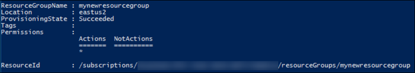
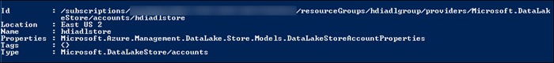
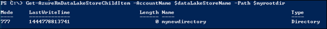

<properties
   pageTitle="開始使用資料湖存放 |Azure"
   description="使用 PowerShell 的 Azure 建立資料湖存放帳戶，並執行基本作業"
   services="data-lake-store"
   documentationCenter=""
   authors="nitinme"
   manager="jhubbard"
   editor="cgronlun"/>

<tags
   ms.service="data-lake-store"
   ms.devlang="na"
   ms.topic="hero-article"
   ms.tgt_pltfrm="na"
   ms.workload="big-data"
   ms.date="10/04/2016"
   ms.author="nitinme"/>

# 使用 PowerShell 的 Azure Azure 資料湖存放快速入門

> [AZURE.SELECTOR]
- [入口網站](data-lake-store-get-started-portal.md)
- [PowerShell](data-lake-store-get-started-powershell.md)
- [.NET SDK](data-lake-store-get-started-net-sdk.md)
- [Java SDK](data-lake-store-get-started-java-sdk.md)
- [REST API](data-lake-store-get-started-rest-api.md)
- [Azure CLI](data-lake-store-get-started-cli.md)
- [Node.js](data-lake-store-manage-use-nodejs.md)

瞭解如何使用 PowerShell 的 Azure 建立 Azure 資料湖存放帳戶，並執行基本作業，例如建立資料夾上, 傳和下載資料檔案，刪除您的帳戶、 等等。如需有關資料湖存放區的詳細資訊，請參閱[資料湖存放概觀](data-lake-store-overview.md)。

## 必要條件

本教學課程之前，您必須具備下列項目︰

* **Azure 訂閱**。 請參閱[取得 Azure 免費試用版](https://azure.microsoft.com/pricing/free-trial/)。

* **Azure PowerShell 1.0 或更大**。 瞭解[如何安裝和設定 PowerShell 的 Azure](../powershell-install-configure.md)。

## 驗證

本文會使用簡單的驗證方法，系統會提示您輸入 Azure 帳戶認證資料湖存放區。 帳戶與檔案系統然後由登入的使用者的存取層級的資料湖存放存取層級。 然而，有其他方法也驗證資料湖存放區，也就是**使用者驗證**或**服務-服務驗證**。 如需相關指示與驗證方法的詳細資訊，請參閱[驗證資料湖存放區使用 Azure Active Directory](data-lake-store-authenticate-using-active-directory.md)。

## 建立 Azure 資料湖存放區帳戶

1. 從您的桌面，開啟新的 Windows PowerShell 視窗，然後輸入下列程式碼片段 Azure 帳戶登入，設定訂閱，並登錄資料湖存放提供者。 當畫面提示您登入，請確定您登入為其中一項訂閱 admininistrators/擁有者︰

        # Log in to your Azure account
        Login-AzureRmAccount

        # List all the subscriptions associated to your account
        Get-AzureRmSubscription

        # Select a subscription
        Set-AzureRmContext -SubscriptionId <subscription ID>

        # Register for Azure Data Lake Store
        Register-AzureRmResourceProvider -ProviderNamespace "Microsoft.DataLakeStore"

2. Azure 資料湖存放帳戶是 Azure 資源群組相關聯。 開始建立 Azure 資源群組。

        $resourceGroupName = "<your new resource group name>"
        New-AzureRmResourceGroup -Name $resourceGroupName -Location "East US 2"

    

2. 建立 Azure 資料湖存放帳戶。 小寫字母和數字，必須只會包含您所指定的名稱。

        $dataLakeStoreName = "<your new Data Lake Store name>"
        New-AzureRmDataLakeStoreAccount -ResourceGroupName $resourceGroupName -Name $dataLakeStoreName -Location "East US 2"

    

3. 確認已成功建立帳戶。

        Test-AzureRmDataLakeStoreAccount -Name $dataLakeStoreName

    這個輸出應該是**True**。

## Azure 資料湖存放區中建立目錄結構

您可以建立目錄，您可用於管理及儲存資料的 Azure 資料湖存放帳號] 之下。

1. 指定的根目錄。

        $myrootdir = "/"

2. 建立新的目錄稱為**mynewdirectory**底下所指定的根目錄。

        New-AzureRmDataLakeStoreItem -Folder -AccountName $dataLakeStoreName -Path $myrootdir/mynewdirectory

3. 確認已成功建立新的目錄。

        Get-AzureRmDataLakeStoreChildItem -AccountName $dataLakeStoreName -Path $myrootdir

    要顯示的輸出如下所示︰

    

## 上傳至 Azure 資料湖存放區的資料

直接在根層級的資料湖存放區或您帳戶中建立的目錄，您可以上傳您的資料。 下列程式碼片段示範如何上傳至您在前一節中所建立的目錄 (**mynewdirectory**) 的一些範例資料。

如果您要尋找的上傳的一些範例資料，您可以取得[Azure 資料湖給存放庫](https://github.com/MicrosoftBigData/usql/tree/master/Examples/Samples/Data/AmbulanceData)**政策救護車資料**的資料夾。 下載檔案並將其儲存在您的電腦，例如 C:\sampledata 上的本機目錄\.

    Import-AzureRmDataLakeStoreItem -AccountName $dataLakeStoreName -Path "C:\sampledata\vehicle1_09142014.csv" -Destination $myrootdir\mynewdirectory\vehicle1_09142014.csv

## 重新命名、 下載及刪除資料湖存放區中的資料

若要重新命名檔案，請使用下列命令︰

    Move-AzureRmDataLakeStoreItem -AccountName $dataLakeStoreName -Path $myrootdir\mynewdirectory\vehicle1_09142014.csv -Destination $myrootdir\mynewdirectory\vehicle1_09142014_Copy.csv

若要下載的檔案，請使用下列命令︰

    Export-AzureRmDataLakeStoreItem -AccountName $dataLakeStoreName -Path $myrootdir\mynewdirectory\vehicle1_09142014_Copy.csv -Destination "C:\sampledata\vehicle1_09142014_Copy.csv"

若要刪除檔案，請使用下列命令︰

    Remove-AzureRmDataLakeStoreItem -AccountName $dataLakeStoreName -Paths $myrootdir\mynewdirectory\vehicle1_09142014_Copy.csv

出現提示時，請輸入**Y**刪除的項目。 如果您有多個要刪除的檔案，您可以提供並以逗號分隔的所有路徑。

    Remove-AzureRmDataLakeStoreItem -AccountName $dataLakeStoreName -Paths $myrootdir\mynewdirectory\vehicle1_09142014.csv, $myrootdir\mynewdirectoryvehicle1_09142014_Copy.csv

## 刪除您 Azure 資料湖儲存的帳戶

若要刪除您的資料湖存放帳戶使用下列命令。

    Remove-AzureRmDataLakeStoreAccount -Name $dataLakeStoreName

出現提示時，請輸入**Y**刪除帳戶。

## 後續步驟

- [保護資料湖存放區中的資料](data-lake-store-secure-data.md)
- [使用資料湖存放 Azure 資料湖狀況分析](../data-lake-analytics/data-lake-analytics-get-started-portal.md)
- [使用資料湖存放 Azure HDInsight](data-lake-store-hdinsight-hadoop-use-portal.md)
