<properties
   pageTitle="Azure 資料湖存放區使用入口網站中建立 HDInsight 叢集 |Azure"
   description="建立及使用 HDInsight 叢集 Azure 資料湖存放區中使用 Azure 入口網站"
   services="data-lake-store,hdinsight" 
   documentationCenter=""
   authors="nitinme"
   manager="jhubbard"
   editor="cgronlun"/>

<tags
   ms.service="data-lake-store"
   ms.devlang="na"
   ms.topic="article"
   ms.tgt_pltfrm="na"
   ms.workload="big-data"
   ms.date="10/21/2016"
   ms.author="nitinme"/>

# 建立 HDInsight 叢集使用 Azure 入口網站的資料湖存放區

> [AZURE.SELECTOR]
- [使用入口網站](data-lake-store-hdinsight-hadoop-use-portal.md)
- [使用 PowerShell](data-lake-store-hdinsight-hadoop-use-powershell.md)
- [使用資源管理員](data-lake-store-hdinsight-hadoop-use-resource-manager-template.md)

瞭解如何使用 Azure 入口網站的存取權 Azure 資料湖存放建立 HDInsight 叢集 （Hadoop、 HBase、 火花或大量）。 在這個版本的一些重要考量事項︰

* **為火花叢集 (Linux) 和 Hadoop 叢集 （Windows 和 Linux）**、 資料湖存放區只可為額外的儲存空間帳戶。 預設儲存帳戶，例如叢集仍可 Azure 儲存體二進位大型物件 (WASB)。

* 資料寫大量拓撲可**的大量叢集 （Windows 和 Linux）**、 資料湖存放區。 資料湖存放也可以用來儲存參考資料，然後可讀取中，但會以大量拓撲。 如需詳細資訊，請參閱[使用資料湖存放在大量拓撲](#use-data-lake-store-in-a-storm-topology)。

* **針對 HBase 叢集 （Windows 和 Linux）**、 資料湖存放可以作為預設儲存空間，以及額外儲存空間。 如需詳細資訊，請參閱[使用資料湖存放 HBase 叢集](#use-data-lake-store-with-hbase-clusters)。

> [AZURE.NOTE] 注意的一些重要事項。 
> 
> * 僅適用於 HDInsight 版本 3.2 捨位及 3.4 （適用於 Windows，以及 Linux Hadoop、 HBase，以及大量叢集） 時，若要建立 HDInsight 叢集有權存取資料湖存放區的選項。 針對 linux 火花叢集，這個選項只適 HDInsight 3.4 叢集上。
>
> * 如上所述，資料湖存放使用做為預設儲存空間的某些叢集類型 (HBase) 和其他叢集類型 （Hadoop、 火花大量） 額外的儲存空間。 使用資料湖存放為額外的儲存空間帳戶並不會影響效能或讀/寫儲存的能力。 在此案例中資料湖存放位置作為額外儲存空間，叢集相關檔案 （例如記錄等） 會寫入到預設儲存空間 (Azure Blob)，而您想要處理的資料可以儲存資料湖存放帳戶。

## 必要條件

本教學課程之前，您必須具備下列項目︰

- **Azure 訂閱**。 請參閱[取得 Azure 免費試用版](https://azure.microsoft.com/pricing/free-trial/)。

- **Azure 資料湖存放帳戶**。 請遵循在[開始使用 Azure 資料湖存放區使用 Azure 入口網站](data-lake-store-get-started-portal.md)的指示進行。 

- **上傳至您的 Azure 資料湖存放帳戶一些範例資料**。 當您建立帳戶之後時，執行下列工作上傳一些範例資料。 您需要更新版本中執行的工作，從 HDInsight 叢集存取資料湖存放區中的資料的教學課程此資料。

    * [建立您的資料湖存放區中的資料夾](data-lake-store-get-started-portal.md#createfolder)。
    * [上傳檔案至您的資料湖存放區](data-lake-store-get-started-portal.md#uploaddata)。 如果您要尋找的上傳的一些範例資料，您可以取得[Azure 資料湖給存放庫](https://github.com/Azure/usql/tree/master/Examples/Samples/Data/AmbulanceData)**政策救護車資料**的資料夾。

- **Azure Active Directory 服務主要**。 在本教學課程中的步驟會提供說明如何建立 Azure AD 服務主要。 不過，您必須是 Azure AD 管理員，才能建立服務主要。 如果您是 Azure AD 管理員，您可以略過此必要條件，並繼續教學課程。
    
    **如果您不是 Azure AD 系統管理員**，您無法執行建立服務主要所需的步驟。 在這種情況下，您的 Azure AD 系統管理員必須先建立服務主要才能建立 HDInsight 叢集資料湖存放區。 此外，服務主要必須建立使用的認證，所述，[建立憑證的主體的服務](../resource-group-authenticate-service-principal.md#create-service-principal-with-certificate)。

## 您更快瞭解與影片嗎？

觀看下列影片，瞭解如何佈建有權存取的 HDInsight 叢集資料湖存放區。

* [建立 HDInsight 叢集有權存取資料湖存放區](https://mix.office.com/watch/l93xri2yhtp2)
* 設定完畢之後叢集，[使用登錄區及豬指令碼的資料湖存放區中的 Access 資料](https://mix.office.com/watch/1n9g5w0fiqv1q)

## 建立 HDInsight 叢集有權存取 Azure 資料湖存放區

在此區段中，您可以建立使用資料湖存放為額外的儲存空間 HDInsight Hadoop 叢集。 在這個版本中，對於 Hadoop 叢集，資料湖存放區只可為額外的儲存空間叢集。 預設儲存空間仍可儲存 Azure blob (WASB)。 因此，我們將第一次建立的儲存空間帳戶與叢集所需的儲存空間容器。

1. 登入新的[Azure 入口網站](https://portal.azure.com)。

2. 請依照啟動佈建 HDInsight 叢集[建立 Hadoop 叢集 HDInsight 中](../hdinsight/hdinsight-provision-clusters.md#create-using-the-preview-portal)的步驟。

3. 在**選擇性組態**刀中，按一下 [**資料來源**。 在**資料來源**防禦，以指定的詳細資料的儲存空間帳戶與存放容器，請為**東亞美國 2**，指定**位置**，然後按一下**叢集 AAD 身分識別**。

    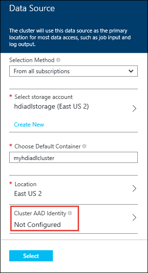

4. 在**叢集 AAD 身分識別**刀中，您可以選擇若要選取現有的服務主要或建立新的範本。

    * **建立新的服務原則**

        * 在**叢集 AAD 身分識別**刀中，按一下 [**建立新****服務主要**，，然後按一下然後在 [**建立服務主要**刀，提供值，以建立新的服務主要。 一部分，憑證和 Azure Active Directory 應用程式也會建立。 按一下 [**建立**]。

            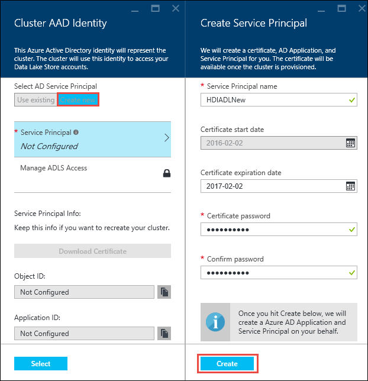

        * 在 [**叢集 AAD 身分識別**刀中，按一下 [**管理 ADLS 存取**]。 窗格會與訂閱相關聯的資料湖存放帳戶。 不過，您可以設定的權限僅適用於您所建立的帳戶。 選取您想要與 HDInsight 叢集建立關聯，然後按一下 [**儲存的權限**的帳戶的讀/寫執行權限。

            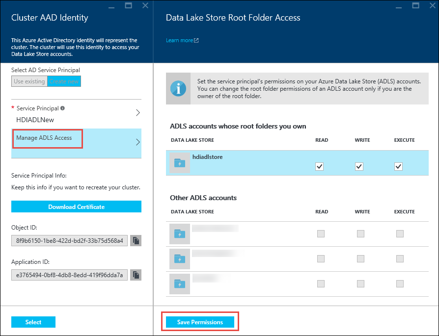

        * 在**叢集 AAD 身分識別**刀中，按一下 [下載憑證的主體您建立的服務相關聯的**下載憑證**]。 這是如果您想要建立其他的 HDInsight 叢集時，使用相同的服務主要有幫助。 按一下 [**選取**]。

            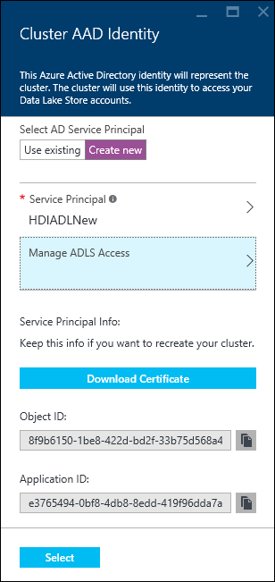

    * **選擇現有的服務原則**

        * 在**叢集 AAD 身分識別**刀中，按一下 [**使用現有的****服務主要**，，然後按一下然後在 [**選擇服務主要**刀，搜尋現有的服務主要。 按一下 [服務主體名稱，然後按一下 [**選取**]。

            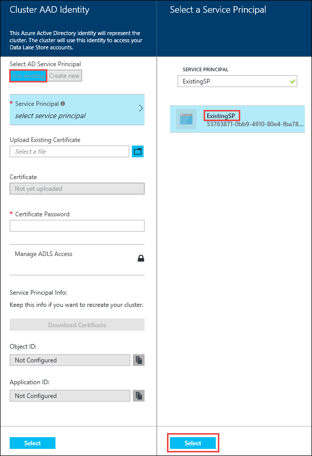

        * 在**叢集 AAD 身分識別**刀中上, 傳與選取]，服務主要相關聯的憑證 (.pfx)，然後提供的憑證密碼。

5. 按一下 [**管理 ADLS 存取**]，然後按一下 [**選取檔案權限**。 

    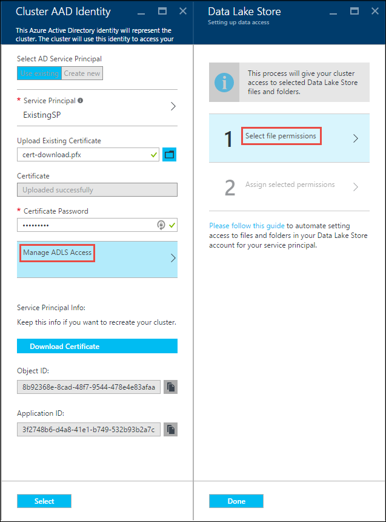

6. 中**選取檔案權限**刀，**帳戶**] 下拉式清單，從選取的資料湖存放帳戶，您想要與 HDInsight 叢集關聯。 刀列出的檔案與資料夾中選取的資料湖存放帳戶使用。 
 
    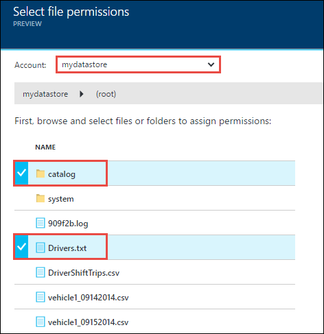

    之後，決定的權限，可提供給選取的檔案和資料夾。 資料夾，也指定是否權限，套用到資料夾只或資料夾及資料夾中的所有子項目。 您可以從**套用至**選取適當的值進行此選項，下拉式。 若要移除權限，請按一下 [**刪除**] 圖示

    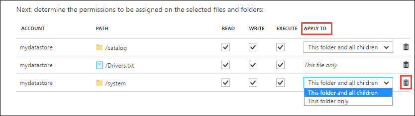

    重複這些步驟相關聯的檔案和資料夾的其他資料湖存放帳戶。 當您完成指派權限時，請按一下 [刀底部的 [**選取**]。

7. **將選取的權限指派**刀，檢閱您所提供的權限，然後按一下 [授與這些權限的 [**執行**。

    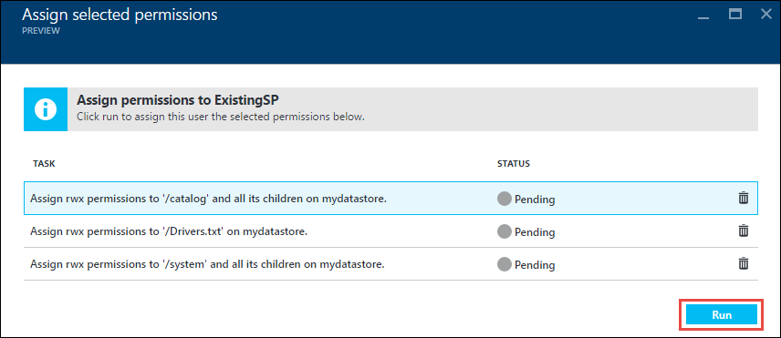

    [狀態] 欄會顯示進度。 一旦成功指派所有的權限，請按一下 [**完成**]。 

6. 按一下 [**叢集 AAD 身分識別**與**資料來源**刀中的 [**選取**，然後繼續執行叢集之所述，[建立 Hadoop 叢集 HDInsight 中](../hdinsight/hdinsight-hadoop-create-linux-clusters-portal.md)。

7. 一旦叢集佈建後，您可以驗證服務主要是 HDInsight 叢集與相關聯。 若要這麼做，從叢集刀中，按一下 [若要查看相關聯的服務主要的**叢集 AAD 身分識別**]。

    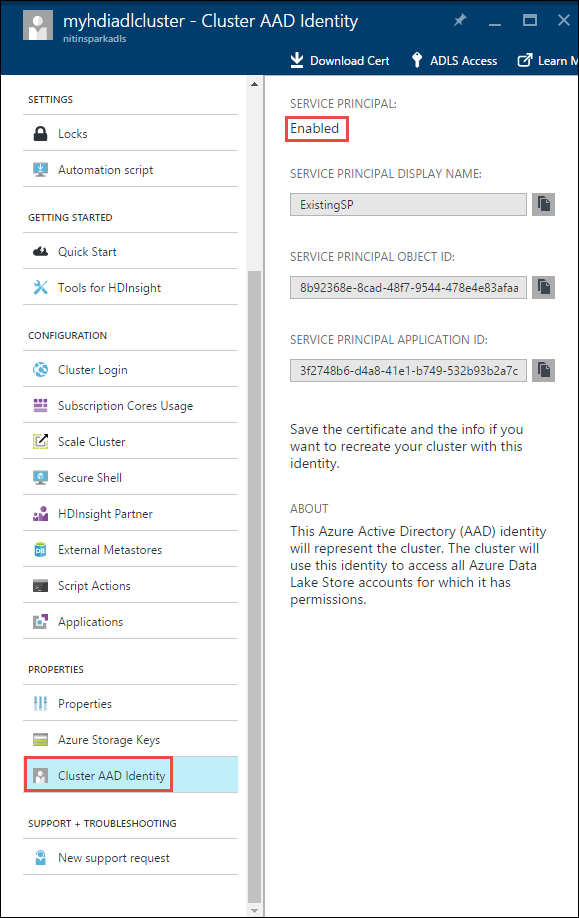

## 執行 HDInsight 叢集使用 Azure 資料湖存放區上的 [測試工作

您已設定 HDInsight 叢集之後，您可以執行測試工作叢集測試 HDInsight 叢集可以存取 Azure 資料湖存放區中的資料。 若要這麼做，我們會執行某些登錄區查詢的目標資料湖存放區。

### Linux 叢集

1. 開啟叢集刀，只要佈建叢集，然後按一下 [**儀表板**。 這會開啟 Linux 叢集 Ambari。 存取 Ambari，系統會提示您驗證網站。 輸入 （預設管理員） 的管理員帳戶名稱和密碼時建立叢集使用。

    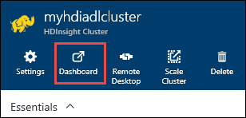

    您也可以直接對 Ambari 導覽，移至網頁瀏覽器中 https://CLUSTERNAME.azurehdinsight.net （ **CLUSTERNAME**是您 HDInsight 叢集的名稱）。

2. 開啟登錄區檢視。 選取到清單可用的檢視 （旁邊**管理員**連結] 按鈕右邊的頁面]） 的 [頁面] 功能表的平方和的設定。 選取的**登錄區**檢視。

    

3. 您應該會看到類似以下的頁面︰

    ![包含 [查詢編輯器] 區段的登錄區檢視頁面的圖像](./media/data-lake-store-hdinsight-hadoop-use-portal/hiveview.png)

4. 在 [頁面的 [**查詢編輯器**] 區段中，貼上到工作表的下列 HiveQL 陳述式︰

        CREATE EXTERNAL TABLE vehicles (str string) LOCATION 'adl://mydatalakestore.azuredatalakestore.net:443/mynewfolder'

5. 按一下 [**執行**] 按鈕，底部的 [**查詢編輯器] 中**，以啟動查詢]。 **查詢的程序結果**區段應該會出現**查詢編輯器]**底下，並顯示工作的相關資訊。

6. 查詢完成之後，[**查詢程序結果**] 區段會顯示作業的結果。 [**結果**] 索引標籤應該包含下列資訊︰

7. 執行下列查詢，以驗證所建立資料表。

        SHOW TABLES;

    [**結果**] 索引標籤會顯示下列動作︰

        hivesampletable
        vehicles

    **車輛**是您先前建立的資料表。 **hivesampletable**是預設的所有 HDInsight 叢集提供的範例表格。

8. 您也可以執行查詢來擷取**車輛**表格中的資料。

        SELECT * FROM vehicles LIMIT 5;

### Windows 叢集

1. 開啟叢集刀，只要佈建叢集，然後按一下 [**儀表板**。

    

    出現提示時，輸入叢集系統管理員認證。

2. 這會開啟 Microsoft Azure HDInsight 查詢主控台。 按一下 [**登錄區編輯器**]。

    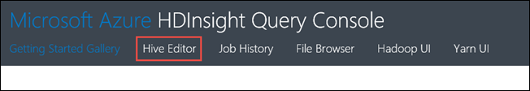

3. 在登錄區編輯器中，輸入下列查詢，然後再按一下 [**提交**]。

        CREATE EXTERNAL TABLE vehicles (str string) LOCATION 'adl://mydatalakestore.azuredatalakestore.net:443/mynewfolder'

    在此登錄區查詢中，建立表格從儲存在資料湖存放區中的資料`adl://mydatalakestore.azuredatalakestore.net:443/mynewfolder`。 此位置具有您應該上傳較舊版本的範例資料檔案。

    **工作階段**資料表底部會顯示從**初始化**，變更為**執行**，**完成**工作的狀態。 您也可以按一下 [**檢視詳細資料**，查看已完成的工作的相關詳細資訊。

    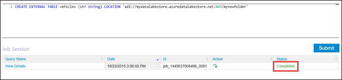

4. 執行下列查詢，以驗證所建立資料表。

        SHOW TABLES;

    按一下 [**檢視詳細資料**對應至這個查詢和輸出應該會顯示下列動作︰

        hivesampletable
        vehicles

    **車輛**是您先前建立的資料表。 **hivesampletable**是預設的所有 HDInsight 叢集提供的範例表格。

5. 您也可以執行查詢來擷取**車輛**表格中的資料。

        SELECT * FROM vehicles LIMIT 5;

## Access 資料湖存放區使用 HDFS 命令

一旦您已設定 HDInsight 叢集使用資料湖存放區，您可以使用 HDFS 命令介面指令存取存放區。

### Linux 叢集

在這個區段您將叢集會 SSH 及執行 HDFS 命令。 Windows 不提供的內建的 SSH 用戶端。 我們建議使用**PuTTY**，可以從[http://www.chiark.greenend.org.uk/~sgtatham/putty/download.html](http://www.chiark.greenend.org.uk/~sgtatham/putty/download.html)下載。

如需有關如何使用 PuTTY 的詳細資訊，請參閱[使用 SSH Linux 為基礎的 Hadoop HDInsight 從 Windows 上使用](../hdinsight/hdinsight-hadoop-linux-use-ssh-windows.md)。

連線後，使用下列 HDFS 檔案系統命令清單資料湖存放區中的檔案。

    hdfs dfs -ls adl://<Data Lake Store account name>.azuredatalakestore.net:443/

此應該列出您上傳的舊版資料湖存放區的檔案。

    15/09/17 21:41:15 INFO web.CaboWebHdfsFileSystem: Replacing original urlConnectionFactory with org.apache.hadoop.hdfs.web.URLConnectionFactory@21a728d6
    Found 1 items
    -rwxrwxrwx   0 NotSupportYet NotSupportYet     671388 2015-09-16 22:16 adl://mydatalakestore.azuredatalakestore.net:443/mynewfolder

您也可以使用`hdfs dfs -put`] 命令以某些檔案上傳到 [資料湖 Store]，然後使用`hdfs dfs -ls`確認是否已成功上傳的檔案。

### Windows 叢集

1. 登入新的[Azure 入口網站](https://portal.azure.com)。

2. 按一下 [**瀏覽**]、 按一下**HDInsight 叢集**，，然後按一下您建立的 HDInsight 叢集。

3. 在叢集刀中，按一下**遠端桌面**]，然後在 [**遠端桌面**刀中，按一下 [**連線**。

    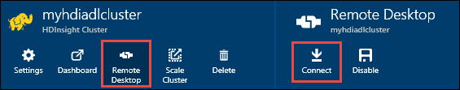

    出現提示時，輸入您的遠端桌面使用者所提供的認證。

4. 在遠端工作階段，啟動 Windows PowerShell，並使用 HDFS 檔案系統命令清單 Azure 資料湖存放區中的檔案。

        hdfs dfs -ls adl://<Data Lake Store account name>.azuredatalakestore.net:443/

    此應該列出您上傳的舊版資料湖存放區的檔案。

        15/09/17 21:41:15 INFO web.CaboWebHdfsFileSystem: Replacing original urlConnectionFactory with org.apache.hadoop.hdfs.web.URLConnectionFactory@21a728d6
        Found 1 items
        -rwxrwxrwx   0 NotSupportYet NotSupportYet     671388 2015-09-16 22:16 adl://mydatalakestore.azuredatalakestore.net:443/mynewfolder

    您也可以使用`hdfs dfs -put`] 命令以某些檔案上傳到 [資料湖 Store]，然後使用`hdfs dfs -ls`確認是否已成功上傳的檔案。

## 使用與火花叢集資料湖存放區

在此區段中，您使用 Jupyter 筆記本可用的 HDInsight 火花叢集執行工作的讀取您與 HDInsight 火花叢集，而不是預設 Azure 儲存體 Blob 帳戶相關聯的資料湖存放帳戶中的資料。

1. 複製與火花叢集叢集相關聯的 Azure 資料湖存放區帳戶相關聯的預設儲存帳戶 (WASB) 的一些範例資料。 您可以使用[ADLCopy 工具](http://aka.ms/downloadadlcopy)執行此作業。 下載並安裝工具的連結。

2. 開啟命令提示字元，並瀏覽至 AdlCopy 安裝的目錄，通常是`%HOMEPATH%\Documents\adlcopy`。

3. 執行下列命令以來源容器中的特定 blob 複製到資料湖存放區︰

        AdlCopy /source https://<source_account>.blob.core.windows.net/<source_container>/<blob name> /dest swebhdfs://<dest_adls_account>.azuredatalakestore.net/<dest_folder>/ /sourcekey <storage_account_key_for_storage_container>

    在此教學課程中，複製 [ **HVAC.csv**範例資料檔案，在**/HdiSamples/HdiSamples/SensorSampleData/hvac/** Azure 資料湖存放帳戶。 程式碼片段看起來應該像︰

        AdlCopy /Source https://mydatastore.blob.core.windows.net/mysparkcluster/HdiSamples/HdiSamples/SensorSampleData/hvac/HVAC.csv /dest swebhdfs://mydatalakestore.azuredatalakestore.net/hvac/ /sourcekey uJUfvD6cEvhfLoBae2yyQf8t9/BpbWZ4XoYj4kAS5Jf40pZaMNf0q6a8yqTxktwVgRED4vPHeh/50iS9atS5LQ==

    >[AZURE.WARNING] 請確定您的檔案和路徑的名稱會在適當的大小寫。

4. 會提示您輸入認證，您可以在其下有資料湖存放帳號的 Azure 訂閱。 您會看到類似以下的輸出︰

        Initializing Copy.
        Copy Started.
        100% data copied.
        Copy Completed. 1 file copied.

    將資料湖存放帳戶中的資料夾**/hvac**下複製的資料檔案 (**HVAC.csv**)。

4. 從[Azure 入口網站](https://portal.azure.com/)，從 startboard，按一下 [火花叢集] 方塊 （如果您釘選它 startboard）。 您也可以導覽下**瀏覽所有**叢集 > **HDInsight 叢集**。   

2. 從火花叢集刀中，按一下 [**快速連結**]，然後從**叢集儀表板**刀中，按一下**Jupyter 筆記本**。 如果出現提示，請輸入叢集管理員認證。

    > [AZURE.NOTE] 您也可能會在瀏覽器中開啟下列 URL 達到叢集 Jupyter 筆記本。 取代您叢集名稱__CLUSTERNAME__ :
    >
    > `https://CLUSTERNAME.azurehdinsight.net/jupyter`

2. 建立新的筆記本。 按一下 [**新增**]，然後按一下 [ **PySpark**。

    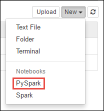

3. 建立新的筆記本，並開啟**Untitled.pynb**名稱。 

4. 您建立 PySpark 核心的筆記本，因為您不需要明確地建立任何內容。 當您執行第一個程式碼儲存格時，火花和登錄區內容，會自動建立適合您。 您可以開始匯入所需的這種情況的類型。 若要這麼做，貼上下列的程式碼片段，在儲存格中，按下**SHIFT + enter 鍵**。

        from pyspark.sql.types import *
        
    每當您在 Jupyter 執行工作，您的網頁瀏覽器視窗標題會顯示筆記本標題以及**（忙碌）**狀態。 您也會看到實心圓形**PySpark**文字在右上角旁。 完成工作之後，這會變更空心圓。

     

4. 載入使用**HVAC.csv**檔案複製到資料湖存放帳戶的暫存資料表中的範例資料。 您可以存取資料湖存放帳戶使用下列的 URL 模式中的資料。

        adl://<data_lake_store_name>.azuredatalakestore.net/<path_to_file>

    空白的儲存格，貼上下列的程式碼範例、 **MYDATALAKESTORE**取代您的資料湖存放帳戶名稱，然後按**SHIFT + enter 鍵**。 此範例中的程式碼到暫存資料表中稱為**hvac**註冊資料。

        # Load the data
        hvacText = sc.textFile("adl://MYDATALAKESTORE.azuredatalakestore.net/hvac/HVAC.csv")
        
        # Create the schema
        hvacSchema = StructType([StructField("date", StringType(), False),StructField("time", StringType(), False),StructField("targettemp", IntegerType(), False),StructField("actualtemp", IntegerType(), False),StructField("buildingID", StringType(), False)])
        
        # Parse the data in hvacText
        hvac = hvacText.map(lambda s: s.split(",")).filter(lambda s: s[0] != "Date").map(lambda s:(str(s[0]), str(s[1]), int(s[2]), int(s[3]), str(s[6]) ))
        
        # Create a data frame
        hvacdf = sqlContext.createDataFrame(hvac,hvacSchema)
        
        # Register the data fram as a table to run queries against
        hvacdf.registerTempTable("hvac")

5. 因為您使用的 PySpark 核心，您現在可以直接執行 SQL 查詢上您剛剛建立使用暫存資料表**hvac** `%%sql`個神奇。 如需有關`%%sql`的優勢，以及其他我們提供 PySpark 核心，請參閱[核心提供火花 HDInsight 叢集 Jupyter 筆記本](hdinsight-apache-spark-jupyter-notebook-kernels.md#why-should-i-use-the-new-kernels)。
        
        %%sql
        SELECT buildingID, (targettemp - actualtemp) AS temp_diff, date FROM hvac WHERE date = \"6/1/13\"

5. 一旦作業成功完成時，預設會顯示下列表格式輸出。

    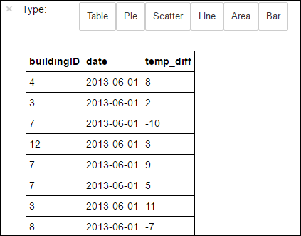

    您也可以查看其他視覺效果中的結果。 例如，相同的輸出區域圖會看起來如下。

    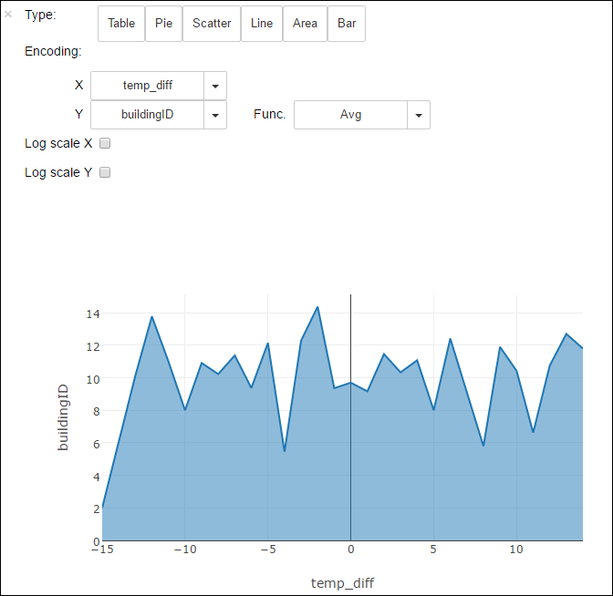

6. 當您完成執行應用程式之後，您應該要關閉的筆記本，以釋出資源。 若要這麼做，從 [**檔案**] 功能表上的筆記本中，按一下 [**關閉並停止**]。 這將會關閉，然後關閉的筆記本。

## 使用資料湖存放在大量拓撲

若要從大量拓撲撰寫資料，您可以使用資料湖存放區。 瞭解如何達成這種情況，請參閱[使用 Azure 資料湖存放區與 HDInsight Apache 大量](../hdinsight/hdinsight-storm-write-data-lake-store.md)的相關指示。

## 使用資料湖存放 HBase 叢集

您可以使用 HBase 叢集資料湖存放為預設儲存空間，以及額外儲存空間。 若要這麼做︰

1.  在**資料來源**刀， **HBase 資料的位置**，請選取**資料湖存放區**。
2.  選取您要使用的資料湖存放區的名稱，或建立新的範本。
3.  最後，指定資料湖存放區中的**HBase 根資料夾**。 如果資料湖存放帳戶沒有根資料夾，建立新的範本。

    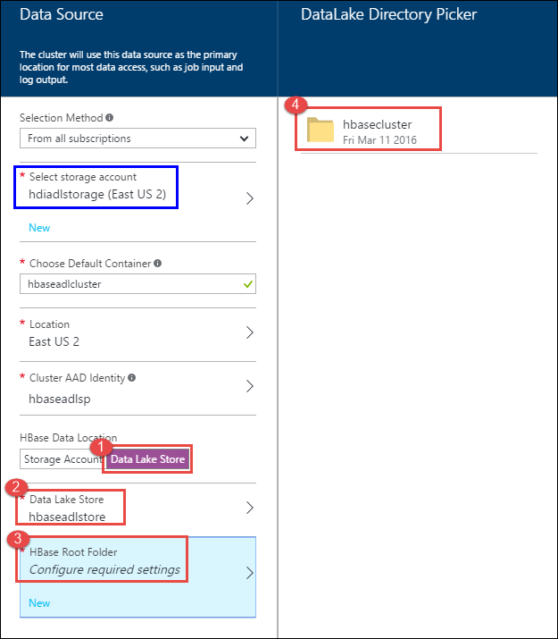

### 使用資料湖存放作為預設儲存空間，HBase 叢集時的考量事項

* 您可以使用相同的資料湖存放帳戶的多個 HBase 叢集。 不過，您必須是唯一**HBase 根資料夾**所提供的叢集 （步驟 4 中螢幕擷取畫面上方）。 您**不能**在兩個不同的 HBase 叢集使用相同的根資料夾。
* 雖然您可以使用資料湖存放帳戶作為預設儲存空間，HBase 叢集記錄檔仍會儲存在 Azure 儲存體二進位大型物件 (WASB) 叢集相關聯。 在螢幕擷取畫面上方的 [藍色] 方塊中，這會醒目提示。

## 另請參閱

* [PowerShell︰ 建立 HDInsight 叢集使用資料湖存放區](data-lake-store-hdinsight-hadoop-use-powershell.md)

[makecert]: https://msdn.microsoft.com/library/windows/desktop/ff548309(v=vs.85).aspx
[pvk2pfx]: https://msdn.microsoft.com/library/windows/desktop/ff550672(v=vs.85).aspx
