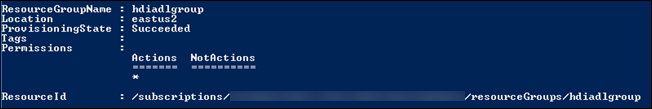
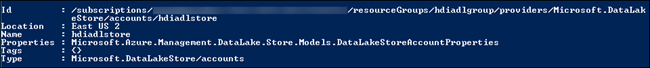

<properties
   pageTitle="使用 PowerShell 的 Azure 資料湖存放區建立 HDInsight 叢集 |Azure"
   description="建立並使用 Azure 資料湖 HDInsight 叢集使用 PowerShell 的 Azure"
   services="data-lake-store,hdinsight" 
   documentationCenter=""
   authors="nitinme"
   manager="jhubbard"
   editor="cgronlun"/>

<tags
   ms.service="data-lake-store"
   ms.devlang="na"
   ms.topic="article"
   ms.tgt_pltfrm="na"
   ms.workload="big-data"
   ms.date="10/21/2016"
   ms.author="nitinme"/>

# 建立資料湖存放使用 PowerShell 的 Azure HDInsight 叢集

> [AZURE.SELECTOR]
- [使用入口網站](data-lake-store-hdinsight-hadoop-use-portal.md)
- [使用 PowerShell](data-lake-store-hdinsight-hadoop-use-powershell.md)
- [使用資源管理員](data-lake-store-hdinsight-hadoop-use-resource-manager-template.md)

瞭解如何使用 PowerShell 的 Azure HDInsight 叢集 （Hadoop、 HBase 或大量） 設定存取 Azure 資料湖存放區。 在這個版本的一些重要考量事項︰

* **為火花叢集 (Linux) 和 Hadoop/大量叢集 （Windows 和 Linux）**、 資料湖存放區只可為額外的儲存空間帳戶。 預設儲存帳戶，例如叢集仍可 Azure 儲存體二進位大型物件 (WASB)。

* 以預設儲存空間或額外的儲存空間可**針對 HBase 叢集 （Windows 和 Linux）**、 資料湖存放區。

> [AZURE.NOTE] 注意的一些重要事項。 
> 
> * 僅適用於 HDInsight 版本 3.2 捨位及 3.4 （適用於 Windows，以及 Linux Hadoop、 HBase，以及大量叢集） 時，若要建立 HDInsight 叢集有權存取資料湖存放區的選項。 針對 linux 火花叢集，這個選項只適 HDInsight 3.4 叢集上。
>
> * 如上所述，資料湖存放使用做為預設儲存空間的某些叢集類型 (HBase) 和其他叢集類型 （Hadoop、 火花大量） 額外的儲存空間。 使用資料湖存放為額外的儲存空間帳戶並不會影響效能或讀/寫儲存的能力。 在此案例中資料湖存放位置作為額外儲存空間，叢集相關檔案 （例如記錄等） 會寫入到預設儲存空間 (Azure Blob)，而您想要處理的資料可以儲存資料湖存放帳戶。

本文中，我們會提供資料湖存放區的 Hadoop 叢集為額外的儲存空間。

設定使用資料湖存放 HDInsight 使用 PowerShell 牽涉下列步驟︰

* 建立 Azure 資料湖存放區
* 設定驗證角色型存取資料湖存放區
* 建立 HDInsight 叢集驗證時資料湖存放區
* 在 [叢集執行測試工作

## 必要條件

本教學課程之前，您必須具備下列項目︰

- **Azure 訂閱**。 請參閱[取得 Azure 免費試用版](https://azure.microsoft.com/pricing/free-trial/)。

- **Azure PowerShell 1.0 或更大**。 瞭解[如何安裝和設定 PowerShell 的 Azure](../powershell-install-configure.md)。

- **Windows SDK**。 您可以從[這裡](https://dev.windows.com/en-us/downloads)進行安裝。 您可以使用此選項建立安全性憑證。

- **Azure Active Directory 服務主要**。 在本教學課程中的步驟會提供說明如何建立 Azure AD 服務主要。 不過，您必須是 Azure AD 管理員，才能建立服務主要。 如果您是 Azure AD 管理員，您可以略過此必要條件，並繼續教學課程。
    
    **如果您不是 Azure AD 系統管理員**，您無法執行建立服務主要所需的步驟。 在這種情況下，您的 Azure AD 系統管理員必須先建立服務主要才能建立 HDInsight 叢集資料湖存放區。 此外，服務主要必須建立使用的認證，所述，[建立憑證的主體的服務](../resource-group-authenticate-service-principal.md#create-service-principal-with-certificate)。 

## 建立 Azure 資料湖存放區

請遵循這些步驟來建立資料湖存放區。

1. 從您的桌面，開啟新的 PowerShell 的 Azure 視窗，然後輸入下列程式碼片段。 當畫面提示您登入，請確定您登入為其中一項訂閱 admininistrators/擁有者︰

        # Log in to your Azure account
        Login-AzureRmAccount

        # List all the subscriptions associated to your account
        Get-AzureRmSubscription

        # Select a subscription
        Set-AzureRmContext -SubscriptionId <subscription ID>

        # Register for Data Lake Store
        Register-AzureRmResourceProvider -ProviderNamespace "Microsoft.DataLakeStore"

    >[AZURE.NOTE] 如果您收到錯誤，類似於`Register-AzureRmResourceProvider : InvalidResourceNamespace: The resource namespace 'Microsoft.DataLakeStore' is invalid`時註冊資料湖存放資源提供者，有可能是您 subsrcription 不是 whitelisted Azure 資料湖市集。 請確定您啟用 Azure 資料湖存放公用 preview 版訂閱，依照下列[指示進行](data-lake-store-get-started-portal.md#signup)。

3. Azure 資料湖存放帳戶是 Azure 資源群組相關聯。 開始建立 Azure 資源群組。

        $resourceGroupName = "<your new resource group name>"
        New-AzureRmResourceGroup -Name $resourceGroupName -Location "East US 2"

    

2. 建立 Azure 資料湖存放帳戶。 小寫字母和數字，必須只會包含您所指定的帳戶名稱。

        $dataLakeStoreName = "<your new Data Lake Store name>"
        New-AzureRmDataLakeStoreAccount -ResourceGroupName $resourceGroupName -Name $dataLakeStoreName -Location "East US 2"

    

3. 確認已成功建立帳戶。

        Test-AzureRmDataLakeStoreAccount -Name $dataLakeStoreName

    這個輸出應該是**True**。

4. 上傳一些範例資料，以 Azure 資料湖。 我們會使用這本文稍後的驗證的資料是從 HDInsight 叢集存取。 如果您要尋找的上傳的一些範例資料，您可以取得[Azure 資料湖給存放庫](https://github.com/MicrosoftBigData/usql/tree/master/Examples/Samples/Data/AmbulanceData)**政策救護車資料**的資料夾。

        $myrootdir = "/"
        Import-AzureRmDataLakeStoreItem -AccountName $dataLakeStoreName -Path "C:\<path to data>\vehicle1_09142014.csv" -Destination $myrootdir\vehicle1_09142014.csv

## 設定驗證角色型存取資料湖存放區

每個 Azure 的訂閱是 Azure Active Directory 與相關聯。 使用者和服務存取資源使用 Azure 傳統入口網站或 Azure 資源管理員 API 的訂閱，必須先與的 Azure Active Directory 驗證。 已授與存取 Azure 訂閱與服務分派於 Azure 資源適當的角色。  如需服務，服務主要識別服務的 Azure Active Directory (AAD)。 本節說明如何將應用程式服務，例如 HDInsight，Azure 資源 （Azure 資料湖存放您先前建立的帳戶） 的存取權授與建立應用程式服務原則，並指派給該角色，透過 PowerShell 的 Azure。

若要設定 Azure 資料湖 Active Directory 驗證，您必須執行下列工作。

* 建立自我簽署的憑證
* Azure Active Directory 和服務主要中建立的應用程式

### 建立自我簽署的憑證

請確定您有[Windows SDK](https://dev.windows.com/en-us/downloads)本節中的步驟進行之前，先安裝。 您必須也建立目錄，例如**C:\mycertdir**，將會建立憑證。

1. 從 [PowerShell] 視窗中，瀏覽至安裝 Windows SDK 的位置 (通常`C:\Program Files (x86)\Windows Kits\10\bin\x86`並使用[MakeCert] [makecert]公用程式，來建立自我簽署的憑證和私密金鑰。 使用下列命令。

        $certificateFileDir = "<my certificate directory>"
        cd $certificateFileDir
        $startDate = (Get-Date).ToString('MM/dd/yyyy')
        $endDate = (Get-Date).AddDays(365).ToString('MM/dd/yyyy')

        makecert -sv mykey.pvk -n "cn=HDI-ADL-SP" CertFile.cer -b $startDate -e $endDate -r -len 2048

    系統會提示您輸入私密金鑰密碼。 順利執行命令之後，您應該會看到的**CertFile.cer**和**mykey.pvk**您指定的憑證目錄中。

4. 使用[Pvk2Pfx] [pvk2pfx]公用程式，來建立 MakeCert.pvk 和.cer 檔案轉換成.pfx 檔。 執行下列命令。

        pvk2pfx -pvk mykey.pvk -spc CertFile.cer -pfx CertFile.pfx -po <password>

    出現提示時輸入您先前指定私密金鑰密碼。 您指定**的採購單**參數的值是.pfx 檔與相關聯的密碼。 命令順利完成之後，您也應該會看到您所指定的憑證目錄中 CertFile.pfx。

###  建立 Azure Active Directory 和服務原則

在此區段中，您可以執行來建立服務本金 Azure Active Directory 應用程式、 主體服務中指派角色及提供憑證驗證服務主要步驟。 執行下列命令以 Azure Active Directory 中建立的應用程式。

1. PowerShell 主控台視窗中，貼上下列 cmdlet。 請確定您指定**的 DisplayName**屬性的值是唯一的。 此外， **-首頁**及**-IdentiferUris**的值是版面配置區的值，與驗證。

        $certificateFilePath = "$certificateFileDir\CertFile.pfx"

        $password = Read-Host –Prompt "Enter the password" # This is the password you specified for the .pfx file

        $certificatePFX = New-Object System.Security.Cryptography.X509Certificates.X509Certificate2($certificateFilePath, $password)

        $rawCertificateData = $certificatePFX.GetRawCertData()

        $credential = [System.Convert]::ToBase64String($rawCertificateData)

        $application = New-AzureRmADApplication `
                    -DisplayName "HDIADL" `
                    -HomePage "https://contoso.com" `
                    -IdentifierUris "https://mycontoso.com" `
                    -KeyValue $credential  `
                    -KeyType "AsymmetricX509Cert"  `
                    -KeyUsage "Verify"  `
                    -StartDate $startDate  `
                    -EndDate $endDate

        $applicationId = $application.ApplicationId

2. 建立服務主體使用應用程式識別碼。

        $servicePrincipal = New-AzureRmADServicePrincipal -ApplicationId $applicationId

        $objectId = $servicePrincipal.Id

3. 授與服務主體存取資料湖存放檔案/資料夾，您將會從 HDInsight 叢集存取權。 下列程式碼片段提供存取資料湖存放帳戶的根目錄。

        Set-AzureRmDataLakeStoreItemAclEntry -AccountName $dataLakeStoreName -Path / -AceType User -Id $objectId -Permissions All

    出現提示時，請輸入**Y**來確認。

## 建立 HDInsight 叢集驗證時資料湖存放區

在此區段中，我們建立 HDInsight Hadoop 叢集。 這個版本中，HDInsight 叢集和資料湖存放必須在同一個位置 （用於美國 2）。

1. 開始擷取訂閱租用戶識別碼。 您需要的更新版本。

        $tenantID = (Get-AzureRmContext).Tenant.TenantId

2. 這個版本中，對於 Hadoop 叢集，資料湖存放區只可為額外的儲存空間叢集。 預設儲存空間仍可儲存 Azure blob (WASB)。 因此，我們將第一次建立的儲存空間帳戶與叢集所需的儲存空間容器。

        # Create an Azure storage account
        $location = "East US 2"
        $storageAccountName = "<StorageAcccountName>"   # Provide a Storage account name

        New-AzureRmStorageAccount -ResourceGroupName $resourceGroupName -StorageAccountName $storageAccountName -Location $location -Type Standard_GRS

        # Create an Azure Blob Storage container
        $containerName = "<ContainerName>"              # Provide a container name
        $storageAccountKey = Get-AzureRmStorageAccountKey -Name $storageAccountName -ResourceGroupName $resourceGroupName | %{ $_.Key1 }
        $destContext = New-AzureStorageContext -StorageAccountName $storageAccountName -StorageAccountKey $storageAccountKey
        New-AzureStorageContainer -Name $containerName -Context $destContext

3. 建立 HDInsight 叢集。 使用下列 cmdlet。

        # Set these variables
        $clusterName = $containerName                   # As a best practice, have the same name for the cluster and container
        $clusterNodes = <ClusterSizeInNodes>            # The number of nodes in the HDInsight cluster
        $httpCredentials = Get-Credential
        $rdpCredentials = Get-Credential

        New-AzureRmHDInsightCluster -ClusterName $clusterName -ResourceGroupName $resourceGroupName -HttpCredential $httpCredentials -Location $location -DefaultStorageAccountName "$storageAccountName.blob.core.windows.net" -DefaultStorageAccountKey $storageAccountKey -DefaultStorageContainer $containerName  -ClusterSizeInNodes $clusterNodes -ClusterType Hadoop -Version "3.2" -RdpCredential $rdpCredentials -RdpAccessExpiry (Get-Date).AddDays(14) -ObjectID $objectId -AadTenantId $tenantID -CertificateFilePath $certificateFilePath -CertificatePassword $password

    Cmdlet 順利完成之後，您應該會看到成果像這樣︰

        Name                      : hdiadlcluster
        Id                        : /subscriptions/65a1016d-0f67-45d2-b838-b8f373d6d52e/resourceGroups/hdiadlgroup/providers/Mi
                                    crosoft.HDInsight/clusters/hdiadlcluster
        Location                  : East US 2
        ClusterVersion            : 3.2.7.707
        OperatingSystemType       : Windows
        ClusterState              : Running
        ClusterType               : Hadoop
        CoresUsed                 : 16
        HttpEndpoint              : hdiadlcluster.azurehdinsight.net
        Error                     :
        DefaultStorageAccount     :
        DefaultStorageContainer   :
        ResourceGroup             : hdiadlgroup
        AdditionalStorageAccounts :

## 使用資料湖存放區 HDInsight 叢集上執行測試工作

您已設定 HDInsight 叢集之後，您可以執行叢集測試 HDInsight 叢集可以存取資料湖存放區上的測試工作。 若要這麼做，我們會執行建立表格，使用您上傳的舊版資料湖存放區的範例資料的範例登錄區工作。

### Linux 叢集

本節中您必須將 SSH 到叢集，並執行範例登錄區查詢。 Windows 不提供的內建的 SSH 用戶端。 我們建議使用**PuTTY**，可以從[http://www.chiark.greenend.org.uk/~sgtatham/putty/download.html](http://www.chiark.greenend.org.uk/~sgtatham/putty/download.html)下載。

如需有關如何使用 PuTTY 的詳細資訊，請參閱[使用 SSH Linux 為基礎的 Hadoop HDInsight 從 Windows 上使用](../hdinsight/hdinsight-hadoop-linux-use-ssh-windows.md)。

1. 連線之後，請使用下列命令以啟動登錄區 CLI:

        hive

2. 使用 CLI，輸入要建立新資料表命名**車輛**資料湖存放區中使用的範例資料的下列陳述式︰

        DROP TABLE vehicles;
        CREATE EXTERNAL TABLE vehicles (str string) LOCATION 'adl://<mydatalakestore>.azuredatalakestore.net:443/';
        SELECT * FROM vehicles LIMIT 10;

    您應該會看到類似以下的輸出︰

        1,1,2014-09-14 00:00:03,46.81006,-92.08174,51,S,1
        1,2,2014-09-14 00:00:06,46.81006,-92.08174,13,NE,1
        1,3,2014-09-14 00:00:09,46.81006,-92.08174,48,NE,1
        1,4,2014-09-14 00:00:12,46.81006,-92.08174,30,W,1
        1,5,2014-09-14 00:00:15,46.81006,-92.08174,47,S,1
        1,6,2014-09-14 00:00:18,46.81006,-92.08174,9,S,1
        1,7,2014-09-14 00:00:21,46.81006,-92.08174,53,N,1
        1,8,2014-09-14 00:00:24,46.81006,-92.08174,63,SW,1
        1,9,2014-09-14 00:00:27,46.81006,-92.08174,4,NE,1
        1,10,2014-09-14 00:00:30,46.81006,-92.08174,31,N,1

### Windows 叢集

使用下列 cmdlet，以執行登錄區查詢。 在這個查詢我們會從資料湖存放區中的資料建立表格，然後再執行建立表格的 [選取查詢。

    $queryString = "DROP TABLE vehicles;" + "CREATE EXTERNAL TABLE vehicles (str string) LOCATION 'adl://$dataLakeStoreName.azuredatalakestore.net:443/';" + "SELECT * FROM vehicles LIMIT 10;"

    $hiveJobDefinition = New-AzureRmHDInsightHiveJobDefinition -Query $queryString

    $hiveJob = Start-AzureRmHDInsightJob -ResourceGroupName $resourceGroupName -ClusterName $clusterName -JobDefinition $hiveJobDefinition -ClusterCredential $httpCredentials

    Wait-AzureRmHDInsightJob -ResourceGroupName $resourceGroupName -ClusterName $clusterName -JobId $hiveJob.JobId -ClusterCredential $httpCredentials

這會有下列輸出。 **ExitValue**輸出中的 0 的建議工作已順利完成。

    Cluster         : hdiadlcluster.
    HttpEndpoint    : hdiadlcluster.azurehdinsight.net
    State           : SUCCEEDED
    JobId           : job_1445386885331_0012
    ParentId        :
    PercentComplete :
    ExitValue       : 0
    User            : admin
    Callback        :
    Completed       : done

擷取從工作的成果，使用下列 cmdlet:

    Get-AzureRmHDInsightJobOutput -ClusterName $clusterName -JobId $hiveJob.JobId -DefaultContainer $containerName -DefaultStorageAccountName $storageAccountName -DefaultStorageAccountKey $storageAccountKey -ClusterCredential $httpCredentials

工作輸出類似下列各項︰

    1,1,2014-09-14 00:00:03,46.81006,-92.08174,51,S,1
    1,2,2014-09-14 00:00:06,46.81006,-92.08174,13,NE,1
    1,3,2014-09-14 00:00:09,46.81006,-92.08174,48,NE,1
    1,4,2014-09-14 00:00:12,46.81006,-92.08174,30,W,1
    1,5,2014-09-14 00:00:15,46.81006,-92.08174,47,S,1
    1,6,2014-09-14 00:00:18,46.81006,-92.08174,9,S,1
    1,7,2014-09-14 00:00:21,46.81006,-92.08174,53,N,1
    1,8,2014-09-14 00:00:24,46.81006,-92.08174,63,SW,1
    1,9,2014-09-14 00:00:27,46.81006,-92.08174,4,NE,1
    1,10,2014-09-14 00:00:30,46.81006,-92.08174,31,N,1

## Access 資料湖存放區使用 HDFS 命令

一旦您已設定 HDInsight 叢集使用資料湖存放區，您可以使用 HDFS 命令介面指令存取存放區。

### Linux 叢集

在這個區段您將叢集會 SSH 及執行 HDFS 命令。 Windows 不提供的內建的 SSH 用戶端。 我們建議使用**PuTTY**，可以從[http://www.chiark.greenend.org.uk/~sgtatham/putty/download.html](http://www.chiark.greenend.org.uk/~sgtatham/putty/download.html)下載。

如需有關如何使用 PuTTY 的詳細資訊，請參閱[使用 SSH Linux 為基礎的 Hadoop HDInsight 從 Windows 上使用](../hdinsight/hdinsight-hadoop-linux-use-ssh-windows.md)。

連線後，使用下列 HDFS 檔案系統命令清單資料湖存放區中的檔案。

    hdfs dfs -ls adl://<Data Lake Store account name>.azuredatalakestore.net:443/

此應該列出您上傳的舊版資料湖存放區的檔案。

    15/09/17 21:41:15 INFO web.CaboWebHdfsFileSystem: Replacing original urlConnectionFactory with org.apache.hadoop.hdfs.web.URLConnectionFactory@21a728d6
    Found 1 items
    -rwxrwxrwx   0 NotSupportYet NotSupportYet     671388 2015-09-16 22:16 adl://mydatalakestore.azuredatalakestore.net:443/mynewfolder

您也可以使用`hdfs dfs -put`] 命令以某些檔案上傳到 [資料湖 Store]，然後使用`hdfs dfs -ls`確認是否已成功上傳的檔案。

### Windows 叢集

1. 登入新的[Azure 入口網站](https://portal.azure.com)。

2. 按一下 [**瀏覽**]、 按一下**HDInsight 叢集**，，然後按一下您建立的 HDInsight 叢集。

3. 在叢集刀中，按一下**遠端桌面**]，然後在 [**遠端桌面**刀中，按一下 [**連線**。

    

    出現提示時，輸入您的遠端桌面使用者所提供的認證。

4. 在遠端工作階段，啟動 Windows PowerShell，並使用 HDFS 檔案系統命令清單 Azure 資料湖存放區中的檔案。

        hdfs dfs -ls adl://<Data Lake Store account name>.azuredatalakestore.net:443/

    此應該列出您上傳的舊版資料湖存放區的檔案。

        15/09/17 21:41:15 INFO web.CaboWebHdfsFileSystem: Replacing original urlConnectionFactory with org.apache.hadoop.hdfs.web.URLConnectionFactory@21a728d6
        Found 1 items
        -rwxrwxrwx   0 NotSupportYet NotSupportYet     671388 2015-09-16 22:16 adl://mydatalakestore.azuredatalakestore.net:443/vehicle1_09142014.csv

    您也可以使用`hdfs dfs -put`] 命令以某些檔案上傳到 [資料湖 Store]，然後使用`hdfs dfs -ls`確認是否已成功上傳的檔案。

## 另請參閱

* [入口網站︰ 建立 HDInsight 叢集使用資料湖存放區](data-lake-store-hdinsight-hadoop-use-portal.md)

[makecert]: https://msdn.microsoft.com/library/windows/desktop/ff548309(v=vs.85).aspx
[pvk2pfx]: https://msdn.microsoft.com/library/windows/desktop/ff550672(v=vs.85).aspx
