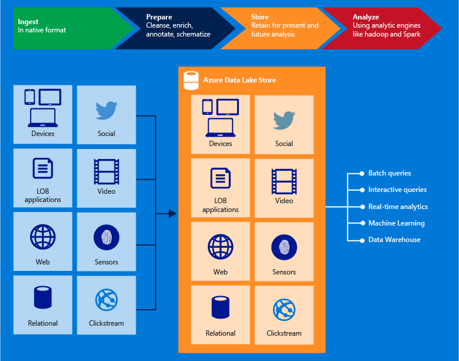

<properties
   pageTitle="Azure 資料湖存放概觀 |Microsoft Azure"
   description="瞭解什麼是 Azure 資料湖存放以及它提供了其他資料存放區的值"
   services="data-lake-store"
   documentationCenter=""
   authors="nitinme"
   manager="jhubbard"
   editor="cgronlun"/>

<tags
   ms.service="data-lake-store"
   ms.devlang="na"
   ms.topic="get-started-article"
   ms.tgt_pltfrm="na"
   ms.workload="big-data"
   ms.date="10/28/2016"
   ms.author="nitinme"/>

# Azure 資料湖存放區的概觀

Azure 資料湖存放是顯示較大的資料分析負載企業超比例存放庫。 Azure 資料湖可讓您擷取資料的作業與探分析一個單一位置的任何大小、 類型及 ingestion 速度。

> [AZURE.TIP] 使用[資料湖存放學習路徑](https://azure.microsoft.com/documentation/learning-paths/data-lake-store-self-guided-training/)來開始探索 Azure 資料湖存放服務。

Azure 資料湖存放可存取從 Hadoop （提供 HDInsight 叢集） 使用 WebHDFS 相容 REST Api。 它專為啟用上儲存的資料分析並調整為資料分析案例的效能。 預設工作，包括所有的企業級功能，安全性、 管理、 延展性、 可靠性和可用性，不可或缺的真實世界企業使用案例。

部分 Azure 資料湖的重要功能包括。

### Hadoop 的內建

Azure 資料湖市集是相容 Hadoop 分散式檔案系統 (HDFS) 與 Hadoop 生態相關事務 Apache Hadoop 檔案系統。  您現有的 HDInsight 應用程式或服務的使用 WebHDFS API 可以輕鬆地整合資料湖存放區。 資料湖存放也會公開 WebHDFS 相容 REST 應用程式介面

儲存資料湖存放區中的資料您可以輕鬆地分析使用 Hadoop 分析架構，例如 MapReduce 或登錄區。 可以佈建 Microsoft Azure HDInsight 叢集，並將其設為直接存取資料湖存放區中的資料。

### 不受限制的儲存空間，petabyte 檔案

Azure 資料湖存放區提供不受限制的儲存空間，以及適用於儲存各種不同的資料分析。 它不會強制帳戶大小、 檔案大小或可以儲存在資料湖的資料量有限制。 個別檔案的範圍可從 kb 到 petabytes 讓儲存任何類型的資料非常適合的大小。 資料儲存長期進行多份複本，在資料可以儲存在資料湖期間沒有限制。

### 效能調整大的資料分析

Azure 資料湖存放內建執行大型分析系統需要大量處理量查詢及分析大量資料。 資料湖散佈部分檔案在個別的儲存空間伺服器的數目。 閱讀平行執行資料分析的檔案時，這可改善讀取處理量。

### 企業專用︰ 高度-可用安全

Azure 資料湖存放提供業界標準可用性和可靠性。 藉由多餘的複本，以防止任何非預期的失敗次數長期儲存您的資料資產。 企業可以使用他們的解決方案中 Azure 資料湖，做為現有的資料平台重要的一部分。

資料湖存放也會提供企業級安全性儲存的資料。 如需詳細資訊，請參閱[Azure 資料湖存放區中的保護資料](#DataLakeStoreSecurity)。

### 所有的資料

Azure 資料湖存放可以儲存任何資料在其原始格式]，為，而不需要任何先前的轉換。 資料湖存放區並不需要先載入資料，定義的結構描述留給個別分析解譯資料，並在分析時定義的結構描述架構。 無法儲存檔案的任意大小和格式，可讓資料湖存放區來處理結構化、 半結構化及非結構化資料。

Azure 資料湖存放容器的資料是基本上資料夾和檔案。 您在處理使用 Sdk Azure 入口網站，與 Powershell 的 Azure 儲存的資料。 當您將使用這些介面，使用適當的容器市集放置資料，您可以儲存任何類型的資料。 資料湖存放區不會執行任何特殊的處理根據它所儲存的資料類型的資料。

## Azure 資料湖存放區中的資料

Azure 資料湖存放使用 Azure Active Directory 驗證，存取控制清單 (Acl) 來管理您的資料的存取權。

| 功能                                 | 描述                              |
|-----------------------------------------|------------------------------------------|
| 驗證 | Azure 資料湖存放區身分識別與存取權的管理，Azure 資料湖存放區中的所有資料的整合與 Azure Active Directory (AAD)。 當做整合，包括多重因素驗證、 條件存取、 角色型存取控制、 應用程式使用監視、 安全性監視和警告，所有 AAD 功能從 Azure 資料湖優點等。Azure 資料湖存放其餘介面中的驗證與支援 OAuth 2.0 通訊協定。 |
| 存取控制                          | Azure 資料湖存放提供存取控制由支援公開 WebHDFS 通訊協定 POSIX 樣式權限。 在目前的版本，Acl 可以啟用根資料夾、 子資料夾中，為個別檔案。 您套用到的根資料夾的 Acl 會也適用於所有子資料夾/檔案。|

想要深入瞭解保護資料湖存放區中的資料。 請遵循下列連結。

* 如需如何保護資料資料湖存放區中的指示，請參閱[Azure 資料湖存放區中的保護資料](data-lake-store-secure-data.md)。
* 比較偏好視訊嗎？ [觀賞本影片，](https://mix.office.com/watch/1q2mgzh9nn5lx)如何保護資料湖存放區中的資料。

## 相容於 Azure 資料湖市集的應用程式

Azure 資料湖存放是相容於 Hadoop 生態系統中的最開啟來源元件。 它也整合運用與其他 Azure 服務。 如此可讓資料湖存放您資料的儲存空間需求的完美選項。 請遵循下列連結，進一步瞭解如何使用資料湖存放同時開啟來源元件，以及其他 Azure 服務使用。

* 開啟來源與資料湖存放協同的應用程式的清單，請參閱[應用程式與服務相容於 Azure 資料湖存放區](data-lake-store-compatible-oss-other-applications.md)。
* 請參閱[與其他 Azure 服務的拷貝](data-lake-store-integrate-with-other-services.md)若要瞭解如何資料湖存放可用與其他 Azure 服務來啟用較大範圍的案例。
* 請參閱[使用資料湖存放區的案例](data-lake-store-data-scenarios.md)，瞭解如何使用資料湖存放在例如 ingesting 資料、 處理資料、 下載資料，以及視覺化資料的情況下。

## 什麼是 Azure 資料湖存放檔案系統 (adl: / /)？

新的檔案系統 AzureDataLakeFilesystem 透過可存取資料湖存放 (adl: / /)，在 Hadoop 環境 （提供 HDInsight 叢集） 中。 應用程式與服務的使用 adl: / / 可以利用進一步無法 WebHDFS 目前提供的效能最佳化。 如此一來，資料湖存放區可讓您的彈性，[可用的最佳效能，建議使用 adl 的選項: / / 或以繼續直接使用 WebHDFS API 維護現有的程式碼。 Azure HDInsight 完全運用資料湖存放區上提供最佳效能，AzureDataLakeFilesystem。

您可以存取資料湖市集使用中的資料`adl://<data_lake_store_name>.azuredatalakestore.net`。 如需有關如何存取資料湖存放區中的資料的詳細資訊，請參閱[儲存的資料檢視屬性](data-lake-store-get-started-portal.md#properties)

## 如何開始使用 Azure 資料湖存放？

如何佈建資料湖存放區使用 Azure 入口網站，請參閱[開始使用資料湖存放使用 Azure 入口網站](data-lake-store-get-started-portal.md)。 一旦您有 Azure 資料湖佈建後，您可以瞭解如何使用資料湖存放區中的大型資料服務，例如 Azure 資料湖分析或 Azure HDInsight。 您也可以建立要建立 Azure 資料湖存放區帳戶並執行作業，例如 [上傳的資料，請下載等資料的.NET 應用程式。

- [開始使用 Azure 資料湖狀況分析](../data-lake-analytics/data-lake-analytics-get-started-portal.md)
- [使用資料湖存放 Azure HDInsight](data-lake-store-hdinsight-hadoop-use-portal.md)
- [使用.NET SDK Azure 資料湖存放快速入門](data-lake-store-get-started-net-sdk.md)

## 資料湖存放影片

如果您想要觀看影片，瞭解，資料湖存放提供視訊的功能範圍。

* [建立 Azure 資料湖存放區帳戶](https://mix.office.com/watch/1k1cycy4l4gen)
* [使用資料總管管理 Azure 資料湖存放區中的資料](https://mix.office.com/watch/icletrxrh6pc)
* [Azure 資料湖分析連線至 Azure 資料湖存放區](https://mix.office.com/watch/qwji0dc9rx9k)
* [Access 資料湖分析透過 Azure 資料湖存放](https://mix.office.com/watch/1n0s45up381a8)
* [Azure HDInsight 連線至 Azure 資料湖存放區](https://mix.office.com/watch/l93xri2yhtp2)
* [Access Azure 資料湖存放透過登錄區與的豬](https://mix.office.com/watch/1n9g5w0fiqv1q)
* [使用 DistCp （Hadoop 分散式複本） Azure 資料湖存放區中往返複製資料](https://mix.office.com/watch/1liuojvdx6sie)
* [使用 Apache Sqoop 關聯的來源和 Azure 資料湖存放區之間移動資料](https://mix.office.com/watch/1butcdjxmu114)
* [資料協調流程 Azure 資料工廠用 Azure 資料湖存放區](https://mix.office.com/watch/1oa7le7t2u4ka)
* [Azure 資料湖存放區中的資料](https://mix.office.com/watch/1q2mgzh9nn5lx)

