<properties
   pageTitle="使用 Power BI 分析資料湖存放區中的資料 |Microsoft Azure"
   description="使用 Power BI 分析 Azure 資料湖存放區中的資料"
   services="data-lake-store" 
   documentationCenter=""
   authors="nitinme"
   manager="jhubbard"
   editor="cgronlun"/>

<tags
   ms.service="data-lake-store"
   ms.devlang="na"
   ms.topic="article"
   ms.tgt_pltfrm="na"
   ms.workload="big-data"
   ms.date="10/05/2016"
   ms.author="nitinme"/>

# 使用 Power BI 分析資料湖存放區中的資料

在本文中，您將學習如何使用 Power BI Desktop 分析並以視覺化方式呈現 Azure 資料湖存放區中的資料。

## 必要條件

本教學課程之前，您必須具備下列項目︰

- **Azure 訂閱**。 請參閱[取得 Azure 免費試用版](https://azure.microsoft.com/pricing/free-trial/)。

- **Azure 資料湖存放帳戶**。 請遵循在[開始使用 Azure 資料湖存放區使用 Azure 入口網站](data-lake-store-get-started-portal.md)的指示進行。 本文假設您有已經建立資料湖存放帳戶，稱為**mybidatalakestore**，並上傳至該的範例資料檔案 (**Drivers.txt**)。 使用從[Azure 資料湖給存放庫](https://github.com/Azure/usql/tree/master/Examples/Samples/Data/AmbulanceData/Drivers.txt)下載這個範例檔案。

- **Power BI Desktop**。 您可以從[Microsoft 下載中心](https://www.microsoft.com/en-us/download/details.aspx?id=45331)下載此設定。 

## Power BI Desktop 中建立報表

1. 在您的電腦上啟動 Power BI Desktop。

2. 從 [**常用]**功能區，按一下**取得資料**]，然後按一下 [更多。 在 [**取得資料**] 對話方塊中，按一下**Azure** **Azure 資料湖存放**區，然後按一下然後按一下 [**連線**。

    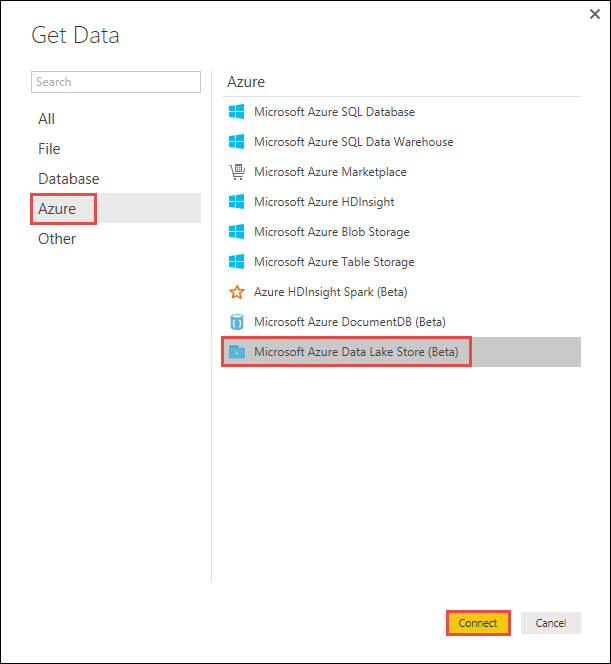

3. 如果您看到有關在開發階段連接器] 對話方塊中，選擇要繼續。

4. **Microsoft Azure 資料湖存放區**] 對話方塊中，提供您的資料湖存放帳戶的 URL，然後按一下**[確定]**。

    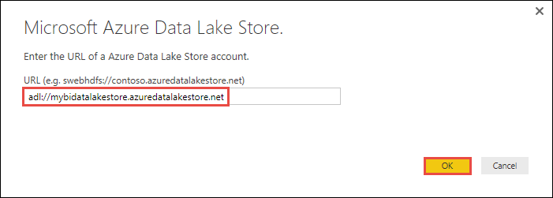

5. 在 [下一步] 對話方塊中，按一下 [**登入**登入資料湖儲存的帳戶。 您會被重新導向至您組織的登入] 頁面。 請依照提示登入帳戶。

    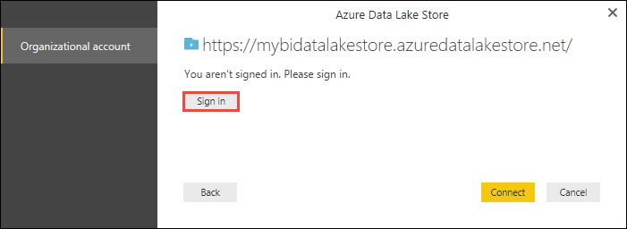

6. 順利登入之後，請按一下 [**連線**。

    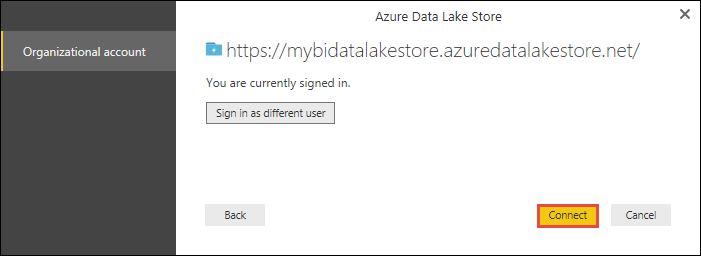

7. [下一步] 對話方塊會顯示您上傳到您的資料湖儲存帳戶檔案。 驗證資訊，然後按一下 [**載入**。

    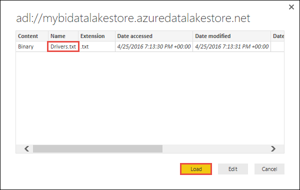

8. 資料已成功載入到 Power BI 之後，您會看到下列欄位中的**欄位**] 索引標籤。

    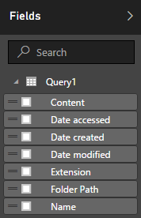

    不過，若要以視覺化方式呈現並分析資料，我們想可供每下列欄位的資料

    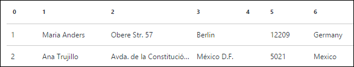

    在下一個步驟中，我們將會更新查詢轉換匯入的資料中所要的格式。

9. 從 [**常用]**功能區，按一下 [**編輯查詢**]。

    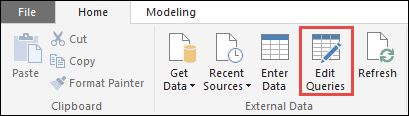

10. 在 [查詢編輯器中，[**內容**] 欄中，按一下 [**二進位**。

    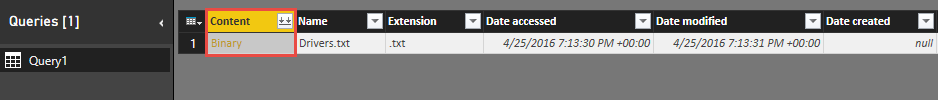

11. 您會看到檔案圖示，代表您上傳**Drivers.txt**檔案。 以滑鼠右鍵按一下檔案]，然後按一下**CSV**]。  

    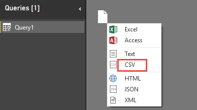

12. 您應該會看到成果，如下所示。 現在使用的格式，您可以建立視覺效果中使用您的資料。

    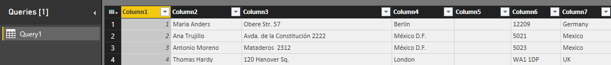

13. 從 [**常用]**功能區，按一下 [**關閉] 和 [套用**]，然後按一下**關閉並套用**。

    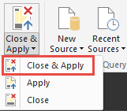

14. 一旦更新查詢時，[**欄位**] 索引標籤會顯示可用的視覺效果的新欄位。

    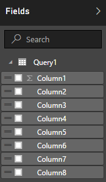

15. 讓我們建立圓形圖代表中指定的國家/地區的各城市的驅動程式。 若要這麼做，請進行下列選項。

    1. 視覺效果] 索引標籤上，按一下 [圓形圖符號]。

        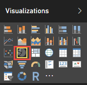

    2. 我們將使用的資料行是**欄 4** （城市名稱） 和**資料行 7** （國家/地區名稱）。 將這些資料行**欄位**] 索引標籤至**視覺效果**] 索引標籤，如下所示。

        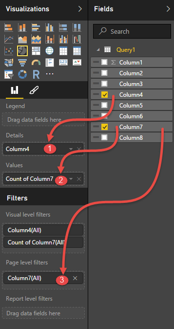

    3. 現在，圓形圖應該類似如下所示。

        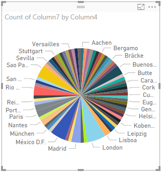

16. 從頁面層級篩選器中選取特定的國家/地區，您現在可以看到每個城市的所選國家/地區的驅動程式的數目。 例如，在**視覺效果**] 索引標籤底下**網頁層級篩選**、 選取**巴西**。

    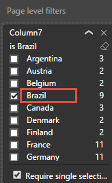

17. 圓形圖會自動更新以顯示巴西的城市驅動程式。

    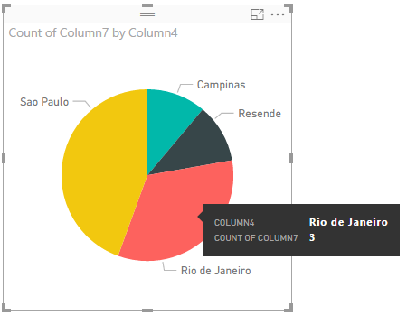

18. 從 [**檔案**] 功能表中，按一下 [**儲存**] 儲存為 Power BI Desktop 檔案的視覺效果。

## 將報表發佈至 Power BI 服務

一旦您在 Power BI Desktop 中建立視覺效果，您可以與其他人共用發佈到 Power BI 服務。 瞭解如何執行這項作業，請參閱[從 Power BI Desktop 發佈](https://powerbi.microsoft.com/documentation/powerbi-desktop-upload-desktop-files/)的相關指示。

## 另請參閱

* [分析資料湖存放區中使用資料湖分析的資料](../data-lake-analytics/data-lake-analytics-get-started-portal.md)
