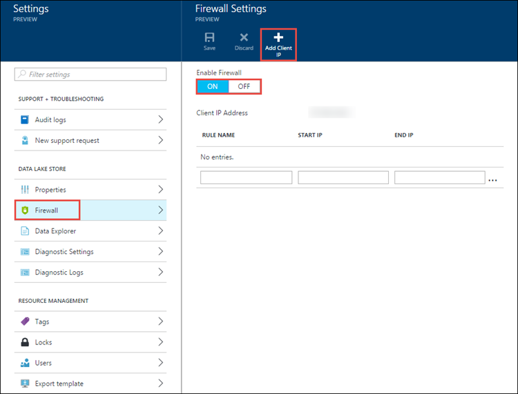

<properties 
   pageTitle="Azure 資料湖存放區中的資料 |Microsoft Azure" 
   description="瞭解如何保護 Azure 資料湖存放區中使用群組的資料，以及存取控制清單" 
   services="data-lake-store" 
   documentationCenter="" 
   authors="nitinme" 
   manager="jhubbard" 
   editor="cgronlun"/>
 
<tags
   ms.service="data-lake-store"
   ms.devlang="na"
   ms.topic="article"
   ms.tgt_pltfrm="na"
   ms.workload="big-data" 
   ms.date="09/29/2016"
   ms.author="nitinme"/>

# Azure 資料湖存放區中的資料

Azure 資料湖存放區中的資料是由三個步驟的方法。

1. 開始建立安全性群組中 Azure Active Directory (AAD)。 這些安全性群組用來實作 Azure 入口網站中的角色型存取控制 (RBAC)。 如需詳細資訊，請參閱[Microsoft Azure 中的角色型存取控制](../active-directory/role-based-access-control-configure.md)。

2. Azure 資料湖存放帳戶指派 AAD 的安全性群組。 這會控制存取入口網站及管理作業的入口網站或 Api 資料湖存放帳戶。

3. 指派 AAD 安全性群組，以存取控制清單 (Acl) 資料湖存放在檔案系統上。

4. 此外，您也可以設定 IP 位址範圍的用戶端可以存取資料湖存放區中的資料。

本文提供如何使用 Azure 入口網站執行上述工作的指示。 在您採取進階資料湖存放實作帳戶和資料層級的安全性的方式的詳細資訊，請參閱[Azure 資料湖存放區中的安全性](data-lake-store-security-overview.md)。 深度探討在實作 Acl Azure 資料湖存放區中的資訊，請參閱[存取控制的概觀資料湖存放區中](data-lake-store-access-control.md)。

## 必要條件

本教學課程之前，您必須具備下列項目︰

- **Azure 訂閱**。 請參閱[取得 Azure 免費試用版](https://azure.microsoft.com/pricing/free-trial/)。
- **Azure 資料湖存放帳戶**。 如何建立的指示，請參閱[開始使用 Azure 資料湖存放區](data-lake-store-get-started-portal.md)

## Azure Active Directory 中建立安全性群組

如需如何建立 AAD 安全性群組，以及如何將使用者新增至群組的相關指示，請參閱[Azure Active Directory 中的管理安全性群組](../active-directory/active-directory-accessmanagement-manage-groups.md)。

## 指定使用者或安全性群組 Azure 資料湖存放區帳戶

當您指派使用者或安全性群組 Azure 資料湖存放帳戶時，您可以控制存取帳戶使用 Azure 入口網站和 Azure 資源管理員 Api 管理作業。 

1. 開啟 Azure 資料湖存放帳戶。 從左側的窗格中，按一下 [**瀏覽****資料湖存放**區，然後按一下然後資料湖存放刀中，按一下您要指定使用者或安全性群組群組帳戶名稱。

2. 在您的資料湖存放帳戶刀，按一下 [**設定**]。 從**設定**刀中，按一下 [**使用者**]。

    

3. 依預設**使用者**刀列出**訂閱管理員**群組擁有者。 

    
 
    有兩種方式新增群組以及指派相關的角色。

    * 新增使用者/群組至帳戶，然後指派角色，或
    * 新增角色，然後再將指派給角色的使用者或群組]。

    在此區段中，我們在第一種方法，加入群組，然後指派角色。 您可以執行類似的步驟，以第一次選取角色，然後再將群組指派給該角色。
    
4. 在**使用者**刀中，按一下 [**新增**] 以開啟 [**新增存取**刀]。 在**新增存取**刀中，按一下 [**選擇一個角色**]，然後選取使用者/群組的角色。

     

    **擁有者**和**參與者**的角色提供資料湖帳戶存取各種管理功能。 與資料湖中的資料互動的使用者，您可以將其新增至**讀者**角色。 這些角色的範圍僅限於與 Azure 資料湖存放客戶相關的管理作業。

    資料作業個別檔案系統權限會定義使用者能做什麼。 因此，無法讀取者角色的使用者可以只能檢視 [管理帳戶相關聯的設定，但可以潛在讀取和寫入檔案系統的權限指派給他們所根據的資料。 在[指派 acl Azure 資料湖存放檔案系統的安全性群組](#filepermissions)說明資料湖存放檔案系統的權限。

5. 在**新增存取**刀中，按一下 [**新增使用者**，以開啟 [**新增使用者**刀。 在此刀，尋找您之前在 Azure Active Directory 中建立的安全性群組。 如果您有許多要搜尋的群組，請使用 [文字] 方塊頂端篩選的群組名稱。 按一下 [**選取**]。

    

    如果您想要新增群組/使用者未列出，您可以使用 [**邀請**] 圖示，指定使用者/群組的電子郵件地址邀請他們。

6. 按一下**[確定]**。 您應該會看到新增如下所示的安全性群組。

    

7. 安全性使用者/群組現在有 Azure 資料湖存放帳戶的存取權。 如果您想要提供給特定使用者的存取，您可以將其新增至 [安全性] 群組。 同樣地，如果您想要撤銷使用者的存取權，您可以從 [安全性] 群組加以移除。 您也可以指定多個安全性群組帳戶。 

## 指定使用者或安全性群組 acl Azure 資料湖存放檔案系統

藉由 Azure 資料湖檔案系統中指派使用者/安全性群組，您可以設定存取控制 Azure 資料湖存放區中的資料。

1. 在您的資料湖存放帳戶刀，按一下 [**資料檔案總管**]。

    

2. 在**資料總管**刀中，按一下 [檔案] 或 [您要設定 ACL，資料夾，然後按一下**存取**。 若要指定 ACL 檔案，您必須從**檔案預覽**刀按一下**存取**。

    

3. **Access**刀列出的標準存取和已指派給根目錄的自訂存取權。 按一下 [**新增**] 圖示，若要新增自訂層級 Acl。

    

    * **標準存取**是 [UNIX 樣式存取，您可在其中指定讀取、 撰寫執行三個不同的使用者類別 (rwx): 擁有人] 群組中，與其他人。
    * **自訂 access**會對應到 POSIX Acl 可讓您設定的特定的使用者名稱或群組]，並不只檔案的擁有者或群組權限。 
    
    如需詳細資訊，請參閱[HDFS Acl](https://hadoop.apache.org/docs/current/hadoop-project-dist/hadoop-hdfs/HdfsPermissionsGuide.html#ACLs_Access_Control_Lists)。 如需有關如何實作 Acl 資料湖存放區中的詳細資訊，請參閱[Access 資料湖存放區中的控制項](data-lake-store-access-control.md)。

4. 按一下 [**新增**] 圖示以開啟 [**新增自訂 Access**刀。 在此刀，按一下 [**選取使用者或群組**]，然後在**選取的使用者或群組**刀尋找您之前在 Azure Active Directory 中建立的安全性群組。 如果您有許多要搜尋的群組，請使用 [文字] 方塊頂端篩選的群組名稱。 按一下您想要新增，然後按一下 [**選取**的群組。

    

5. 按一下 [**選取的權限**的權限，然後選取是否要作為預設 ACL 指派權限，存取 ACL，或兩者。 按一下**[確定]**。

    

    如需有關資料湖存放區及預設/存取 Acl 中的權限的詳細資訊，請參閱[Access 資料湖存放區中的控制項](data-lake-store-access-control.md)。

6. 在 [**新增自訂 Access**刀中，按一下**[確定]**。 新增的群組中，具有相關聯的權限，現在會列在 [**存取**刀。

    

    > [AZURE.IMPORTANT] 在目前的版本，您只能有 9 項目，在 [**自訂存取**。 如果您想要新增 9 個以上的使用者，您應該建立安全性群組，將使用者新增至安全性群組、 新增資料湖存放帳戶提供的存取權的安全性群組。

7. 如有需要，您也可以在您加入群組後修改的存取權限。 清除或選取每個權限類型 （讀取、 寫入、 執行） 根據您是否想要移除，或將該權限指派給安全性群組的核取方塊。 按一下 [**儲存**] 儲存變更，或 [**捨棄**] 予以復原變更]。

## 設定資料存取的 IP 位址範圍

Azure 資料湖存放區可讓您進一步鎖定存取您的網路層級的資料存放區。 您可以啟用防火牆、 指定的 IP 位址或定義您受信任的用戶端 IP 位址範圍。 一旦啟用，具有已定義之範圍內的 IP 位址的用戶端可以連線至市集]。

## 移除 Azure 資料湖存放帳戶的安全性群組

當您從 Azure 資料湖存放帳戶移除安全性群組時，只會變更存取帳戶使用 Azure 入口網站和 Azure 資源管理員 Api 管理作業。

1. 在您的資料湖存放帳戶刀，按一下 [**設定**]。 從**設定**刀中，按一下 [**使用者**]。

    

2. 在**使用者**刀，請按一下您想要移除的安全性群組。

    

3. 在 [刀的 [安全性] 群組中，按一下 [**移除**]。

    

## 從 Azure 資料湖存放檔案系統中移除安全性群組 Acl

當您從 Azure 資料湖存放檔案系統移除安全性群組 Acl 時，您可以變更 access 資料湖存放區中的資料。

1. 在您的資料湖存放帳戶刀，按一下 [**資料檔案總管**]。

    

2. 在**資料總管**刀中，按一下檔案或資料夾，您想要移除 ACL，，然後在您的帳戶刀，按一下 [ **Access**圖示。 若要移除 ACL 檔案，您必須從**檔案預覽**刀按一下**存取**。

    

3. 在**Access**刀，從 [**自訂存取**] 區段中，按一下您想要移除的安全性群組。 在**自訂 Access**刀中，按一下 [**移除**]，然後按一下**[確定]**。

    

## 另請參閱

- [Azure 資料湖存放區的概觀](data-lake-store-overview.md)
- [Azure 儲存體 Blob 將資料複製到資料湖存放區](data-lake-store-copy-data-azure-storage-blob.md)
- [使用資料湖存放 Azure 資料湖狀況分析](../data-lake-analytics/data-lake-analytics-get-started-portal.md)
- [使用資料湖存放 Azure HDInsight](data-lake-store-hdinsight-hadoop-use-portal.md)
- [使用 PowerShell 資料湖存放快速入門](data-lake-store-get-started-powershell.md)
- [使用.NET SDK 資料湖存放快速入門](data-lake-store-get-started-net-sdk.md)
- [Access 資料湖市集的診斷記錄](data-lake-store-diagnostic-logs.md)
