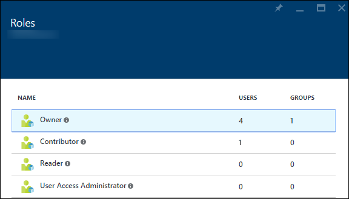
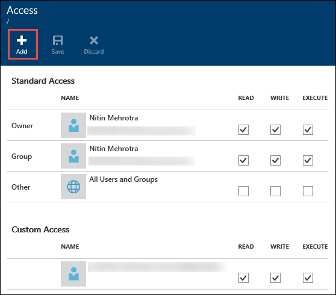
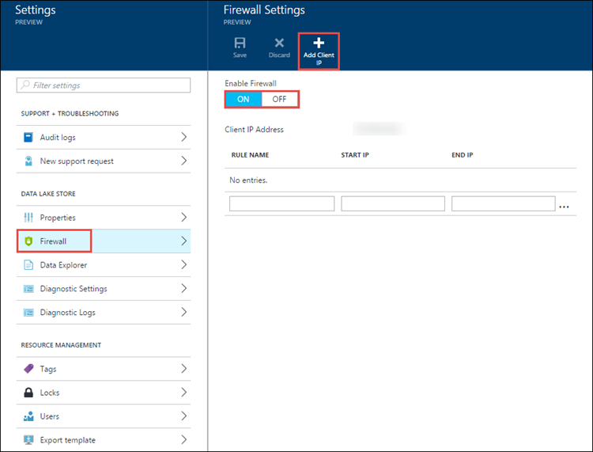
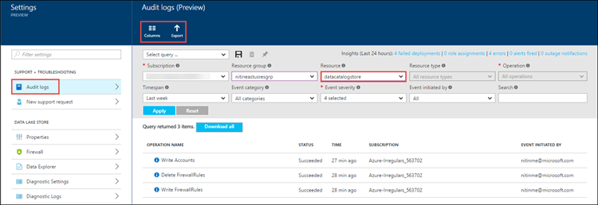
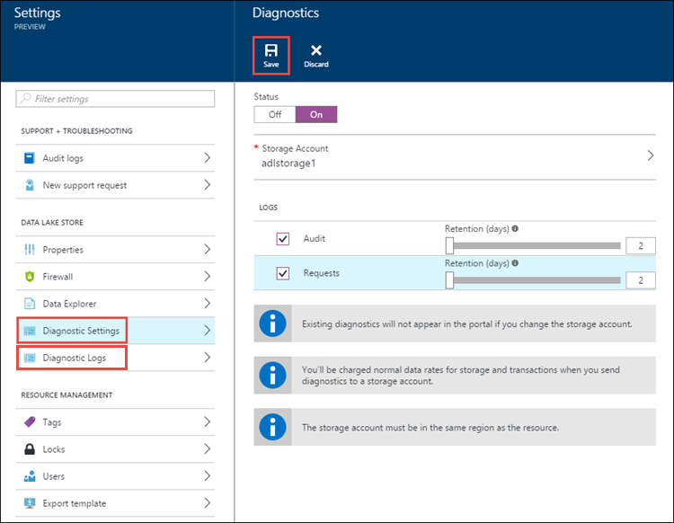

<properties
   pageTitle="資料湖存放區中的安全性概觀 |Microsoft Azure"
   description="了解如何 Azure 資料湖存放更安全的大型資料存放區"
   services="data-lake-store"
   documentationCenter=""
   authors="nitinme"
   manager="jhubbard"
   editor="cgronlun"/>

<tags
   ms.service="data-lake-store"
   ms.devlang="na"
   ms.topic="article"
   ms.tgt_pltfrm="na"
   ms.workload="big-data"
   ms.date="08/02/2016"
   ms.author="nitinme"/>

# Azure 資料湖存放區中的安全性

許多企業利用商務深入資訊，以協助他們智慧決策大型資料分析。 組織可能複雜且規定環境中，以增加各種不同的使用者數目。 很重要，請確定重要的商務資料更安全地儲存以正確的層級的存取權授與個別使用者企業版。 Azure 資料湖存放被為了協助符合安全性需求。 本文中，深入了解資料湖儲存、 安全性功能包括︰

* 驗證
* 授權
* 網路隔離
* 資料保護
* 稽核

## 驗證與身分識別管理

驗證是在使用者互動資料湖存放或連線到資料湖存放任何服務時，使用者的身分識別驗證所用的程序。 身分識別管理和驗證，資料湖存放區，請使用[Azure Active Directory](../active-directory/active-directory-whatis.md)、 全面涵蓋所有內容的身分識別和可簡化管理使用者和群組的存取管理雲端解決方案。

每個 Azure 訂閱可與執行個體的 Azure Active Directory 相關聯。 只有使用者和 Azure Active Directory 服務中定義的服務身分識別可以使用 Azure 入口網站中，命令列工具，來存取您的資料湖存放帳戶，或用戶端應用程式到您的組織使用建立 Azure 資料湖市集 SDK。 使用做為集中的存取控制機制的 Azure Active Directory 的主要優點是︰

* 簡化的身分識別生命週期管理。 您可以快速建立及快速撤銷只刪除，或停用在目錄中的帳戶的使用者或服務 （服務本金身分識別） 的身分識別。

* 多重因素驗證。 [多重因素驗證](../multi-factor-authentication/multi-factor-authentication.md)提供額外的使用者登增益集和交易的安全性層級。

* 從任何用戶端透過標準開啟通訊協定，例如 OAuth 或 OpenID 驗證。

* 企業版的目錄服務與雲端身分識別提供者的同盟。

## 授權及存取控制

Azure Active Directory 驗證的使用者，讓使用者可以存取 Azure 資料湖存放區之後，授權控制項存取資料湖儲存區權限。 資料湖存放區隔帳戶以及資料相關活動的授權，以下列方式︰

* [角色型存取控制](../active-directory/role-based-access-control-what-is.md)(RBAC) 所提供 Azure 帳戶管理
* POSIX ACL 存取存放區中的資料

### RBAC 帳戶管理

預設資料湖市集定義四個基本的角色。 角色允許透過 Azure 入口網站、 PowerShell cmdlet 和 REST Api 資料湖存放帳戶不同的作業。 擁有者及參與者的角色可以執行各種管理功能帳戶。 您可以閱讀程式角色指派給使用者僅能與資料互動。

請注意，雖然帳戶管理指派角色某些角色會影響資料的存取權。 您需要使用 Acl 來控制存取權的使用者能在檔案系統執行的作業。 下表摘要管理權限 」 和 「 資料的預設角色的存取權限。

| 角色                    | 管理權限               | 資料的存取權限 | 說明 |
| ------------------------ | ------------------------------- | ------------------ | ----------- |
| 沒有指派角色         | 無                            | 由 ACL    | 使用者無法使用 Azure 入口網站或 Azure PowerShell cmdlet 來瀏覽資料湖存放區。 使用者可以使用僅命令列工具。
| 擁有者  | 所有  | 所有  | 擁有者角色是 superuser。 此角色擁有完整的存取權的資料，並可以管理所有項目。
| 閱讀程式   | 唯讀狀態  | 由 ACL    | 讀取者角色可以檢視所有項目相關帳戶管理，例如這指派給使用者的角色。 讀取者角色無法進行任何變更。   |
| 參與者              | 除了新增和移除的角色 | 由 ACL    | 參與者角色可以管理帳戶，例如部署建立及管理通知的某些部分。 參與者的角色無法新增或移除角色。
| 使用者存取系統管理員 | 新增和移除的角色            | 由 ACL    | 使用者存取系統管理員角色可以管理帳戶的使用者存取權。 |

如需相關指示，請參閱[指派使用者或安全性群組帳戶資料湖存放區](data-lake-store-secure-data.md#assign-users-or-security-groups-to-azure-data-lake-store-accounts)。

### 使用 Acl 檔案系統上進行的作業

資料湖存放是階層式檔案系統等 Hadoop 分散式檔案系統 (HDFS)，以及支援[POSIX Acl](https://hadoop.apache.org/docs/current/hadoop-project-dist/hadoop-hdfs/HdfsPermissionsGuide.html#ACLs_Access_Control_Lists)。 控制讀取 (r)、 撰寫 (w)，然後執行 (x) 資源的擁有者角色的擁有人] 群組中，與其他使用者和群組的權限。 在資料湖市集公用預覽 （目前的發行版本），根資料夾、 子資料夾，及個別檔案，會啟用 Acl。 Acl 套用至根資料夾也會套用到所有的子資料夾及檔案。

我們建議您為多個使用者定義的 Acl，使用[安全性群組](../active-directory/active-directory-accessmanagement-manage-groups.md)。 將使用者新增至 [安全性] 群組中，然後再將檔案或資料夾的 Acl 指派給該安全性群組。 當您想要提供自訂的存取權，因為您受限於新增自訂的存取九個項目的最大值時，這是很有用。 如需有關如何使用 Azure Active Directory 安全性群組儲存資料湖存放區中的資料更安全的詳細資訊，請參閱[指派使用者或安全性群組 acl Azure 資料湖存放檔案系統](data-lake-store-secure-data.md#filepermissions)。

## 網路隔離

使用您的網路層級的資料存放區協助控制存取權限的資料湖存放區。 您可以建立的防火牆，並定義您受信任的用戶端 IP 位址範圍。 使用 IP 位址範圍，僅有 IP 位址已定義之範圍內的用戶端可以連線至資料湖存放區。

## 資料保護

組織想要確保其重要資料安全生命週期。 中的資料傳輸，資料湖存放使用業界標準傳輸層安全性 (TLS) 通訊協定安全的用戶端與資料湖存放區之間移動資料。

資料保護的其餘部分資料將可未來的版本。

## 稽核與診斷記錄

您可以使用稽核或診斷記錄]，取決於您要尋找管理相關的活動或資料相關活動的記錄。

*  管理相關活動使用 Azure 資源管理員 Api，並透過稽核記錄呈現 Azure 入口網站中。
*  資料相關活動使用 WebHDFS REST Api，並透過 [診斷記錄呈現 Azure 入口網站中。

### 稽核記錄

若要符合法規，深入特定的事件，需要組織時，可能需要有足夠的稽核線索。 資料湖存放有內建監視與稽核，而且就會記錄所有帳戶管理活動。

為帳戶管理稽核追蹤，檢視，並選擇您想要記錄的資料行。 您也可以匯出至 Azure 儲存體稽核記錄。

### 診斷記錄

您可以在 Azure 入口網站 （在 [診斷設定） 中設定資料存取稽核追蹤，並建立 Azure Blob 儲存體帳戶記錄的儲存位置。

設定診斷設定之後，您可以檢視 [**診斷記錄**] 索引標籤上的記錄。

如需有關如何使用 Azure 資料湖存放區診斷記錄的詳細資訊，請參閱[Access 資料湖市集的診斷記錄](data-lake-store-diagnostic-logs.md)。

## 摘要

企業客戶要求資料分析雲端平台的安全性和容易使用。 Azure 資料湖存放是設計用來說明這些需求，透過身分識別管理和驗證透過 Azure Active Directory 整合、 ACL 為基礎的授權、 網路隔離資料加密和在傳輸時會將 （在未來有即將） 的地址及稽核。

如果您想要請參閱資料湖存放區中的新功能，傳送給我們您的意見反應中的[資料湖市集 UserVoice 論壇](https://feedback.azure.com/forums/327234-data-lake)。

## 另請參閱

- [Azure 資料湖存放區的概觀](data-lake-store-overview.md)
- [開始使用資料湖存放區](data-lake-store-get-started-portal.md)
- [保護資料湖存放區中的資料](data-lake-store-secure-data.md)
