<properties
   pageTitle="將資料流分析的資料串流到資料湖存放 |Azure"
   description="使用資料流資料至 Azure 資料湖存放 Azure 資料流狀況分析"
   services="data-lake-store,stream-analytics" 
   documentationCenter=""
   authors="nitinme"
   manager="jhubbard"
   editor="cgronlun"/>

<tags
   ms.service="data-lake-store"
   ms.devlang="na"
   ms.topic="article"
   ms.tgt_pltfrm="na"
   ms.workload="big-data"
   ms.date="07/07/2016"
   ms.author="nitinme"/>

# 從 Azure 儲存體 Blob 資料湖存放區使用 Azure 資料流分析的資料流資料

本文中，您將學習如何 Azure 資料湖存放作為 Azure 資料流分析工作成果。 本文將示範簡單的案例的從 Azure 儲存體 blob （輸入） 讀取資料，並將資料至資料湖存放區 （輸出）。

>[AZURE.NOTE] 此時，建立及設定資料湖存放輸出資料流分析只支援[Azure 傳統入口網站](https://manage.windowsazure.com)。 因此，此教學課程中的某些部分會使用 Azure 傳統入口網站。

## 必要條件

本教學課程之前，您必須具備下列項目︰

- **Azure 訂閱**。 請參閱[取得 Azure 免費試用版](https://azure.microsoft.com/pricing/free-trial/)。

- **啟用 Azure 訂閱**資料湖市集公用預覽。 請參閱[相關指示](data-lake-store-get-started-portal.md#signup)。

- **Azure 儲存體帳戶**。 您會使用從這個帳戶 blob 容器來輸入資料流分析工作的資料。 在此教學課程，假設您建立**datalakestoreasa** ] 和 [容器稱為**datalakestoreasacontainer**帳戶內的儲存空間帳戶。 一旦您建立容器上, 傳的範例資料檔案，以便。 您可以從[Azure 資料湖給存放庫](https://github.com/Azure/usql/tree/master/Examples/Samples/Data/AmbulanceData/Drivers.txt)取得的範例資料檔案。 您可以使用各種不同的用戶端，例如[Azure 儲存檔案總管](http://storageexplorer.com/)] 中，若要上傳至 blob 容器的資料。

    >[AZURE.NOTE] 如果您是從 Azure 入口網站建立帳戶，請確定您建立**傳統**的部署模型。 這樣儲存帳戶，可以存取從 Azure 傳統入口網站，因為我們使用建立串流分析作業。 如需如何建立使用傳統部署 Azure 入口網站儲存帳戶的相關指示，請參閱[建立 Azure 儲存體帳戶](../storage/storage-create-storage-account/#create-a-storage-account)。
    >
    > 或者，您可以從 Azure 傳統入口網站中建立的儲存空間的帳戶。

- **Azure 資料湖存放帳戶**。 請遵循在[開始使用 Azure 資料湖存放區使用 Azure 入口網站](data-lake-store-get-started-portal.md)的指示進行。  

## 建立資料流分析工作

您開始建立包含輸入的來源輸出目的地串流分析工作。 在此教學課程，來源 Azure blob 容器，而目的地是資料湖存放區。

1. [Azure 傳統入口網站](https://manage.windowsazure.com)登入。

2. 從畫面底部的左側，按一下 [**新增]**，**資料服務**、**串流分析**，**快速建立**。 提供如下所示的值，然後按一下 [**建立資料流分析工作**。

    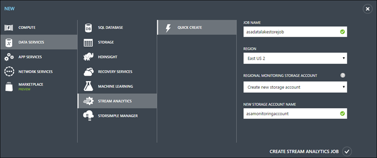

## 建立工作 Blob 輸入

1. 開啟 [串流分析工作] 頁面按一下 [**輸入**] 索引標籤，再按一下 [**新增輸入**啟動精靈。

2. 在 [**新增輸入您的工作**] 頁面上選取**資料流**]，然後按一下轉寄的箭號。

    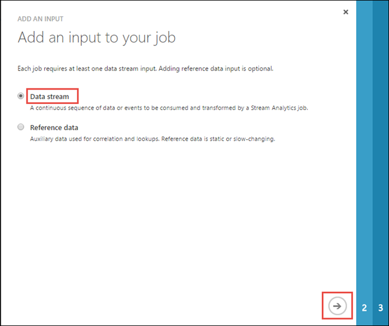

3. 在 [**新增資料流您的工作**] 頁面上選取**Blob 儲存體**]，然後按一下轉寄的箭號。

    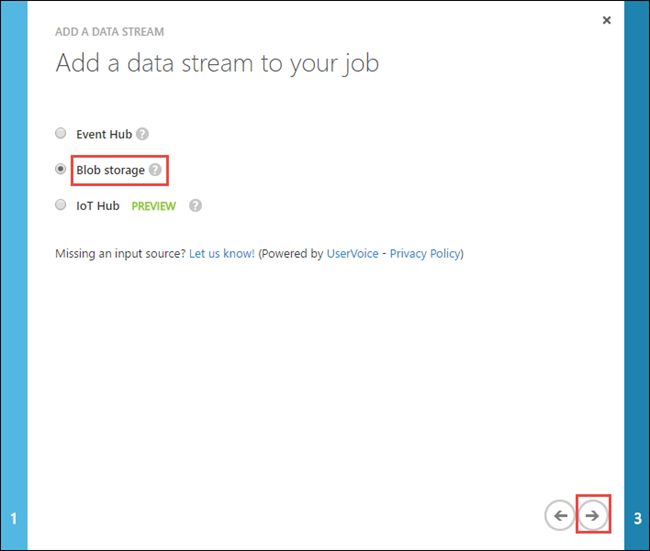

4. 在 [ **Blob 儲存體設定**] 頁面上提供您使用便會輸入的資料來源 blob 儲存體詳細資料。

    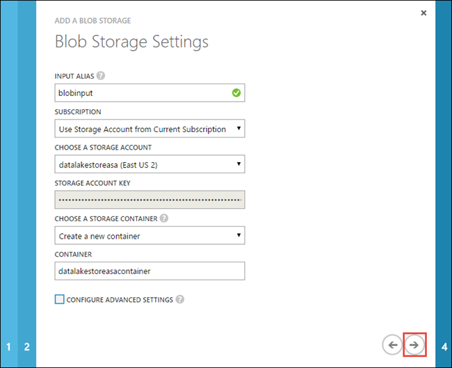

    * **輸入輸入別名**。 這是您提供工作輸入唯一的名稱。
    * **選取儲存的帳戶**。 確認儲存的帳戶有相同的區域，以資料流分析工作，或您會造成其他成本區域之間移動資料。
    * **提供存放容器**。 您可以選擇建立新的容器或選取現有的容器。

    按一下轉寄的箭號。

5. 在 [**序列化設定**] 頁面中，將序列化格式設定為**CSV** **] 索引標籤**，為分隔符號編碼為**UTF8**，然後再按一下核取記號。

    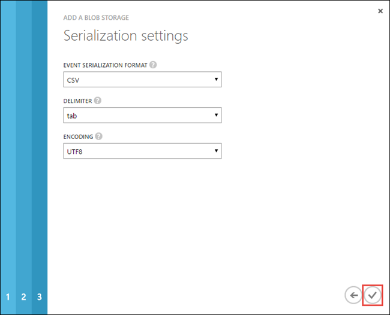

6. 在您完成精靈，blob 輸入將會新增 [**輸入**] 索引標籤和 [**診斷**] 欄會顯示**[確定]**。 您也明確可以測試連線]，輸入使用底部的 [**測試連接**] 按鈕。

## 建立工作的資料湖存放輸出

1. 開啟串流分析作業的頁面按一下 [**輸出**] 索引標籤，再按一下 [**新增輸出**至啟動精靈。

2. 在 [**新增至您的工作成果**] 頁面上選取**資料湖存放區**，，然後按一下轉寄的箭號。

    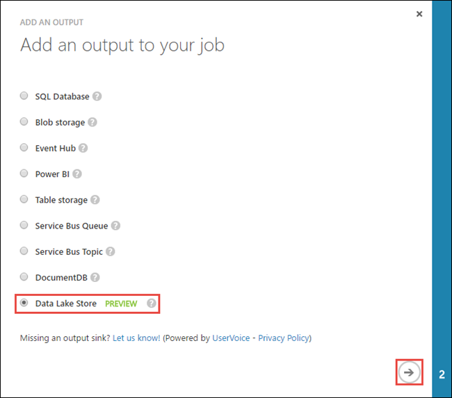

3. **授權連線**] 頁面中，如果您已經建立資料湖存放帳戶，按一下 [**立即授權**。 否則，請按一下 [建立新的帳戶的 [**立即註冊**]。 在此教學課程中，讓我們假設您已經建立 （如下所述的必要條件） 的資料湖存放帳戶。 您將會自動獲授權使用您登入 Azure 傳統入口網站的認證。

    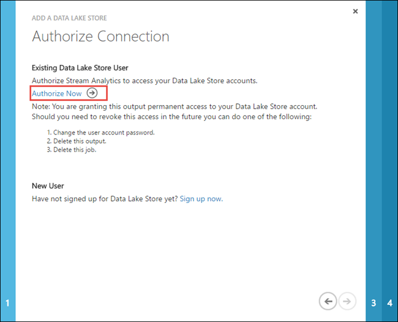

4. 螢幕擷取畫面下方所示，在**資料湖存放區 」 設定**頁面上，輸入的資訊。

    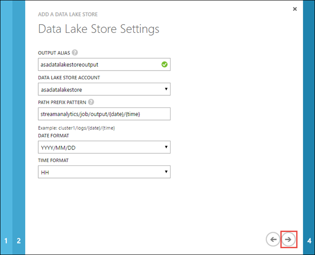

    * **輸入輸出別名**。 這是您為工作輸出提供的唯一名稱。
    * **指定資料湖存放帳戶**。 您應該已經建立，如同必要條件中所述。
    * **指定前置詞圖樣的線條路徑**。 這被需要找出輸出檔案資料流分析工作所撰寫資料湖存放區。 因為輸出工作所撰寫的標題是 GUID 格式，包括首碼會協助您識別撰寫的輸出。 如果您想要包含的前置詞一部分的日期和時間戳記請確定您將包含`{date}/{time}`前置詞模式中。 如果包含此，已啟用的**日期**和**時間格式**的欄位，您可以選取選項的格式。

    按一下轉寄的箭號。

5. 在 [**序列化設定**] 頁面中，將序列化格式設定為**CSV** **] 索引標籤**，為分隔符號編碼為**UTF8**，然後再按一下核取記號。

    

6. 在您完成精靈，資料湖存放輸出便會新增**輸出**] 索引標籤下，[**診斷**] 欄會顯示**[確定]**。 您也明確可以使用下方的 [**測試連接**] 按鈕，以測試輸出連線。

## 執行資料流分析工作

若要執行的資料流分析作業，您必須執行查詢，從 [查詢] 索引標籤。 在此教學課程中，您可以執行查詢範例取代預留位置與工作輸入與輸出別名，如下圖所示的螢幕擷取畫面下方。

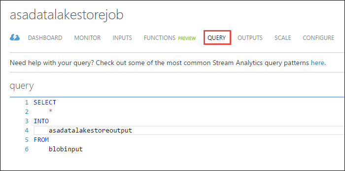

按一下 [從螢幕底部的 [**儲存**]，然後按一下 [**開始**。 從對話方塊中，選取**自訂時間**]，然後選取日期從過去的經驗，例如**1/1/2016年**。 按一下 [核取記號，以開始工作。 就可以在幾分鐘即可開始工作。

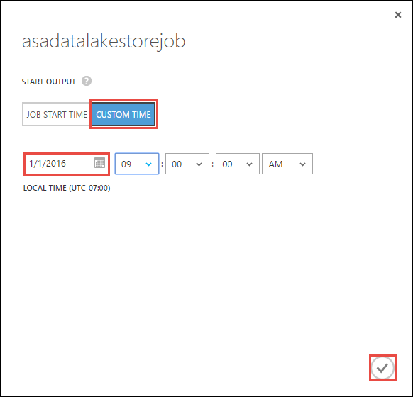

工作開始之後，按一下 [**監視器**] 索引標籤以查看如何處理資料。

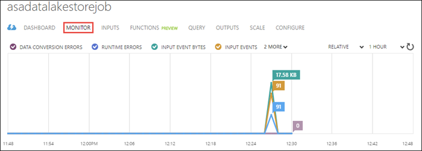

最後，您可以使用[Azure 入口網站](https://portal.azure.com)，以開啟您的資料湖存放帳戶，並確認資料已成功寫入到您的帳戶。

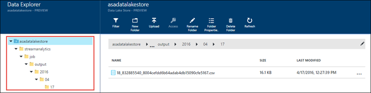

在 [資料檔案總管] 窗格中，請注意，輸出會寫入到資料湖存放區中指定資料夾輸出設定 (`streamanalytics/job/output/{date}/{time}`)。  

## 另請參閱

* [建立使用資料湖存放區 HDInsight 叢集](data-lake-store-hdinsight-hadoop-use-portal.md)
