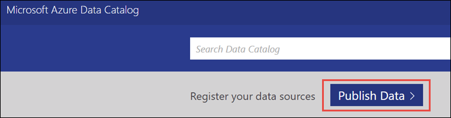
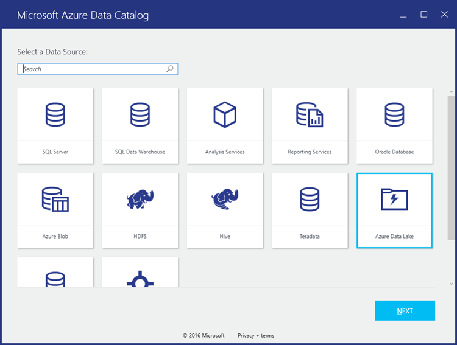
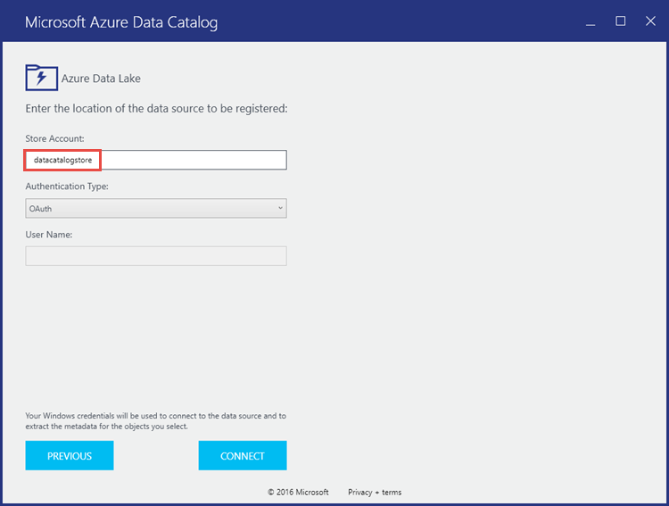
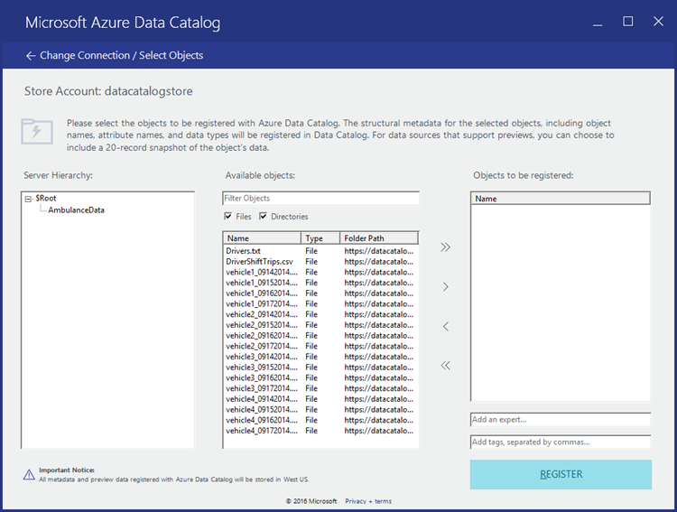
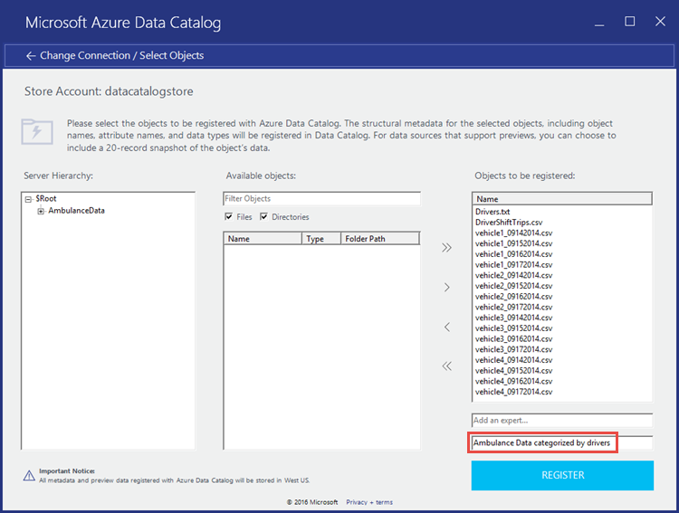
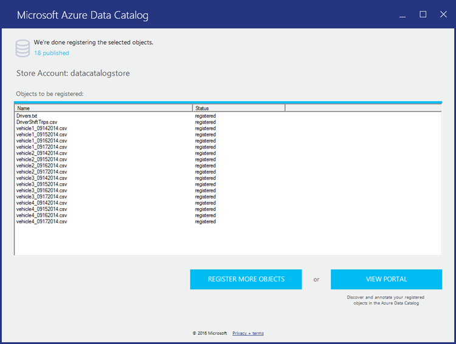

<properties
   pageTitle="註冊 Azure 資料目錄] 中的資料湖存放區 |Microsoft Azure"
   description="註冊 Azure 資料目錄] 中的資料湖存放區"
   services="data-lake-store,data-catalog" 
   documentationCenter=""
   authors="nitinme"
   manager="jhubbard"
   editor="cgronlun"/>

<tags
   ms.service="data-lake-store"
   ms.devlang="na"
   ms.topic="article"
   ms.tgt_pltfrm="na"
   ms.workload="big-data"
   ms.date="10/28/2016"
   ms.author="nitinme"/>

# 註冊 Azure 資料目錄] 中的資料湖存放區

本文中，您將學習如何使用 Azure 資料目錄，讓您的資料搜尋組織內使用資料目錄整合 Azure 資料湖存放區。 如需有關分類資料的詳細資訊，請參閱[Azure 資料目錄](../data-catalog/data-catalog-what-is-data-catalog.md)。 若要瞭解您可以在其中使用資料目錄的情況，請參閱[Azure 資料目錄常見的案例](../data-catalog/data-catalog-common-scenarios.md)。

## 必要條件

本教學課程之前，您必須具備下列項目︰

- **Azure 訂閱**。 請參閱[取得 Azure 免費試用版](https://azure.microsoft.com/pricing/free-trial/)。

- **啟用 Azure 訂閱**資料湖市集公用預覽。 請參閱[相關指示](data-lake-store-get-started-portal.md#signup)。

- **Azure 資料湖存放帳戶**。 請遵循在[開始使用 Azure 資料湖存放區使用 Azure 入口網站](data-lake-store-get-started-portal.md)的指示進行。 在此教學課程中，讓我們建立稱為**datacatalogstore**資料湖存放帳戶。 

    您一次建立帳戶上, 傳加以範例資料集。 在此教學課程中，讓我們上傳資料夾底下的 [ **AmbulanceData** [Azure 資料湖給存放庫](https://github.com/Azure/usql/tree/master/Examples/Samples/Data/AmbulanceData/)中的所有.csv 檔案。 您可以使用各種不同的用戶端，例如[Azure 儲存檔案總管](http://storageexplorer.com/)] 中，若要上傳至 blob 容器的資料。

- **Azure 資料目錄**。 您的組織必須已為您的組織建立 Azure 資料目錄。 只有一個目錄的每一個組織允許。

## Register 作為資料目錄的來源資料湖存放區

>[AZURE.VIDEO adcwithadl] 

1. 移至 [ `https://azure.microsoft.com/services/data-catalog`，然後按一下 [**開始使用**。

2. 登入 Azure 資料目錄入口網站，並按一下 [**發佈資料**。

    

3. 在下一個頁面上，按一下 [**啟動應用程式**。 這會下載您的電腦上的應用程式資訊清單檔案。 按兩下資訊清單的檔案，以啟動應用程式。

4. 在 [歡迎] 頁面上，按一下 [**登入**，然後輸入您的認證。

    ![歡迎使用] 畫面](./media/data-lake-store-with-data-catalog/welcome.screen.png "歡迎使用] 畫面")

5. 在 [選取資料來源] 頁面上，選取**Azure 資料湖**，然後按 [**下一步**。

    

6. 在下一個頁面上，提供您要註冊資料目錄] 中的資料湖存放帳戶名稱。 離開設為預設的其他選項，然後按一下 [**連線**。

    

7. 下一個頁面可分為以下區段。

    。 [**伺服器階層**] 方塊代表資料湖存放帳戶資料夾結構。 **$Root**代表資料湖存放帳戶根目錄，而**AmbulanceData**代表根目錄中的資料湖存放區帳戶建立的資料夾。

    b。 **可用的物件**] 方塊中列出的檔案與資料夾底下的 [ **AmbulanceData**的資料夾。

    c。 **物件已註冊] 方塊中**列出的檔案與您想要註冊 Azure 資料目錄] 中的資料夾。

    

8. 在此教學課程中，您應該在目錄中註冊的所有檔案。 然後，按一下 （） 按鈕，將所有檔案都移至**要註冊的物件**] 方塊。 

    會在整個組織資料目錄] 中登錄的資料，因為它是 recommened 新增您稍後可以用來快速找出資料的部分中繼資料。 例如，您可以新增電子郵件地址 （例如，一個上傳的資料） 資料擁有者，或新增標籤以識別的資料。 螢幕擷取畫面下方會顯示我們新增資料標籤。

    

    按一下 [**註冊**]。

8. 下列畫面擷取代表資料已成功註冊資料目錄] 中。

    

9. 按一下 [若要返回 [資料目錄] 入口網站，並確認您現在可以存取註冊的資料從入口網站**檢視入口網站**]。 若要搜尋資料，您可以使用您註冊資料時所使用的標籤。

    ![搜尋目錄] 中的資料](./media/data-lake-store-with-data-catalog/search-data-in-catalog.png "搜尋目錄] 中的資料")

10. 您現在可以執行作業，例如新增註釋與文件的資料。 如需詳細資訊，請參閱下列連結。
    * [加上註釋資料目錄] 中的資料來源](../data-catalog/data-catalog-how-to-annotate.md)
    * [資料目錄] 中的文件資料來源](../data-catalog/data-catalog-how-to-documentation.md)

## 另請參閱

* [加上註釋資料目錄] 中的資料來源](../data-catalog/data-catalog-how-to-annotate.md)
* [資料目錄] 中的文件資料來源](../data-catalog/data-catalog-how-to-documentation.md)
* [與其他 Azure 服務整合資料湖存放區](data-lake-store-integrate-with-other-services.md)
