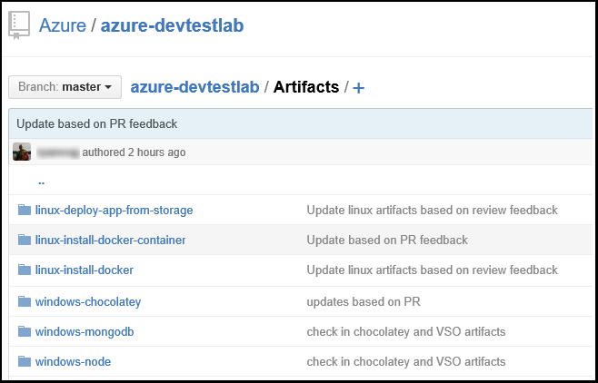

<properties
    pageTitle="將給成品存放庫新增至在 Azure DevTest 實驗室實驗室 |Microsoft Azure"
    description="Azure DevTest 實驗室中新增自訂的成品來源 GitHub 或 Visual Studio 小組服務給存放庫"
    services="devtest-lab,virtual-machines,visual-studio-online"
    documentationCenter="na"
    authors="tomarcher"
    manager="douge"
    editor=""/>

<tags
    ms.service="devtest-lab"
    ms.workload="na"
    ms.tgt_pltfrm="na"
    ms.devlang="na"
    ms.topic="article"
    ms.date="09/06/2016"
    ms.author="tarcher"/>

# 若要在 Azure DevTest 實驗室實驗室新增給成品存放庫

> [AZURE.VIDEO how-to-add-your-private-artifacts-repository-in-a-devtest-lab]

在 Azure DevTest 實驗室成品的*動作*-例如安裝軟體或執行指令碼和指令-建立 VM 時。 根據預設，實驗室會包含從正式 Azure DevTest 實驗室成品存放庫的成品。 您可以新增您要包含您的小組所建立的成品實驗室給成品存放庫。 存放庫可以裝載於[GitHub](https://github.com)或[Visual Studio 小組服務 (VSTS)](https://visualstudio.com)。

- 若要瞭解如何建立 GitHub 存放庫，請參閱[GitHub Bootcamp](https://help.github.com/categories/bootcamp/)。
- 若要瞭解如何使用給存放庫中建立專案小組服務，請參閱[連線至 Visual Studio 小組服務](https://www.visualstudio.com/get-started/setup/connect-to-visual-studio-online)。

以下螢幕擷取畫面顯示存放庫包含成品可能看 GitHub 的範例︰  

## 取得存放庫資訊及認證

若要測試環境中加入成品存放庫，您必須先從您存放庫取得特定資訊。 下列各節會引導您完成成品存放庫裝載於 GitHub 和 Visual Studio 小組服務的資訊。

### 取得的 GitHub 存放庫複製 URL 和個人的存取權的權杖

若要取得 GitHub 存放庫複製，URL] 與 [個人存取權杖，請遵循下列步驟︰

1. 瀏覽至包含成品定義 GitHub 存放庫的 [首頁] 頁面。

1. 選取 [**複製或下載**。

1. 選取 [複製到剪貼簿中的 [ **HTTPS 複製 url** ] 按鈕，然後儲存以供日後使用的 URL。

1. 選取的設定檔圖像右上角的 GitHub，並選取 [**設定**]。

1. 在左側的 [**個人設定**] 功能表中選取 [**個人存取權杖**]。

1. 選取**新產生的權杖**。

1. 在**新的個人存取權杖**頁面上，輸入**權杖描述**、 接受預設項目，在 [**選取範圍**]，然後選擇**產生的權杖**。

1. 視需要更新版本，請儲存產生的權杖。

1. 您可以立即關閉 GitHub。   

1. 繼續[連線至成品存放庫實驗室](#connect-your-lab-to-the-artifact-repository)節。

### 取得的 Visual Studio 小組服務存放庫複製 URL 和個人的存取權的權杖

若要取得 Visual Studio 小組服務存放庫複製 URL 和個人存取權杖，請遵循下列步驟︰

1. 開啟您的小組集合的首頁 (例如， `https://contoso-web-team.visualstudio.com`)，然後選取 [成品專案。

1. 在 [專案首頁] 頁面中，選取 [**程式碼**]。

1. 若要檢視複製 URL，在專案的 [**程式碼**] 頁面上，選取 [**複製**]。

1. 視需要更新版本在本教學課程，請儲存 URL。

1. 若要建立個人存取權杖，**我的設定檔**從功能表選取 [使用者帳戶下拉式清單。

1. 在 [設定檔資訊] 頁面中，選取 [**安全性**]。

1. 在 [**安全性**] 索引標籤中，選取 [**新增**]。

1. 在 [**建立個人存取權杖**頁面︰

    - 權杖輸入**描述**。
    - **180 天**從清單中選取**[到期日**。
    - 從 [**帳戶**] 清單中選擇**可存取的所有帳戶**。
    - 選擇 [**所有範圍**] 選項。
    - 選擇 [**建立權杖**]。

1. 完成之後，新的權杖會出現在 [**個人存取權杖**清單中。 選取 [**複製權杖**，，然後再儲存以供日後使用的 token 值。

1. 繼續[連線至成品存放庫實驗室](#connect-your-lab-to-the-artifact-repository)節。

##實驗室連線至成品存放庫

1. [Azure 入口網站](http://go.microsoft.com/fwlink/p/?LinkID=525040)登入。

1. 選取**更多服務**]，然後從清單中選取 [ **DevTest 實驗室**。

1. 從實驗室清單中，選取所要的實驗]。   

1. 在實驗室刀，選取 [**設定**]。

1. 在實驗室**設定**刀，選取 [**成品存放庫**]。

1. 在**成品存放庫**刀中，選取 [ **+ 新增]**。

    ![新增成品存放庫] 按鈕](./media/devtest-lab-add-artifact-repo/add-artifact-repo.png)
 
1. 在第二個的**成品存放庫**刀，指定下列設定︰

    - **名稱**-輸入存放庫的名稱。
    - **給複製 Url** -輸入您先前複製 GitHub 或 Visual Studio 小組服務給 HTTPS 複製 URL。 
    - **資料夾路徑**-輸入資料夾路徑相對於包含您的成品定義複製 URL。
    - **分支**-輸入以取得您的成品定義分支。
    - **個人存取權杖**-輸入較早取得 GitHub 或 Visual Studio 小組服務的個人存取權杖。 
     
    

1. 選取 [**儲存**]。

[AZURE.INCLUDE [devtest-lab-try-it-out](../../includes/devtest-lab-try-it-out.md)]

## 相關的部落格文章
- [如何疑難排解失敗 AzureDevTestLabs 的成品](http://www.visualstudiogeeks.com/blog/DevOps/How-to-troubleshoot-failing-artifacts-in-AzureDevTestLabs)
- [加入 VM 至現有的 AD 網域 Azure 開發測試實驗中使用手錶範本](http://www.visualstudiogeeks.com/blog/DevOps/Join-a-VM-to-existing-AD-domain-using-ARM-template-AzureDevTestLabs)