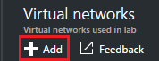

<properties
    pageTitle="設定虛擬網路中 Azure DevTest 實驗室 |Microsoft Azure"
    description="瞭解如何設定現有的虛擬網路和子網路，並在與 Azure DevTest 實驗室 VM 中使用它們"
    services="devtest-lab,virtual-machines"
    documentationCenter="na"
    authors="tomarcher"
    manager="douge"
    editor=""/>

<tags
    ms.service="devtest-lab"
    ms.workload="na"
    ms.tgt_pltfrm="na"
    ms.devlang="na"
    ms.topic="article"
    ms.date="09/06/2016"
    ms.author="tarcher"/>

# 在 Azure DevTest 實驗室設定虛擬網路

所述的文章，[新增要實驗室成品與 VM](devtest-lab-add-vm-with-artifacts.md)，當您建立 VM 中，您可以指定設定的虛擬網路。 執行此動作的一種情況是如果您需要從您在使用虛擬網路 ExpressRoute 或網站-VPN 所設定的 Vm 存取網卡資源。 下列各節說明如何將您現有的虛擬網路新增到實驗室的虛擬網路設定，使其可選擇建立 Vm 時。

## 使用 [Azure 入口網站的實驗室虛擬網路設定
下列步驟會引導您完成新增實驗室現有的虛擬網路 （及子網路），這樣就可以在同一個實驗室建立 VM 時使用。 

1. [Azure 入口網站](http://go.microsoft.com/fwlink/p/?LinkID=525040)登入。

1. 選取**更多服務**]，然後從清單中選取 [ **DevTest 實驗室**。

1. 從實驗室清單中，選取所要的實驗]。 

1. 在實驗室刀，選取 [**設定**]。

1. 在實驗室**設定**刀，選取 [**虛擬網路**]。

1. 在**虛擬網路**刀中，您會看到虛擬網路設定目前的實驗，以及預設的虛擬網路實驗室針對所建立的清單。 

1. 選取 [ **+ 新增**]。

    
    
1. 在**虛擬網路**刀中，選取**[選取虛擬網路]**。

    
    
1. 在**選擇虛擬網路**刀中，選取所要的虛擬網路。 刀會顯示為實驗室訂閱中的相同地區下的所有虛擬網路。  

1. 選取後虛擬網路，您會回到**虛擬網路**刀，並啟用多個欄位。  

    

1. 指定虛擬網路的描述 / 實驗室組合。

1. 若要允許用於實驗室 VM 建立子網路，選取 [**使用中的虛擬機器建立**]。

1. 若要允許的公用 IP 位址子網路中，選取 [**允許的公用 IP**]。

1. 在 [**最大虛擬機器每個使用者**] 欄位中，指定每位使用者每一個子網路的最大 Vm。 如果您想 Vm 中不受限制的數目，請將此欄位保留空白。

1. 選取 [**儲存**]。

1. 現在，虛擬網路設定，您可以選取建立 VM 時。 若要瞭解如何建立 VM，並指定虛擬網路，請參閱[新增與實驗室的成品 VM](devtest-lab-add-vm-with-artifacts.md)文章。 

[AZURE.INCLUDE [devtest-lab-try-it-out](../../includes/devtest-lab-try-it-out.md)]

## 後續步驟

一旦您在測試環境中新增所需的虛擬網路下, 一步是[新增至您實驗室 VM](devtest-lab-add-vm-with-artifacts.md)。