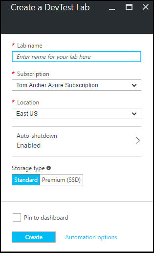

<properties
    pageTitle="Azure DevTest 實驗室中建立實驗室 |Microsoft Azure"
    description="建立虛擬機器中 Azure DevTest 實驗室實驗室"
    services="devtest-lab,virtual-machines"
    documentationCenter="na"
    authors="tomarcher"
    manager="douge"
    editor=""/>

<tags
    ms.service="devtest-lab"
    ms.workload="na"
    ms.tgt_pltfrm="na"
    ms.devlang="na"
    ms.topic="get-started-article"
    ms.date="09/12/2016"
    ms.author="tarcher"/>

# Azure DevTest 實驗室中建立實驗室

## 必要條件

若要建立實驗室，您需要︰

- Azure 的訂閱。 若要瞭解 Azure 購買選項，請參閱[如何購買 Azure](https://azure.microsoft.com/pricing/purchase-options/)或[一個月免費的試用版](https://azure.microsoft.com/pricing/free-trial/)。 您必須是訂閱的擁有者，若要建立實驗室。

## 建立實驗室 Azure DevTest 實驗室中的步驟

下列步驟說明如何使用 Azure 入口網站中 Azure DevTest 實驗室建立實驗室。 

1. [Azure 入口網站](http://go.microsoft.com/fwlink/p/?LinkID=525040)登入。

1. 選取**更多服務**]，然後從清單中選取 [ **DevTest 實驗室**。

1. 在**DevTest 實驗室**刀中，選取 [**新增**]。

    

1. 在 [**建立 DevTest 實驗室**刀︰

    1. 輸入新的實驗**實驗室名稱**。
    
    1. 選取**訂閱**，與實驗室建立關聯。
    
    1. 選取要儲存實驗室的**位置**。
    
    1. 選取 [若要指定是否您想要啟用-和定義的參數-自動關閉所有實驗室的 Vm**自動關閉**。
    
    1. 選取要為實驗室 Vm 指示的儲存空間的磁碟類型的**儲存空間類型**。 
    
    1. 選取 [**建立**]。

    

[AZURE.INCLUDE [devtest-lab-try-it-out](../../includes/devtest-lab-try-it-out.md)]

## 後續步驟

建立您實驗室之後，以下是一些步驟，請考慮︰

- [安全存取實驗室](devtest-lab-add-devtest-user.md)。

- [設定實驗室原則](devtest-lab-set-lab-policy.md)。

- [建立實驗室範本](devtest-lab-create-template.md)。

- [建立自訂的成品，為您的 Vm](devtest-lab-artifact-author.md)。

- [新增與實驗室的成品 VM](devtest-lab-add-vm-with-artifacts.md)。