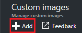
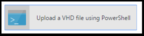
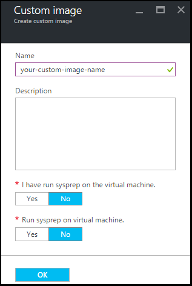

<properties
    pageTitle="管理 Azure DevTest 實驗室自訂圖像，若要建立 Vm |Microsoft Azure"
    description="瞭解如何從 VHD 檔案]，或從現有的 VM Azure DevTest 實驗室中建立的自訂圖像"
    services="devtest-lab,virtual-machines"
    documentationCenter="na"
    authors="tomarcher"
    manager="douge"
    editor=""/>

<tags
    ms.service="devtest-lab"
    ms.workload="na"
    ms.tgt_pltfrm="na"
    ms.devlang="na"
    ms.topic="article"
    ms.date="09/07/2016"
    ms.author="tarcher"/>

# 管理要建立 Vm Azure DevTest 實驗室自訂圖像

Azure DevTest 實驗室中自訂圖像，讓您快速建立 Vm，而不需等待在目標電腦上安裝所有必要的軟體。 自訂圖像允許您預先安裝在 VHD 檔案中，您需要的所有軟體，然後建立 VM 依 VHD 檔案。 已安裝軟體，因為 VM 建立時間會更快。 此外，就會從 VM，建立自訂的圖像，然後從該自訂圖像建立 Vm 複製 Vm 使用自訂的影像。

在本文中，您將學會如何︰

- [建立自訂影像從 VHD 檔案](#create-a-custom-image-from-a-vhd-file)以便然後您可以建立 VM 從該自訂的圖像。 
- [建立自訂影像從 VM](#create-a-custom-image-from-a-vm)快速 VM 複製。

## 從 VHD 檔案建立自訂的圖像

在此區段中，您會看到如何從 VHD 檔案建立自訂的圖像。
您需要在此區段中執行所有步驟有效 VHD 檔案的存取權。   

1. [Azure 入口網站](http://go.microsoft.com/fwlink/p/?LinkID=525040)登入。

1. 選取**更多服務**]，然後從清單中選取 [ **DevTest 實驗室**。

1. 實驗室清單中，選取所要的實驗。  

1. 在實驗室刀，選取 [**設定**]。 

1. 在實驗室**設定**刀中，選取 [**自訂圖像**]。

1. 在**自訂圖像**刀中，選取 [ **+ 自訂圖像**。

    

1. 輸入自訂圖像的名稱。 建立 VM 時，此名稱會顯示清單中的基本的圖像。

1. 輸入自訂的圖像描述。 建立 VM 時，此描述會顯示清單中的基本的圖像。

1. 選取**VHD 檔案**。

1. 如果您有權存取的未列於 VHD 檔案，新增 [ [VHD 檔案上傳](#upload-a-vhd-file)] 區段中的指示執行，完成時，請回到此處。

1. 選取您要的 VHD 檔案。

1. 選取**[確定**] 關閉**VHD 檔案**刀。

1. 選取 [ **OS 設定**]。

1. 在**OS 組態**] 索引標籤中，選取 [ **Windows** ] 或 [ **Linux**。

1. 如果選取 [ **Windows** ]，指定透過核取方塊*Sysprep*是否已在電腦上執行。

1. 選取**[確定**] 關閉**OS 設定**刀。

1. 選取**[確定**] 以建立自訂的圖像。

1. 移至 [[下一步](#next-steps)] 區段。

###上傳 VHD 檔案

若要新增自訂的圖像，您需要有權存取 VHD 檔案。

1. 在 [ **VHD 檔案**刀中，選取 [**使用 PowerShell 將 VHD 檔案上傳**]。

    

1. 下一步刀會顯示修改，並執行的 PowerShell 指令碼，上傳至您訂閱的 Azure VHD 檔案的相關指示。 
**附註︰**此程序可能會根據 VHD 檔案大小和您的連線速度很長的。

## 從 VM 建立自訂的圖像
如果您已設定 VM，您可以從該 VM，建立自訂的圖像，並之後使用自訂圖像建立其他相同 Vm。 下列步驟說明如何從 VM 建立的自訂圖像︰

1. [Azure 入口網站](http://go.microsoft.com/fwlink/p/?LinkID=525040)登入。

1. 選取**更多服務**]，然後從清單中選取 [ **DevTest 實驗室**。

1. 實驗室清單中，選取所要的實驗。  

1. 在實驗室刀，選取 [**我的虛擬機器**]。
 
1. 在**虛擬機器**刀中，選取您要建立自訂圖像的 VM。

1. 在 VM 刀，選取 [**建立自訂圖像 (VHD)**]。

    ![建立自訂的圖像] 功能表項目](./media/devtest-lab-create-template/create-custom-image.png)

1. 在**建立圖像**刀中，輸入的名稱和描述您自訂的圖像。 這項資訊會顯示在基數的清單中，當您建立 VM。

    

1. 選擇是否要 sysprep VM 上執行。 如果未執行 sysprep VM 上，指定是否要執行此自訂圖像從建立 VM 時 sysprep。

1. 選取**[確定]**完成建立自訂的圖像。

[AZURE.INCLUDE [devtest-lab-try-it-out](../../includes/devtest-lab-try-it-out.md)]

## 相關的部落格文章

- [自訂圖像或公式？](https://blogs.msdn.microsoft.com/devtestlab/2016/04/06/custom-images-or-formulas/)
- [複製 Azure DevTest 實驗室自訂圖像](http://www.visualstudiogeeks.com/blog/DevOps/How-To-Move-CustomImages-VHD-Between-AzureDevTestLabs#copying-custom-images-between-azure-devtest-labs)

##後續步驟

一旦您新增自訂的圖像，以供建立 VM 時下, 一步是[新增至您實驗室 VM](./devtest-lab-add-vm-with-artifacts.md)。