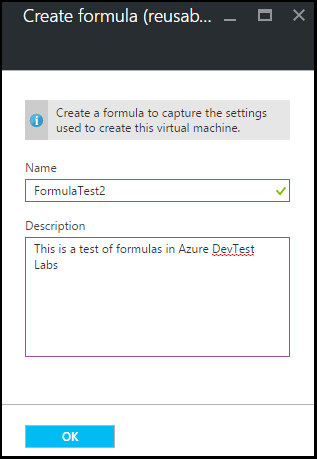

<properties
    pageTitle="管理公式中建立 Vm Azure DevTest 實驗室 |Microsoft Azure"
    description="瞭解如何建立、 更新或移除 Azure DevTest 實驗室公式，以及用來建立新的 Vm。"
    services="devtest-lab,virtual-machines"
    documentationCenter="na"
    authors="tomarcher"
    manager="douge"
    editor=""/>

<tags
    ms.service="devtest-lab"
    ms.workload="na"
    ms.tgt_pltfrm="na"
    ms.devlang="na"
    ms.topic="article"
    ms.date="08/30/2016"
    ms.author="tarcher"/>

# 管理建立 Vm DevTest 實驗室公式

Azure DevTest 實驗室公式是用來建立虛擬機器 (VM) 的預設屬性值的清單。 在建立 VM 從公式時，可以使用預設值為-，或修改。 [自訂圖像](./devtest-lab-create-template.md)和等[服務商場圖像](./devtest-lab-configure-marketplace-images.md)，公式會提供快速 VM 佈建機制。  

在本文中，您將學習如何執行下列工作︰

- [建立公式](#create-a-formula)
- [佈建 VM 使用公式](#use-a-formula-to-provision-a-vm)
- [修改公式](#modify-a-formula)
- [刪除公式](#delete-a-formula)

> [AZURE.NOTE] 公式-例如[自訂圖像](./devtest-lab-create-template.md)-可讓您從 VHD 檔案建立基本的圖像。 基本影像可用佈建新 VM。 若要可協助您判斷哪是最適合您特定的環境，請參閱文件，[比較自訂圖像和 DevTest 實驗室中的公式](./devtest-lab-comparing-vm-base-image-types.md)。

## 建立公式
DevTest 實驗室*使用者*權限的任何人都可以建立使用公式做為基礎的 Vm。 有兩種方式來建立公式︰ 

- 基底-從時，使用您想要定義公式的所有特性。
- 從現有的實驗 VM-當您想要建立公式，請使用根據現有的 VM 的設定。

### 從基底建立公式
下列步驟會引導您完成程序建立的自訂圖像、 服務商場圖像或另一個公式的公式。

1. [Azure 入口網站](http://go.microsoft.com/fwlink/p/?LinkID=525040)登入。

1. 選取**更多服務**]，然後從清單中選取 [ **DevTest 實驗室**。

1. 從實驗室清單中，選取所要的實驗]。  

1. 在實驗室刀選取**公式 （可重複使用的基數）**。

    ![資料編輯] 功能表](./media/devtest-lab-manage-formulas/lab-settings-formulas.png)

1. **實驗室公式**防禦，以在中，選取 [ **+ 新增**]。

    

1. 在 [**選擇基底**刀中，選取 [您要建立公式底數 （自訂圖像、 服務商場圖像或公式）]。

    

1. 在**建立公式**刀中，指定下列的值︰

    - **公式名稱**-輸入公式的名稱。 此值會顯示清單中的基本的圖像，當您建立 VM 時。 當您輸入，及郵件如果不正確，即表示有效的名稱的需求，名稱會進行驗證。
    - **描述**-輸入有意義的描述的公式。 當您建立 VM 公式的內容功能表中使用此值。
    - **使用者名稱**-輸入授與系統管理員權限的使用者名稱。
    - **密碼**-輸入或從下拉式清單中選取-您想要使用指定之使用者的密碼 （密碼） 相關聯的值。  
    - **圖像**此欄位會顯示您選取基底圖像的名稱上先前刀。 
    - **虛擬機器大小**-選取其中一個預先定義的項目，指定處理器核心、 RAM 大小，並建立 VM 硬碟大小。
    - **虛擬網路**-指定所要的虛擬網路。
    - **子網路**-指定所要的子網路。
    - **公用 IP 位址**-如果實驗室原則設定為允許選取子網路的公用 IP 位址，指定您是否想要選取 [**是**] 或 [**否**]，為公用的 IP 位址。 否則，此選項會停用，並選取為 [**否]**。
    - **成品**-選取並設定您想要新增至基底圖像的成品。 保護公式不會儲存值的字串。 因此，不會顯示為安全的字串成品參數。 

        

1. 選取 [**建立**]，建立公式。

### 從 VM 建立公式
下列步驟會引導您完成建立公式，根據現有的 VM 的程序。 

> [AZURE.NOTE] 若要從 VM 建立公式，VM 必須後就會建立 2016 年 3 月 30 日。 

1. [Azure 入口網站](http://go.microsoft.com/fwlink/p/?LinkID=525040)登入。

1. 選取**更多服務**]，然後從清單中選取 [ **DevTest 實驗室**。

1. 從實驗室清單中，選取所要的實驗]。  

1. 在實驗室**概觀**刀，選取您要建立公式的 VM。

    

1. 在 [VM 刀，選取 [**建立公式 （可重複使用底數）**]。

    

1. 在**建立公式**刀中，輸入新公式的**名稱**和**描述**。

    

1. 選取**[確定**] 建立公式。

## 佈建 VM 使用公式
建立公式之後，您可以建立 VM 根據該公式。 [] 區段中[新增的成品 VM](devtest-lab-add-vm-with-artifacts.md#add-a-vm-with-artifacts)逐步引導您完成程序。

## 修改公式
若要修改公式，請遵循下列步驟︰

1. [Azure 入口網站](http://go.microsoft.com/fwlink/p/?LinkID=525040)登入。

1. 選取**更多服務**]，然後從清單中選取 [ **DevTest 實驗室**。

1. 從實驗室清單中，選取所要的實驗]。  

1. 在實驗室刀選取**公式 （可重複使用的基數）**。

    ![資料編輯] 功能表](./media/devtest-lab-manage-formulas/lab-settings-formulas.png)

1. 在**實驗室公式**刀中，選取您想要修改的公式。

1. 在**更新公式**刀，進行所要的編輯，然後選取 [**更新**]。

## 刪除公式 
若要刪除公式，請遵循下列步驟︰

1. [Azure 入口網站](http://go.microsoft.com/fwlink/p/?LinkID=525040)登入。

1. 選取**更多服務**]，然後從清單中選取 [ **DevTest 實驗室**。

1. 從實驗室清單中，選取所要的實驗]。  

1. 在實驗室**設定**刀中，選取 [**公式**]。

    ![資料編輯] 功能表](./media/devtest-lab-manage-formulas/lab-settings-formulas.png)

1. 在**實驗室公式**刀中，選取您想要刪除的公式右邊的省略符號。

    ![資料編輯] 功能表](./media/devtest-lab-manage-formulas/lab-formulas-blade.png)

1. 在公式的操作功能表中，選取 [**刪除**]。

    

1. 刪除確認對話方塊中選取**[是]** 。

[AZURE.INCLUDE [devtest-lab-try-it-out](../../includes/devtest-lab-try-it-out.md)]

## 相關的部落格文章

- [自訂圖像或公式？](https://blogs.msdn.microsoft.com/devtestlab/2016/04/06/custom-images-or-formulas/)

## 後續步驟
一旦您建立公式用於建立 VM 時下, 一步是[新增至您實驗室 VM](./devtest-lab-add-vm-with-artifacts.md)。