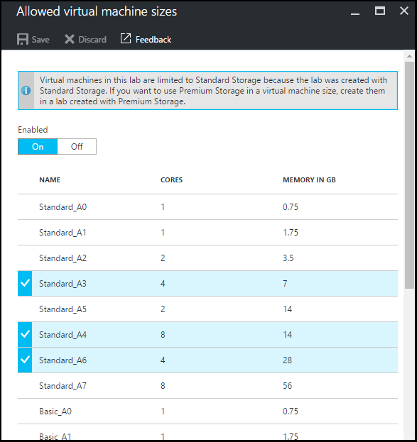
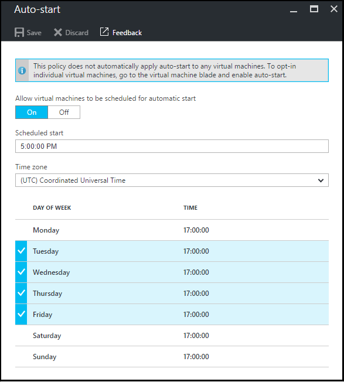

<properties
    pageTitle="定義中 Azure DevTest 實驗室實驗室原則 |Microsoft Azure"
    description="瞭解如何定義例如 VM 大小，每個使用者，然後關閉自動化的最大 Vm 實驗室原則。"
    services="devtest-lab,virtual-machines"
    documentationCenter="na"
    authors="tomarcher"
    manager="douge"
    editor=""/>

<tags
    ms.service="devtest-lab"
    ms.workload="na"
    ms.tgt_pltfrm="na"
    ms.devlang="na"
    ms.topic="article"
    ms.date="09/12/2016"
    ms.author="tarcher"/>

# 定義中 Azure DevTest 實驗室實驗室原則

> [AZURE.VIDEO how-to-set-vm-policies-in-a-devtest-lab]

Azure DevTest 實驗室可讓您指定原則，協助您控制成本，以及在實驗室浪費最小化。 這些實驗室原則包含每位使用者與每次實驗，並自動關閉，並自動開始的各種選項建立 Vm 的數上限。 

## 存取在 Azure DevTest 實驗室實驗室的原則

下列步驟會引導您設定的實驗中 Azure DevTest 實驗室原則︰

若要檢視 （並變更） 實驗室的原則，請遵循下列步驟︰

1. [Azure 入口網站](http://go.microsoft.com/fwlink/p/?LinkID=525040)登入。

1. 選取**更多服務**]，然後從清單中選取 [ **DevTest 實驗室**。

1. 實驗室清單中，選取所要的實驗。   

1. 選取**原則設定**]。

1. **原則設定**刀包含設定，您可以指定的功能表︰ 

    

    若要瞭解更多關於設定原則的資訊，請從下列清單中選取︰

    - [允許的虛擬機器大小](#set-allowed-virtual-machine-sizes)-VM 大小清單允許實驗室中選取。 使用者可以建立 Vm 僅從這份清單。

    - [每個使用者的虛擬機器](#set-virtual-machines-per-user)中的指定的使用者可以建立 Vm 數目上限。 

    - [每次實驗的虛擬機器](#set-virtual-machines-per-lab)中的指定實驗室可以建立的 Vm 數目上限。 

    - [自動關閉](#set-auto-shutdown)-指定的時間，當目前的實驗的 Vm 會自動關閉。

    - [自動開始](#set-auto-start)-指定當目前的實驗 Vm 自動開始的時間。

## 允許的虛擬機器大小的設定

設定允許的 VM 大小的原則，可協助您可以指定哪些 VM 大小允許實驗室中，實驗浪費最小化。 如果已啟動此原則，只 VM 大小從這份清單可用來建立 Vm。

1. 在實驗室的**原則設定**刀，選取 [**允許的虛擬機器大小**]。

    
 
1. 選取**上**啟用此原則，和**關閉**停用它。

1. 如果您啟用此原則，請選取 [測試環境中可以建立的一個或多個 VM 大小]。

1. 選取 [**儲存**]。

## 每個使用者的設定虛擬機器

**虛擬機器每位使用者**的原則可讓您指定的個別使用者可以建立的 Vm 數上限。 如果使用者嘗試建立 VM 已符合使用者限制時，錯誤訊息指出 VM，無法建立。 

1. 在 [測試環境的**原則設定**刀，選取 [**每位使用者的虛擬機器**]。

    

1. 選取**上**啟用此原則，和**關閉**停用它。

1. 如果您啟用此原則，請輸入數字的值，指出您可以建立使用者的 Vm 數目上限。 如果您輸入數字不是有效的 UI 會顯示這個欄位所允許的最大數目。

1. 選取 [**儲存**]。

## 設定每次實驗的虛擬機器

**每次實驗的虛擬機器**的原則可讓您指定的目前實驗室可以建立的 Vm 數目上限。 如果使用者嘗試建立 VM 已符合實驗室限制時，出現錯誤訊息會表示無法建立 VM。 

1. 在實驗室的**原則設定**刀，選取 [**每次實驗的虛擬機器**]。

    

1. 選取**上**啟用此原則，和**關閉**停用它。

1. 如果您啟用此原則，請輸入一個數字的值，指出目前實驗室可以建立的 Vm 數目上限。 如果您輸入數字不是有效的 UI 會顯示這個欄位所允許的最大數目。

1. 選取 [**儲存**]。

## 設定自動關閉

自動關閉原則，可協助降低實驗室浪費可以讓您指定的時間，此實驗室 Vm 關閉。

1. 在實驗室的**原則設定**刀，選取 [**自動關閉**。

    

1. 選取**上**啟用此原則，和**關閉**停用它。

1. 如果您啟用此原則，指定要關閉所有 Vm 在目前的實驗當地時間。

1. 選取 [**儲存**]。

1. 根據預設，一旦啟用，此原則適用於所有 Vm 目前實驗室中。 若要移除特定 VM 這項設定，請開啟 VM 刀並將其**自動關閉**設定變更 

## 設定自動啟動

自動啟動原則可讓您指定在目前的實驗 Vm 會啟動。  

1. 在實驗室的**原則設定**刀，選取 [**自動啟動**。

    

1. 選取**上**啟用此原則，和**關閉**停用它。

1. 如果您啟用此原則，指定本機排程開始時間和時間套用週的日子。 

1. 選取 [**儲存**]。

1. 一旦啟用，此原則會不會自動套用至目前實驗室中任何 Vm。 若要與特定 VM 套用這項設定，請開啟 VM 刀並將其**自動啟動**設定變更 

[AZURE.INCLUDE [devtest-lab-try-it-out](../../includes/devtest-lab-try-it-out.md)]

## 後續步驟

一旦您定義並套用不同的 VM 原則設定的測試環境，以下是下一步嘗試的一些事項︰

- [設定成本管理](./devtest-lab-configure-cost-management.md)-說明如何使用**每月估計成本趨勢**圖表  
若要檢視目前月份的估計成本迄今和規劃的結束的月成本。
- [建立自訂圖像](./devtest-lab-create-template.md)-當您建立 VM 時，您指定的底數，可自訂的圖像或服務商場圖像。 本文說明如何從 VHD 檔案建立自訂的圖像。
- [設定服務商場圖像](./devtest-lab-configure-marketplace-images.md)Azure DevTest 實驗室支援建立 Vm 根據 Azure Marketplace 圖像。 本文將說明如何指定哪些，如果有的話，可以是 Azure Marketplace 圖像中建立 Vm 時使用。
- [建立在實驗室 VM](./devtest-lab-add-vm-with-artifacts.md) -說明如何建立基本的影像 VM (其中一個自訂或服務商場)，以及如何使用您 VM 的成品。
