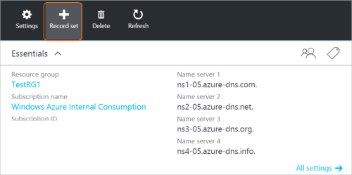

<properties
   pageTitle="建立記錄的設定和使用 Azure 入口網站的 DNS 區域記錄 |Microsoft Azure"
   description="如何建立 Azure DNS 主機記錄，以及建立記錄設定和使用 Azure 入口網站的記錄"
   services="dns"
   documentationCenter="na"
   authors="sdwheeler"
   manager="carmonm"
   editor=""
   tags="azure-resource-manager"/>

<tags
   ms.service="dns"
   ms.devlang="na"
   ms.topic="article"
   ms.tgt_pltfrm="na"
   ms.workload="infrastructure-services"
   ms.date="08/16/2016"
   ms.author="sewhee"/>

# 使用 [Azure 入口網站建立 DNS 記錄設定及記錄

> [AZURE.SELECTOR]
- [Azure 入口網站](dns-getstarted-create-recordset-portal.md)
- [PowerShell](dns-getstarted-create-recordset.md)
- [Azure CLI](dns-getstarted-create-recordset-cli.md)

本文會引導您完成建立記錄，記錄集使用 Azure 入口網站的程序。 建立您的 DNS 區域之後，您會新增您網域的 DNS 記錄。 若要這麼做，您必須瞭解 DNS 記錄，以及記錄集。

[AZURE.INCLUDE [dns-about-records-include](../../includes/dns-about-records-include.md)]

## 建立的記錄設定及記錄

下列範例會引導您使用 Azure 入口網站建立的記錄設定及記錄的程序。 我們會使用"A"的 DNS 記錄類型。

1. 登入入口網站。

2. 移至您要建立的記錄組**DNS 區域**刀。

3. 在**DNS 區域**刀頂端，選取 [開啟**新增記錄設定**刀的 [**設定記錄**]。

    

4. 在**新增記錄設定**刀，命名您記錄的設定。 例如，您可能會命名您記錄設定 「**www**」。

    

5. 選取您想要建立的記錄類型。 例如，選取 [ **A**]。

6. 設定**[TTL]**。 若要在入口網站的預設時間是一小時。

7. 新增的 IP 位址，每一行的同一 IP 位址。 當您使用的建議記錄設定名稱和稍早所述的記錄類型時，則會新增至 www 記錄設定**A**記錄的 IPv4 IP 位址。

8. 新增 IP 位址之後，請選取 [刀底部的**[確定**]。 將會建立 DNS 記錄設定。

## 後續步驟

若要管理您的錄製設定和記錄，請參閱[管理 DNS 記錄和記錄設定為使用 Azure 入口網站](dns-operations-recordsets-portal.md)。

如需有關 Azure DNS 的詳細資訊，請參閱[Azure DNS 概觀](dns-overview.md)。
