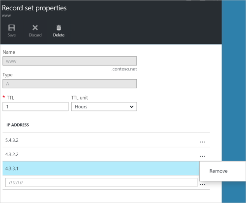

<properties
   pageTitle="管理 DNS 記錄設定和使用 Azure 入口網站的記錄 |Microsoft Azure"
   description="管理 DNS 記錄設定，並時裝載您的網域，在 Azure 的 DNS 記錄。"
   services="dns"
   documentationCenter="na"
   authors="sdwheeler"
   manager="carmonm"
   editor=""
   tags="azure-resource-manager"/>

<tags
   ms.service="dns"
   ms.devlang="na"
   ms.topic="article"
   ms.tgt_pltfrm="na"
   ms.workload="infrastructure-services"
   ms.date="08/16/2016"
   ms.author="sewhee"/>

# 管理 DNS 記錄，然後記錄設定為使用 Azure 入口網站

> [AZURE.SELECTOR]
- [Azure 入口網站](dns-operations-recordsets-portal.md)
- [Azure CLI](dns-operations-recordsets-cli.md)
- [PowerShell](dns-operations-recordsets.md)

本文將示範如何使用 Azure 入口網站管理記錄集和您的 DNS 區域記錄。

請務必瞭解 DNS 記錄集與個別的 DNS 記錄之間的差異。 記錄的設定是區域中有相同的名稱，而且相同類型的記錄的集合。 如需詳細資訊，請參閱[建立 DNS 記錄設定和使用 Azure 入口網站的記錄](dns-getstarted-create-recordset-portal.md)。

## 建立新的記錄設定及記錄

若要建立設定 Azure 入口網站中的記錄，請參閱[使用 Azure 入口網站建立 DNS 記錄](dns-getstarted-create-recordset-portal.md)。

## 檢視記錄的設定

1. 在 Azure 入口網站中，移至**DNS 區域**刀。

2. 搜尋記錄的設定，並加以選取。 這會開啟記錄設定屬性。

    

## 新增記錄至記錄的設定

您可以新增任何記錄設定 20 個記錄。 記錄的設定不能包含兩個相同的記錄。 空白的記錄集 （含零記錄） 您可以建立，但不是會顯示在 Azure DNS 名稱伺服器上。 記錄類型 CNAME 組最多可以包含一筆記錄。

1. 在您的 DNS 區域**記錄設定屬性**刀，按一下您想要新增記錄以記錄設定。

    

2. 指定記錄以設定屬性的欄位中填滿。

    

2. 按一下 [**儲存**刀頂端儲存您的設定。 刀關閉。

3. 在角，您會看到該記錄會將儲存。

    

儲存記錄後， **DNS 區域**刀上的值會反映在新記錄。

## 更新記錄

當您更新現有的記錄設定中的記錄時，您可以更新欄位，取決於您正在使用的記錄類型。

1. 在 [您的記錄集**記錄設定屬性**刀，搜尋記錄。

2. 修改記錄。 當您修改記錄時，您可以變更記錄可用的設定。 在下列範例中，已選取 [ **IP 位址**] 欄位，而 IP 位址是程序正在修改。

    

3. 按一下 [**儲存**刀頂端儲存您的設定。 在右上角，您會看到記錄已經儲存過的通知。

    

儲存記錄後，設定**DNS 區域**刀記錄的值會反映更新的記錄。

## 從記錄中移除記錄

若要移除的記錄組中的記錄，您可以使用 [Azure 入口網站。 請注意，移除記錄設定的最後一筆記錄並不會刪除記錄的設定。

1. 在 [您的記錄集**記錄設定屬性**刀，搜尋記錄。

2. 按一下您想要移除的記錄。 然後選取 [**移除**]。

    

3. 按一下 [**儲存**刀頂端儲存您的設定。

3. 已移除記錄之後，請在 [ **DNS zone**刀記錄的值會反映移除。

## 刪除記錄集

1. 在**記錄設定屬性**的刀您記錄設定，按一下 [**刪除**]。

    

2. 出現一則訊息，詢問如果您想要刪除的記錄設定。

3. 請確認名稱符合您想要刪除，，然後按一下 [**是]**記錄設定。

4. 在 [ **DNS zone**防禦，以確認記錄集不再顯示。

## 使用 NS 和 SOA 記錄

NS 和 SOA 會自動建立的記錄可以在其他記錄類型以不同的方式管理。

### 修改 SOA 記錄

您無法新增或移除區域 apex 在設定的自動建立 SOA 記錄的記錄 (名稱 = "@")。 不過，您可以修改任何 SOA 記錄 （除了 「 主機 」） 中的參數，記錄設定 [TTL]。

### 修改區域 apex NS 記錄

您無法新增若要移除，或修改自動建立的 NS 記錄設定區域 apex 中的記錄 (名稱 = "@")。 只允許變更是修改記錄設定 [TTL]。

### 刪除 SOA 或 NS 記錄設定

您無法刪除 SOA 及 NS 記錄設定區域 apex (名稱 ="@")所建立自動建立區域時。 當您刪除區域時，他們會自動刪除。

## 後續步驟

-   如需有關 Azure DNS 的詳細資訊，請參閱[Azure DNS 概觀](dns-overview.md)。
-   如需有關自動執行 DNS 的詳細資訊，請參閱[建立 DNS 區域和記錄設定為使用.NET SDK](dns-sdk.md)。
-   如需有關反向 DNS 記錄的詳細資訊，請參閱[如何管理服務使用 PowerShell 反向 DNS 記錄](dns-reverse-dns-record-operations-ps.md)。
