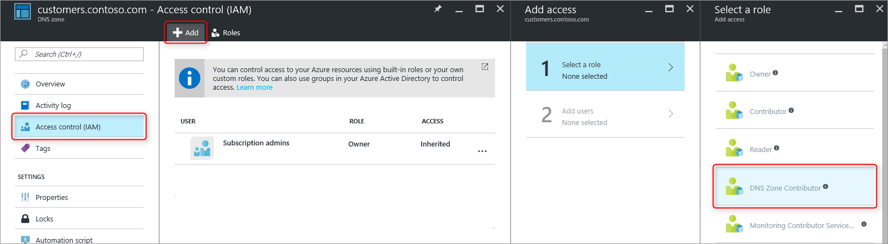

<properties 
   pageTitle="保護 DNS 區域和記錄 |Microsoft Azure" 
   description="Microsoft Azure DNS 設定如何保護 DNS 區域和記錄。" 
   services="dns" 
   documentationCenter="na" 
   authors="jtuliani" 
   manager="carmonm" 
   editor=""/>

<tags
   ms.service="dns"
   ms.devlang="na"
   ms.topic="article"
   ms.tgt_pltfrm="na"
   ms.workload="infrastructure-services" 
   ms.date="10/20/2016"
   ms.author="jtuliani"/>

# 如何保護 DNS 區域和記錄

DNS 區域和記錄的要徑的資源。 刪除 DNS 區域或甚至只單一 DNS 記錄可能會導致總服務中斷。  因此，是很重要的要徑 DNS 區域和記錄會防止未經授權或意外的變更。

本文說明如何 Azure DNS 可讓您以保護您的 DNS 區域和記錄對這類所做的變更。  我們套用提供由 Azure 資源管理員的兩個功能強大的安全性功能︰[角色型存取控制](../active-directory/role-based-access-control-what-is.md)和[資源鎖定](../resource-group-lock-resources.md)。

## 角色型存取控制

Azure 角色型存取控制 (RBAC) 可讓精密存取 Azure 使用者、 群組和資源管理。 使用 RBAC，您可以授與確實存取的數量，使用者需要執行工作。 如需有關如何 RBAC 可協助您管理存取權的詳細資訊，請參閱[什麼是角色型存取控制](../active-directory/role-based-access-control-what-is.md)。

### [DNS Zone 參與者 」 角色

[DNS Zone 參與者 」 角色是 Azure 管理 DNS 資源所提供的內建角色。  指派給使用者或群組的 [DNS Zone 參與者] 權限可讓管理 DNS 的資源，但不是資源的其他任何類型的群組。

例如，假設資源群組 」 myzones 「 Contoso Corporation 包含五個區域。 授與 DNS 管理員該資源群組的 [DNS Zone 參與者 」 權限，讓這些 DNS 區域的完全控制權。 也可以避免，例如 DNS 管理員無法建立或停止虛擬機器授與不必要的權限]。

若要指派 RBAC 權限最簡單的方法是[透過 Azure 入口網站](../active-directory/role-based-access-control-configure.md)。  開啟 [存取控制 (IAM)] 刀資源群組，然後按一下 [新增]，然後選取 [DNS Zone 參與者 」 角色再選取所需的使用者或群組，若要授與權限。

權限也可以[授與使用 PowerShell 的 Azure](../active-directory/role-based-access-control-manage-access-powershell.md):

    # Grant 'DNS Zone Contributor' permissions to all zones in a resource group
    New-AzureRmRoleAssignment -SignInName <user email address> -RoleDefinitionName "DNS Zone Contributor" -ResourceGroupName <resource group name>

對等的命令也有[透過 Azure CLI](../active-directory/role-based-access-control-manage-access-azure-cli.md):

    # Grant 'DNS Zone Contributor' permissions to all zones in a resource group
    azure role assignment create --signInName  <user email address> --roleName "DNS Zone Contributor" --resourceGroup <resource group name>

### 區域層級 RBAC

Azure RBAC 規則可以套用至 [訂閱]，[資源群組或個別的資源。 若是 Azure DNS 資源可以個別的 DNS 區域或甚至個別記錄的設定。

例如，假設資源群組 'myzones' 包含區域 'contoso.com' 和 subzone 'customers.contoso.com' 每個客戶帳戶建立 CNAME 記錄。  用來管理這些 CNAME 記錄的帳戶應該逐一指派權限可建立記錄只 'customers.contoso.com] 區域中，它不應該存取其他區域。

區域層級 RBAC 權限可授與透過 Azure 入口網站。  開啟 「 存取控制 (IAM)' 刀區域，然後按一下 [新增]，然後選取 [DNS Zone 參與者 」 角色再選取所需的使用者或群組，若要授與權限。

權限也可以[授與使用 PowerShell 的 Azure](../active-directory/role-based-access-control-manage-access-powershell.md):

    # Grant 'DNS Zone Contributor' permissions to a specific zone
    New-AzureRmRoleAssignment -SignInName <user email address> -RoleDefinitionName "DNS Zone Contributor" -ResourceGroupName <resource group name> -ResourceName <zone name> -ResourceType Microsoft.Network/DNSZones

對等的命令也有[透過 Azure CLI](../active-directory/role-based-access-control-manage-access-azure-cli.md):

    # Grant 'DNS Zone Contributor' permissions to a specific zone
    azure role assignment create --signInName <user email address> --roleName "DNS Zone Contributor" --resource-name <zone name> --resource-type Microsoft.Network/DNSZones --resource-group <resource group name>

### 記錄層級 RBAC 設定

我們可以繼續下一步。 請考慮 Contoso 公司電子郵件管理員需要存取 'contoso.com' 區域的 apex MX 和 TXT 記錄。  她不需要存取任何其他 MX 或 TXT 記錄，或任何其他任何類型的記錄。  Azure DNS 可讓您將權限層級設定記錄，指派給確實電子郵件管理員必須能夠存取的記錄。  電子郵件管理員已授與精確地控制她需要時，即無法進行任何其他變更。
  
您可以透過 Azure 入口網站中，使用記錄設定刀中的 [使用者] 按鈕設定記錄設定層級 RBAC 權限︰

記錄設定層級 RBAC 權限也可以[授與使用 PowerShell 的 Azure](../active-directory/role-based-access-control-manage-access-powershell.md):

    # Grant permissions to a specific record set
    New-AzureRmRoleAssignment -SignInName <user email address> -RoleDefinitionName "DNS Zone Contributor" -Scope "/subscriptions/<subscription id>/resourceGroups/<resource group name>/providers/Microsoft.Network/dnszones/<zone name>/<record type>/<record name>" 

對等的命令也有[透過 Azure CLI](../active-directory/role-based-access-control-manage-access-azure-cli.md):

    # Grant permissions to a specific record set
    azure role assignment create --signInName <user email address> --roleName "DNS Zone Contributor" --scope "/subscriptions/<subscription id>/resourceGroups/<resource group name>/providers/Microsoft.Network/dnszones/<zone name>/<record type>/<record name>"

### 自訂的角色

內建的 [DNS Zone 參與者 」 角色啟用 DNS 資源的完全控制權。 您也可建立您自己的客戶 Azure 角色，提供更細緻的控制項。

請考慮再次針對每個 Contoso 公司客戶帳戶建立一筆 CNAME 記錄在 「 customers.contoso.com 」 的區域中的範例。  用來管理這些 CNAMEs 帳戶應授與權限管理僅限 CNAME 記錄。  您就無法修改記錄其他類型 （例如變更 MX 記錄），或執行區域層級作業，例如區域刪除。

下列範例顯示自訂角色定義管理僅限 CNAME 記錄︰

    {
        "Name": "DNS CNAME Contributor",
        "Id": "",
        "IsCustom": true,
        "Description": "Can manage DNS CNAME records only.",
        "Actions": [
            "Microsoft.Network/dnsZones/CNAME/*",
            "Microsoft.Network/dnsZones/read",
            "Microsoft.Authorization/*/read",
            "Microsoft.Insights/alertRules/*",
            "Microsoft.ResourceHealth/availabilityStatuses/read",
            "Microsoft.Resources/deployments/*",
            "Microsoft.Resources/subscriptions/resourceGroups/read",
            "Microsoft.Support/*"
        ],
        "NotActions": [
        ],
        "AssignableScopes": [
            "/subscriptions/ c276fc76-9cd4-44c9-99a7-4fd71546436e"
        ]
    }

[動作] 屬性中定義的下列 DNS 特定權限︰

- `Microsoft.Network/dnsZones/CNAME/*`授與的完全控制權 CNAME 記錄
- `Microsoft.Network/dnsZones/read`授與權限讀取 DNS 區域，但無法修改，讓您能夠看到在其中建立 CNAME 的區域。

剩餘的動作會複製的 [ [DNS Zone 參與者內建的角色](../active-directory/role-based-access-built-in-roles.md#dns-zone-contributor)。

>[AZURE.NOTE] 若要防止刪除記錄集，同時仍允許更新它們不是有效的控制項中使用自訂的 RBAC 角色。 防止刪除，記錄集，但無法防止這些不會受到修改。  允許的修改包含新增及移除記錄的設定，包括移除離開 「 空白 」 的記錄設定所有記錄的記錄。 此已刪除的記錄，從 DNS 解析觀點設定相同的效果。

目前無法透過 Azure 入口網站定義自訂的角色定義。 可以使用 PowerShell 的 Azure 建立此角色定義所根據的自訂角色︰

    # Create new role definition based on input file
    New-AzureRmRoleDefinition -InputFile <file path>

您也可以透過 Azure CLI 建立︰

    # Create new role definition based on input file
    azure role create –inputfile <file path>

然後可以將角色指派為內建的角色，相同的方式，本文稍早所述。

如需有關如何建立的詳細資訊，管理，並指定自訂的角色，請參閱[Azure RBAC 自訂角色](../active-directory/role-based-access-control-custom-roles.md)。

## 資源鎖定

除了 RBAC，Azure 資源管理員支援其他類型的安全性控制項，也就是 「 鎖定 」 資源的能力。 位置 RBAC 規則讓您控制特定的使用者和群組的動作，資源鎖定就會套用至資源，並在所有使用者與角色都是有效。 如需詳細資訊，請參閱[鎖定資源與 Azure 資源管理員](../resource-group-lock-resources.md)。

有兩種類型的資源鎖定︰ **DoNotDelete**及**唯讀**。 這些可以套用至 DNS 區域，或個別的記錄設定。  下列各節說明幾個常見的案例中，以及如何支援這些使用資源鎖定。

### 防止所有變更

若要防止所做的任何變更，請套用唯讀鎖定到該區域。  這可防止新記錄集所建立，或現有記錄集修改或刪除的郵件。

您可以透過 Azure 入口網站建立區域撫平資源鎖定。  從 [DNS zone 刀中，按一下 [「 鎖定 」，然後 「 新增 」:

區域層級鎖定也可以透過 PowerShell 的 Azure 建立的資源︰

    # Lock a DNS zone
    New-AzureRmResourceLock -LockLevel <lock level> -LockName <lock name> -ResourceName <zone name> -ResourceType Microsoft.Network/DNSZones -ResourceGroupName <resource group name> 

設定 Azure 資源鎖定目前不支援透過 Azure CLI。

### 保護個別的記錄
若要防止設定針對修改現有的 DNS 記錄，請套用唯讀鎖定記錄集。

>[AZURE.NOTE] 將 DoNotDelete 鎖定套用至記錄的設定不是有效的控制項。 它會防止設定遭到刪除的記錄，但它不會防止加以修改。  允許的修改包含新增及移除記錄的設定，包括移除離開 「 空白 」 的記錄設定所有記錄的記錄。 此已刪除的記錄，從 DNS 解析觀點設定相同的效果。

記錄設定撫平資源鎖定目前可以只使用 PowerShell 的 Azure 設定。  Azure 入口網站或 Azure CLI 中不支援它們。

    # Lock a DNS record set
    New-AzureRmResourceLock -LockLevel <lock level> -LockName <lock name> -ResourceName <zone name>/<record set name> -ResourceType Microsoft.Network/DNSZones/<record type> -ResourceGroupName <resource group name> 

### 防止區域刪除

Azure DNS 中刪除區域時，在區域中的所有記錄集也會一併刪除。  這項作業無法復原。  不小心刪除重要區域有可能會有有效的商務的影響。  因此，它是很重要，以避免意外的區域刪除。

套用至區域的 DoNotDelete 鎖定可防止區域刪除。  不過，由於鎖定子資源的繼承，也可以防止遭到刪除，但可能不是 「 區域中的任何記錄集。  此外，上面的附註所述，也是無效之後還是可以從現有記錄集移除記錄。

或者，請考慮將 DoNotDelete 鎖定套用至記錄的區域，例如 SOA 記錄設定中設定。  無法刪除區域，而不需也刪除記錄集，因為這可以防止區域刪除，同時仍允許自由修改區域內的 [記錄集。 如果嘗試刪除區域 Azure 資源管理員會偵測這也會刪除 SOA 記錄設定，並會封鎖通話，因為 SOA 已被鎖定。  沒有記錄集會刪除。

下列 PowerShell 命令建立 DoNotDelete 鎖定針對給定的區域的 SOA 記錄︰

    # Protect against zone delete with DoNotDelete lock on the record set
    New-AzureRmResourceLock -LockLevel DoNotDelete -LockName <lock name> -ResourceName <zone name>/@ -ResourceType Microsoft.Network/DNSZones/SOA -ResourceGroupName <resource group name> 

若要避免意外區域刪除另一個方法是使用自訂的角色，以確保的運算子，而且用來管理您的區域的服務帳戶不需要刪除權限的區域。 當您需要刪除區域時，您可以強制執行兩個步驟刪除、 第一個授與的區域刪除權限，（位於區域的範圍，以防止刪除錯誤區域） 和第二個来刪除區域。

此第二個方法的優點，其運作方式存取這些帳戶，而不需要建立任何鎖定，請記得所有區域。 有缺點區域刪除權限，例如訂閱擁有者的任何帳戶可以仍不小心刪除重要的區域。

就可以使用這兩種方法資源鎖定和自訂角色的同時，為 DNS zone 保護的措施深入方法。

## 後續步驟

- 如需有關使用 RBAC 的詳細資訊，請參閱[開始使用 access Azure 入口網站中的管理](../active-directory/role-based-access-control-what-is.md)。 
- 如需有關如何使用資源鎖定的詳細資訊，請參閱[鎖定資源與 Azure 資源管理員](../resource-group-lock-resources.md)。
- 如需有關如何保護您 Azure 資源的詳細資訊，請參閱[Azure 資源管理員的安全性考量](../best-practices-resource-manager-security.md)。
