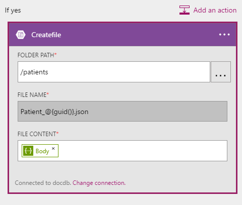
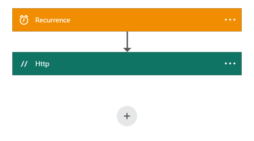

<properties 
    pageTitle="DocumentDB 變更通知使用邏輯應用程式 |Microsoft Azure" 
    description="." 
    keywords="變更通知"
    services="documentdb" 
    authors="hedidin" 
    manager="jhubbard" 
    editor="mimig" 
    documentationCenter=""/>

<tags 
    ms.service="documentdb" 
    ms.workload="data-services" 
    ms.tgt_pltfrm="na" 
    ms.devlang="rest-api" 
    ms.topic="article" 
    ms.date="09/23/2016" 
    ms.author="b-hoedid"/>

# <a name="notifications-for-new-or-changed-documentdb-resources-using-logic-apps"></a>使用邏輯應用程式的新的或變更 DocumentDB 資源的通知

本文的相關來自我看到張貼 Azure DocumentDB 社群論壇的其中一個問題。 問題是**會 DocumentDB 支援已修改的資源的通知**嗎？

我有許多年，使用 BizTalk Server，這是常見的情況時使用[WCF LOB 介面卡](https://msdn.microsoft.com/library/bb798128.aspx)。 因此，我決定要看看是否我無法複製新及/或修改過的文件中 DocumentDB 此功能。

本文提供變更通知解決方案，其中包括[觸發程序](documentdb-programming.md#trigger)和[邏輯應用程式](../app-service-logic/app-service-logic-what-are-logic-apps.md)的元件的概觀。 提供內嵌程式碼片段而整個方案上提供[GitHub](https://github.com/HEDIDIN/DocDbNotifications)重要事項。

## <a name="use-case"></a>使用大小寫

下列本文是本文的使用情況。

DocumentDB 是狀況層級七個國際 (HL7) 快速保健互通性資源 (FHIR) 文件存放庫。 例如，假設 DocumentDB 資料庫配合您的 API 和邏輯應用程式的進行 HL7 FHIR 伺服器設定。  保健單位是病患資料儲存 DocumentDB 「 病人 」 資料庫。 有數個集合中病患的資料庫。臨床、 識別等。病患資訊所屬的識別碼。  您必須名為 「 病人 」 集合。

Cardiology 部門追蹤個人的健康情況和運動資料。 新增或修改過的病患記錄搜尋很花時間。 他們要求 IT 部門是否他們可能會收到通知，以新增或修改過的病患記錄的方式。  

IT 部門說，他們可以輕鬆地提供此。 他們也說他們無法文件推入[Azure Blob 儲存體](https://azure.microsoft.com/services/storage/)Cardiology 部門輕鬆無法存取。

## <a name="how-the-it-department-solved-the-problem"></a>IT 部門如何解決問題

若要建立此應用程式，IT 部門決定第一次的模型。  使用商業流程模型和示意圖 (BPMN) 的好是技術和非技術人員可以輕鬆地瞭解它。 此整個通知程序會被視為商務程序。 

## <a name="high-level-view-of-notification-process"></a>通知程序的高層級檢視

1. 您開始使用具有計時器觸發程序邏輯應用程式。 根據預設，觸發程序會執行每小時。
2. 接下來您執行 HTTP 張貼邏輯應用程式。
3. 邏輯應用程式會所有的工作。


### <a name="lets-take-a-look-at-what-this-logic-app-does"></a>讓我們來看看此邏輯應用程式的功能
如果您看看下圖有幾個步驟 LogicApp 工作流程中。


步驟如下所示︰

1. 您需要取得目前 UTC DateTime 從 API 應用程式。  預設值是一小時前一個。

2. UTC DateTime 會轉換為 Unix 時間戳記的格式。 這是 DocumentDB 的時間戳記的預設格式。

3. 您張貼的值至 API 應用程式，並 DocumentDB 查詢。 會在查詢中使用值。

    ```SQL
        SELECT * FROM Patients p WHERE (p._ts >= @unixTimeStamp)
    ```

    > [AZURE.NOTE] _Ts 代表 DocumentDB 的所有資源的時間戳記中繼資料。

4. 如果有找到文件，請回應內容會傳送至您的 Azure Blob 儲存體。

    > [AZURE.NOTE] Blob 儲存體需要 Azure 儲存體帳戶。 您需要佈建 Azure Blob 儲存體帳戶，並新增名為病患的新 Blob。 如需詳細資訊，請參閱[關於 Azure 儲存體帳戶](../storage/storage-create-storage-account.md)和[Azure Blob 儲存體快速入門](../storage/storage-dotnet-how-to-use-blobs.md)。

5. 最後，電子郵件傳送的通知找到文件的數字的收件者。 如果找不到文件，電子郵件本文就是 「 0 文件找 」。 

您已經有的工作流程的功能，讓我們來看看如何實作。

### <a name="lets-start-with-the-main-logic-app"></a>現在就讓我們開始主邏輯應用程式

如果您不熟悉邏輯應用程式，他們可在[Azure Marketplace](https://portal.azure.com/)]，而且您可以進一步瞭解中[邏輯應用程式有哪些？](../app-service-logic/app-service-logic-what-are-logic-apps.md)

當您建立新的邏輯應用程式時，會要求您**您要如何開始？**

當您按一下 [文字] 方塊內時，您可以事件的選擇。 此邏輯應用程式中，選取 [**手動-時 HTTP 要求收到**如下所示。


### <a name="design-view-of-your-completed-logic-app"></a>您已完成的邏輯應用程式的 [設計檢視
現在就讓我們跳，然後查看 [邏輯應用程式，名稱為 DocDB 已完成的設計] 檢視。


編輯邏輯應用程式設計工具中的動作，您可以選取**輸出**從 HTTP 要求或上一個動作 sendMail 動作以下所示的選擇。


在您的工作流程中每個動作之前，您可以進行決策;**新增動作**] 或 [**新增條件**下圖所示。


如果您選取 [**新增條件**，您會看到表單，如下所示下圖中，輸入您的邏輯。  這是基本上，商務規則。  如果您按一下欄位內，您可以上一個動作，從選取參數的選擇。 您也可以直接輸入的值。


> [AZURE.NOTE] 您也可以輸入所有項目程式碼檢視中的功能。

讓我們來看一下已完成的邏輯應用程式的程式碼檢視] 中。  

```JSON
   
    "$schema": "https://schema.management.azure.com/providers/Microsoft.Logic/schemas/2015-08-01-preview/workflowdefinition.json#",
    "actions": {
        "Conversion": {
            "conditions": [
                {
                    "dependsOn": "GetUtcDate"
                }
            ],
            "inputs": {
                "method": "post",
                "queries": {
                    "currentdateTime": "@{body('GetUtcDate')}"
                },
                "uri": "https://docdbnotificationapi-debug.azurewebsites.net/api/Conversion"
            },
            "metadata": {
                "apiDefinitionUrl": "https://docdbnotificationapi-debug.azurewebsites.net/swagger/docs/v1",
                "swaggerSource": "custom"
            },
            "type": "Http"
        },
        "Createfile": {
            "conditions": [
                {
                    "expression": "@greater(length(body('GetDocuments')), 0)"
                },
                {
                    "dependsOn": "GetDocuments"
                }
            ],
            "inputs": {
                "body": "@body('GetDocuments')",
                "host": {
                    "api": {
                        "runtimeUrl": "https://logic-apis-westus.azure-apim.net/apim/azureblob"
                    },
                    "connection": {
                        "name": "@parameters('$connections')['azureblob']['connectionId']"
                    }
                },
                "method": "post",
                "path": "/datasets/default/files",
                "queries": {
                    "folderPath": "/patients",
                    "name": "Patient_@{guid()}.json"
                }
            },
            "type": "ApiConnection"
        },
        "GetDocuments": {
            "conditions": [
                {
                    "dependsOn": "Conversion"
                }
            ],
            "inputs": {
                "method": "post",
                "queries": {
                    "unixTimeStamp": "@body('Conversion')"
                },
                "uri": "https://docdbnotificationapi-debug.azurewebsites.net/api/Patient"
            },
            "metadata": {
                "apiDefinitionUrl": "https://docdbnotificationapi-debug.azurewebsites.net/swagger/docs/v1",
                "swaggerSource": "custom"
            },
            "type": "Http"
        },
        "GetUtcDate": {
            "conditions": [],
            "inputs": {
                "method": "get",
                "queries": {
                    "hoursBack": "@{int(triggerBody()['GetUtcDate_HoursBack'])}"
                },
                "uri": "https://docdbnotificationapi-debug.azurewebsites.net/api/Authorization"
            },
            "metadata": {
                "apiDefinitionUrl": "https://docdbnotificationapi-debug.azurewebsites.net/swagger/docs/v1",
                "swaggerSource": "custom"
            },
            "type": "Http"
        },
        "sendMail": {
            "conditions": [
                {
                    "dependsOn": "GetDocuments"
                }
            ],
            "inputs": {
                "body": "api_user=@{triggerBody()['sendgridUsername']}&api_key=@{triggerBody()['sendgridPassword']}&from=@{parameters('fromAddress')}&to=@{triggerBody()['EmailTo']}&subject=@{triggerBody()['Subject']}&text=@{int(length(body('GetDocuments')))} Documents Found",
                "headers": {
                    "Content-type": "application/x-www-form-urlencoded"
                },
                "method": "POST",
                "uri": "https://api.sendgrid.com/api/mail.send.json"
            },
            "type": "Http"
        }
    },
    "contentVersion": "1.0.0.0",
    "outputs": {
        "Results": {
            "type": "String",
            "value": "@{int(length(body('GetDocuments')))} Records Found"
        }
    },
    "parameters": {
        "$connections": {
            "defaultValue": {},
            "type": "Object"
        },
        "fromAddress": {
            "defaultValue": "user@msn.com",
            "type": "String"
        },
        "toAddress": {
            "defaultValue": "XXXXX@XXXXXXX.net",
            "type": "String"
        }
    },
    "triggers": {
        "manual": {
            "inputs": {
                "schema": {
                    "properties": {},
                    "required": [],
                    "type": "object"
                }
            },
            "type": "Manual"
        }
    
```

如果您不熟悉程式碼中的不同區段所代表的意義，您可以檢視[邏輯應用程式工作流程定義語言](http://aka.ms/logicappsdocs)文件。

此工作流程的您使用的[HTTP Webhook 觸發程序](https://sendgrid.com/blog/whats-webhook/)。 如果您查看上述的程式碼時，您會看到參數，如下列範例所示。

```C#

    =@{triggerBody()['Subject']}

```

`triggerBody()`表示邏輯應用程式 REST API 其餘張貼的本文中所含的參數。 `()['Subject']`表示的欄位。 所有下列參數組成 JSON 格式化本文。 

> [AZURE.NOTE] 藉由使用 Web 鉤，您可以讓的完整存取權的標題和本文的觸發程序的要求。 此應用程式中您想要的本文。

如先前所述，您可以使用設計工具來指派參數，或執行程式碼檢視中。
如果您執行的程式碼檢視] 中，您定義的屬性要求值，如以下的程式碼範例所示。 

```JSON

    "triggers": {
        "manual": {
            "inputs": {
            "schema": {
                "properties": {
            "Subject": {
                "type" : "String"   

            }
            },
                "required": [
            "Subject"
                 ],
                "type": "object"
            }
            },
            "type": "Manual"
        }
        }
```

正在就將傳入 JSON 結構描述建立從 HTTP 文章本文。
若要啟動觸發程序，您將需要回撥 URL。  您將學習如何產生，稍後的教學課程。  

## <a name="actions"></a>動作
我們來看看我們邏輯應用程式中的每個動作的功能。

### <a name="getutcdate"></a>GetUTCDate

**設計] 檢視**


**程式碼檢視**

```JSON

    "GetUtcDate": {
            "conditions": [],
            "inputs": {
            "method": "get",
            "queries": {
                "hoursBack": "@{int(triggerBody()['GetUtcDate_HoursBack'])}"
            },
            "uri": "https://docdbnotificationapi-debug.azurewebsites.net/api/Authorization"
            },
            "metadata": {
            "apiDefinitionUrl": "https://docdbnotificationapi-debug.azurewebsites.net/swagger/docs/v1"
            },
            "type": "Http"
        },

```

此 HTTP 巨集指令執行取得作業。  它會呼叫 API 應用程式 GetUtcDate 方法。 Uri 使用插入觸發程序本文傳遞 'GetUtcDate_HoursBack' 屬性。  在第一個邏輯應用程式中設定 「 GetUtcDate_HoursBack 」 值。 您會觸發程序邏輯應用程式的相關更新版本中深入教學課程。

這個動作會撥打您的 API 應用程式，以傳回 UTC 日期字串值。

#### <a name="operations"></a>作業

**要求**

```JSON

    {
        "uri": "https://docdbnotificationapi-debug.azurewebsites.net/api/Authorization",
        "method": "get",
        "queries": {
          "hoursBack": "24"
        }
    }

```

**回應**

```JSON

    {
        "statusCode": 200,
        "headers": {
          "pragma": "no-cache",
          "cache-Control": "no-cache",
          "date": "Fri, 26 Feb 2016 15:47:33 GMT",
          "server": "Microsoft-IIS/8.0",
          "x-AspNet-Version": "4.0.30319",
          "x-Powered-By": "ASP.NET"
        },
        "body": "Fri, 15 Jan 2016 23:47:33 GMT"
    }

```

下一步是將 Unix 時間戳記，是.NET 雙類型轉換的 UTC 日期時間值。

### <a name="conversion"></a>轉換

##### <a name="designer-view"></a>設計] 檢視


##### <a name="code-view"></a>程式碼檢視

```JSON

    "Conversion": {
        "conditions": [
        {
            "dependsOn": "GetUtcDate"
        }
        ],
        "inputs": {
        "method": "post",
        "queries": {
            "currentDateTime": "@{body('GetUtcDate')}"
        },
        "uri": "https://docdbnotificationapi-debug.azurewebsites.net/api/Conversion"
        },
        "metadata": {
        "apiDefinitionUrl": "https://docdbnotificationapi-debug.azurewebsites.net/swagger/docs/v1"
        },
        "type": "Http"
    },

```

在此步驟中您傳入 GetUTCDate 傳回的值。  有 dependsOn 條件，這表示必須順利完成 GetUTCDate 動作。 如果沒有，就會略過這個動作。 

這個動作會撥打您處理轉換的 API 應用程式。

#### <a name="operations"></a>作業

##### <a name="request"></a>要求

```JSON

    {
        "uri": "https://docdbnotificationapi-debug.azurewebsites.net/api/Conversion",
        "method": "post",
        "queries": {
        "currentDateTime": "Fri, 15 Jan 2016 23:47:33 GMT"
        }
    }   
```

##### <a name="response"></a>回應

```JSON

    {
        "statusCode": 200,
        "headers": {
          "pragma": "no-cache",
          "cache-Control": "no-cache",
          "date": "Fri, 26 Feb 2016 15:47:33 GMT",
          "server": "Microsoft-IIS/8.0",
          "x-AspNet-Version": "4.0.30319",
          "x-Powered-By": "ASP.NET"
        },
        "body": 1452901653
    }
```

在下一個動作，您會執行後置作業，我們 API 應用程式。

### <a name="getdocuments"></a>GetDocuments 

##### <a name="designer-view"></a>設計] 檢視


##### <a name="code-view"></a>程式碼檢視

```JSON

    "GetDocuments": {
        "conditions": [
        {
            "dependsOn": "Conversion"
        }
        ],
        "inputs": {
        "method": "post",
        "queries": {
            "unixTimeStamp": "@{body('Conversion')}"
        },
        "uri": "https://docdbnotificationapi-debug.azurewebsites.net/api/Patient"
        },
        "metadata": {
        "apiDefinitionUrl": "https://docdbnotificationapi-debug.azurewebsites.net/swagger/docs/v1"
        },
        "type": "Http"
    },

```

您要從 [轉換] 動作傳遞回應內容中 GetDocuments 動作。 這是在 Uri 參數︰

 
```C#

    unixTimeStamp=@{body('Conversion')}

```

QueryDocuments 動作會 HTTP 後置作業 API 應用程式。 

呼叫的方法是**QueryForNewPatientDocuments**。

#### <a name="operations"></a>作業

##### <a name="request"></a>要求

```JSON

    {
        "uri": "https://docdbnotificationapi-debug.azurewebsites.net/api/Patient",
        "method": "post",
        "queries": {
        "unixTimeStamp": "1452901653"
        }
    }
```

##### <a name="response"></a>回應

```JSON

    {
        "statusCode": 200,
        "headers": {
        "pragma": "no-cache",
        "cache-Control": "no-cache",
        "date": "Fri, 26 Feb 2016 15:47:35 GMT",
        "server": "Microsoft-IIS/8.0",
        "x-AspNet-Version": "4.0.30319",
        "x-Powered-By": "ASP.NET"
        },
        "body": [
        {
            "id": "xcda",
            "_rid": "vCYLAP2k6gAXAAAAAAAAAA==",
            "_self": "dbs/vCYLAA==/colls/vCYLAP2k6gA=/docs/vCYLAP2k6gAXAAAAAAAAAA==/",
            "_ts": 1454874620,
            "_etag": "\"00007d01-0000-0000-0000-56b79ffc0000\"",
            "resourceType": "Patient",
            "text": {
            "status": "generated",
            "div": "<div>\n      \n      <p>Henry Levin the 7th</p>\n    \n    </div>"
            },
            "identifier": [
            {
                "use": "usual",
                "type": {
                "coding": [
                    {
                    "system": "http://hl7.org/fhir/v2/0203",
                    "code": "MR"
                    }
                ]
                },
                "system": "urn:oid:2.16.840.1.113883.19.5",
                "value": "12345"
            }
            ],
            "active": true,
            "name": [
            {
                    "family": [
                        "Levin"
                    ],
                    "given": [
                        "Henry"
                    ]
                }
            ],
            "gender": "male",
            "birthDate": "1932-09-24",
            "managingOrganization": {
                "reference": "Organization/2.16.840.1.113883.19.5",
                "display": "Good Health Clinic"
            }
        },

```

下一個動作是將文件儲存至[Azure 部落格的儲存空間](https://azure.microsoft.com/services/storage/)。 

> [AZURE.NOTE] Blob 儲存體需要 Azure 儲存體帳戶。 您需要佈建 Azure Blob 儲存體帳戶，並新增名為病患的新 Blob。 如需詳細資訊，請參閱[開始使用 Azure Blob 儲存體](../storage/storage-dotnet-how-to-use-blobs.md)。

### <a name="create-file"></a>建立檔案

##### <a name="designer-view"></a>設計] 檢視



##### <a name="code-view"></a>程式碼檢視

```JSON

    {
    "host": {
        "api": {
            "runtimeUrl": "https://logic-apis-westus.azure-apim.net/apim/azureblob"
        },
        "connection": {
            "name": "subscriptions/fxxxxxc079-4e5d-b002-xxxxxxxxxx/resourceGroups/Api-Default-Central-US/providers/Microsoft.Web/connections/azureblob"
        }
    },
    "method": "post",
    "path": "/datasets/default/files",
    "queries": {
        "folderPath": "/patients",
        "name": "Patient_17513174-e61d-4b56-88cb-5cf383db4430.json"
    },
    "body": [
        {
            "id": "xcda",
            "_rid": "vCYLAP2k6gAXAAAAAAAAAA==",
            "_self": "dbs/vCYLAA==/colls/vCYLAP2k6gA=/docs/vCYLAP2k6gAXAAAAAAAAAA==/",
            "_ts": 1454874620,
            "_etag": "\"00007d01-0000-0000-0000-56b79ffc0000\"",
            "resourceType": "Patient",
            "text": {
                "status": "generated",
                "div": "<div>\n      \n      <p>Henry Levin the 7th</p>\n    \n    </div>"
            },
            "identifier": [
                {
                    "use": "usual",
                    "type": {
                        "coding": [
                            {
                                "system": "http://hl7.org/fhir/v2/0203",
                                "code": "MR"
                            }
                        ]
                    },
                    "system": "urn:oid:2.16.840.1.113883.19.5",
                    "value": "12345"
                }
            ],
            "active": true,
            "name": [
                {
                    "family": [
                        "Levin"
                    ],
                    "given": [
                        "Henry"
                    ]
                }
            ],
            "gender": "male",
            "birthDate": "1932-09-24",
            "managingOrganization": {
                "reference": "Organization/2.16.840.1.113883.19.5",
                "display": "Good Health Clinic"
            }
        },

```

程式碼會產生從設計工具中的動作。 您不需要修改的程式碼。

如果您不是使用 Azure Blob API 的部分，請參閱[Azure blob 儲存體 API 快速入門](../connectors/connectors-create-api-azureblobstorage.md)。

#### <a name="operations"></a>作業

##### <a name="request"></a>要求

```JSON

    "host": {
        "api": {
            "runtimeUrl": "https://logic-apis-westus.azure-apim.net/apim/azureblob"
        },
        "connection": {
            "name": "subscriptions/fxxxxxc079-4e5d-b002-xxxxxxxxxx/resourceGroups/Api-Default-Central-US/providers/Microsoft.Web/connections/azureblob"
        }
    },
    "method": "post",
    "path": "/datasets/default/files",
    "queries": {
        "folderPath": "/patients",
        "name": "Patient_17513174-e61d-4b56-88cb-5cf383db4430.json"
    },
    "body": [
        {
            "id": "xcda",
            "_rid": "vCYLAP2k6gAXAAAAAAAAAA==",
            "_self": "dbs/vCYLAA==/colls/vCYLAP2k6gA=/docs/vCYLAP2k6gAXAAAAAAAAAA==/",
            "_ts": 1454874620,
            "_etag": "\"00007d01-0000-0000-0000-56b79ffc0000\"",
            "resourceType": "Patient",
            "text": {
                "status": "generated",
                "div": "<div>\n      \n      <p>Henry Levin the 7th</p>\n    \n    </div>"
            },
            "identifier": [
                {
                    "use": "usual",
                    "type": {
                        "coding": [
                            {
                                "system": "http://hl7.org/fhir/v2/0203",
                                "code": "MR"
                            }
                        ]
                    },
                    "system": "urn:oid:2.16.840.1.113883.19.5",
                    "value": "12345"
                }
            ],
            "active": true,
            "name": [
                {
                    "family": [
                        "Levin"
                    ],
                    "given": [
                        "Henry"
                    ]
                }
            ],
            "gender": "male",
            "birthDate": "1932-09-24",
            "managingOrganization": {
                "reference": "Organization/2.16.840.1.113883.19.5",
                "display": "Good Health Clinic"
            }
        },….


```

##### <a name="response"></a>回應

```JSON

    {
        "statusCode": 200,
        "headers": {
        "pragma": "no-cache",
        "x-ms-request-id": "2b2f7c57-2623-4d71-8e53-45c26b30ea9d",
        "cache-Control": "no-cache",
        "date": "Fri, 26 Feb 2016 15:47:36 GMT",
        "set-Cookie": "ARRAffinity=29e552cea7db23196f7ffa644003eaaf39bc8eb6dd555511f669d13ab7424faf;Path=/;Domain=127.0.0.1",
        "server": "Microsoft-HTTPAPI/2.0",
        "x-AspNet-Version": "4.0.30319",
        "x-Powered-By": "ASP.NET"
        },
        "body": {
        "Id": "0B0nBzHyMV-_NRGRDcDNMSFAxWFE",
        "Name": "Patient_47a2a0dc-640d-4f01-be38-c74690d085cb.json",
        "DisplayName": "Patient_47a2a0dc-640d-4f01-be38-c74690d085cb.json",
        "Path": "/Patient/Patient_47a2a0dc-640d-4f01-be38-c74690d085cb.json",
        "LastModified": "2016-02-26T15:47:36.215Z",
        "Size": 65647,
        "MediaType": "application/octet-stream",
        "IsFolder": false,
        "ETag": "\"c-g_a-1OtaH-kNQ4WBoXLp3Zv9s/MTQ1NjUwMTY1NjIxNQ\"",
        "FileLocator": "0B0nBzHyMV-_NRGRDcDNMSFAxWFE"
        }
    }
```

您的最後一個步驟是要傳送電子郵件通知

### <a name="sendemail"></a>sendEmail

##### <a name="designer-view"></a>設計] 檢視


##### <a name="code-view"></a>程式碼檢視

```JSON


    "sendMail": {
        "conditions": [
        {
            "dependsOn": "GetDocuments"
        }
        ],
        "inputs": {
        "body": "api_user=@{triggerBody()['sendgridUsername']}&api_key=@{triggerBody()['sendgridPassword']}&from=@{parameters('fromAddress')}&to=@{triggerBody()['EmailTo']}&subject=@{triggerBody()['Subject']}&text=@{int(length(body('GetDocuments')))} Documents Found",
        "headers": {
            "Content-type": "application/x-www-form-urlencoded"
        },
        "method": "POST",
        "uri": "https://api.sendgrid.com/api/mail.send.json"
        },
        "type": "Http"
    }
```

在這個動作您傳送電子郵件通知]。  您使用的[SendGrid](https://sendgrid.com/marketing/sendgrid-services?cvosrc=PPC.Bing.sendgrib&cvo_cid=SendGrid%20-%20US%20-%20Brand%20-%20&mc=Paid%20Search&mcd=BingAds&keyword=sendgrib&network=o&matchtype=e&mobile=&content=&search=1&utm_source=bing&utm_medium=cpc&utm_term=%5Bsendgrib%5D&utm_content=%21acq%21v2%2134335083397-8303227637-1649139544&utm_campaign=SendGrid+-+US+-+Brand+-+%28English%29)。   

使用邏輯應用程式和 SendGrid [101 邏輯應用程式-sendgrid Github 存放庫](https://github.com/Azure/azure-quickstart-templates/tree/master/101-logic-app-sendgrid)中的範本產生的程式碼。
 
HTTP 作業是一篇文章。 

授權參數會在觸發程序內容

```JSON

    },
        "sendgridPassword": {
             "type": "SecureString"
         },
         "sendgridUsername": {
            "type": "String"
         }

        In addition, other parameters are static values set in the Parameters section of the Logic App. These are:
        },
        "toAddress": {
            "defaultValue": "XXXX@XXXX.com",
            "type": "String"
        },
        "fromAddress": {
            "defaultValue": "XXX@msn.com",
            "type": "String"
        },
        "emailBody": {
            "defaultValue": "@{string(concat(int(length(actions('QueryDocuments').outputs.body)) Records Found),'/n', actions('QueryDocuments').outputs.body)}",
            "type": "String"
        },

```

EmailBody 串連查詢所傳回的它可以是 「 0 」 或更大，並搭配，」 找到記錄 」 的文件的數。 其餘的參數會在觸發程序參數設定。

這個動作會因**GetDocuments**動作而定。

#### <a name="operations"></a>作業

##### <a name="request"></a>要求
```JSON

    {
        "uri": "https://api.sendgrid.com/api/mail.send.json",
        "method": "POST",
        "headers": {
        "Content-type": "application/x-www-form-urlencoded"
        },
        "body": "api_user=azureuser@azure.com&api_key=Biz@Talk&from=user@msn.com&to=XXXX@XXXX.com&subject=New Patients&text=37 Documents Found"
    }

```

##### <a name="response"></a>回應

```JSON

    {
        "statusCode": 200,
        "headers": {
        "connection": "keep-alive",
        "x-Frame-Options": "DENY,DENY",
        "access-Control-Allow-Origin": "https://sendgrid.com",
        "date": "Fri, 26 Feb 2016 15:47:35 GMT",
        "server": "nginx"
        },
        "body": {
        "message": "success"
        }
    }
```

最後，您要能夠 Azure 入口網站上看到您邏輯應用程式的結果。 若要執行這項作業，您可以新增參數至輸出] 區段。


```JSON

    "outputs": {
        "Results": {
            "type": "String",
            "value": "@{int(length(actions('QueryDocuments').outputs.body))} Records Found"
        }

```

這會傳回相同會傳送電子郵件本文中的值。 下圖顯示範例 「 29 記錄找到 」。


## <a name="metrics"></a>指標
您可以設定監控主要入口網站中的邏輯應用程式。 這可讓您檢視執行延遲和其他事件，如下圖所示。


## <a name="docdb-trigger"></a>DocDb 觸發程序

此邏輯應用程式會在您的主要邏輯應用程式啟動工作流程的觸發程序。

下圖顯示 [設計] 檢視。



```JSON

    {
        "$schema": "https://schema.management.azure.com/providers/Microsoft.Logic/schemas/2015-08-01-preview/workflowdefinition.json#",
        "actions": {
        "Http": {
            "conditions": [],
            "inputs": {
            "body": {
                "EmailTo": "XXXXXX@XXXXX.net",
                "GetUtcDate_HoursBack": "24",
                "Subject": "New Patients",
                "sendgridPassword": "********",
                "sendgridUsername": "azureuser@azure.com"
            },
            "method": "POST",
            "uri": "https://prod-01.westus.logic.azure.com:443/workflows/12a1de57e48845bc9ce7a247dfabc887/triggers/manual/run?api-version=2015-08-01-preview&sp=%2Ftriggers%2Fmanual%2Frun&sv=1.0&sig=ObTlihr529ATIuvuG-dhxOgBL4JZjItrvPQ8PV6973c"
            },
            "type": "Http"
        }
        },
        "contentVersion": "1.0.0.0",
        "outputs": {
        "Results": {
            "type": "String",
            "value": "@{body('Http')['status']}"
        }
        },
        "parameters": {},
        "triggers": {
        "recurrence": {
            "recurrence": {
            "frequency": "Hour",
            "interval": 24
            },
            "type": "Recurrence"
        }
        }
    }

```

24 小時的週期設定觸發程序。 [動作是 HTTP 張貼使用回撥 URL 的主要邏輯應用程式。 本文包含在 JSON 結構描述中指定的參數。 

#### <a name="operations"></a>作業

##### <a name="request"></a>要求

```JSON

    {
        "uri": "https://prod-01.westus.logic.azure.com:443/workflows/12a1de57e48845bc9ce7a247dfabc887/triggers/manual/run?api-version=2015-08-01-preview&sp=%2Ftriggers%2Fmanual%2Frun&sv=1.0&sig=ObTlihr529ATIuvuG-dhxOgBL4JZjItrvPQ8PV6973c",
        "method": "POST",
        "body": {
        "EmailTo": "XXXXXX@XXXXX.net",
        "GetUtcDate_HoursBack": "24",
        "Subject": "New Patients",
        "sendgridPassword": "********",
        "sendgridUsername": "azureuser@azure.com"
        }
    }

```

##### <a name="response"></a>回應

```JSON

    {
        "statusCode": 202,
        "headers": {
        "pragma": "no-cache",
        "x-ms-ratelimit-remaining-workflow-writes": "7486",
        "x-ms-ratelimit-burst-remaining-workflow-writes": "1248",
        "x-ms-request-id": "westus:2d440a39-8ba5-4a9c-92a6-f959b8d2357f",
        "cache-Control": "no-cache",
        "date": "Thu, 25 Feb 2016 21:01:06 GMT"
        }
    }
```

現在讓我們來看看 API 應用程式。

## <a name="docdbnotificationapi"></a>DocDBNotificationApi

雖然有數種作業的應用程式中，您只將使用三個。

* GetUtcDate
* ConvertToTimeStamp
* QueryForNewPatientDocuments

### <a name="docdbnotificationapi-operations"></a>DocDBNotificationApi 作業
讓我們來看一下 Swagger 文件

> [AZURE.NOTE] 若要讓您從外部呼叫作業，您需要新增允許的來源值 CORS 「 * 」 （不含引號） 在 [應用程式的 API 如下圖所示的設定。


#### <a name="getutcdate"></a>GetUtcDate


#### <a name="converttotimestamp"></a>ConvertToTimeStamp


#### <a name="queryfornewpatientdocuments"></a>QueryForNewPatientDocuments


讓我們來看看程式碼後置這項作業。

#### <a name="getutcdate"></a>GetUtcDate

```C#

    /// <summary>
    /// Gets the current UTC Date value
    /// </summary>
    /// <returns></returns>
    [H ttpGet]
    [Metadata("GetUtcDate", "Gets the current UTC Date value minus the Hours Back")]
    [SwaggerOperation("GetUtcDate")]
    [SwaggerResponse(HttpStatusCode.OK, type: typeof (string))]
    [SwaggerResponse(HttpStatusCode.InternalServerError, "Internal Server Operation Error")]
    public string GetUtcDate(
       [Metadata("Hours Back", "How many hours back from the current Date Time")] int hoursBack)
    {


        return DateTime.UtcNow.AddHours(-hoursBack).ToString("r");
    }
```

這項作業只會傳回傳回目前 UTC DateTime 減號 HoursBack 值。

#### <a name="converttotimestamp"></a>ConvertToTimeStamp

``` C#

        /// <summary>
        ///     Converts DateTime to double
        /// </summary>
        /// <param name="currentdateTime"></param>
        /// <returns></returns>
        [Metadata("Converts Universal DateTime to number")]
        [SwaggerResponse(HttpStatusCode.OK, null, typeof (double))]
        [SwaggerResponse(HttpStatusCode.BadRequest, "DateTime is invalid")]
        [SwaggerResponse(HttpStatusCode.InternalServerError)]
        [SwaggerOperation(nameof(ConvertToTimestamp))]
        public double ConvertToTimestamp(
            [Metadata("currentdateTime", "DateTime value to convert")] string currentdateTime)
        {
            double result;

            try
            {
                var uncoded = HttpContext.Current.Server.UrlDecode(currentdateTime);

                var newDateTime = DateTime.Parse(uncoded);
                //create Timespan by subtracting the value provided from the Unix Epoch
                var span = newDateTime - new DateTime(1970, 1, 1, 0, 0, 0, 0).ToLocalTime();

                //return the total seconds (which is a UNIX timestamp)
                result = span.TotalSeconds;
            }
            catch (Exception e)
            {
                throw new Exception("unable to convert to Timestamp", e.InnerException);
            }

            return result;
        }

```

這項作業轉換回應 GetUtcDate 作業雙的值。

#### <a name="queryfornewpatientdocuments"></a>QueryForNewPatientDocuments

```C#

        /// <summary>
        ///     Query for new Patient Documents
        /// </summary>
        /// <param name="unixTimeStamp"></param>
        /// <returns>IList</returns>
        [Metadata("QueryForNewDocuments",
            "Query for new Documents where the Timestamp is greater than or equal to the DateTime value in the query parameters."
            )]
        [SwaggerOperation("QueryForNewDocuments")]
        [SwaggerResponse(HttpStatusCode.OK, type: typeof (Task<IList<Document>>))]
        [SwaggerResponse(HttpStatusCode.BadRequest, "The syntax of the SQL Statement is incorrect")]
        [SwaggerResponse(HttpStatusCode.NotFound, "No Documents were found")]
        [SwaggerResponse(HttpStatusCode.InternalServerError, "Internal Server Operation Error")]
        // ReSharper disable once ConsiderUsingAsyncSuffix
        public IList<Document> QueryForNewPatientDocuments(
            [Metadata("UnixTimeStamp", "The DateTime value used to search from")] double unixTimeStamp)
        {
            var context = new DocumentDbContext();
            var filterQuery = string.Format(InvariantCulture, "SELECT * FROM Patient p WHERE p._ts >=  {0}",
                unixTimeStamp);
            var options = new FeedOptions {MaxItemCount = -1};


            var collectionLink = UriFactory.CreateDocumentCollectionUri(DocumentDbContext.DatabaseId,
                DocumentDbContext.CollectionId);

            var response =
                context.Client.CreateDocumentQuery<Document>(collectionLink, filterQuery, options).AsEnumerable();

            return response.ToList();
    }

```

這項作業會使用[DocumentDB.NET SDK](documentdb-sdk-dotnet.md)來建立文件的查詢。 

```C#
     CreateDocumentQuery<Document>(collectionLink, filterQuery, options).AsEnumerable();
```

傳遞的 ConvertToTimeStamp 作業 (unixTimeStamp) 的回應。 此作業會傳回一份文件， `IList<Document>`。

先前我們討論 CallbackURL。 若要啟動工作流程主邏輯應用程式中，您必須撥打使用 CallbackURL。

## <a name="callbackurl"></a>CallbackURL

若要開始，您將需要您 Azure AD Token。  很難取得此 token。 我要找出簡單的方法，Jeff Hollan，是 Azure 邏輯應用程式專案經理，建議您在 PowerShell 中使用[armclient](http://blog.davidebbo.com/2015/01/azure-resource-manager-client.html) 。  您可以將其追蹤所提供的指示進行安裝。

您想要使用的作業是登入與撥 ARM API。
 
登入︰ 您會使用相同的認證的 Azure 入口網站登入。 

通話 ARM Api 作業是會產生您 CallBackURL。

在 PowerShell 您呼叫它，如下所示︰  

```powershell

    ArmClient.exe post https://management.azure.com/subscriptions/[YOUR SUBSCRIPTION ID/resourcegroups/[YOUR RESOURCE GROUP]/providers/Microsoft.Logic/workflows/[YOUR LOGIC APP NAME/triggers/manual/listcallbackurl?api-version=2015-08-01-preview

```

結果看起來應該像這樣︰

```powershell

    https://prod-02.westus.logic.azure.com:443/workflows/12a1de57e48845bc9ce7a247dfabc887/triggers/manual/run?api-version=2015-08-01-prevaiew&sp=%2Ftriggers%2Fmanual%2Frun&sv=1.0&sig=XXXXXXXXXXXXXXXXXXX

```

您可以使用這類[郵差](http://www.getpostman.com/)的工具來測試您主要的邏輯應用程式在下圖所示。


下表列出觸發程序參數組成 DocDB 觸發程序邏輯應用程式的本文。

參數 | 描述 
--- | --- 
GetUtcDate_HoursBack | 用來設定搜尋開始日期的時數
sendgridUsername | 用來設定搜尋開始日期的時數
sendgridPassword | 傳送格線電子郵件的使用者名稱
電子郵件 | 將收到的電子郵件通知的電子郵件地址
主旨 | 電子郵件主旨

## <a name="viewing-the-patient-data-in-the-azure-blob-service"></a>檢視中的 Azure Blob 服務的病患的資料

移至您的 Azure 儲存體帳戶，並選取 [服務] 底下的二進位大型物件，如下圖所示。

 

您可以檢視病患 blob 檔案資訊如下所示。


## <a name="summary"></a>摘要

在此逐步解說，您學到下列動作︰

* 若要在 DocumentDB 實作通知可能是。
* 使用邏輯應用程式，您可以自動化程序。
* 使用邏輯應用程式，您可以減少進行應用程式的時間。
* 使用 HTTP，您可以輕鬆使用 API 應用程式中的邏輯應用程式。
* 您可以輕鬆地建立取代 HTTP 接聽 CallBackURL。
* 使用邏輯應用程式的設計工具中，您可以輕鬆建立自訂工作流程。

索引鍵是事先計劃，並建立您的工作流程的模型。

## <a name="next-steps"></a>後續步驟
請下載並使用[Github](https://github.com/HEDIDIN/DocDbNotifications)上提供的邏輯應用程式碼。 邀請您建立的應用程式，並提交 repo 的變更。 

若要進一步瞭解 DocumentDB，請造訪[學習路徑](https://azure.microsoft.com/documentation/learning-paths/documentdb/)。
