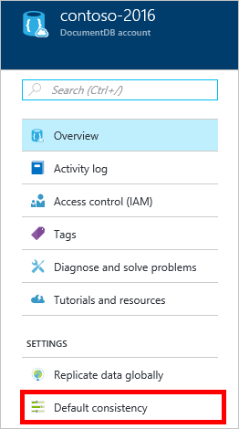
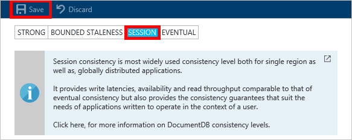

<properties
    pageTitle="如何建立 DocumentDB 帳戶 |Microsoft Azure"
    description="建立具有 Azure DocumentDB NoSQL 資料庫。 請依照這些指示建立 DocumentDB 帳戶，並開始建立 blazing 快速、 全球規模 NoSQL 資料庫。" 
    keywords="建立資料庫"
    services="documentdb"
    documentationCenter=""
    authors="mimig1"
    manager="jhubbard"
    editor="monicar"/>

<tags
    ms.service="documentdb"
    ms.workload="data-services"
    ms.tgt_pltfrm="na"
    ms.devlang="na"
    ms.topic="get-started-article"
    ms.date="10/17/2016"
    ms.author="mimig"/>

# 如何建立 DocumentDB NoSQL 帳戶使用 Azure 入口網站

> [AZURE.SELECTOR]
- [Azure 入口網站](documentdb-create-account.md)
- [Azure CLI 和 Azure 資源管理員](documentdb-automation-resource-manager-cli.md)

若要建立具有 Microsoft Azure DocumentDB 的資料庫，您必須︰

- 有 Azure 帳戶。 如果您沒有，您可以取得[免費的 Azure 帳戶](https://azure.microsoft.com/free)。 
- 建立 DocumentDB 帳戶。  

Azure 入口網站、 Azure 資源管理員範本或 Azure 命令列介面 (CLI)，您可以建立使用以下任一項 DocumentDB 帳戶。 本文將示範如何建立 DocumentDB 帳戶使用 Azure 入口網站。 若要建立使用 Azure 資源管理員或 Azure CLI 帳戶，請參閱[自動化 DocumentDB 帳戶建立資料庫](documentdb-automation-resource-manager-cli.md)。

您是新手 DocumentDB 嗎？ 觀看[此](https://azure.microsoft.com/documentation/videos/create-documentdb-on-azure/)四分鐘視訊以史 Hanselman，瞭解如何完成線上入口網站中的常見工作。

1.  [Azure 入口網站](https://portal.azure.com/)登入。
2.  在 Jumpbar，按一下 [**新增**]，按一下 [**資料庫**]，然後按一下**DocumentDB (NoSQL)**。 

    ![Azure 入口網站，並醒目提示 [更多服務]，然後 DocumentDB (NoSQL) 的螢幕擷取畫面](./media/documentdb-create-account/create-nosql-db-databases-json-tutorial-1.png)  

3. 在**新帳戶**刀中，指定 DocumentDB 帳戶所需的設定。

    

    - 在 [**識別碼**] 方塊中，輸入名稱來識別 DocumentDB 帳戶。  當**ID**驗證時，綠色的核取記號會出現在 [**識別碼**] 方塊中。 [**識別碼**] 的值會變成 URI 內，主機名稱。 **識別碼**可能包含只大小寫字母、 數字，以及 '-' 字元，而且必須是介於 3 至 50 個字元。 附註的*documents.azure.com*會附加您選擇，結果會為您 DocumentDB 帳戶端點結束點名稱。

    - 在 [ **NoSQL API** ] 方塊中，選取要使用的程式設計模型︰
        - **DocumentDB**: DocumentDB API 可供使用透過.NET，Java，Node.js，Python 和 JavaScript [Sdk](documentdb-sdk-dotnet.md)，以及 HTTP[其餘部分](https://msdn.microsoft.com/library/azure/dn781481.aspx)，並提供以程式設計方式存取所有 DocumentDB 功能。 
       
        - **MongoDB**: DocumentDB 也提供**MongoDB** Api 的[通訊協定層級支援](documentdb-protocol-mongodb.md)。 當您選擇 [MongoDB API] 選項時，您可以使用 [現有的 MongoDB Sdk 和[工具](documentdb-mongodb-mongochef.md)與 DocumentDB。 您可以[移動](documentdb-import-data.md)現存 MongoDB 應用程式使用 DocumentDB，[不需要的程式碼變更](documentdb-connect-mongodb-account.md)，並利用為服務，沒有限制的小數位數、 全域複寫，與其他功能完全受管理的資料庫。

    - **訂閱**]，選取您想要使用的 DocumentDB 帳戶 Azure 訂閱。 如果您的帳戶有只有一個訂閱，預設會選取該帳戶。

    - 在 [**資源] 群組**中，選取或建立您的 DocumentDB 帳戶的資源群組。  根據預設，會建立新的資源群組。 如需詳細資訊，請參閱[使用 Azure 入口網站管理 Azure 資源](../articles/azure-portal/resource-group-portal.md)。

    - 若要指定要主控您的 DocumentDB 帳戶的地理位置的使用**位置**。 

4.  一旦設定新的 DocumentDB 帳戶選項，請按一下 [**建立**]。 若要檢查的部署狀態，請核取 [通知] 中心。  

      

    ![[通知] 中心內，顯示 DocumentDB 帳戶已成功建立及部署到資源群組-線上資料庫建立者通知的螢幕擷取畫面](./media/documentdb-create-account/create-nosql-db-databases-json-tutorial-5.png)

5.  建立 DocumentDB 帳戶後，就可供使用的預設設定。 預設的一致性 DocumentDB 帳戶會設定為**工作階段**。  按一下 [資源] 功能表中的 [**預設的一致性**，可以調整預設一致性。 若要進一步瞭解 DocumentDB 所提供的一致性層級，請參閱[DocumentDB 中的一致性層級](documentdb-consistency-levels.md)。

      

      

[How to: Create a DocumentDB account]: #Howto
[Next steps]: #NextSteps
[documentdb-manage]:../articles/documentdb/documentdb-manage.md

## 後續步驟

現在您有 DocumentDB 帳戶下, 一步就是建立一個 DocumentDB 集合和資料庫。 

您可以建立新集合及資料庫，使用下列其中一項︰

- Azure 入口網站，以[建立 DocumentDB 集合使用 Azure 入口網站](documentdb-create-collection.md)所述。
- 包含範例資料的全部包含教學課程︰ [.NET](documentdb-get-started.md)」、 「 [.NET MVC](documentdb-dotnet-application.md)」、 「 [Java](documentdb-java-application.md)」、 「 [Node.js](documentdb-nodejs-application.md)或 「 [Python](documentdb-python-application.md)。
- [.NET](documentdb-dotnet-samples.md#database-examples)、 [Node.js](documentdb-nodejs-samples.md#database-examples)或[Python](documentdb-python-samples.md#database-examples)程式碼範例 GitHub 提供。
- [.NET](documentdb-sdk-dotnet.md)、 [Node.js](documentdb-sdk-node.md)、 [Java](documentdb-sdk-java.md)、 [Python](documentdb-sdk-python.md)和[其餘](https://msdn.microsoft.com/library/azure/mt489072.aspx)Sdk。

建立您的資料庫及集合之後, 您要[新增文件](documentdb-view-json-document-explorer.md)集合。

有集合中的文件之後，您可以執行[查詢](documentdb-sql-query.md#executing-queries)中使用[DocumentDB SQL](documentdb-sql-query.md)針對您的文件。 您可以使用 [在入口網站、 [REST API](https://msdn.microsoft.com/library/azure/dn781481.aspx)，或其中一個[Sdk](documentdb-sdk-dotnet.md)[查詢檔案總管](documentdb-query-collections-query-explorer.md)中執行查詢。

### 深入瞭解

若要進一步瞭解 DocumentDB，請探索這些資源︰

-   [DocumentDB 學習路徑](https://azure.microsoft.com/documentation/learning-paths/documentdb/)
-   [DocumentDB 階層式資源的模型和概念](documentdb-resources.md)
